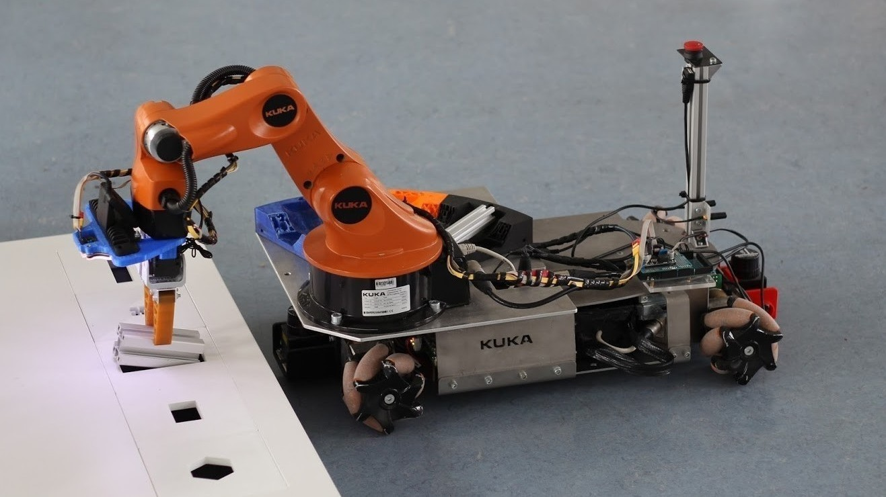

<!--

author:   Sebastian Zug & André Dietrich & Fabian Bär
email:    sebastian.zug@informatik.tu-freiberg.de & andre.dietrich@informatik.tu-freiberg.de & fabian.baer@student.tu-freiberg.de
version:  0.0.1
language: de
narrator: Deutsch Female

import:   https://raw.githubusercontent.com/liascript-templates/plantUML/master/README.md
          https://raw.githubusercontent.com/LiaTemplates/NetSwarm-Simulator/master/README.md
          https://raw.githubusercontent.com/liaTemplates/DigiSim/master/README.md

-->

# Organisation und Motivation

**TU Bergakademie Freiberg - Wintersemester 2020 / 21**

Link auf die aktuelle Vorlesung im Versionsmanagementsystem GitHub

[https://github.com/TUBAF-IfI-LiaScript/VL_EingebetteteSysteme/blob/master/00_Einfuehrung.md](https://github.com/TUBAF-IfI-LiaScript/VL_EingebetteteSysteme/blob/master/00_Einfuehrung.md)

Die interaktive Form ist unter diese [Link](https://liascript.github.io/course/?https://raw.githubusercontent.com/TUBAF-IfI-LiaScript/VL_EingebetteteSysteme/master/00_Einfuehrung.md#1) zu finden.

---------------------------------------------------------------------

```c HelloWorld.c
#define ANSWER_TO_LIFE 42

void setup() {
  Serial.begin(9600);
  Serial.println("Herzlich willkommen");

  volatile byte a;

  asm ("ldi %0, %1\n\t"
      : "=r" (a)
      : "M" (ANSWER_TO_LIFE));

  Serial.print("Antwort auf alle Fragen ist:");
  Serial.println(a);
}

void loop() {
}
```


## Zielstellung

Was steht im Modulhandbuch über diesen Kurs?

**Qualifikationsziele /Kompetenzen:**

_Mit der erfolgreichen Teilnahme an der Veranstaltung sollen die Studierenden in der Lage sein:_

+ _die Teilkomponenten eines Rechners ausgehend von der Boolschen Algebra sowie kombinatorischen und sequentiellen Schaltungen zu beschreiben und ausschnitthafte Teilelemente selbstständig entwerfen zu können._
+ _die Integration der Elemente und die Abläufe bei der Programmabarbeitung in verschiedenen Modellrechnern zu beherrschen und die Vor- und Nachteile verschiedener Konfigurationen bewerten zu können,_
+ _Architekturentwürfe auf reale Controller zu übertragen, die resultierenden Programmierkonzepte zu verstehen und anzuwenden_
+ _die konkrete Realisierung von eingebetteten Systemen in entsprechenden Anwendungen aus den Schaltplänen zu erfassen und die softwareseitigen Realisierungen daraus abzuleiten_

**Inhalte**

_Grundlegende Prinzipien der Modellierung digitaler Systeme: Boolsche Algebren und Funktionen, kombinatorische und sequentielle Schaltungen, Herleitung eines Modellrechners und Abbildung von dessen Funktionsweise, Einführung in die Entwicklung eingebetteter Systeme(Sensoren, Aktoren, elektrische Peripherie, Programmierkonzepte), Anwendungsfelder_

{{1}}
**Und was heißt das nun konkret? Worum geht es?**

{{1}}
Nehmen wir an, Sie realisieren ein Arduino Beispielprogramm wie dieses:

{{1}}
```c
void setup() {
  pinMode(13, OUTPUT);
}
void loop() {
  digitalWrite(13, HIGH);
  delay(1000);
  digitalWrite(13, LOW);
  delay(1000);
}
```

{{2}}
Am Ende des Compiliervorganges entsteht daraus der sogenannte Maschinencode. Dieses ist die Sprache, die der Rechner originär versteht und die entsprechend ausgeführt werden kann.

{{2}}
```
:100000000C9472000C947E000C947E000C947E0084
:100010000C947E000C947E000C947E000C947E0068
:100020000C947E000C947E000C947E000C947E0058
…
:1000A0000C947E000C947E000C947E000C947E00D8
:1000B0000C947E000C947E000C947E000C947E00C8
:1000C0000C947E000C947E000C947E000C947E00B8
:1000D0000C947E000C947E000C947E000C947E00A8
:1000E0000C947E0011241FBECFEFD1E2DEBFCDBF46
:1000F00000E00CBF0E9480000C9483000C94000070
:0A010000279A2F98FFCFF894FFCF            45
:00000001FF
```

                                  {{3}}
*******************************************************************************

**Was heißt das denn nun der Rechner?**

<!-- width="70%" -->

**Auf welche konkreten Systeme schauen wir dabei insbesondere?**

+ ATmega4808/4809
+ ATmega32

*******************************************************************************

                                 {{4}}
*******************************************************************************

**Und wie nützt mir das?**

<!-- width="70%" -->

Wenn wir noch einen Schritt weitergehen können wir die Daten auch an einen Server übergeben. Dieser übernimmt die Aufbereitung und Visualisierung.

<iframe width="450" height="260" style="border: 1px solid #cccccc;" src="https://thingspeak.com/channels/856893/charts/7?bgcolor=%23ffffff&color=%23d62020&days=3&dynamic=true&type=line"></iframe>

Hier lassen sich dann die eigentlichen "Untersuchungen" realisieren und zum Beispiel die Frage beantworten, ob die Sonne am Wochenende häufiger scheint.

<!-- width="70%" -->

Die roten Punkte stellen die Verteilung der Wochenendmessungen der vergangenen Woche dar, während die blauen Kreuze die Wochentage illustrieren. Dunkelheit wird durch einen Wert nahe 1023 ausgedrückt, während helle Messituationen durch kleine Werte dargestellt werden.
*******************************************************************************

## Organisation

| Name                    | Email                                      |
|:----------------------- |:------------------------------------------ |
| Prof. Dr. Sebastian Zug | sebastian.zug@informatik.tu-freiberg.de    |
| Dr. Martin Reinhardt    | martin.reinhardt@informatik.tu-freiberg.de |

> Bitte melden Sie sich im OPAL unter [Eingebettete Systeme](https://bildungsportal.sachsen.de/opal/auth/RepositoryEntry/26860322818/CourseNode/102563572218999) für die Veranstaltung an. Dies ist im Kontext der Pandemiesituation Teil des Hygienekonzepts der Hochschule.

### Zeitplan

Die Veranstaltung wird sowohl für die Vorlesung als auch die Übung in Präsenz durchgeführt.

| Veranstaltungen | Tag        | Zeitslot      | Ort      | Bemerkung       |
| --------------- | ---------- | ------------- | -------- | --------------- |
| Vorlesung I     | Dienstag   | 14:00 - 15:30 | WIN-1005 | wöchentlich     |
| Vorlesung II    | Donnerstag | 14:00 - 15:30 | WIN-1005 | ungerade Wochen |
| Übungen         | Dienstag   | 18:00 - 19:30 | KKB-2097 | ab Dezember     |

Wir gehen gegenwärtig noch davon aus, dass die Übungen auch in Präsenz stattfinden. Dort haben Sie dann insbesondere ab Januar Gelegenheit anhand spezifischer Mikrocontrollerschaltungen Ihre Fähigkeiten zu vertiefen.

<!--
style="width: 80%; min-width: 420px; max-width: 720px;"
-->
```ascii

                Abstraktionsebenen

           +----------------------------+ -.
  Ebene 6  | Problemorientierte Sprache |  |
           +----------------------------+  |
                                           ⎬ Anwendungssoftware
           +----------------------------+  |
  Ebene 5  | Assemblersprache           |  |
           +----------------------------+ -.

           +----------------------------+
  Ebene 4  | Betriebssystem             |     Systemsoftware
           +----------------------------+

           +----------------------------+
  Ebene 3  | Istruktionsset             |     Maschinensprache
           +----------------------------+

           +----------------------------+  -.
  Ebene 2  | Mikroarchitektur           |   |
           +----------------------------+   |
                                            ⎬ Automaten, Speicher, Logik
           +----------------------------+   |       ╔══════════════════╗
  Ebene 1  | Digitale Logik             |   |    ◀══║ HIER STARTEN WIR!║
           +----------------------------+  -.       ╚══════════════════╝

           +----------------------------+
  Ebene 0  | E-Technik, Physik          |     Analoge Phänomene
           +----------------------------+                                      .
```


### Prüfungsmodalitäten

> *Credit-Points:* 6


> *Arbeitsaufwand:* Der Zeitaufwand beträgt 180h und setzt sich zusammen aus 60h Präsenzzeit und 120h Selbststudium. Letzteres umfasst die Vor- undNachbereitung der Lehrveranstaltung, die eigenständige Lösung von Übungsaufgaben sowie die Prüfungsvorbereitung.


> *Prüfungsform:* Die Veranstaltung wird mit einer schriftlichen Prüfung abgeschlossen.


> *5 Fragen in 5 Minuten:* Teilnehmer stellen mit Blick auf die vergangen Lehrveranstaltung weitere Aufgaben vor und besprechen die Lösung kurz. Die Fragen gehen dann in Teilen in die Klausur ein.

## ... und wozu brauche ich das überhaupt?

**Antwort A:**
Das Studium vermittelt ein Weltbild und keine eng zugeschnittene Sicht.

**Antwort B:**
Die Fähigkeit in Algorithmen zu denken, ist eine Grundlage wissenschaftlichen
Arbeitens.

**Antwort C:**
Am Ende steht Ihnen das Rüstzeug zur Verfügung kleine eingebettete C-Projekte
selbst anzugehen.


## Literaturempfehlungen

1. Umfassende Lehrbücher

   + David A. Patterson, John L. Hennessy: Computer Organization & Design
   + B. Becker, R. Drechsler, P. Molitor: Technische Informatik - Eine Einführung, Pearson Studium, 2005
   + Hoffmann, D. W.: Grundlagen der technischen Informatik, Hanser Verlag

2. Videos

   + Youtube – „How computers works“ https://www.youtube.com/watch?v=cNN_tTXABUA

Bei den jeweiligen Vorlesungsinhalten werden zusätzliche Materialien angegeben.

## Schreiben Sie an den Materialien mit!

                              {{0-1}}
****************************************************************************

Die Lehrmaterialien finden Sie unter GitHub, einer Webseite für das Versionsmanagement und die Projektverwaltung.

https://github.com/TUBAF-IfI-LiaScript/VL_EingebetteteSysteme/blob/dev/01_HistorischerUeberblick.md

Die Unterlagen selbst sind in der Auszeichnungsprache LiaScipt verfasst und öffentlich verfügbar.

****************************************************************************

                         {{1-2}}
****************************************************************************

Markdown ist eine Auszeichnungssprache für die Gliederung und Formatierung von Texten und anderen Daten. Analog zu HTML oder LaTex werden die Eigenschaften und Organisation von Textelementen (Zeichen, Wörtern, Absätzen) beschrieben. Dazu werden entsprechende "Schlüsselworte", die sogenannten Tags verwandt.

Markdown wurde von John Gruber und Aaron Swartz mit dem Ziel entworfen, die Komplexität der Darstellung so weit zu reduzieren, dass schon der Code sehr einfach lesbar ist. Als Auszeichnungselemente werden entsprechend möglichst kompakte Darstellungen genutzt.

```markdown HelloWorld.md
# Überschrift

__eine__ Betonung __in kursiver Umgebung__

* Punkt 1
* Punkt 2

Und noch eine Zeile mit einer mathematischen Notation $a=cos(b)$!
```

----------------------------------------------------------------------------<h1>Überschrift</h1>
<i>eine <em>Betonung</em> in kursiver Umgebung</i>
<ul>
<li>Punkt 1</li>
<li>Punkt 2</li>
</ul>
Und noch eine Zeile mit einer mathematischen Notation $a=cos(b)$!

----------------------------------------------------------------------------

Eine gute Einführung zu Markdown finden Sie zum Beispiel unter

* [MarkdownGuide](https://www.markdownguide.org/getting-started/)
* [GitHubMarkdownIntro](https://guides.github.com/features/mastering-markdown/)

Mit einem entsprechenden Editor und einigen Paketen macht das Ganze dann auch Spaß

* Wichtigstes Element ist ein Previewer, der es Ihnen erlaubt "online" die Korrektheit der Eingaben zu prüfen
* Tools zur Unterstützung komplexerer Eingaben wie zum Beispiel der Tabellen (zum Beispiel für Atom mit [markdown-table-editor](https://atom.io/packages/markdown-table-editor))
* Visualisierungsmethoden, die schon bei der Eingabe unterstützen
* Rechtschreibprüfung (!)

****************************************************************************


                                 {{2-3}}
****************************************************************************

Allerdings vermisst Markdown trotz seiner Einfachheit einige Features, die
für die Anwendbarkeit in der (Informatik-)Lehre sprechen:

* Ausführbarer Code
* Möglichkeiten zur Visualisierung
* Quizze Tests und Aufgaben
* spezifische Tools für die Modellierung Simulation etc.

```cpp
void setup() {
  Serial.println("Hello stuff.");
}

void thing(char i) {
  switch(i) {
  case 0: Serial.println("a pear"); break;
  case 1: Serial.println("an apple"); break;
  case 2: Serial.println("an elephant"); break;
  case 3: Serial.println("an arduino"); break;
  }
}

void loop() {
  Serial.print("here's ");
  thing(random(4));
}
```
@NetSwarm.loop

``` js @DigiSim.eval
// Init components
AND(["and1", "and2"], ["and3"], "AND1");
OR(["or1", "or2"], ["or3"], "OR1");
XOR(["xor1", "xor2"], ["xor3"], "XOR1");
Button("btn1", "BUTTON1");
Button("btn2", "BUTTON2");
Button("btn3", "BUTTON3");
Button("btn4", "BUTTON4");
Lamp("lmp1", "LAMP1");

// IO IN
wire("btn1", "and1");
wire("btn2", "and2");
wire("btn3", "or1");
wire("btn4", "or2");

// AND, OR -> XOR
wire("and3", "xor1");
wire("or3", "xor2");

// IO OUT
wire("xor3", "lmp1", "Main Output");
```

Eine Reihe von Einführungsvideos findet sich unter [Youtube](https://www.youtube.com/channel/UCyiTe2GkW_u05HSdvUblGYg). Die Dokumentation von LiaScript ist hier [verlinkt](https://liascript.github.io/course/?https://raw.githubusercontent.com/liaScript/docs/master/README.md#1)

***************************************************************************

## Trotz Simulation und Virtuellem ...

... braucht es aber auch immer etwas zum anfassen.

> Blick hinter eine Arduino-Anwendung

## Wie können Sie zum Gelingen der Veranstaltung beitragen?

* Stellen Sie Fragen, seinen Sie kommunikativ!

> Hinweis auf OPAL Forum!

* Organisieren Sie sich in Arbeitsgruppen!

> Hinweis auf Repl.it

> Hinweis auf ThinkerCAD

* Bringen Sie sich mit Implementierungen in die Veranstaltung ein.

## Und wenn Sie dann immer noch programmieren wollen ...

Dann wartet das TUFbots-Team auf Sie ...

<!--
style="width: 80%; display: block; margin-left: auto; margin-right: auto;" -->

Quelle: _Team RobOTTO_, OVGU Magdeburg
