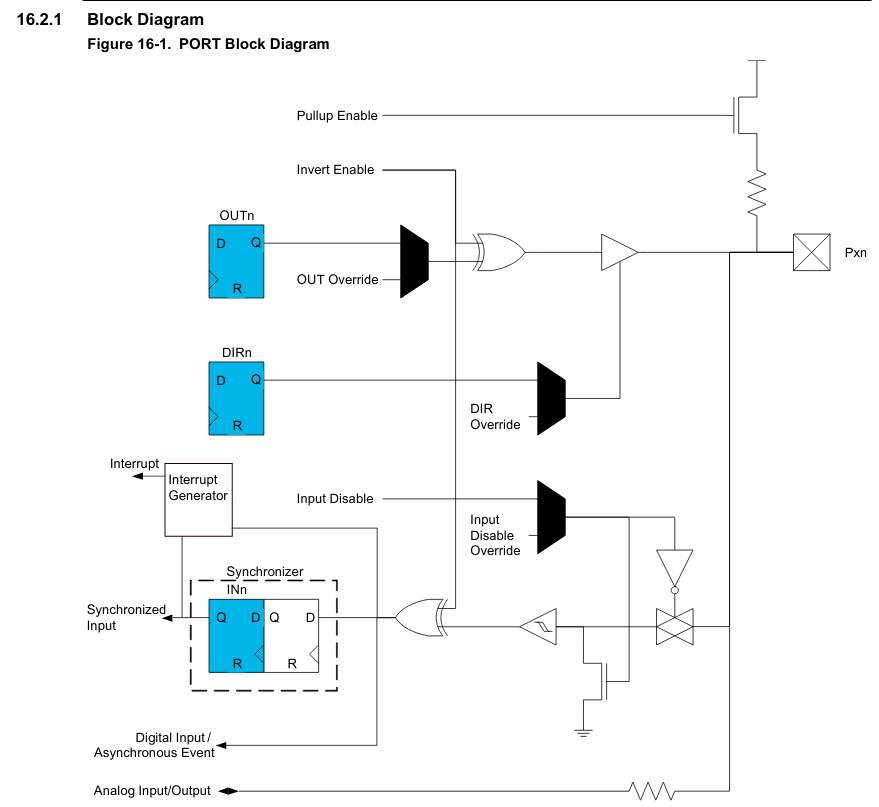
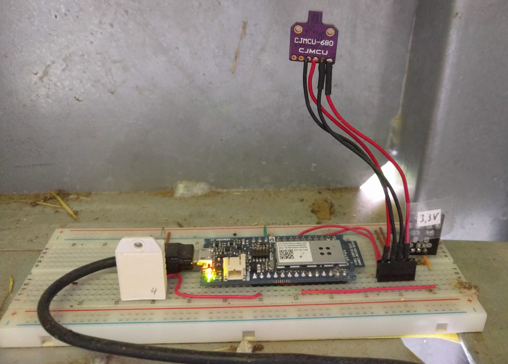
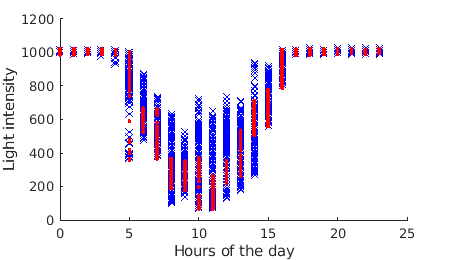
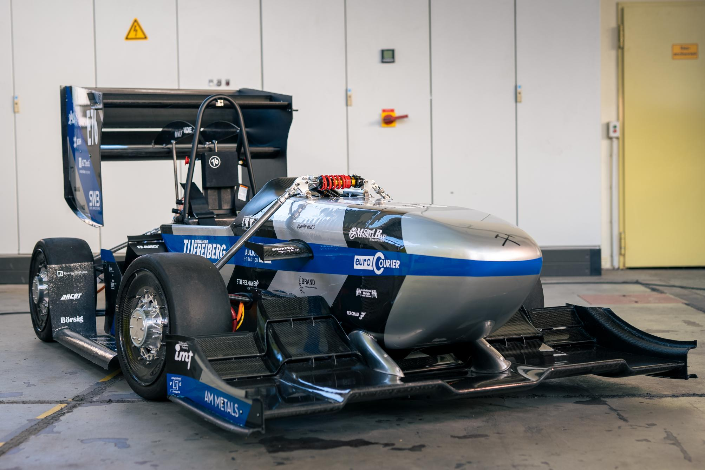

<!--

author:   Sebastian Zug, André Dietrich & `fjangfaragesh`, `FnHm`, `gjaeger`, `ShyFlyGuy`, `Lalelele`
email:    sebastian.zug@informatik.tu-freiberg.de & andre.dietrich@informatik.tu-freiberg.de & fabian.baer@student.tu-freiberg.de
version:  0.0.2
language: de
narrator: Deutsch Female

import:   https://raw.githubusercontent.com/liascript-templates/plantUML/master/README.md
          https://raw.githubusercontent.com/LiaTemplates/NetSwarm-Simulator/master/README.md
          https://raw.githubusercontent.com/liaTemplates/DigiSim/master/README.md
          https://raw.githubusercontent.com/liaTemplates/AVR8js/main/README.md
          https://raw.githubusercontent.com/TUBAF-IfI-LiaScript/VL_EingebetteteSysteme/master/config.md

-->

# Einführung 

[](https://liascript.github.io/course/?https://raw.githubusercontent.com/TUBAF-IfI-LiaScript/VL_EingebetteteSysteme/master/00_Einfuehrung.md#1)

| Parameter                | Kursinformationen                                                                                        |
| ------------------------ | -------------------------------------------------------------------------------------------------------- |
| **Veranstaltung:**       | @config.lecture                                                                                          |
| **Semester:**            | @config.semester                                                                                         |
| **Hochschule:**          | `Technische Universität Freiberg`                                                                        |
| **Inhalte:**             | `Motivation der Vorlesung "Eingebettete Systeme" und Beschreibung der Organisation der Veranstaltung`   |
| **Link auf GitHub:**     | https://github.com/TUBAF-IfI-LiaScript/VL_EingebetteteSysteme/blob/master/00_Einfuehrung.md             |
| **Autoren:**             | @author                                                                                                  |

---------------------------------------------------------------------

## Worum geht es in dieser Vorlesung?

> Starten wir mit etwas Code ... 

<div id="example1">
<wokwi-led color="red"   pin="13" label="13"></wokwi-led>
<wokwi-led color="green" pin="12" label="12"></wokwi-led>
<wokwi-led color="blue"  pin="11" label="11"></wokwi-led>
<wokwi-led color="blue"  pin="10" label="10"></wokwi-led>
<span id="simulation-time"></span>
</div>

```cpp BlinkLEDs.ino
byte leds[] = {13, 12, 11, 10};

void setup() {
  Serial.begin(115200);
  for (byte i = 0; i < sizeof(leds); i++) {
    pinMode(leds[i], OUTPUT);
  }
}

int i = 0;
void loop() {
  Serial.print("LED: ");
  Serial.println(i);
  digitalWrite(leds[i], HIGH);
  delay(250);
  digitalWrite(leds[i], LOW);
  i = (i + 1) % sizeof(leds);
}
```
@AVR8js.sketch

> Welche Funktion hat der Code?

> Was ist notwendig, damit dieses Programm auf einem Mikrocontroller läuft?

{{1-2}}

```hex
:100000000C9472000C947E000C947E000C947E0084
:100010000C947E000C947E000C947E000C947E0068
:100020000C947E000C947E000C947E000C947E0058
:100030000C947E000C947E000C947E000C947E0048
:100040000C947E000C947E000C947E000C947E0038
:100050000C947E000C947E000C947E000C947E0028
:100060000C947E000C947E000C947E000C947E0018
:100070000C947E000C947E000C947E000C947E0008
:100080000C947E000C947E000C947E000C947E00F8
:100090000C947E000C947E000C947E000C947E00E8
:1000A0000C947E000C947E000C947E000C947E00D8
:1000B0000C947E000C947E000C947E000C947E00C8
:1000C0000C947E000C947E000C947E000C947E00B8
:1000D0000C947E000C947E000C947E000C947E00A8
:1000E0000C947E0011241FBECFEFD1E2DEBFCDBF46
:1000F00000E00CBF0E9480000C9483000C94000070
:0A010000279A2F98FFCFF894FFCF45
:00000001FF
```
{{2-3}}

> **Am Ende des Semesters können Sie jeden Schritt dieser Transformation verstehen und erklären!**

Sie werden die komplette Reise von Ihrem Arduino-Code bis zur Ausführung im ATmega328P-Mikrocontroller nachvollziehen können – von der ersten `digitalWrite()`-Funktion bis zum letzten Transistor, der eine LED zum Leuchten bringt.

### 🗺️ Die Reise: 16 Stationen zum Verständnis

| Station | Vorlesung                                           | Was lernen Sie hier?        |
| ------- | --------------------------------------------------- | --------------------------- |
| 🏁     | [00 Einführung](00_Einfuehrung.md)                  | Die große Vision            |
| 📚     | [01 Historie](01_HistorischerUeberblick.md)         | Von Zuse zu Arduino         |
| ⚡      | [02 Boolesche Algebra](02_BoolscheAlgebra.md)       | 0 und 1 verstehen           |
| 🔧     | [03 Minimierung](03_Minimierung.md)                 | Effizienz in Logik          |
| 🧩     | [04 Schaltnetze](04_Schaltnetze.md)                 | Logik wird Hardware         |
| 🎛️   | [05 Standardschaltnetze](05_Standardschaltnetze.md) | Decoder & Multiplexer       |
| 💾     | [06 FlipFlops](06_FlipFlops.md)                     | Speicher entsteht           |
| 🔄     | [07 Schaltwerke](07_Schaltwerke.md)                 | Zustandsmaschinen           |
| 📊     | [08 Standardschaltwerke](08_StandardSchaltwerke.md) | Counter & Register          |
| 🧮     | [09 Rechnerarithmetik](09_Rechnerarithmetik.md)     | Addition in Hardware        |
| 🏗️   | [10 CPU-Basis](10_CPU_Basis.md)                     | Der erste Prozessor         |
| 🖥️   | [11 Modell-CPU](11_Modell_CPU.md)                   | CPU-Simulation              |
| ⚡      | [12 Pipeline](12_Pipeline.md)                       | Geschwindigkeit             |
| 🎯     | [13 AVR-CPU](13_AVR_CPU.md)                         | **IHR Arduino-Chip!**       |
| 📡     | [14 ADC](14_ADC.md)                                 | Analog trifft Digital       |
| ⏰       | [15 Timer & Interrupts](15_TimerUndInterrupts.md)   | Multitasking                |
| 🤖     | [16 Aktoren](16_Aktoren.md)                         | Hardware ansteuern          |

> Wir haben nominell 21 Vorlesungen, an einigen Stellen werden wir aber länger verweilen und an anderen Stellen schneller vorankommen. Diese Aufzählung ist also eher ein Leitfaden, denn ein strikter Plan.

### Was steht am Ende?

**Sie können diese 8 Fragen fundiert beantworten:**

1. **"Wie wird `pinMode(13, OUTPUT)` zu Hardware-Konfiguration?"**  
   *Von Arduino-Funktion über AVR-libc zu Assembler zu DDRB-Register zu Tri-State-Logik*

2. **"Wie wird `digitalWrite(13, HIGH)` zu Spannung am Pin 13?"**  
   *Von C-Funktion über Compiler zu Register-Manipulation zu Transistor-Schaltung*

3. **"Warum braucht `delay(1000)` genau 16.000.000 Taktzyklen?"**  
   *Taktfrequenz, Befehlszyklen und Timer-Hardware verstehen*

4. **"Was passiert im ATmega328P während `analogRead(A0)`?"**  
   *ADC-Wandlung, Sampling, Quantisierung und Speicherung*

5. **"Wie führt die CPU den Maschinenbefehl `0C 94 72 00` aus?"**  
   *Instruction Decode, Fetch-Execute-Cycle, Register-Operationen*

6. **"Warum ist `if (digitalRead(2) && digitalRead(3))` als Schaltung effizienter?"**  
   *Boolesche Algebra, Gatter-Optimierung, Hardware-Software-Grenze*

7. **"Wie kann ein 8-bit-Mikrocontroller 16-bit-Zahlen addieren?"**  
   *Multi-Precision-Arithmetik, Carry-Flag, ALU-Design*

8. **"Welche Hardware-Komponenten arbeiten parallel zu Ihrem `loop()`?"**  
   *Interrupts, Timer, UART, SPI - das komplette AVR-Ökosystem*


## 🔬 Der Unterschied zu einem "Arduino-Kurs"

**Arduino-Kurs:** "Drücke diesen Button, LEDs blinken" ✨ *Magie!*

**Unser Kurs:** "Warum passiert das und wie funktioniert es bis hinunter zum Transistor?"

### 🧭 Unsere Bottom-Up-Reise

<!--
style="width: 80%; min-width: 420px; max-width: 720px;"
-->
```ascii

                Abstraktionsebenen

           +----------------------------+ -.
  Ebene 6  | Problemorientierte Sprache |  |
           +----------------------------+  |
                                           ⎬ Anwendungssoftware
           +----------------------------+  |
  Ebene 5  | Assemblersprache           |  |
           +----------------------------+ -.

           +----------------------------+
  Ebene 4  | Betriebssystem             |     Systemsoftware (brauchen wir nicht :-) )
           +----------------------------+

           +----------------------------+
  Ebene 3  | Instruktionsset            |     Maschinensprache
           +----------------------------+

           +----------------------------+  -.
  Ebene 2  | Mikroarchitektur           |   |
           +----------------------------+   |
                                            ⎬ Automaten, Speicher, Logik
           +----------------------------+   |       ╔══════════════════╗
  Ebene 1  | Digitale Logik             |   |    ◀══║ HIER STARTEN WIR!║
           +----------------------------+  -.       ╚══════════════════╝

           +----------------------------+
  Ebene 0  | E-Technik, Physik          |     Analoge Phänomene
           +----------------------------+                                      .
```


### Beispiel 1: Mikroarchitektur

> Ein Rechner ist eine ziemlich komplizierte Maschine. Der AVR-Mikrocontroller in Ihrem Arduino besteht aus über 30 Millionen Transistoren! Wir brauchen ein methodisches Verständnis und mehrere Abstraktionsebenen, um das zu verstehen.

{{0-1}}
```text @plantUML.png
@startditaa
               +------------------+
               |c88F              |
               |     Speicher     |
               |                  |
               +---------+-+------+
                       ^ | ^
                       | | |
+----------+  Adresse  | | |               +-----+-----+
|cF88      +-----------+ | |               |  A  |  B  |
|          |             | |        Daten  +-----+-----+
|          |   Befehl    | +-------------->+cFF4       |
|  Steuer- |<------------+                 |           |
|   werk   |                     Kontrolle |    ALU    |
|          +------------------------------>+           |
|          |                               |           |
|          |                       Status  |           |
|          |<------------------------------+           |
|          |                               |           |
|          | Kontrolle                     |           |
|          +-------------+         Daten   |           |
|          |             | +-------------->|           |
|          |  Status     | |               |           |
|          |<----------+ | |               |           |
+----------+           | | |               +-----------+
                       | | |
                       | V V
               +-------+-----------+
               |c8F8               |
               |    Ein/Ausgabe    |
               |                   |
               +-------------------+
@endditaa
```

### 🔬 Beispiel 2: Quer über alle Ebenene

**Wir bauen von den Grundlagen nach oben!** Jede Ebene erklärt die nächste, bis Sie verstehen, wie Ihr `digitalWrite()` am Ende einen Transistor schaltet.

**Schauen wir uns konkret an, was in diesen 4 Abstraktionsebenen passiert:**

**🎯 Ebene 6 - Ihr Arduino-Code:**
```cpp
pinMode(13, OUTPUT);  // Pin 13 als Ausgang konfigurieren
```

**⚙️ Ebene 5 - AVR-libc Implementation (echte Arduino-Version):**
```c
void pinMode(uint8_t pin, uint8_t mode) {
  uint8_t bit = digitalPinToBitMask(pin);    // Pin 13 → Bit 5
  uint8_t port = digitalPinToPort(pin);      // Pin 13 → PORTB
  volatile uint8_t *reg = portModeRegister(port); // → &DDRB
  
  if (mode == OUTPUT) {
    uint8_t oldSREG = SREG;  // ⚠️ INTERRUPT-SCHUTZ!
    cli();                   // Interrupts AUS
    *reg |= bit;            // DDRB |= (1 << 5)
    SREG = oldSREG;         // Interrupts wieder AN
  }
  // INPUT und INPUT_PULLUP analog...
}
```

**🔧 Ebene 3 - AVR-Assembler Code:**
```asm
; uint8_t oldSREG = SREG; cli();
in   r25, 0x3F    ; Lade SREG (Status Register)
cli               ; Clear Interrupt Flag → Interrupts AUS

; *reg |= bit;  (DDRB |= (1 << 5))
in   r24, 0x04    ; Lade DDRB Register (I/O-Adresse 0x04)
ori  r24, 0x20    ; OR mit 0x20 (Bit 5 setzen)
out  0x04, r24    ; Schreibe zurück zu DDRB

; SREG = oldSREG;
out  0x3F, r25    ; Restore SREG → Interrupts wieder AN
```

**⚡ Ebene 1 - Hardware-Konfiguration:**

<!-- width="60%" -->

Das `DDRB`-Register steuert direkt die **Tri-State-Logik** des I/O-Pins:
- **DDRB[5] = 1**: Ausgangstreiber wird aktiviert → Pin kann HIGH/LOW ausgeben
- **DDRB[5] = 0**: Hochohmig → Pin kann Eingangssignale lesen

## 🚀 Was können Sie damit bauen?

**Von einfachen LEDs zu echten Projekten:**

<!-- width="70%" -->

Nach diesem Kurs wissen Sie nicht nur, wie man Sensordaten ausliest, sondern **warum** der ADC-Wandler 1023 als Maximum liefert und wie die Timer-Interrupts das Sampling steuern.

<!-- width="70%" -->

Sie verstehen, warum die Messwerte (1023 = dunkel, niedrige Werte = hell) genau so aussehen und können die ADC-Referenzspannung für präzisere Messungen optimieren.

### 🤔 "Aber ich will doch Webentwickler/Data Scientist/KI-Entwickler werden..."

**🎯 Perfekt! Denn Sie werden ein BESSERER Entwickler in JEDEM Bereich:**

+ **🌐 Webentwickler**: Sie verstehen Performance bis zur Hardware-Ebene
+ **📊 Data Scientist**: Sie wissen, wie Ihre Daten WIRKLICH entstehen  
+ **🤖 KI-Entwickler**: Edge-AI auf Mikrocontrollern? Sie können es!
+ **☁️ Cloud-Architekt**: Sie verstehen die Hardware unter Ihren VMs
+ **🎮 Game-Developer**: Low-Level-Optimierung wird Ihr Superpower

**Das tiefe Hardware-Verständnis macht Sie in JEDER Tech-Rolle wertvoller!**

## Organisation

| Name                    | Email                                   |
| :---------------------- | :-------------------------------------- |
| Prof. Dr. Sebastian Zug | sebastian.zug@informatik.tu-freiberg.de |
| Adrian Köppen           | adrian.koeppen@student.tu-freiberg.de   |

> Bitte melden Sie sich im OPAL unter [Digitale Systeme](https://bildungsportal.sachsen.de/opal/auth/RepositoryEntry/37204033543/CourseNode/1665541981269900003) für die Veranstaltung an. Dort finden Sie auch die aktuellen Informationen zur Veranstaltung.

### Zeitplan

Die Veranstaltung wird sowohl für die Vorlesung als auch die Übung in Präsenz durchgeführt.

<!-- data-type="none" -->
| Veranstaltungen | Tag        | Zeitslot      | Ort      | Bemerkung     |
| --------------- | ---------- | ------------- | -------- | ------------- |
| Vorlesung I     | Mittwoch   | 16:15 - 17:45 | FOR-0270 | wöchentlich   |
| Vorlesung II    | Donnerstag | 09:45 - 11:15 | FOR-0270 | gerade Wochen |

> Die zugehörigen Übungen starten im Dezember und werden dann wöchentlich durchgeführt. Dort haben Sie dann insbesondere ab Januar Gelegenheit anhand spezifischer Mikrocontrollerschaltungen Ihre Kenntnisse praktisch zu vertiefen.

> Daneben gibt es weiterführende Angebote, sich mit der Materie auseinanderzusetzen:

+ Einsteiger-Tutorials zur Programmierung
+ Bits & Bytes Vorträge im RoboLab 

> Remote-Labore werden etwa Dezember bereitstehen, um einzelne Aspekte der Lehrveranstaltung zu vertiefen.

### Prüfungsmodalitäten

> *Credit-Points:* 6

> *Prüfungsform:* Die Veranstaltung wird mit einer schriftlichen Prüfung abgeschlossen. Diese wird als Open Book Klausur entworfen. Sie dürfen dazu alle schriftlichen, nicht-digitalen Materialien verwenden.

Im Laufe der Übungen werden wir "alte" Übungsaufgaben durchspielen, die Ihnen einen Eindruck von der Prüfung vermitteln sollen.

### Literaturempfehlungen

1. Umfassende Lehrbücher

   + David A. Patterson, John L. Hennessy: Computer Organization & Design
   + B. Becker, R. Drechsler, P. Molitor: Technische Informatik - Eine Einführung, Pearson Studium, 2005
   + Hoffmann, D. W.: Grundlagen der technischen Informatik, Hanser Verlag

2. Videos

   + Youtube – „How a CPU Works“ [Link](https://www.youtube.com/watch?v=cNN_tTXABUA)

Bei den jeweiligen Vorlesungsinhalten werden zusätzliche Materialien angegeben.

## Engagement und Motivation

> *Arbeitsaufwand:* Der Zeitaufwand beträgt 180h und setzt sich zusammen aus **60h Präsenzzeit** und **120h Selbststudium**. Letzteres umfasst die Vor- und Nachbereitung der Lehrveranstaltung, die eigenständige Lösung von Übungsaufgaben sowie die Prüfungsvorbereitung.

### Open Educational Resources

                              {{0-1}}
****************************************************************************

Die Lehrmaterialien finden Sie unter GitHub, einer Webseite für das Versionsmanagement und die Projektverwaltung.

[https://github.com/TUBAF-IfI-LiaScript/VL_EingebetteteSysteme](https://github.com/TUBAF-IfI-LiaScript/VL_EingebetteteSysteme)

Die Unterlagen selbst sind in der Auszeichnungsprache LiaScript verfasst und öffentlich verfügbar.

****************************************************************************

                         {{1-2}}
****************************************************************************

Markdown ist eine Auszeichnungssprache für die Gliederung und Formatierung von Texten und anderen Daten. Analog zu HTML oder LaTex werden die Eigenschaften und Organisation von Textelementen (Zeichen, Wörtern, Absätzen) beschrieben. Dazu werden entsprechende "Schlüsselworte", die sogenannten Tags, verwendet.

Markdown wurde von John Gruber und Aaron Swartz mit dem Ziel entworfen, die Komplexität der Darstellung so weit zu reduzieren, dass schon der Code sehr einfach lesbar ist. Als Auszeichnungselemente werden entsprechend möglichst kompakte Darstellungen genutzt.

```markdown HelloWorld.md
# Überschrift

__eine__ Betonung __in kursiver Umgebung__

+ Punkt 1
+ Punkt 2

Und noch eine Zeile mit einer mathematischen Notation $a=cos(b)$!

```

----------------------------------------------------------------------------<h1>Überschrift</h1>
<i>eine <em>Betonung</em> in kursiver Umgebung</i>
<ul>
<li>Punkt 1</li>
<li>Punkt 2</li>
</ul>
Und noch eine Zeile mit einer mathematischen Notation $a=cos(b)$!

----------------------------------------------------------------------------


Eine gute Einführung zu Markdown finden Sie zum Beispiel unter:

* [MarkdownGuide](https://www.markdownguide.org/getting-started/)
* [GitHubMarkdownIntro](https://guides.github.com/features/mastering-markdown/)

Mit einem entsprechenden Editor und einigen Paketen macht das Ganze dann auch Spaß.

* Wichtigstes Element ist ein Previewer, der es Ihnen erlaubt "online" die Korrektheit der Eingaben zu prüfen
* Tools zur Unterstützung komplexerer Eingaben wie zum Beispiel der Tabellen (zum Beispiel für Atom mit [markdown-table-editor](https://atom.io/packages/markdown-table-editor))
* Visualisierungsmethoden, die schon bei der Eingabe unterstützen
* Rechtschreibprüfung (!)

****************************************************************************


                                 {{2-3}}
****************************************************************************

Allerdings vermisst Markdown trotz seiner Einfachheit einige Features, die
für die Anwendbarkeit in der (Informatik-)Lehre sprechen:

* Ausführbarer Code
* Möglichkeiten zur Visualisierung
* Quizze, Tests und Aufgaben
* Spezifische Tools für die Modellierung, Simulationen etc.

```cpp     ArduinoSimulator.ino
void setup() {
  Serial.println("Hello stuff.");
}

void thing(char i) {
  switch(i) {
  case 0: Serial.println("a pear"); break;
  case 1: Serial.println("an apple"); break;
  case 2: Serial.println("an elephant"); break;
  case 3: Serial.println("an arduino"); break;
  }
}

void loop() {
  Serial.print("here's ");
  thing(random(4));
}
```
@AVR8js.sketch

??[Simulation: Noninverting Amplifier](https://www.falstad.com/circuit/circuitjs.html?ctz=CQAgzCAMB0l3BWEA2aB2ATAFi2TXIBODMARjUJAQA4Q0rIqBTAWlNICgBDEUyLFAPLJBvRkkZ94cFNCyEFipUqixk0uBlKF1yMGGpCN3MUNIZeaEewt8qUMRqpzlrhfRiR1GrTq-7DR3gTPiF1S2twuwkg+BAsFzdlWk9vaV9dAKNpEP4QDEhaYXzCsXtJDUYwRKTFag81Soz-A2zgnlD8hGsrLutxBylpfJrahVUvJu1M1tjIXIEwPOKlo3K5yVGxkVSpvz1ZobgF8ARbXrAzspijmRh5MZVdn2mWwNuOACc6C1pMKh2DHm33+3R+pkGwRBtjy-1IVwqx2hvCu-wKjERwPB6OxWBSQS+uL+FgwOkhSOxZP+YBw5Kx1Np1OIDgQxwASuDaGBfg5GAQ6LzVAgOAB3cFgzpg+ZiuHLOUCaXg+EwoQI0XYmSdHGKtF4iHYFLqtFkrVknUWGlGRa0xWdWVCApQdWdcwVMKGsUu5BFPJaHbO32kfoCDDIBUBkNhiFkCy2vIx6PhOMCe35cMcrVCQLYBwCVngdBIapoGIwYUAc3BYGZ-wIGKd8JD1C53tOFtbpAF4mdFyuK2ZtouzIwzfAA57IlWvECU9tM+WM8Cc8W2dHs0HIgwEuHUudO+szLw-s9h96I65vQ3JVoOIKHpKjDvD-ArcVOLArfPL-vxSDj9Kf5OmKT6AU+H4YuqYHhF+4FAREvDmPkQYIbGkHITYSGTmqwHIZcJJrth8FRhgOZRm+pEhjmlpwSR1pNlyNocI2+TUI+ZJ4fkJrgCyzrzk2VR5G+rGcZueqkseLGPqOW6bqOb5iWSBrXjRYmlLepRvmCX4yShNESohfq6fJN6lBxT6KhxH5clc3L3mZplXKG4ZYNo4BnlGWBaWR4DqmZUZHvkZG+Y57FnmawUWiObmTlF8wAPbgFUsbxEQPoTPAhBWN0W4OBaVQcAlyBFslBCELQCCwHANKKGgDxlSklWQJ2nYWEVPmFTFuapeUjVEFlyA5S1KCTgVKD0NyXVlT10iZUVA1IENyDjRwQA)

Eine Reihe von Einführungsvideos findet sich unter [Youtube](https://www.youtube.com/channel/UCyiTe2GkW_u05HSdvUblGYg). Die Dokumentation von LiaScript ist hier [verlinkt](https://liascript.github.io/course/?https://raw.githubusercontent.com/liaScript/docs/master/README.md#1)

***************************************************************************

### Trotz Simulation und Virtuellem ...

... braucht es aber auch immer etwas zum anfassen.

> Blick hinter eine Arduino-Anwendung

### Generelles Engagement

* Stellen Sie Fragen, seien Sie kommunikativ!

* Organisieren Sie sich in Arbeitsgruppen!

* Bringen Sie sich mit Implementierungen als Vortragende in die Veranstaltung ein.

### Und wenn Sie dann immer noch programmieren wollen ...

Dann wartet das __racetech__ Team auf Sie ... autonomes Fahren im Formula Student Kontext.

<!--
style="width: 80%; display: block; margin-left: auto; margin-right: auto;" -->

### Schauen Sie im RoboLab vorbei!

Lion und Caio warten auf Sie ...


## Hausaufgabe

+ Legen Sie sich einen GitHub Account an ... und seien Sie der Erste, der einen Typo in den Unterlagen findet und diesen als Contributor korrigiert :-)
+ Organisieren Sie sich alle in einer Chatgruppe! Niemand verlässt den Raum, bevor er dort nicht Mitglied ist.
