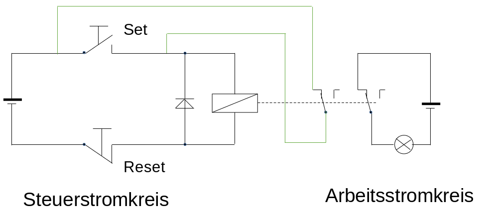
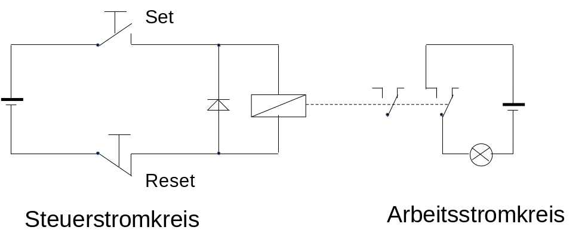
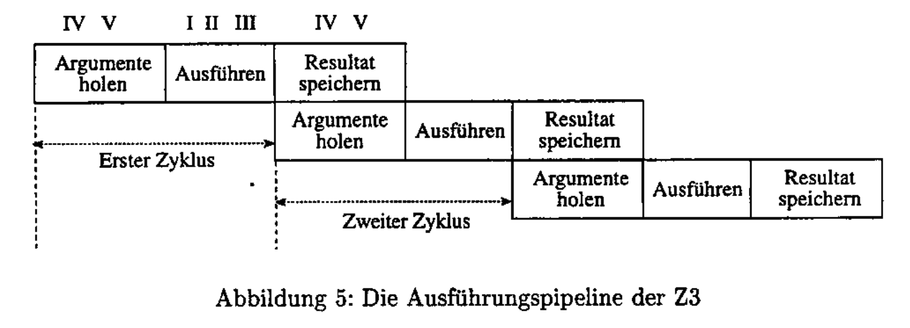
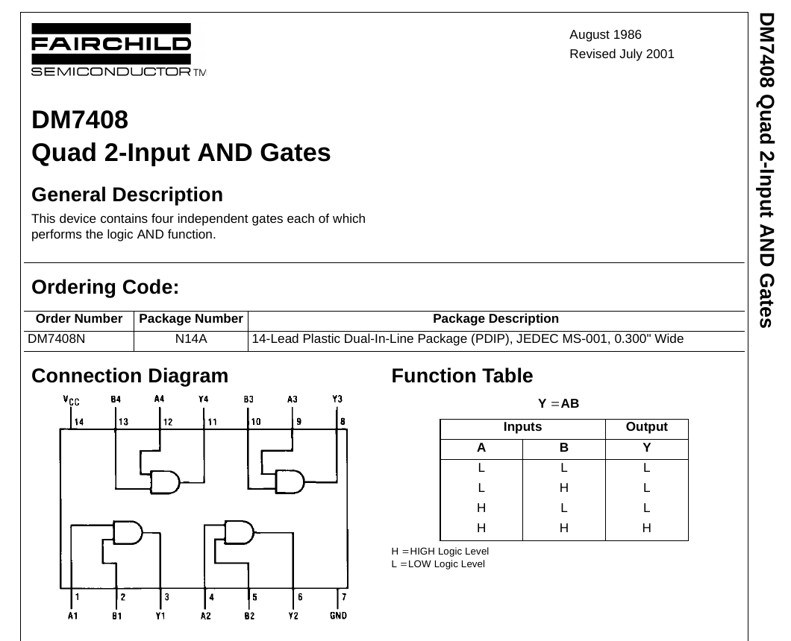
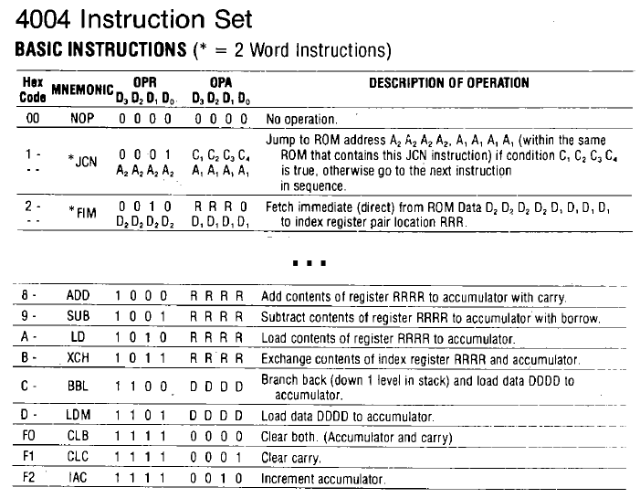
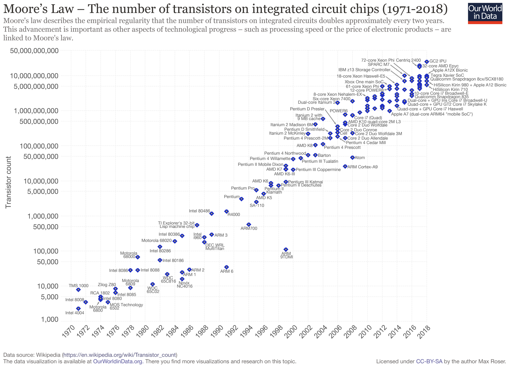

<!--

author:   Sebastian Zug & André Dietrich & Fabian Bär
email:    sebastian.zug@informatik.tu-freiberg.de & andre.dietrich@informatik.tu-freiberg.de & fabian.baer@student.tu-freiberg.de
version:  0.0.1
language: de
narrator: Deutsch Female

import: https://raw.githubusercontent.com/LiaTemplates/NetSwarm-Simulator/master/README.md

-->

# Historischer Überblick

**TU Bergakademie Freiberg - Wintersemester 2020 / 21**

Link auf die aktuelle Vorlesung im Versionsmanagementsystem GitHub

[https://github.com/TUBAF-IfI-LiaScript/VL_EingebetteteSysteme/blob/master/01_HistorischerUeberblick.md](https://github.com/TUBAF-IfI-LiaScript/VL_EingebetteteSysteme/blob/master/01_HistorischerUeberblick.md)

Die interaktive Form ist unter diesem [Link](https://liascript.github.io/course/?https://raw.githubusercontent.com/TUBAF-IfI-LiaScript/VL_EingebetteteSysteme/master/01_HistorischerUeberblick.md#1) zu finden.

---------------------------------------------------------------------

**Fragen an die Veranstaltung**

+ Worin lag der „große Wurf“ des Intel 4004?
+ Was bedeutet die Angabe 8bit, 16bit usw. ?
+ Erklären Sie die Schichten der Rechnerstruktur.
+ Worin unterschieden sich ENIAC und die Z3?
+ ...

---------------------------------------------------------------------

**Weiterführende Literaturhinweise**

+ Dirk W. Hoffmann, Grundlagen der Technischen Informatik, Hanser-Verlag, 2007
+ Raul Rojas, Sechzig Jahre Computergeschichte - Die Architektur der Rechenmaschinen Z1 und Z3 [Link](https://www2.informatik.uni-halle.de/wcms/dokumente/forschung/techreports/96-43report_3.pdf)
+ Webseiten zur Rechnergeschichte

   + http://www.horst-zuse.homepage.t-online.de/z1.html
   + http://www.computerhistory.org/babbage/adalovelace


---------------------------------------------------------------------

<!--
style="width: 80%; min-width: 420px; max-width: 720px;"
-->
```ascii

                Abstraktionsebenen

           +----------------------------+ -.
  Ebene 6  | Problemorientierte Sprache |  |
           +----------------------------+  |
                                           ⎬ Anwendungssoftware
           +----------------------------+  |
  Ebene 5  | Assemblersprache           |  |
           +----------------------------+ -.

           +----------------------------+
  Ebene 4  | Betriebssystem             |     Systemsoftware
           +----------------------------+

           +----------------------------+
  Ebene 3  | Istruktionsset             |     Maschinensprache
           +----------------------------+

           +----------------------------+  -.
  Ebene 2  | Mikroarchitektur           |   |
           +----------------------------+   |
                                            ⎬ Automaten, Speicher, Logik
           +----------------------------+   |
  Ebene 1  | Digitale Logik             |   |
           +----------------------------+  -.

           +----------------------------+
  Ebene 0  | E-Technik, Physik          |     Analoge Phänomene
           +----------------------------+                                      .
```

---------------------------------------------------------------------

## Begrifflichkeiten

_Ein Computer oder Digitalrechner ist eine Maschine, die Probleme für den Menschen lösen kann, indem sie die ihr gegebenen Befehle ausführt._ (Tannenbaum, Computerarchitektur)

_Ein Computer oder Rechner ist ein Gerät, das mittels programmierbarer Rechenvorschriften Daten verarbeitet._ (Wikipedia)

_Rechenanlage (Computer) ...  Die Gesamtheit der Baueinheiten, aus denen ein Datenverarbeitungssystem aufgebaut ist._ (DIN 44300)

> Welche Gemeinsamkeiten und Unterschiede sehen Sie in diesen Definitionen?

## Rechenmaschinen

Ausgangspunkt für die Vereinfachung des Rechnens ist das Konzept des Stellenwertsystems. In einer positionsunabhängigen Darstellung bedarf es immer neuer Symbole um größere Zahlen auszudrücken. Im römischen Zahlensystem sind dies die bekannten Formate `MDCCLXV`. Dabei bedeutet `V` immer 5.

Die Idee, den Wert einer Ziffer von ihrer Position innerhalb der ganzen Zahl abhängig zu machen, geht auf den indischen Kulturkreis zurück. Die sogenannten "arabischen" Zahlen integrieren dafür einen zentrale Voraussetzung, die "0". Ohne die Null ist es nicht möglich, den Wert einer einzelnen Ziffer zu vervielfachen.

Der Abakus greift diesen Ansatz auf und strukturiert den Rechenprozess. Dabei unterscheidet man verschiedene Systeme. Es exisitieren Vorgehensmuster für die Umsetzung der Grundrechenarten und des Wurzelziehens.

<!-- width="60%" --> [^3]

[^3]: Dietmar Rabich, Abakus des Wissenschaftspfads, Lübeck, Schleswig-Holstein, Deutschland, https://commons.wikimedia.org/wiki/File:L%C3%BCbeck,_Wissenschaftspfad,_Abakus_--_2017_--_0373.jpg

Eine weitreichendere Unterstützung beim eigentlichen Rechenprozess bieten die Napierschen Rechenstäbe (John Napier 1550 - 1617), die insbesondere die Multiplikation einer Ziffer mit einem beliebig großen Zahl unterstützen.

!?[Napirsche Rechenstäbe](https://www.youtube.com/watch?v=P_dKOtHjc3o)

Die notwendige manuelle Addition bei größeren Faktoren löste die Rechenmaschine von Wilhelm Schickard. Die Automatisierung der Addition ist mechanisch gelöst und zum Beispiel unter [Link](https://www.rechenwerkzeug.de/schickar.htm)

 <!-- width="60%" --> [^4]

[^4]:  	Herbert Klaeren, Nachbau der Rechenmaschine von Wilhelm Schickard, https://commons.wikimedia.org/wiki/File:Schickardmaschine.jpg

Blair Pascal, Gottfried Wilhelm Leibniz und andere Entwickler trieben die Entwicklung weiter, erweiterten die Stellensysteme, integrierten weitere Rechenarten hatten aber insgesamt mit den mechanischen Herausforderungen und fehlender Fertigungsgenauigkeit zu kämpfen.

_Es ist unwürdig, die Zeit von hervorragenden Leuten mit knechtischen Rechenarbeiten zu verschwenden, weil bei Einsatz einer Maschine auch der Einfältigste die Ergebnisse sicher hinschreiben kann._ (Gottfried Wilhelm Leibniz)

## Abstraktere Konzepte

Bisher stand die Berechnung von einzelnen Ergebnissen auf der Basis einer Sequenz von Eingaben im Vordergrund. Ende des 18. Jahrhunderts entwarfen Visionäre neue Konzepte, die allgemeingültige Lösungen integrierten.

### Joseph-Marie Jacquard (1752 - 1834) - Automatischer Webstuhl

Jacquards "Musterwebstuhl" realisierte die Ansteuerung der Webmechanik durch eine Lochkartensteuerung. Im Jahr 1805 wurde das Verfahren erstmals vorgestellt. Dadurch konnten endlose Muster von beliebiger Komplexität mechanisch hergestellt werden.

<!-- width="60%" --> [^2]

[^2]: Markus Schweiß, Die Lochkartensteuerung einer Jacquard-Maschine im Historischen Zentrum Wuppertal, https://de.wikipedia.org/wiki/Joseph-Marie_Jacquard#/media/Datei:Jacquard01.jpg

Auf den Karte waren Informationen über das in einem Schritt zu webende Muster enthalten. Ein Loch bedeutete Fadenhebung, kein Loch eine Fadensenkung. Dabei konnten die Lochkarten in einer Endlosschleife gekoppelt werden, um wiederkehrende Strukturen umzusetzen.

### Charles Babbage (1791 - 1871) - Analytical Engine

Ausgangspunkt war die Konstruktion einer Rechenmaschine für die Lösung polynomialer Funktionen.  Dabei entstand die Vision einer universellen Rechenapperatur, die auf der Basis eines programmierbaren Systems Berechnungen löst. Die erste Beschreibung wurde 1837 veröffentlicht.

+ Energiebereitstellung über eine Dampfmaschine
+ 55.000 mechanische Komponenten
+ Eingabe der Daten und Befehle über Lochkarten
+ Nutzerinterface:  Drucker, ein Kurvenplotter und eine Glocke
+ Zahlendarstellung: dezimale Festkommazahlen, pro Stelle ein Zahnrad
+ Arbeits“speicher zwischen 1,6 und 20 kB (umstritten)

_The result of my reflections has been that numbers containing more than thirty places of figures will not be required for a long time to come. _

Die Maschine wurde zu Lebzeiten von Babbage nicht realisiert und nur in Teilen durch seinen Sohn implementiert. Aktuell exisitieren in verschiednene Museen unterschiedliche Neubauten.

<!-- width="100%" --> [^1]

[^1]: Science Museum London / Science and Society Picture Library , https://commons.wikimedia.org/wiki/File:Babbages_Analytical_Engine,_1834-1871._(9660574685).jpg

!?[Analytical Engine](https://www.youtube.com/watch?v=_fyUtU6LVNY&feature=emb_logo)

!?[Analytical Engine](https://www.youtube.com/watch?v=XSkGY6LchJs)

## Es werde Licht ... elektrische Systeme

{{0-1}}
*******************************************************************************

Der Verfügbarkeit des elektrische Stromes als Energiequelle löste einige der technischen Hürden bei den mechanischen Rechenmaschinen, eröffnete aber auch neue Möglichkeiten bei der Eingabe von Daten.

Herman Hollerith (1860 - 1929) interpretierte die Lochkarten als Medium neu. Sein Konzept für die Lösung/Auswertung von organisatorischen Problemstellungen sah diese als Basis für die Datenerfassung.

Das System für die Erfassung von Daten auf Lochkartenbestand aus der Tabelliermaschine, dem Lochkartensortierer, dem Lochkartenlocher und dem Lochkartenleser. Damit konnte die Volkszählung in den USA 1890 innerhalb von 2 Jahren auszuwerten.

1924 wurde die von ihm gegründete Firma schließlich in International Business Machines Corporation (IBM) umbenannt.

<!-- width="80%" --> [^6]

[^6]: Railroad Gazette, 19 April 1895, https://commons.wikimedia.org/wiki/File:Hollerith_punched_card.jpg


<!-- width="80%" --> [^5]

[^5]:Adam Schuster, Replica of early Hollerith punched card tabulator and sorting box (right) at Computer History Museum, https://commons.wikimedia.org/wiki/File:HollerithMachine.CHM.jpg

*******************************************************************************

      {{1-2}}
*******************************************************************************
Nicht nur auf der Ebene der Datenerfassung, auch für die Datenspeicherung eröffnete sich auf der Basis des elektrischen Stromes eine Revolution. Relais konnten Zustände nun speichern und logische Operationen abbilden. Damit manifestierte sich aber auch die Festlegung auf eine binäre Informationsdarstellung - An, Aus (1 und 0).

<!-- width="100%" -->

<!-- width="100%" -->
*******************************************************************************

      {{2-3}}
*******************************************************************************
Bis in die 80er Jahre bildeten Analogrechner einen alternativen Ansatz. Anders als bei den diskret arbeitenden Digitalrechnern wurde hier im Werte- und Zeitverlauf kontinuierlich gearbeitete. Dabei wurde das Systemverhalten von komplexen Systemen mit elektrischen Schaltungen nachgebildet.

<!-- width="80%" --> [^6]

[^6]: SchmiAlf, Analogrechneranwendung für die Simulation der Regelstrecke für einen Regelkreis mit einem externen Steuergerät (Mikrocontroller) angeschlossen als Hardware-in-the-Loop, mit Analogrechner EAI-8800, ca. 1985, https://commons.wikimedia.org/wiki/File:Analogrechner_HW-in-Loop_Ausschnitt.jpg

*******************************************************************************

### Zuse Z3

Die Z3 war der erste funktionsfähige Digitalrechner weltweit und wurde 1941 von Konrad Zuse in Zusammenarbeit mit Helmut Schreyer in Berlin gebaut. Die Z3 wurde in elektromagnetischer Relaistechnik mit 600 Relais für das Rechenwerk und 1400 Relais für das Speicherwerk ausgeführt.

+ 10 Hertz Taktfrequenz
+ basierend auf 2200 Relais
+ 22-stellige Binärzahlen (im Gleitkomma-Format !)
+ dezimale Ein-/Ausgabe
+ Speicher mit 64 Worten
+ Steuereinheit mit Sequenzer
+ Addition in 3 Takten, Multiplikation in 16 Takten
+ keine Sprungoperationen!

!?[ZuseZ3 Deutsches Museum](https://www.youtube.com/watch?v=aUXnhVrT4CI)

Bereits Vorwegname der Kernelemente moderner Architekturen:

+ Gleitkommaformat
+ Mikroprogrammierung
+ Pipeline-Konzept
+ Carry-Look-Ahead Addierer

<!-- width="100%" --> [^13]

[^13]:  Raul Rojas, Sechzig Jahre Computergeschichte - Die Architektur der Rechenmaschinen Z1 und Z3 [Link](https://www2.informatik.uni-halle.de/wcms/dokumente/forschung/techreports/96-43report_3.pdf)


### Eniac

+ 18000 Röhren, 1500 Relais
+ 130 m2, 30 Tonnen, 140 kW
+ dezimale Kodierung
+ ca. 5000 Additionen je Sek.
+ 20 Akkumulatoren, 1 Multi-plizierer, 3 Funktionstabellen
+ programmiert durch Kabel-Verbindungen
+ E/A mittels Lochkarten
+ gebaut für ballistische Berechnungen

### Konzeptionelle Entwürfe

In seinem Papier _First Draft on the Report of EDVAC_ beschreibt John von Neumann 1945 die Basiskomponenten eines Rechners:

+ ALU (Arithmetic Logic Unit) – Rechenwerk für die Durchführung mathematisch/logischer Operationen
+ Control Unit – Steuerwerk für die Interpretation der Anweisungen eines Programmes
+ BUS – Bus System, dient zur Kommunikation zwischen den einzelnen Komponenten (Steuerbus, Adressbus, Datenbus)
+ Memory – Speicherwerk für Programme als auch Daten
+ Ein-/Ausgabe – Nutzerinterface

<!-- width="60%" --> [^12]

[^12]: Medvedev, Schaltbild einer Von-Neumann-Architektur auf deutsch.: https://commons.wikimedia.org/wiki/File:%22von_Neumann%22_Architektur_de.svg


## Die Transistor-Ära

1948 stellen Shockley, Bardeen und Brattain den ersten Transistor an den Bell Labs her. Dafür erhalten sie 1956 den Nobelpreis für Physik. Der Transistor verdrängt langsam die Röhre als Verstärker und Schalter. Die neue Technik ermöglicht die Erstellung integrierter Schaltungen.

!?[NPN Transistor](https://www.youtube.com/watch?v=5wIRJN3DN_8)

Und wie wird daraus nun ein Rechner? Die intelligente Verschaltung mehrerer Transistoren ermöglicht die Umsetzung von logischen Schaltungen wie AND, OR usw.

<!-- width="50%" --> [^6]

[^6]: EBatlleP, diagram of a transistor AND gate. Reference: http://hyperphysics.phy-astr.gsu.edu/hbase/electronic/and.html#c1, https://commons.wikimedia.org/wiki/File:TransistorANDgate.png

Diese wiederum fassen wir nun in entsprechenden ICs zusammen. Wir haben die elektrische Ebene verlassen und sind endgültig auf der logischen Ebene angekommen.

<!-- width="100%" --> [^7]

[^7]: Datenblatte der Firma Fairchild, DM7408, August 1986

### Intel 4040

Beispiel: Intel 4004-Architektur (1971)

<!-- style="width: 80%; display: block; margin-left: auto; margin-right: auto;" --> [^8]

[^8]: Autor Appaloosa, Intel 4004, https://upload.wikimedia.org/wikipedia/commons/thumb/8/87/4004_arch.svg/1190px-4004_arch.svg.png

+ Anzahl Transistoren: 2300
+ Taktfrequenz: 500 bis 740 kHz
+ Zyklen pro Instruktion: 8
+ Daten-Adressraum: 5120 Bit (Harvard-Architektur)
+ Anzahl Befehle: 46
+ Bauform: 16 Pin (DIP)

> Halten Sie nach der GoldCap-Variante Ausschau!

Unterstützung für die Interpretation aus dem Nutzerhandbuch, dass das Instruction
set beschreibt:

<!-- width="100%" -->[^9]

[^8]: Intel 4004 Assembler, http://e4004.szyc.org/asm.html

### Weitere Entwicklung

| Jahr | Entwicklung                                              |
| ---- | -------------------------------------------------------- |
| 1974 | Intel 8080 erste universelle 8-Bit CPU auf einem Chip    |
| 1978 | Intel 8086 erste 16-Bit CPU auf einem Chip               |
| 1979 | Motorola 68000 mit 32-Bit interner Architektur           |
| 1981 | Einführung des IBM PC                                    |
| 1985 | Intel 80386 (32-Bit CPU)                                 |
| 1989 | Intel 80486 Cache + FPU auf dem Chip                     |
| 1993 | Intel Pentium (zwei Pipelines)                           |
| 1995 | Intel Pentium Pro (bis zu fünf Operationen gleichzeitig) |
| 2002 | Intel Pentium 4 (Trace-Cache)                            |

<!--
style="width: 80%; display: block; margin-left: auto; margin-right: auto;"-->[^1]

[^1]:Quelle: https://commons.wikimedia.org/wiki/File:Moore%27s_Law_Transistor_Count_1971-2018.png, Max Roser

## Und warum ist das nun alles für uns wichtig?

+ Die historische Entwicklung der Rechentechnik ist eine Übersicht über erfolgreiche und vergangene Trends oder korrekte und weniger korrekte Prognosen.

    _I thinkthere is a world market for about five computers._ (Thomas J. Watson Jr., chairman of IBM, 1943)

    _Where a calculator as the ENIAC is equipped with 18000 vacuum tubes and weighs 30 tons, computers in the future may have only 1000 vaccum tubes and weigh 1 1/2 tons._ (Popular Mechanics, 1949)

    _640 KBytes [of main memory]ought to be enough for anybody._ (Bill Gates, Microsoft, 1981)

+ Eine Einordnung der vielzitierten Pioniere einer Wissenschaft ist für deren objektive Bewertung zwingend notwendig.
+ Entwicklungen wiederholen sich ...


## Hausaufgabe

+ Setzen Sie sich mit den Unterschieden zwischen der Z1 und der Z3 auseinander.

+ Woher stammt der Begriff "Bug" in Bezug auf die Programmierung?
