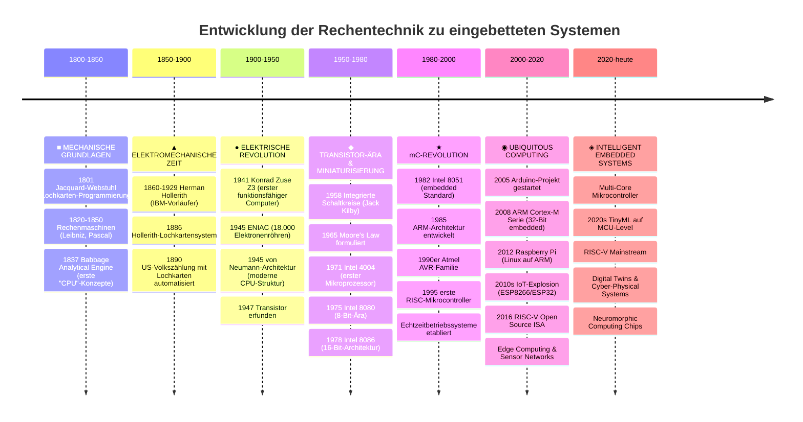

<!--

author:   Sebastian Zug, André Dietrich, Fabian Bär & GitHub Copilot Teaching-Agent
email:    sebastian.zug@informatik.tu-freiberg.de & andre.dietrich@informatik.tu-freiberg.de & fabian.baer@student.tu-freiberg.de
version:  0.6.1
language: de
narrator: Deutsch Female

import:   https://raw.githubusercontent.com/LiaTemplates/NetSwarm-Simulator/master/README.md
          https://raw.githubusercontent.com/liaScript/mermaid_template/master/README.md
          https://raw.githubusercontent.com/TUBAF-IfI-LiaScript/VL_EingebetteteSysteme/master/config.md

-->

[](https://liascript.github.io/course/?https://raw.githubusercontent.com/TUBAF-IfI-LiaScript/VL_EingebetteteSysteme/master/01_HistorischerUeberblick.md#1)

# Historischer Überblick

| Parameter                | Kursinformationen                                                                                                                                                                          |
| ------------------------ | ------------------------------------------------------------------------------------------------------------------------------------------------------------------------------------------ |
| **Veranstaltung:**       | @config.lecture                                                                                          |
| **Semester:**            | @config.semester                                                                                         |
| **Hochschule:**          | `Technische Universität Freiberg`                                                                        |
| **Inhalte:**             | `Übersicht der historischen Entwicklung von Rechentechnik`                                              |
| **Link auf GitHub:**     | https://github.com/TUBAF-IfI-LiaScript/VL_EingebetteteSysteme/blob/master/01_HistorischerUeberblick.md |
| **Autoren:**             | @author                                                                                                  |


---------------------------------------------------------------------

**Fragen an die Veranstaltung**

+ Worin lag der „große Wurf" des Intel 4004?
+ Was bedeutet die Angabe 8bit, 16bit usw. ?
+ Erklären Sie die Schichten der Rechnerstruktur.
+ Worin unterschieden sich ENIAC und die Z3?
+ Welche technologischen Durchbrüche ermöglichten die Miniaturisierung von Computern?
+ Warum war die Harvard-Architektur für frühe Computer wichtig?
+ Welche Rolle spielte die Erfindung des Transistors für die Computerentwicklung?
+ Wie entwickelten sich Speichertechnologien im Laufe der Computergeschichte? 

---------------------------------------------------------------------

**Weiterführende Literaturhinweise**

+ Dirk W. Hoffmann, Grundlagen der Technischen Informatik, Hanser-Verlag, 2007
+ Raul Rojas, Sechzig Jahre Computergeschichte - Die Architektur der Rechenmaschinen Z1 und Z3 [Link](https://www2.informatik.uni-halle.de/wcms/dokumente/forschung/techreports/96-43report_3.pdf)
+ Webseiten zur Rechnergeschichte

   + http://www.horst-zuse.homepage.t-online.de/z1.html
   + http://www.computerhistory.org/babbage/adalovelace

---------------------------------------------------------------------

## Von Rechenmaschinen zum Arduino: 200 Jahre Rechentechnik

    --{{0}}--
Erinnern Sie sich an den Arduino-Code aus der letzten Vorlesung? `pinMode()`, `digitalWrite()`, `delay()` - diese einfachen Befehle sind das Ergebnis einer 200-jährigen Evolution. Heute reisen wir durch die Zeit und entdecken, wie aus mechanischen Zahnrädern die Mikrocontroller in Ihrem Arduino wurden.

    --{{1}}--
Hier ist das Faszinierende: Die Grundprinzipien, die Charles Babbage 1837 in seiner Analytical Engine erdachte, stecken heute noch in Ihrem ATmega328P. Nur sind sie millionenfach kleiner und milliardenfach schneller geworden.

> **Mission dieser Vorlesung:** Verstehen Sie, warum Ihr Arduino so funktioniert, wie er funktioniert - durch die Brille der Geschichte!

---------------------------------------------------------------------

<!--
style="width: 80%; min-width: 420px; max-width: 720px;"
-->
```ascii

                Abstraktionsebenen

           +----------------------------+ -.
  Ebene 6  | Problemorientierte Sprache |  |
           +----------------------------+  |
                                           ⎬ Anwendungssoftware
           +----------------------------+  |
  Ebene 5  | Assemblersprache           |  |
           +----------------------------+ -.

           +----------------------------+
  Ebene 4  | Betriebssystem             |     Systemsoftware
           +----------------------------+

           +----------------------------+
  Ebene 3  | Instruktionsset            |     Maschinensprache
           +----------------------------+

           +----------------------------+  -.
  Ebene 2  | Mikroarchitektur           |   |
           +----------------------------+   |
                                            ⎬ Automaten, Speicher, Logik
           +----------------------------+   |
  Ebene 1  | Digitale Logik             |   |
           +----------------------------+  -.

           +----------------------------+
  Ebene 0  | E-Technik, Physik          |     Analoge Phänomene
           +----------------------------+                                      .
```

---------------------------------------------------------------------

## Begrifflichkeiten

    --{{0}}--
Bevor wir in die Geschichte eintauchen, klären wir die Grundbegriffe. Ihr Arduino ist übrigens ein perfektes Beispiel für alle diese Definitionen: Er löst Probleme (LED-Steuerung), verarbeitet Daten (Sensormessungen) und besteht aus zusammenarbeitenden Baueinheiten (CPU, RAM, Flash-Speicher).

_Ein Computer oder Digitalrechner ist eine Maschine, die Probleme für den Menschen lösen kann, indem sie die ihr gegebenen Befehle ausführt._ (Tannenbaum, Computerarchitektur)

_Ein Computer oder Rechner ist ein Gerät, das mittels programmierbarer Rechenvorschriften Daten verarbeitet._ (Wikipedia)

_Rechenanlage (Computer) ...  Die Gesamtheit der Baueinheiten, aus denen ein Datenverarbeitungssystem aufgebaut ist._ (DIN 44300)

    --{{1}}--
Interessant: Diese Definitionen von 1945, 2020 und 1970 beschreiben alle das Gleiche - nur die Implementierung hat sich dramatisch verändert. Von raumfüllenden Röhrencomputern zu daumennagelgroßen Mikrocontrollern.

> Welche Gemeinsamkeiten und Unterschiede sehen Sie in diesen Definitionen?

## Zeitstrahl: Von Zahnrädern zu Mikrocontrollern

Bevor wir in die Details eintauchen, verschaffen wir uns einen Überblick über die wichtigsten Meilensteine. Dieser Zeitstrahl zeigt Ihnen die Evolution von mechanischen Rechenmaschinen bis zu Ihrem Arduino - eine faszinierende 200-Jahres-Reise!



    --{{0}}--
Faszinierend: Diese Timeline zeigt die kontinuierliche Evolution der technischen Informatik! Von Babbages mechanischen Konzepten 1837 über die Transistor-Revolution bis zu Ihrem Arduino heute - jede Epoche brachte entscheidende Durchbrüche. Besonders bemerkenswert: Moore's Law, ARM-Architektur und RISC-V haben direkt zu den Mikrocontrollern geführt, die Sie heute in embedded Systems verwenden. Ihr Arduino ist das Ergebnis von 200 Jahren Ingenieurskunst!

## Rechenmaschinen

{{0-1}}
Ausgangspunkt für die Vereinfachung des Rechnens ist das Konzept des Stellenwertsystems. In einer positionsunabhängigen Darstellung bedarf es immer neuer Symbole um größere Zahlen auszudrücken. Im römischen Zahlensystem sind dies die bekannten Formate `MDCCLXV`. Können Sie den Zahlenwert rekonstruieren - es ist das Gründungsjahr der Bergakademie.

{{0-1}}
> Die Idee, den Wert einer Ziffer von ihrer Position innerhalb der ganzen Zahl abhängig zu machen, geht auf den indischen Kulturkreis zurück. Die sogenannten "arabischen" Zahlen integrieren dafür einen zentrale Voraussetzung, die "0". Ohne die Null ist es nicht möglich, den Wert einer einzelnen Ziffer zu vervielfachen.

{{1-2}}
Der Abakus greift diesen Ansatz auf und strukturiert den Rechenprozess. Dabei unterscheidet man verschiedene Systeme. Es exisitieren Vorgehensmuster für die Umsetzung der Grundrechenarten und des Wurzelziehens.

{{1-2}}
<!-- width="60%" -->

[^Abakus]: Dietmar Rabich, Abakus des Wissenschaftspfads, Lübeck, Schleswig-Holstein, Deutschland, https://commons.wikimedia.org/wiki/File:L%C3%BCbeck,_Wissenschaftspfad,_Abakus_--_2017_--_0373.jpg

{{2-3}}
Eine weitreichendere Unterstützung beim eigentlichen Rechenprozess bieten die Napierschen Rechenstäbe (John Napier 1550 - 1617), die insbesondere die Multiplikation einer Ziffer mit einer beliebig großen Zahl unterstützen.

{{2-3}}
!?[Napirsche Rechenstäbe](https://www.youtube.com/watch?v=P_dKOtHjc3o)

{{3-4}}
Die notwendige manuelle Addition bei größeren Faktoren löste die Rechenmaschine von Wilhelm Schickard. Die Automatisierung der Addition ist mechanisch gelöst und zum Beispiel unter [Link](https://www.rechenwerkzeug.de/schickar.htm) beschrieben.

{{3-4}}
 <!-- width="60%" -->

{{3-4}}
!?[Wilhelm Schickards Rechenmaschine](https://www.youtube.com/watch?v=N_uiwO8lT5c)

[^Schickard]:  	Herbert Klaeren, Nachbau der Rechenmaschine von Wilhelm Schickard, https://commons.wikimedia.org/wiki/File:Schickardmaschine.jpg

{{4-5}}
Blair Pascal, Gottfried Wilhelm Leibniz und andere Entwickler trieben die Entwicklung weiter, erweiterten die Stellensysteme, integrierten weitere Rechenarten hatten aber insgesamt mit den mechanischen Herausforderungen und fehlender Fertigungsgenauigkeit zu kämpfen.

{{4-5}}
> _Es ist unwürdig, die Zeit von hervorragenden Leuten mit knechtischen Rechenarbeiten zu verschwenden, weil bei Einsatz einer Maschine auch der Einfältigste die Ergebnisse sicher hinschreiben kann._ (Gottfried Wilhelm Leibniz)

## Abstraktere Konzepte

Bisher stand die Berechnung von einzelnen Ergebnissen auf der Basis einer Sequenz von Eingaben im Vordergrund. Ende des 18. Jahrhunderts entwarfen Visionäre neue Konzepte, die allgemeingültige Lösungen integrierten.

Diesen Aspekt kann man auf technischer und theoretischer Ebene betrachten.

Die Grundlagen moderner Rechner legten die Arbeiten von Georg Boole (1815 - 1864), der eine boolesche Algebra (oder einen booleschen Verband) definierte, die die Eigenschaften der logischen Operatoren UND, ODER, NICHT sowie die Eigenschaften der mengentheoretischen Verknüpfungen Durchschnitt, Vereinigung, Komplement verallgemeinert. Gleichwertig zu booleschen Algebren sind boolesche Ringe, die von UND und ENTWEDER-ODER (exklusiv-ODER) beziehungsweise Durchschnitt und symmetrischer Differenz ausgehen.

<!-- width="30%" -->

[^Boole]: Autor unbekannt, George Boole, https://commons.wikimedia.org/wiki/File:George_Boole_color.jpg

### Joseph-Marie Jacquard (1752 - 1834) - Automatischer Webstuhl

Jacquards "Musterwebstuhl" realisierte die Ansteuerung der Webmechanik durch eine Lochkartensteuerung. Im Jahr 1805 wurde das Verfahren erstmals vorgestellt. Dadurch konnten endlose Muster von beliebiger Komplexität mechanisch hergestellt werden.

<!-- width="60%" -->

[^Jacquard]: Markus Schweiß, Die Lochkartensteuerung einer Jacquard-Maschine im Historischen Zentrum Wuppertal, https://de.wikipedia.org/wiki/Joseph-Marie_Jacquard#/media/Datei:Jacquard01.jpg

Auf den Karte waren Informationen über das in einem Schritt zu webende Muster enthalten. Ein Loch bedeutete Fadenhebung, kein Loch eine Fadensenkung. Dabei konnten die Lochkarten in einer Endlosschleife gekoppelt werden, um wiederkehrende Strukturen umzusetzen.

### Charles Babbage (1791 - 1871) - Analytical Engine

Ausgangspunkt war die Konstruktion einer Rechenmaschine für die Lösung polynomialer Funktionen.  Dabei entstand die Vision einer universellen Rechenapperatur, die auf der Basis eines programmierbaren Systems Berechnungen löst. Die erste Beschreibung wurde 1837 veröffentlicht.

+ Energiebereitstellung über eine Dampfmaschine
+ 8000 mechanische Komponenten
+ Eingabe der Daten und Befehle über Lochkarten
+ Nutzerinterface:  Drucker, ein Kurvenplotter und eine Glocke
+ Zahlendarstellung: dezimale Festkommazahlen, pro Stelle ein Zahnrad
+ Arbeitsspeicher zwischen 1,6 und 20 kB (umstritten)

    --{{0}}--
Moment mal - 20 kB Arbeitsspeicher? Ihr Arduino Uno hat 2 kB SRAM! Babbage plante 1837 bereits zehnmal mehr RAM als Ihr moderner Mikrocontroller tatsächlich hat. Das zeigt: Speicher war schon damals der Flaschenhals.

_The result of my reflections has been that numbers containing more than thirty places of figures will not be required for a long time to come. _

    --{{1}}--
Eine weitere Parallele zu heute: Babbage dachte, 30 Dezimalstellen würden "für lange Zeit" ausreichen. Heute rechnen wir mit 32-Bit-Zahlen - das sind etwa 10 Dezimalstellen. Manchmal liegen die Visionäre richtig, aber aus den falschen Gründen!

Die Maschine wurde zu Lebzeiten von Babbage nicht realisiert und nur in Teilen durch seinen Sohn implementiert. Aktuell exisitieren in verschiedenen Museen unterschiedliche Neubauten.

<!-- width="60%" -->

[^AnalyticalEngine]: Science Museum London / Science and Society Picture Library , https://commons.wikimedia.org/wiki/File:Babbages_Analytical_Engine,_1834-1871._(9660574685).jpg

!?[Analytical Engine](https://www.youtube.com/watch?v=_fyUtU6LVNY&feature=emb_logo)

!?[Analytical Engine](https://www.youtube.com/watch?v=XSkGY6LchJs)

Eine der zentralen Persönlichkeiten, die die Möglichkeiten der Analytical Engine erkannte, war Ada Lovelace. 

> _„[Die Analytical Engine] könnte auf andere Dinge als Zahlen angewandt werden, wenn man Objekte finden könnte, deren Wechselwirkungen durch die abstrakte Wissenschaft der Operationen dargestellt werden können und die sich für die Bearbeitung durch die Anweisungen und Mechanismen des Gerätes eignen.“_

Ada Lovelace legte in den Notes zu einem Vortrag von Babbage einen schriftlichen Plan zur Berechnung der Bernoulli-Zahlen in Diagrammform vor, welcher als das erste veröffentlichte formale Computerprogramm gelten kann.

## Es werde Licht ... elektrische Systeme

{{0-1}}
*******************************************************************************

Der Verfügbarkeit des elektrischen Stromes als Energiequelle löste einige der technischen Hürden bei den mechanischen Rechenmaschinen, eröffnete aber auch neue Möglichkeiten bei der Eingabe von Daten.

Herman Hollerith (1860 - 1929) interpretierte die Lochkarten als Medium neu. Sein Konzept für die Lösung/Auswertung von organisatorischen Problemstellungen sah diese als Basis für die Datenerfassung.

Das System für die Erfassung von Daten auf Lochkarten bestand aus der Tabelliermaschine, dem Lochkartensortierer, dem Lochkartenlocher und dem Lochkartenleser. Damit konnte die Volkszählung in den USA 1890 innerhalb von 2 Jahren ausgewertet werden.

1924 wurde die von ihm gegründete Firma schließlich in International Business Machines Corporation (IBM) umbenannt.

<!-- width="80%" -->

!?[Holerith](https://www.youtube.com/watch?v=17On5ItcrBA)

*******************************************************************************

      {{1-2}}
*******************************************************************************

Nicht nur auf der Ebene der Datenerfassung, sondern auch für die Datenspeicherung eröffnete sich auf der Basis des elektrischen Stromes eine Revolution. Relais konnten Zustände nun speichern und logische Operationen abbilden. Damit manifestierte sich aber auch die Festlegung auf eine binäre Informationsdarstellung - An, Aus (1 und 0).

<!-- width="60%" -->

<!-- width="60%" -->

*******************************************************************************

      {{2-3}}
*******************************************************************************
Bis in die 80er Jahre bildeten Analogrechner einen alternativen Ansatz. Anders als bei den diskret arbeitenden Digitalrechnern wurde hier im Werte- und Zeitverlauf kontinuierlich gearbeitet. Dabei wurde das Systemverhalten von komplexen Systemen mit elektrischen Schaltungen nachgebildet.

<!-- width="80%" -->

*******************************************************************************

[^Hollerith]: Adam Schuster, Replica of early Hollerith punched card tabulator and sorting box (right) at Computer History Museum, https://commons.wikimedia.org/wiki/File:HollerithMachine.CHM.jpg

[^AnalogRechner]: SchmiAlf, Analogrechneranwendung für die Simulation der Regelstrecke für einen Regelkreis mit einem externen Steuergerät (Mikrocontroller) angeschlossen als Hardware-in-the-Loop, mit Analogrechner EAI-8800, ca. 1985, https://commons.wikimedia.org/wiki/File:Analogrechner_HW-in-Loop_Ausschnitt.jpg

### Zuse Z3

Die Z3 war der erste funktionsfähige Digitalrechner weltweit und wurde 1941 von Konrad Zuse in Zusammenarbeit mit Helmut Schreyer in Berlin gebaut. Die Z3 wurde in elektromagnetischer Relaistechnik mit 600 Relais für das Rechenwerk und 1400 Relais für das Speicherwerk ausgeführt.

+ 10 Hertz Taktfrequenz
+ basierend auf 2200 Relais
+ 22-stellige Binärzahlen (im Gleitkomma-Format !)
+ dezimale Ein-/Ausgabe
+ Speicher mit 64 Worten
+ Steuereinheit mit Sequenzer
+ Addition in 3 Takten, Multiplikation in 16 Takten
+ keine Sprungoperationen!

!?[ZuseZ3 Deutsches Museum](https://www.youtube.com/watch?v=aUXnhVrT4CI)

Bereits Vorwegname der Kernelemente moderner Architekturen:

+ Gleitkommaformat
+ Mikroprogrammierung
+ Pipeline-Konzept
+ Carry-Look-Ahead Addierer

<!-- width="80%" -->

[^Rojas]:  Raul Rojas, Sechzig Jahre Computergeschichte - Die Architektur der Rechenmaschinen Z1 und Z3 [Link](https://www2.informatik.uni-halle.de/wcms/dokumente/forschung/techreports/96-43report_3.pdf)


### Eniac

Electronic Numerical Integrator and Computer (ENIAC)

+ 18000 Röhren, 1500 Relais
+ 130 $m^2$, 30 Tonnen, 140 kW
+ dezimale Kodierung
+ ca. 5000 Additionen je Sek.
+ 20 Akkumulatoren, 1 Multiplizierer, 3 Funktionstabellen
+ programmiert durch Kabel-Verbindungen
+ E/A mittels Lochkarten
+ gebaut für ballistische Berechnungen

<!-- width="60%" -->

Ein großes Problem bei der Entwicklung des ENIAC war die Fehleranfälligkeit der Elektronenröhren. Wenn nur eine der 17.468 Röhren ausfiel, rechnete die gesamte Maschine fehlerhaft.

[^ENIAC]: Autor unbekannt, ENIAC in Philadelphia, Pennsylvania. Glen Beck (background) and Betty Snyder (foreground) program the ENIAC in building 328 at the Ballistic Research Laboratory , https://commons.wikimedia.org/wiki/File:Eniac.jpg

### Konzeptionelle Entwürfe

In seinem Papier _First Draft on the Report of EDVAC_ beschreibt John von Neumann 1945 die Basiskomponenten eines Rechners:

+ ALU (Arithmetic Logic Unit) – Rechenwerk für die Durchführung mathematischer/logischer Operationen
+ Control Unit – Steuerwerk für die Interpretation der Anweisungen eines Programmes
+ BUS – Bus System, dient zur Kommunikation zwischen den einzelnen Komponenten (Steuerbus, Adressbus, Datenbus)
+ Memory – Speicherwerk sowohl für Programme als auch für Daten
+ Ein-/Ausgabe – Nutzerinterface

<!-- width="60%" -->

[^Neumann]: Medvedev, Schaltbild einer Von-Neumann-Architektur auf deutsch.: https://commons.wikimedia.org/wiki/File:%22von_Neumann%22_Architektur_de.svg


## Die Transistor-Ära

1948 stellen Shockley, Bardeen und Brattain den ersten Transistor an den Bell Labs her. Dafür erhalten sie 1956 den Nobelpreis für Physik. Der Transistor verdrängt langsam die Röhre als Verstärker und Schalter. Die neue Technik ermöglicht die Erstellung integrierter Schaltungen.

!?[NPN Transistor](https://www.youtube.com/watch?v=5wIRJN3DN_8)

Und wie wird daraus nun ein Rechner? Die intelligente Verschaltung mehrerer Transistoren ermöglicht die Umsetzung von logischen Schaltungen wie AND, OR usw.

<!-- width="30%" -->

[^ANDTransistor]: EBatlleP, diagram of a transistor AND gate. Reference: http://hyperphysics.phy-astr.gsu.edu/hbase/electronic/and.html#c1, https://commons.wikimedia.org/wiki/File:TransistorANDgate.png

Diese wiederum fassen wir nun in entsprechenden ICs zusammen. Wir haben die elektrische Ebene verlassen und sind endgültig auf der logischen Ebene angekommen.

<!-- width="100%" -->

[^Fairchild]: Datenblatt der Firma Fairchild, DM7408, August 1986

### Intel 4004

Beispiel: Intel 4004-Architektur (1971)

<!-- style="width: 80%; display: block; margin-left: auto; margin-right: auto;"-->

[^Intel4004]: Autor Appaloosa, Intel 4004, https://upload.wikimedia.org/wikipedia/commons/thumb/8/87/4004_arch.svg/1190px-4004_arch.svg.png

+ Anzahl Transistoren: 2300
+ Taktfrequenz: 500 bis 740 kHz
+ Zyklen pro Instruktion: 8
+ Daten-Adressraum: 5120 Bit (Harvard-Architektur)
+ Anzahl Befehle: 46
+ Bauform: 16 Pin (DIP)

    --{{0}}--
Jetzt wird's spannend: Vergleichen wir das mit Ihrem Arduino! Der ATmega328P hat etwa 100.000 Transistoren (40x mehr), läuft mit 16 MHz (20x schneller) und hat 131 Befehle. In 50 Jahren ist die Rechenleistung um etwa das 1000-fache gestiegen - und das Ganze passt auf einen Fingernagel!

**Intel 4004 (1971) vs. ATmega328P (2008):**

| Eigenschaft | Intel 4004 | ATmega328P | Faktor |
|-------------|------------|------------|---------|
| Transistoren | 2.300 | ~100.000 | 43x |
| Taktfrequenz | 740 kHz | 16 MHz | 22x |
| Befehle | 46 | 131 | 3x |
| Wortbreite | 4 Bit | 8 Bit | 2x |
| RAM | 80 Byte | 2048 Byte | 26x |

    --{{1}}--
Das Faszinierende: Beide verwenden die Harvard-Architektur! Der 4004 war seiner Zeit voraus und verwendete getrennte Speicher für Programm und Daten - genau wie Ihr Arduino heute.

> Halten Sie nach der GoldCap-Variante Ausschau!

Unterstützung für die Interpretation aus dem Nutzerhandbuch, dass das Instruction
set beschreibt:

<!-- width="100%" -->

[^Instruction]: Intel 4004 Assembler, http://e4004.szyc.org/asm.html

### Weitere Entwicklung

| Jahr | Entwicklung                                               | Beschreibung                                                                                                      |
|------|-----------------------------------------------------------|-------------------------------------------------------------------------------------------------------------------|
| 1971 | Intel 4004                                                | Erste kommerzielle CPU auf einem einzigen Chip (4-Bit).                                                          |
| 1978 | Intel 8086                                                | 16-Bit-Architektur und Grundlage für die x86-Architektur.                                                        |
| 1979 | Motorola 68000 mit 32-Bit interner Architektur            |
| 1985 | RISC-Architektur                                          | Einführung der RISC (Reduced Instruction Set Computer)-Architektur für effizientere CPU-Designs.                 |
| 1989 | Intel i860 und erste GPUs                                 | Erste Grafikprozessoren (GPUs) für 3D-Beschleunigung und spezielle Berechnungen.                                 |
| 1993 | Intel Pentium                                             | Einführung von Super-Skalaren und schnellerer Rechenleistung bei x86-Prozessoren.                                |
| 1999 | Nvidia GeForce 256                                        | Erste „GPU“ zur Hardware-Beschleunigung von 3D-Grafikberechnungen.                                               |
| 2000 | AMD Athlon 64                                             | Erste 64-Bit-Desktop-CPU.                                                |
| 2006 | Mehrkernprozessoren (Intel Core, AMD Athlon X2)           | Einführung von Mehrkernprozessoren für verbesserte Leistung und parallele Verarbeitung.                          |
| 2010 | Nvidia Fermi-Architektur                                  | CUDA-Architektur für Parallelverarbeitung und GPGPU (General Purpose GPU Computing).                             |
| 2011 | Intel Sandy Bridge                                        | Einführung der integrierten Grafik mit CPU und GPU auf demselben Chip für höhere Effizienz.                      |
| 2015 | AMD HBM (High Bandwidth Memory)                           | Einführung von HBM für schnelle und effiziente Speichernutzung bei GPUs.                                         |
| 2016 | Nvidia Pascal-Architektur und Deep Learning               | GPUs mit optimierter Leistung für KI und Deep Learning (Tesla P100).                                             |
| 2020 | Apple M1 SoC                                              | Erster ARM-basierter Desktop-Prozessor von Apple                         |
| 2022 | Nvidia Ada Lovelace-Architektur                           | Fortschrittliche Architektur für Raytracing und KI-Beschleunigung mit DLSS 3-Technologie.                        |


<!--
style="width: 80%; display: block; margin-left: auto; margin-right: auto;"-->

[^MooresLaw]:Quelle: https://commons.wikimedia.org/wiki/File:Moore%27s_Law_Transistor_Count_1971-2018.png, Max Roser

## Warum ist das alles für Ihren Arduino wichtig?

    --{{0}}--
Jetzt kommt die Auflösung: Diese ganze Geschichte erklärt, warum Ihr Arduino so funktioniert, wie er funktioniert. Jede Zeile Code, die Sie schreiben, steht auf den Schultern von 200 Jahren Innovation.

+ **Die historische Entwicklung zeigt Muster auf**, die sich wiederholen - auch bei den Fehlprognosen:

    _I think there is a world market for about five computers._ (Thomas J. Watson Jr., chairman of IBM, 1943)

    _Where a calculator as the ENIAC is equipped with 18000 vacuum tubes and weighs 30 tons, computers in the future may have only 1000 vaccum tubes and weigh 1 1/2 tons._ (Popular Mechanics, 1949)

    _There is no reason anyone would want a computer in their home._ (Ken Olsen, founder of Digital Equipment Corporation, 1977)

    _Apple is already dead._ (Nathan Myhrvold, Microsoft CTO, 1997)

    _The Internet will catastrophically collapse in 1996._ (Robert Metcalfe, Ethernet inventor, 1995)

    _Two years from now, spam will be solved._ (Bill Gates, Microsoft, 2004)

    _The iPhone has no chance of getting any significant market share._ (Steve Ballmer, Microsoft CEO, 2007)

    _No one will ever need more than 637 kB of memory for a personal computer._ (Bill Gates, 1981 - angeblich)

    _Smartphones will never replace cameras._ (Kodak executives, 2000s)

    --{{1}}--
**************************************************************

Diese Fehleinschätzungen folgen einem Muster: Die Experten unterschätzten IMMER drei Dinge - Miniaturisierung, Vernetzung und Benutzerfreundlichkeit. Ken Olsen konnte sich 1977 nicht vorstellen, warum jemand einen Computer zu Hause haben wollte. Steve Ballmer lachte 2007 über das iPhone. Kodak dachte, Smartphones würden niemals Kameras ersetzen. Das Muster? Etablierte Experten denken in den Grenzen ihrer aktuellen Technologie, statt radikal neu zu denken.

+ **Ihre Arduino-Projekte sind Teil dieser Geschichte** - Sie programmieren die gleichen Grundkonzepte, die von Babbage erdacht und von den Intel-Ingenieuren perfektioniert wurden.

+ **Patterns wiederholen sich:** Von-Neumann-Architektur (1945) → Intel 4004 (1971) → ATmega328P (2008) → Ihre nächsten Projekte (2025+)

**************************************************************

    --{{2}}--
Das Coolste: Sie sind Teil dieser Entwicklung! Jedes Arduino-Projekt, das Sie bauen, steht in direkter Linie zu den Visionären von gestern. Die Geschichte geht weiter - mit Ihnen als Autor der nächsten Kapitel.


## Hausaufgabe

+ Setzen Sie sich mit den Unterschieden zwischen der Z1 und der Z3 auseinander.

+ Woher stammt der Begriff "Bug" in Bezug auf die Programmierung?
