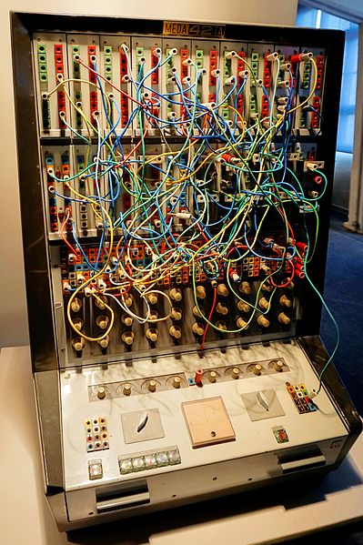
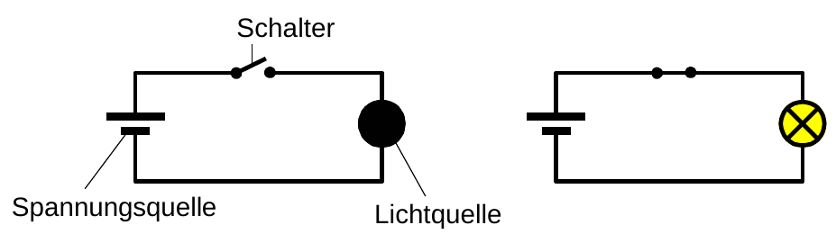
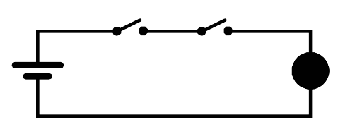
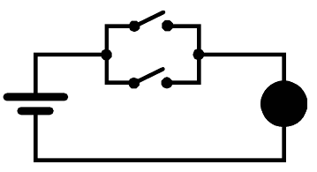
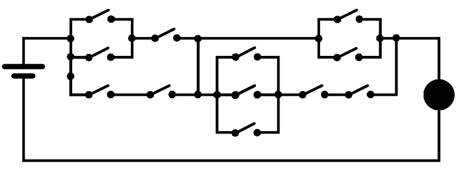
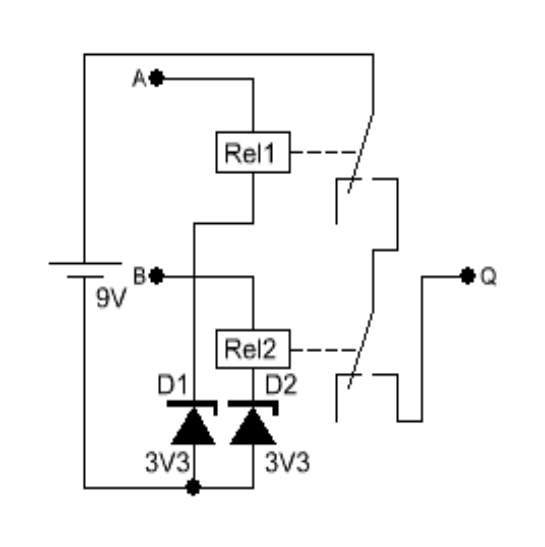
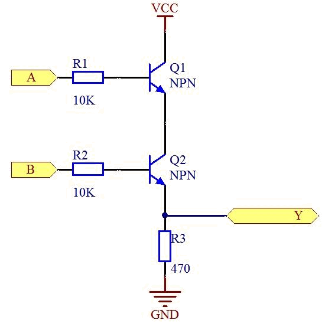
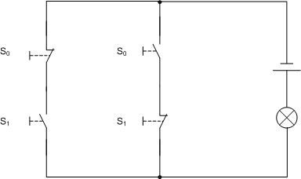
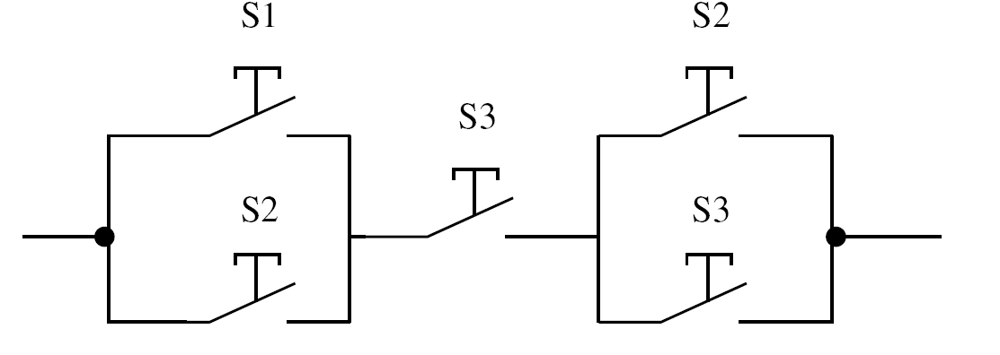

<!--

author:   Sebastian Zug & André Dietrich & Fabian Bär & Copilot
email:    sebastian.zug@informatik.tu-freiberg.de & andre.dietrich@informatik.tu-freiberg.de & fabian.baer@student.tu-freiberg.de
version:  0.0.4
language: de
narrator: Deutsch Female

import:   https://raw.githubusercontent.com/LiaTemplates/NetSwarm-Simulator/master/README.md
          https://raw.githubusercontent.com/TUBAF-IfI-LiaScript/VL_EingebetteteSysteme/master/config.md
          
-->

[](https://liascript.github.io/course/?https://raw.githubusercontent.com/TUBAF-IfI-LiaScript/VL_EingebetteteSysteme/master/02_BoolscheAlgebra.md#1)

# Boolesche Algebra

| Parameter                | Kursinformationen                                                                                                                                                                          |
| ------------------------ | ------------------------------------------------------------------------------------------------------------------------------------------------------------------------------------------ |
| **Veranstaltung:**       | @config.lecture                                                                                          |
| **Semester:**            | @config.semester                                                                                         |
| **Hochschule:**          | `Technische Universität Freiberg`                                                                        |
| **Inhalte:**             | `Boolesche Algebra, Axiome, Schaltfunktionen und technische Realisierung`                              |
| **Link auf GitHub:**     | https://github.com/TUBAF-IfI-LiaScript/VL_EingebetteteSysteme/blob/master/02_BoolscheAlgebra.md        |
| **Autoren:**             | @author                                                                                                  |


---------------------------------------------------------------------

**Fragen an die Veranstaltung**

+ Nennen Sie die Axiome der Booleschen Algebra.
+ Erläutern Sie das Dualitätsprinzip der Booleschen Algebra.
+ Wie viele Schaltfunktionen existieren für 2 Eingangsvariablen?
+ Nennen Sie 3 Beispiele, wie eine Schaltfunktion technisch umgesetzt werden kann.
+ Welcher Unterschied besteht zwischen der DNF und der KDNF?
+ Welcher Unterschied besteht zwischen der DNF und der KNF?
+ Geben Sie das de Morgansche Gesetz wieder.

---------------------------------------------------------------------


## Digital vs. Analog

<!--
style="width: 80%; min-width: 420px; max-width: 720px;"
-->
```ascii

                Abstraktionsebenen

           +----------------------------+ -.
  Ebene 6  | Problemorientierte Sprache |  |
           +----------------------------+  |
                                           ⎬ Anwendungssoftware
           +----------------------------+  |
  Ebene 5  | Assemblersprache           |  |
           +----------------------------+ -.

           +----------------------------+
  Ebene 4  | Betriebssystem             |     Systemsoftware
           +----------------------------+

           +----------------------------+
  Ebene 3  | Instruktionsset            |     Maschinensprache
           +----------------------------+

           +----------------------------+  -.
  Ebene 2  | Mikroarchitektur           |   |
           +----------------------------+   |
                                            ⎬ Automaten, Speicher, Logik
           +----------------------------+   |       ╔═══════════════╗
  Ebene 1  | Digitale Logik             |   |    ◀══║ HIER SIND WIR!║
           +----------------------------+  -.       ╚═══════════════╝

           +----------------------------+
  Ebene 0  | E-Technik, Physik          |     Analoge Phänomene
           +----------------------------+                                      .
```

> __Frage:__ Was bedeutet der Übergang von der Ebene der physikalischen Phänomene (0) auf die Ebene der digitalen Logik (1)?

                              {{1}}
********************************************************************************

Ein Digitalsignal ist ein Signal, welches durch diskrete Werte repräsentiert
wird und dessen zeitliche Entwicklung durch diese beschrieben wird. Es kann aus einem Analogsignal
heraus abgeleitet werden, das einen zeitlich-kontinuierlichen Verlauf einer
physikalischen Größe repräsentiert:

+ Temperatur im Tagesverlauf
+ Spannungswert am IC innerhalb der letzten $n$ Nanosekunden
+ ...

Die Umwandlung eines Analogsignals in ein Digitalsignal geschieht durch
Quantisierung und Abtastung, welche zu definierten Zeitpunkten erfolgt. Digitale
Werte sind üblicherweise als Binärzahlen kodiert. Ihre Quantisierung wird somit
in Bits angegeben.

<lia-chart
option='{
  "xAxis": {
    "type": "category",
    "data": ["00", "01","02","03","04","05"],
    "name": "Zeitschritt"
  },
  "yAxis": [{
    "type": "value",
    "name": "Wert"
  }],
  "series": [
  {
    "data": [820, 932,601,1234,1290,1430],
    "type":"line",
    "smooth": "true"
  },
  {
  "data": [820, 932,601,1234,1290,1430],
    "type":"line",
    "step": "end",
    "lineStyle": {
              "color": "green",
              "width": "2",
              "type": "dashed"
                 },
    "itemStyle": {
                     "borderWidth": "3",
                     "borderColor": "yellow",
                     "color": "blue"
                 }
  }]
}'></lia-chart>


<div id="functionPlot"></div>

Die Abtastung und Bildung des Digitalsignals erfolgt üblicherweise in konstanten Zeitintervallen, allerdings ist dies nicht zwingend notwendig.

********************************************************************************

### Exkurs: Kontrastprogramm - Analoge Rechner

<!-- width="50%" -->

Die Eingabe erfolgte durch Verbinden der Komponenten mittels Programmierschnüren, Steckern und Rechenimpedanzen (Widerstände für die Summatoren und Integratoren) auf der Programmiertafel.

> Wem jetzt gleich die Parallelität zu der Stecker-basierten Programmierung des ENIAC einfällt ... Vorsicht, dieser war ein Digitalrechner!

Zur Auswertung stand zur Verfügung:

+ 6-Strahl-Oszilloskop OPD 280 U
+ X-Y-Schreiber BAK 5 T
+ Digitalvoltmeter

|           | Analoge Hardware                                 | Digitale Hardware                        |
| --------- | ------------------------------------------------ | ---------------------------------------- |
| Vorteile  | Multiplikation und Addition einfach realisierbar | unempfindlich gegen Störungen (Rauschen) |
|           | vergleichsweise schnell                          | einfacher Entwurf                        |
|           |                                                  | beliebig hohe Präzision möglich          |
| Nachteile | Temperaturabhängigkeit                           | vergleichsweise hoher Energieverbrauch   |
|           | nichtlineare Bauteile                            |                                          |
|           | Präzision nur bei ca. 6 - 8 Bit                  |                                          |
|           | Langzeitspeicherung von Daten schwierig          |                                          |

> Digitaltechnik ermöglicht eine einfache Realisierung robuster Hardware.

### Pegel

     {{0}}
***************************************************************

> Digitalisierung: Aufteilung des kontinuierlichen Spektrums in erlaubte und verbotene Bereiche

Verschiedene Standards definieren unterschiedliche Spannungspotentiale für einen High- und einen Low-Pegel. Dazwischen befindet sich der verbotene Bereich.

<!--
style="width: 80%; min-width: 420px; max-width: 720px;"
-->
```ascii
         TTL Logikgatter              CMOS / aktuelle Mikrocontroller (5V)

         ^                            ^                           
Spannung |   |5.0|    |   |           |   |5.0|    |   |                      
V        |   |   |    |   |           |   |   |    |4.2|                           
         |   |   |    |   |           |   |3.0|    +---+                            
         |   |   |    |2.4|           |   +---+                              
         |   |2.0|    +---+           |                                       
         |   +---+                    |                              
         |                            |                           
         |   Verbotener Bereich       |   Verbotener Bereich                           
         |                            |                           
         |   +---+                    |            +---+                  
         |   |0.8|    +---+           |   +---+    |0.8|                          
         |   |   |    |0.4|           |   |0.5|    |   |                           
         +------------------------>   +------------------------>                           
            Eingang  Ausgang             Eingang  Ausgang        .                           
```


> **Frage:** Warum ist im TTL Kontext der undefinierte Bereich des Einganges schmaler als der des Ausganges?

***************************************************************

     {{1}}
***************************************************************

<!-- data-type="none" -->
| Kriterium / Technologie | **Mechanisches Relais** | **TTL (Transistor-Transistor-Logik)** | **CMOS / Mikrocontroller-Eingang** |
|--------------------------|-------------------------|---------------------------------------|------------------------------------|
| **Funktionsprinzip** | Mechanischer Schalter mit elektromagnetischer Betätigung | Bipolare Transistorstufen (meist NPN) | MOSFET-Gatter mit hochohmigem Gateeingang |
| **Schaltzeit** | 5–20 ms | 10–50 ns | < 10 ns (intern) |
| **Stromverbrauch (aktiv)** | 100–500 mW | einige mW pro Gatter | < 1 µW (Eingang), wenige mW aktiv gesamt |
| **Eingangswiderstand** | < 1 kΩ (Spule) | ca. 1 kΩ | > 1 MΩ (typ. 10–100 MΩ) |
| **Schaltspannung (High)** | Abhängig von Spulenspannung (5–24 V üblich) | > 2,0 V (bei 5 V Versorgung) | > 0,7 × Vcc (z. B. > 2,1 V bei 3 V3) |
| **Schaltspannung (Low)** | 0 V | < 0,8 V | < 0,3 × Vcc (z. B. < 1,0 V bei 3 V3) |
| **Lebensdauer (Schaltzyklen)** | 10⁵ – 10⁷ | theoretisch unbegrenzt (keine Mechanik) | unbegrenzt (Halbleiter) |
| **Größe** | cm-Bereich | mm-Bereich (IC) | µm-Bereich (integriert) |
| **Isolation** | Galvanisch getrennt | Keine galvanische Trennung | Keine galvanische Trennung |
| **Empfindlichkeit gegenüber Störungen** | Gering | Mittel | Hoch  |
| **Kosten** | Hoch (0,5 – 2 €) | Mittel (Cent-Bereich pro Gatter) | Niedrig (Millionen Gatter pro Chip) |
| **Typische Anwendung** | Schaltsignale in Industrie oder Leistungselektronik | Klassische Logikschaltungen | Eingänge von Mikrocontrollern, integrierte Logiksysteme |

> Galvanische Trennung bedeutet, dass **kein direkter elektrischer Leiter** zwischen zwei Schaltungsteilen besteht. Die Information wird über andere physikalische Effekte übertragen, z. B.: Licht, Magnetfelder oder kapazitive Kopplung.

***************************************************************

## Motivation

Nehmen wir folgende einfache Schaltung an:

<!-- width="60%" -->

Wir betrachten den Schalter mit seinen 2 Zuständen als Input und die Glühlampe als Output. Das Übergangsverhalten wird ignoriert.

| Input                | Output               |
| -------------------- | -------------------- |
| Schalter geschlossen | Lampe leuchtet       |
| Schalter offen       | Lampe leuchtet nicht |


                      {{1}}
****************************************************************
Für zwei Schalter (Inputs) lassen sich darauf aufbauend zwei grundlegende Schaltungsmuster entwerfen:

| Reihenschaltung | Parallelschaltung |
| --------------- | ----------------- |
|  <!-- width="80%" -->            |  <!-- width="80%" -->                    |
| Die Lampe leuchtet, wenn der erste und der zweite Schalter geschlossen werden               | Lampe leuchtet, wenn der erste oder der zweite Schalter geschlossen. wird.            |

****************************************************************

                      {{2}}
****************************************************************

 <!-- width="80%" -->

> Es gibt verschiedene Lösungen, um die Lampe mit drei geschlossenen Schaltern zum Leuchten zu bringen. Wie viele? Wieviele Kombinationen von Schalterbelegungen sind möglich?

> Wir brauchen eine Abstraktion, um die Abbildung von digitalen Eingängen E auf einen digitalen Ausgang A repräsentieren und analysieren zu können.

Dazu beschreiben wir die Wirkung des elektrischen Stromes

+ Stromfluss / kein (oder ein sehr geringer) Stromfluss
+ Spannung / keine (oder eine sehr geringe) Spannung

... aus Sicht der Logik anhand von Zuständen

+ an / aus
+ wahr / falsch
+ 1 / 0
+ 0 / 1

> Wie aber können logische Grundverknüpfungen identifiziert werden? Auf welchem Wege lassen diese sich praktisch realisieren?

****************************************************************

## Boolesche Algebra

Historische Entwicklung:

+ Aristoteles (384-322 v.Chr.) begründet „Syllogistik“ Lehre von den logischen Schlussformen
+ Später bilden die Stoiker die Syllogistik als Aussagenlogik weiter aus. Im Mittelalter → Scholastik
+ George Boole (1815-1864) 1854 mathematische Formalisierung in _„An Investigation of the Laws of Thought on which are founded the Mathematical Theories of Logic and Probabilities"_.
+ Claude Shannon (1916-2001) hat im Rahmen seiner Masterarbeit _„On the Symbolic Analysis of Relay and Switching Circuits (1940)“_, gezeigt, dass man die Boolesche Algebra zur Beschreibung von Schaltkreisen anwenden kann.

<!-- width="25%" -->

> Problem: Gibt es ein Verfahren:
>
> + um die Äquivalenz zweier Schaltungen formal nachzuweisen ?
> + um Schaltungen auf einfache Weise zu transformieren ?
> + um minimale Schaltungen zu entwerfen ?

__Lösung:__ Boolesche Algebra basierend auf den Vorarbeiten von G. Boole aus dem Jahre 1854

+ zwei Werte: 0 und 1
+ drei Boolesche Operationen: + , $\cdot$ sowie „not"
+ vier Axiome


Die Boolesche Algebra basiert nach [Huntington](https://de.wikipedia.org/wiki/Edward_Vermilye_Huntington) auf einer Trägermenge
$B = \{0,1\}$ (Zuständen) mit zwei Verknüpfungen auf $B$ für deren Elemente $a\in B$, $b\in B$ und $c\in B$ gilt:

| Axiom                             | Definition |
| --------------------------------- | ---------- |
| Kommutativität                   | $\begin{aligned} a + b &= b + a \\ a \cdot b &= b \cdot a\end{aligned}$            |
| Distributivität                   | $\begin{aligned} a \cdot (b + c) &= (a \cdot b) + (a \cdot c) \\ a + (b \cdot c) &= (a + b) \cdot (a+c) \end{aligned}$            |
| Existenz eines neutralen Elements | $\begin{aligned}  0 + a &= a \\ 1\cdot a &= a\end{aligned}$           |
| Existenz von Komplementen        |  $\begin{aligned}  a + \overline{a} &= 1 \\ a \cdot \overline{a} &= 0   \end{aligned}$      |

                                    {{1}}
****************************************************************

Aus dieser Definition lassen sich die zugehörigen Gesetze der booleschen Algebra ableiten:

| Gesetz               | Definition                                                                                                                                 |
| -------------------- | ------------------------------------------------------------------------------------------------------------------------------------------ |
| Assoziativität       | $\begin{aligned} a + (b + c) &= (a + b) + c = a + b + c \\ a \cdot (b \cdot c) &= (a \cdot b) \cdot c = a \cdot b \cdot c\end{aligned}$    |
| Idempotenzgesetze    | $\begin{aligned} a + a &= a \\ a \cdot a &= a\end{aligned}$                                                                                |
| Absorptionsgesetz    | $\begin{aligned} a + (a \cdot b) &= a \\ a \cdot (a + b) &= a\end{aligned}$                                                                |
| Doppelnegation       | $\begin{aligned} a = \overline{\overline{a}}\end{aligned}$                                                                                 |
| De Morgan'sche Regel | $\begin{aligned} \overline{a + b} &= \overline{a} \cdot \overline{b} \\ \overline{a \cdot b} &= \overline{a} + \overline{b} \end{aligned}$ |
|

****************************************************************

                                     {{2}}
****************************************************************

> Das Dualitätsprinzip zeigt uns eine faszinierende Symmetrie: Jede wahre Aussage in der Booleschen Algebra hat ein "Spiegelbild" - und beide sind gleichermaßen gültig!

_Ersetzt man gleichzeitig in einem Axiom UND durch ODER und ODER durch UND sowie 1 durch 0 und 0 durch 1, so erhält man das zu diesem Axiom gehörige duale Axiom. Führt man diese Ersetzung in einem Theorem aus, so erhält man das zu diesem Theorem gehörige duale Theorem._

<!-- data-type="none" -->
| Form 1                 | Form 2                     |
| ---------------------- | -------------------------- |
| $0 + a = a$            | $1 \cdot a = a$            |
| $1 + a = 1$            | $ 0 \cdot a = 0        $   |
| $a + a = a$            | $ a \cdot a = a         $  |
| $a + \overline{a} = 1$ | $a \cdot \overline{a} = 0$ |

Am Beispiel des Distributivgesetzes

$$
\begin{aligned}
a \cdot (b+c) &= (a \cdot b)+(a \cdot c) \\
a+(b \cdot c) &= (a+b) \cdot (a+c)
\end{aligned}
$$


****************************************************************

## Anwendung

                    {{0-1}}
****************************************************************

**Ziel der Umformung: Minimierung für die technische Realisierung**

> **Warum Minimierung?** In der technischen Informatik ist das Hauptziel die **Minimierung von Schaltfunktionen**. Weniger Terme bedeuten weniger Gatter, geringere Kosten, höhere Geschwindigkeit und niedrigeren Energieverbrauch!

**Grundlegende Strategien zur Minimierung:** Nutze die Booleschen Gesetze zur schrittweisen Reduktion der Terme.

**Beispiel:** 

$a \cdot b + a \cdot \overline{b} + a \cdot c = a \cdot (b + \overline{b}) + a \cdot c = a \cdot 1 + a \cdot c = a + a \cdot c = a$ (Absorption!)

**Von 3 Produkttermen auf nur 1 Variable reduziert!**

****************************************************************

                    {{1-2}}
****************************************************************

**Anwendungsbeispiel 1**

$$
\begin{aligned}
f(x_1, x_2, x_3) &= x_1 \cdot x_2 \cdot \overline{x_3} + x_1 \cdot x_2 \cdot x_3 + x_1 \cdot \overline{x_2} \cdot x_3 \\
&= x_1 \cdot x_2 \cdot \overline{x_3} +\textcolor{red}{x_1 \cdot x_2 \cdot x_3}  + x_1 \cdot x_2 \cdot x_3 + x_1 \cdot \overline{x_2} \cdot x_3 & (Idempotenzgesetz) \\
&= \textcolor{red}{x_1 \cdot x_2 \cdot ( \overline{x_3} + x_3)}  + x_1 \cdot x_2 \cdot x_3 + x_1 \cdot \overline{x_2} \cdot x_3 & (Distributivgesetz) \\
&= x_1 \cdot x_2 \cdot ( \overline{x_3} + x_3)  + \textcolor{red}{x_1 \cdot x_3 \cdot x_2  + x_1  \cdot x_3 \cdot \overline{x_2}} & (Kommutativgesetz) \\
&= x_1 \cdot x_2 \cdot ( \overline{x_3} + x_3)  + \textcolor{red}{x_1 \cdot x_3 \cdot (x_2  + \overline{x_2})} & (Distributivgesetz) \\
&= x_1 \cdot x_2 \cdot \textcolor{red}{(1)}  + x_1 \cdot x_3 \cdot \textcolor{red}{(1)}  & (Komplementäres Element) \\
&= x_1 \cdot x_2  + x_1 \cdot x_3  & (Neutrales Element)\\
\end{aligned}
$$

> **🎯 Minimierungs-Erfolg:** Von **5 Produkttermen** auf **2 Terme** reduziert!  
> **Hardware-Einsparung:** 60% weniger UND-Gatter benötigt!  
> **Faktorisierung möglich:** $x_1(x_2 + x_3)$ → Nur noch 1 UND + 1 ODER Gatter!

****************************************************************

                    {{2-4}}
**Anwendungsbeispiel 2**

                    {{2-3}}
$$
\begin{aligned}
f(w,x,y,z) &=\overline{w}x\overline{y}\,\overline{z}+\overline{w}x\overline{y}z+w\overline{x}y\overline{z}+wx\overline{y}\,\overline{z}+wx\overline{y}z \\
\end{aligned}
$$

{{3-4}}
$$
\begin{aligned}
f(w,x,y,z) &=\overline{w}x\overline{y}\,\overline{z}+\overline{w}x\overline{y}z+w\overline{x}y\overline{z}+wx\overline{y}\,\overline{z}+wx\overline{y}z \\
&  =\overline{w}x\overline{y}\left(\overline{z}+z\right)+wx\overline{y}\left(\overline{z}+z\right)+w\overline{x}y\overline{z} & {Kommut., 2xDistr.}\\
 & =\overline{w}x\overline{y}1+wx\overline{y}1+w\overline{x}y\overline{z} & {Komplement.}\\
 & =\overline{w}x\overline{y}+wx\overline{y}+w\overline{x}y\overline{z} & {Neutralitäts.}\\
 & =x\overline{y}\,\overline{w}+x\overline{y}w+w\overline{x}y\overline{z} & 2\times {Kommut.}\\
 & =x\overline{y}\left(\overline{w}+w\right)+w\overline{x}y\overline{z} & Distributivitätsgesetz\\
 & =x\overline{y}1+w\overline{x}y\overline{z} & {Komplement.}\\
 & =x\overline{y}+w\overline{x}y\overline{z} & {Neutral.}
\end{aligned}
$$


{{3-4}}
> **🎯 Beeindruckende Reduktion:** Von **5 komplexen 4-Variablen-Termen** auf nur **2 einfache Terme**!  
> **Gatter-Einsparung:** Ursprünglich 20+ UND-Gatter → Jetzt nur noch 4 UND-Gatter (80% Reduktion!)  
> **Praktischer Nutzen:** Weniger Chips, niedrigere Kosten, höhere Zuverlässigkeit!

{{4}}
**Anwendungsbeispiel 3**

{{4}}
$$
\begin{aligned}
f(x_1, x_2) &=\overline{\overline{\overline{x}_1 x_2(x_1 +\overline{x}_1)}}  + x_1\overline{x_2x_1} \\
\end{aligned}
$$

{{4}}
> Jetzt sind Sie dran! 

{{5}}
$$
\begin{aligned}
f(x_1, x_2) &=\overline{\overline{\overline{x}_1 x_2(x_1 +\overline{x}_1)}}  + x_1\overline{x_2x_1} \\
&=\overline{\overline{\overline{x}_1 x_2 \cdot 1}}  + x_1\overline{x_2x_1} & \text{(Komplement: } x_1 +\overline{x}_1 = 1\text{)} \\
&=\overline{\overline{\overline{x}_1 x_2}}  + x_1\overline{x_2x_1} & \text{(Neutrales Element: } a \cdot 1 = a\text{)} \\
&=\overline{x}_1 x_2 + x_1\overline{x_2x_1} & \text{(Doppelnegation: } \overline{\overline{a}} = a\text{)} \\
&=\overline{x}_1 x_2 + x_1(\overline{x}_2 + \overline{x}_1) & \text{(De Morgan: } \overline{a \cdot b} = \overline{a} + \overline{b}\text{)} \\
&=\overline{x}_1 x_2 + x_1\overline{x}_2 + x_1\overline{x}_1 & \text{(Distributiv)} \\
&=\overline{x}_1 x_2 + x_1\overline{x}_2 + 0 & \text{(Komplement: } x_1\overline{x}_1 = 0\text{)} \\
&=\overline{x}_1 x_2 + x_1\overline{x}_2 & \text{(Neutrales Element: } a + 0 = a\text{)} \\
&=\overline{x}_1 \oplus x_2 & \text{(Definition XOR: } a \oplus b = \overline{a}b + a\overline{b}\text{)} \\
\end{aligned}
$$

{{6}}
> **🎉 Aha-Moment erreicht!** 
> 
> **Ergebnis:** Komplexe verschachtelte Negationen → Einfache XOR-Funktion!  
> **Hardware-Gewinn:** Von 6+ Negationsgattern auf nur 2 Terme reduziert!  
> **Erkenntnisse:** Systematisches Vorgehen macht selbst komplexeste Ausdrücke lösbar!

## Schaltfunktionen

+ Funktionen $f:\{0,1\}^n \rightarrow \{0,1\}^m$ mit $n, m \geq 1$ werden auch als Schaltfunktionen bezeichnet
+ Eine Schaltfunktion $f:\{0,1\}^n \rightarrow \{0,1\}^m$ heißt eine $n$-stellige Boolesche Funktion
+ Jede Schaltfunktion $f:\{0,1\}^n \rightarrow \{0,1\}^m$ kann durch $m$ Boolesche Funktionen ausgedrückt werden
+ Jede Boolesche Funktion lässt sich beschreiben

  + durch eine Wahrheitstabelle / Wahrheitstafel 
  + durch einen booleschen Ausdruck (gebildet durch Boolesche Variablen und Operationen aus der Booleschen Algebra)
  + ein Schaltwerk aus logischen Gattern

+ Es gibt $2^{2^n}$ verschiedene $n$-stellige Boolesche Funktionen (also 16 zweistellige, 256 dreistellige, 65536 vierstellige, ...)

> Achtung: Nur die Wahrheitstafel ist in jedem Fall eindeutig!

{{1}}
> Stellen Sie eine Wahrheitstafel für folgende Schaltfunktion auf:

{{1}}
$$
\begin{aligned}
  f(x_1 , x_2, x_3) =&\overline{x}_1\cdot \overline{x}_2 \cdot \overline{x}_3 + \\
                     &\overline{x}_1\cdot \overline{x}_2 \cdot x_3 + \\
                     &x_1\cdot \overline{x}_2 \cdot x_3 + \\
                     &x_1\cdot x_2 \cdot \overline{x}_3 + \\
                     &x_1\cdot \overline{x}_2 \cdot \overline{x}_3 \\
\end{aligned}
$$

{{1}}
+ Wie groß muss die Wahrheitstafel sein?
+ Wie stellen Sie sicher, dass alle Einträge enthalten sind?

{{2}}
<!-- data-type="none" -->
| $x_1$ | $x_2$ | $x_3$ | f   | Term                                                      |
| ----- | ----- | ----- | --- | --------------------------------------------------------- |
| 0     | 0     | 0     | 1   | $\overline{x}_1\cdot \overline{x}_2 \cdot \overline{x}_3$ |
| 0     | 0     | 1     | 1   | $\overline{x}_1\cdot \overline{x}_2 \cdot x_3$            |
| 0     | 1     | 0     | 0   |                                                           |
| 0     | 1     | 1     | 0   |                                                           |
| 1     | 0     | 0     | 1   | $x_1\cdot \overline{x}_2 \cdot \overline{x}_3$            |
| 1     | 0     | 1     | 1   | $x_1\cdot \overline{x}_2 \cdot x_3$                       |
| 1     | 1     | 0     | 1   | $x_1\cdot x_2 \cdot \overline{x}_3$                       |
| 1     | 1     | 1     | 0   |                                                           |

{{3}}
> Und die Schaltfunktionen? Kann man diese auch systematisch darstellen?

### Schaltfunktionen mit einem Eingang

Die möglichen 4 Kombinationen einer Schaltfunktion mit einem Eingang lassen sich wie folgt gliedern:

<!-- data-type="none" -->
| Eingang | Nullfunktion | Identität | Negation            | Einsfunktion |
| ------- | ------------ | --------- | ------------------- | ------------ |
| $x = 0$ | 0            | 0         | 1                   | 1            |
| $x = 1$ | 0            | 1         | 0                   | 1            |
|         | $f(x)=0$     | $f(x)=x$  | $f(x)=\overline{x}$ | $f(x)=1$     |

### Schaltfunktionen mit zwei Eingängen

Die möglichen 16 Kombinationen einer Schaltfunktion mit zwei Eingängen lassen sich wie folgt gliedern:

Konjunktion == UND == AND

<!-- data-type="none" -->
| Eingang x | Eingang y | Nullfunktion | Konjunktion        |                              |            |
| --------- | --------- | ------------ | ----------------- | ---------------------------- | ---------- |
| $x = 0$   | $y = 0$   | 0            | 0                 | 0                            | 0          |
| $x = 0$   | $y = 1$   | 0            | 0                 | 0                            | 0          |
| $x = 1$   | $y = 0$   | 0            | 0                 | 1                            | 1          |
| $x = 1$   | $y = 1$   | 0            | 1                 | 0                            | 1          |
|           |           | $f(x,y)=0$   | $f(x,y)=x\cdot y$ | $f(x,y)=x\cdot \overline{y}$ | $f(x,y)=x$ |

Disjunktion == ODER == OR
Antivalenz == exklusives OR == XOR == $\oplus$

<!-- data-type="none" -->
| Eingang x | Eingang y |                              |             | Antivalenz                                         | Disjunktion  |
| --------- | --------- | ---------------------------- | ----------- | -------------------------------------------------- | ------------ |
| $x = 0$   | $y = 0$   | 0                            | 0           | 0                                                  | 0            |
| $x = 0$   | $y = 1$   | 1                            | 1           | 1                                                  | 1            |
| $x = 1$   | $y = 0$   | 0                            | 0           | 1                                                  | 1            |
| $x = 1$   | $y = 1$   | 0                            | 1           | 0                                                  | 1            |
|           |           | $f(x,y)=\overline{x}\cdot y$ | $f(x,y)= y$ | $f(x,y)=x\cdot \overline{y} + \overline{x}\cdot y$ | $f(x,y)=x+y$ |

negiertes ODER == NOR == Peirce-Funktion

<!-- data-type="none" -->
| Eingang x | Eingang y | negiertes ODER           | Äquivalenz                                           |                        |                         |
| --------- | --------- | ------------------------ | ---------------------------------------------------- | ---------------------- | ----------------------- |
| $x = 0$   | $y = 0$   | 1                        | 1                                                    | 1                      | 1                       |
| $x = 0$   | $y = 1$   | 0                        | 0                                                    | 0                      | 0                       |
| $x = 1$   | $y = 0$   | 0                        | 0                                                    | 1                      | 1                       |
| $x = 1$   | $y = 1$   | 0                        | 1                                                    | 0                      | 1                       |
|           |           | $f(x,y)=\overline{x+ y}$ | $f(x,y)= x\cdot y + \overline{x} \cdot \overline{y}$ | $f(x,y)=\overline{y}$ | $f(x,y)=x+\overline{y}$ |

negiertes UND == NAND == Sheffer-Funktion genannt

<!-- data-type="none" -->
| Eingang x | Eingang y |                       | Implikation                | negiertes UND                 | Einsfunktion |
| --------- | --------- | --------------------- | -------------------------- | ----------------------------- | ------------ |
| $x = 0$   | $y = 0$   | 1                     | 1                          | 1                             | 1            |
| $x = 0$   | $y = 1$   | 1                     | 1                          | 1                             | 1            |
| $x = 1$   | $y = 0$   | 0                     | 0                          | 1                             | 1            |
| $x = 1$   | $y = 1$   | 0                     | 1                          | 0                             | 1            |
|           |           | $f(x,y)=\overline{x}$ | $f(x,y)= \overline{x} + y$ | $f(x,y)=\overline{x \cdot y}$ | $f(x,y)=1$   |

### Exkurs: Technische Realisierung

Ein Gatter ist eine (elektrotechnische) „Black Box“ mit einem, zwei oder
mehreren Eingängen $A,B,C,... \in {0,1}$ und genau einem Ausgang $Y\in {0,1}$
zur Realisierung einer Funktion $Y = f (A,B,C,...)$

<!-- width="45%" -->
<!-- width="45%" -->

Wir gehen bei der Frage der Schaltnetze in Vorlesung 04 nochmals auf die technische Realisierung ein.

{{1}}
> Und das exklusive ODER, hätten Sie eine Idee?

{{1}}
<!-- data-type="none" -->
| $S_1$ | $S_0$ | y   |
| ----- | ----- | --- |
| 0     | 0     | 0   |
| 0     | 1     | 1   |
| 1     | 0     | 1   |
| 1     | 1     | 0   |

{{2}}
<!-- width="45%" -->

## Hausaufgaben

1. Geben Sie für die nachfolgend dargestellte Schaltung eine boolesche Funktion an. Bilden Sie diese in einer Wahrheitstafel ab.

<!-- width="65%" -->

2. Studieren Sie das Datenblatt eines AND Gates, welches Sie unter [Link](https://www.ti.com/lit/ds/symlink/sn74lvc2g08-ep.pdf?ts=1761744031191) finden und beantworten Sie folgende Fragen:

   + Wie groß ist die maximale Verzögerung, mit der der Ausgang dem Eingang nachfolgt?
   + Was bedeuten die Kreuze in der Wahrheitstafel (_Function table_)?
   + Können Sie mit dem Gatter auch eine Negation des Eingangssignals realisieren?

3. Entwerfen Sie unter ausschließlicher Verwendung der Gatter UND, ODER und NICHT Schaltnetze, die die Ausgaben $P$ und $Q$ aus den Eingängen $X$, $Y$ und $Z$ generieren. Stellen Sie mithilfe von Wahrheitstabellen eine Beziehung zwischen $P$ und $Q$ her.

$$
		\begin{aligned}
			P&=\left(X+\overline{Y}\right)\left(Y\oplus Z\right) \\
			Q&=\overline{Y}Z+XY\overline{Z}.
		\end{aligned}
$$
