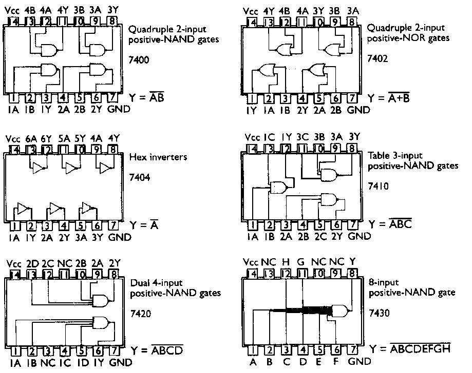
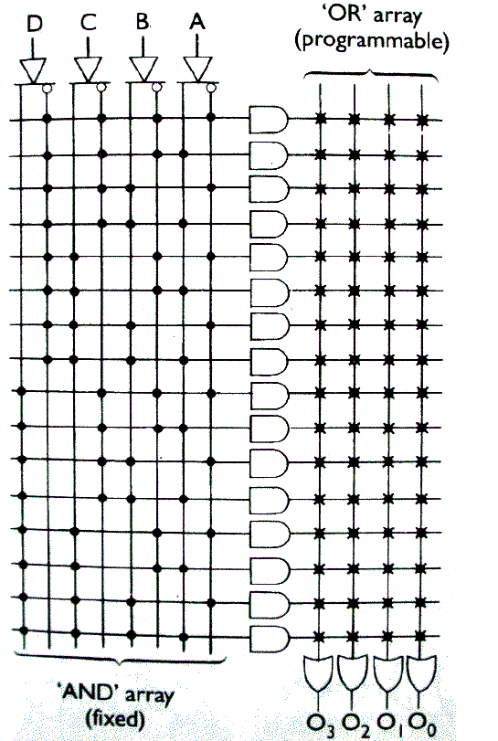
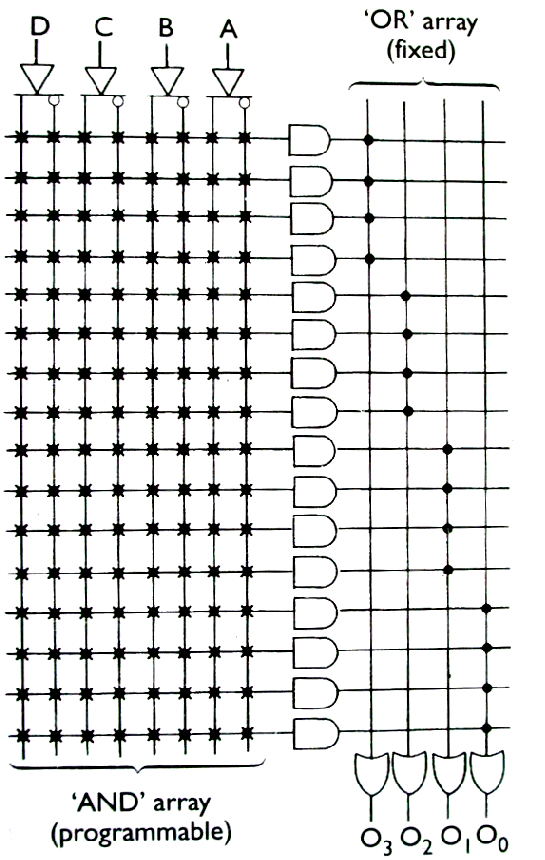
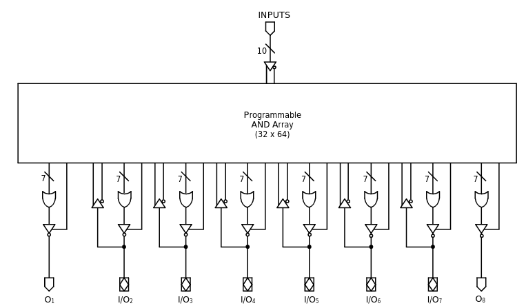
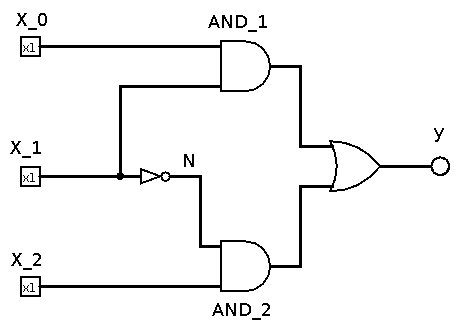
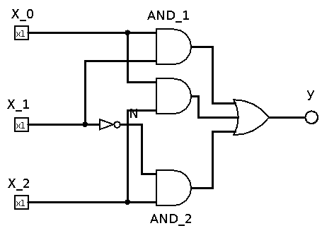
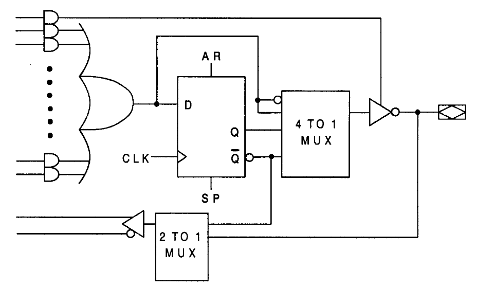

<!--

author:   Sebastian Zug & André Dietrich & Fabian Bär
email:    sebastian.zug@informatik.tu-freiberg.de & andre.dietrich@informatik.tu-freiberg.de & fabian.baer@student.tu-freiberg.de
version:  0.0.6
language: de
narrator: Deutsch Female

import: https://raw.githubusercontent.com/LiaTemplates/NetSwarm-Simulator/master/README.md
        https://raw.githubusercontent.com/LiaTemplates/DigiSim/master/README.md
        https://github.com/LiaTemplates/Pyodide

mark: <span style="background-color: @0;
                           display: flex;
                           width: calc(100% + 32px);
                           margin: -16px;
                           padding: 6px 16px 6px 16px;
                           ">@1</span>

red:  @mark(#FF888888,@0)
blue: @mark(lightblue,@0)
gray: @mark(gray,@0)
-->

[](https://liascript.github.io/course/?https://raw.githubusercontent.com/TUBAF-IfI-LiaScript/VL_EingebetteteSysteme/master/04_Schaltnetze.md#1)

# Minimierung von boolschen Funktionen / Schaltnetze

| Parameter                | Kursinformationen                                                                                                                                                                          |
| ------------------------ | ------------------------------------------------------------------------------------------------------------------------------------------------------------------------------------------ |
| **Veranstaltung:**       | `Eingebettete Systeme`                                                                                                                                                                     |
| **Semester**             | `Wintersemester 2021/22`                                                                                                                                                                      |
| **Hochschule:**          | `Technische Universität Freiberg`                                                                                                                                                          |
| **Inhalte:**             | `Verfahren von Quine-McCluskey, Realisierung von Schaltnetzen`                                                                                      |
| **Link auf GitHub:** | [https://github.com/TUBAF-IfI-LiaScript/VL_Softwareentwicklung/blob/master/04_Schaltnetze.md](https://github.com/TUBAF-IfI-LiaScript/VL_EingebetteteSysteme/blob/master/04_Schaltnetze.md) |
| **Autoren**              | @author                                                                                                                                                                                    |


---------------------------------------------------------------------

** Fragen an die Veranstaltung**

+ Erläutern Sie das Verfahren von Quine-McCluskey
+ Grenzen Sie die Begriffe Schaltnetz und Schaltfunktion voneinander ab.
+ Erklären Sie die Idee von Multiplexern und Kodierern.
+ Welche Besonderheit besteht bei der Ableitung der Schaltfunktionen für einen Dekodierer? Was ist ein SLPD und welche Ausprägungen kennen Sie davon.
+ Welche Gatterkombinationen sind geeignet um beliebige Schaltfunktionen damit umzusetzen?
+ Was ist ein Glitch?

---------------------------------------------------------------------

<!--
style="width: 80%; min-width: 420px; max-width: 720px;"
-->
```ascii

                Abstraktionsebenen

           +----------------------------+ -.
  Ebene 6  | Problemorientierte Sprache |  |
           +----------------------------+  |
                                           ⎬ Anwendungssoftware
           +----------------------------+  |
  Ebene 5  | Assemblersprache           |  |
           +----------------------------+ -.

           +----------------------------+
  Ebene 4  | Betriebssystem             |     Systemsoftware
           +----------------------------+

           +----------------------------+
  Ebene 3  | Istruktionsset             |     Maschinensprache
           +----------------------------+

           +----------------------------+  -.
  Ebene 2  | Mikroarchitektur           |   |
           +----------------------------+   |
                                            ⎬ Automaten, Speicher, Logik
           +----------------------------+   |       ╔═══════════════╗
  Ebene 1  | Digitale Logik             |   |    ◀══║ HIER SIND WIR!║
           +----------------------------+  -.       ╚═══════════════╝

           +----------------------------+
  Ebene 0  | E-Technik, Physik          |     Analoge Phänomene
           +----------------------------+                                      .
```

---------------------------------------------------------------------

## Beispielanwendung

Nehmen wir an, dass wir die Logik einer Kaffeemaschine umsetzen wollen. Diese
verfügt über verschiedene Eingänge wie Sensoren an der Heizplatte, einem
Füllstandsmesser, Drucksensorik usw. Wir gehen davon aus, dass diese lediglich
digitale Ausgaben generiert.

Die Variable $y$ gibt entsprechend einen Fehlerzustand wieder und ist zum
Beispiel mit einer LED verknüpft. Ab Zustand 6 bis 14 soll diese Leuchten.

 <!--style="width: 50%; max-width:700px"-->

<!-- data-type="none" -->
| $x_3$ | $x_2$ | $x_1$ | $x_0$ | $y$ | Zustand                  |
| ----- | ----- | ----- | ----- | --- | ------------------------ |
| 0     | 0     | 0     | 0     | 0   | 0  - Initialisierung     |
| 0     | 0     | 0     | 1     | 0   | 1  - Heizplatte erwärmen |
| 0     | 0     | 1     | 0     | 0   | 2  - Wasserkocher an     |
| 0     | 0     | 1     | 1     | 0   | 3  -                     |
| 0     | 1     | 0     | 0     | 0   | 4  -                     |
| 0     | 1     | 0     | 1     | 0   | 5  -                     |
| 0     | 1     | 1     | 0     | 1   | 6  - Wasser fehlt        |
| 0     | 1     | 1     | 1     | 1   | 7  - Kaffeefach geöffnet |
| 1     | 0     | 0     | 0     | 1   | 8  - Druckabfall         |
| 1     | 0     | 0     | 1     | 1   | 9  - ...                 |
| 1     | 0     | 1     | 0     | 1   | 10  -                    |
| 1     | 0     | 1     | 1     | 1   | 11  -                    |
| 1     | 1     | 0     | 0     | 1   | 12  -                    |
| 1     | 1     | 0     | 1     | 1   | 13  -                    |
| 1     | 1     | 1     | 0     | 1   | 14  -  Wartung fällig    |
| 1     | 1     | 1     | 1     | 0   | 15  -  Kaffee fertig     |


Wie muss also die Schaltung für diese Aufgabe umgesetzt werden?

### Schritt 1: Aufstellen der Gleichungen

**Kanonische Disjunktive Normalform (KDNF)**

+ eindeutige Darstellung einer booleschen Funktion f als Disjunktion von Mintermen
+ Beispiel: $( x \cdot y \cdot z ) + ( x \cdot y \cdot z ) + ( x \cdot y \cdot z )$ ist KDNF von $f(x,y,z)$

**Kanonische Konjunktive Normalform (KKNF)**

+ eindeutige Darstellung einer booleschen Funktion f als Konjunktion von Maxtermen
+ Beispiel: $( x + y ) \cdot ( x + y ) \cdot ( x + y )$ ist KKNF von $f(x,y)$

{{0-1}}
<!-- data-type="none" -->
| $x_3$ | $x_2$ | $x_1$ | $x_0$ | $y$ | Minterme | Maxterme |
| ----- | ----- | ----- | ----- | --- | -------- | -------- |
| 0     | 0     | 0     | 0     | 0   | ???      | ???      |
| 0     | 0     | 0     | 1     | 0   |          |          |
| 0     | 0     | 1     | 0     | 0   |          |          |
| 0     | 0     | 1     | 1     | 0   |          |          |
| 0     | 1     | 0     | 0     | 0   |          |          |
| 0     | 1     | 0     | 1     | 0   |          |          |
| 0     | 1     | 1     | 0     | 1   |          |          |
| 0     | 1     | 1     | 1     | 1   |          |          |
| 1     | 0     | 0     | 0     | 1   |          |          |
| 1     | 0     | 0     | 1     | 1   |          |          |
| 1     | 0     | 1     | 0     | 1   |          |          |
| 1     | 0     | 1     | 1     | 1   |          |          |
| 1     | 1     | 0     | 0     | 1   |          |          |
| 1     | 1     | 0     | 1     | 1   |          |          |
| 1     | 1     | 1     | 0     | 1   |          |          |
| 1     | 1     | 1     | 1     | 0   |          |          |

{{1}}
<!-- data-type="none" -->
| $x_3$ | $x_2$ | $x_1$ | $x_0$ | $y$ | Minterme                                                             | Maxterme                                                            |
| ----- | ----- | ----- | ----- | --- | -------------------------------------------------------------------- | ------------------------------------------------------------------- |
| 0     | 0     | 0     | 0     | 0   |                                                                      | $x_3 + x_2 + x_1 + x_0$                                             |
| 0     | 0     | 0     | 1     | 0   |                                                                      | $x_3 + x_2 + x_1 + \overline{x_0}$                                  |
| 0     | 0     | 1     | 0     | 0   |                                                                      | $x_3 + x_2 + \overline{x_1} + x_0$                                  |
| 0     | 0     | 1     | 1     | 0   |                                                                      | $x_3 + x_2 + \overline{x_1} + \overline{x_0}$                       |
| 0     | 1     | 0     | 0     | 0   |                                                                      | $x_3 + \overline{x_2} + x_1 + x_0$                                  |
| 0     | 1     | 0     | 1     | 0   |                                                                      | $x_3 + \overline{x_2} + x_1 + \overline{x_0}$                       |
| 0     | 1     | 1     | 0     | 1   | $\overline{x_3} \cdot x_2 \cdot x_1 \cdot \overline{x_0}$            |                                                                     |
| 0     | 1     | 1     | 1     | 1   | $\overline{x_3} \cdot x_2 \cdot x_1 \cdot x_0$                       |                                                                     |
| 1     | 0     | 0     | 0     | 1   | $x_3 \cdot \overline{x_2} \cdot \overline{x_1} \cdot \overline{x_0}$ |                                                                     |
| 1     | 0     | 0     | 1     | 1   | $x_3 \cdot \overline{x_2} \cdot \overline{x_1} \cdot x_0$            |                                                                     |
| 1     | 0     | 1     | 0     | 1   | $x_3 \cdot \overline{x_2} \cdot \overline{x_1} \cdot x_0$            |                                                                     |
| 1     | 0     | 1     | 1     | 1   | $x_3 \cdot \overline{x_2} \cdot x_1 \cdot x_0$                       |                                                                     |
| 1     | 1     | 0     | 0     | 1   | $x_3 \cdot x_2 \cdot \overline{x_1} \cdot \overline{x_0}$            |                                                                     |
| 1     | 1     | 0     | 1     | 1   | $x_3 \cdot x_2 \cdot \overline{x_1} \cdot x_0$                       |                                                                     |
| 1     | 1     | 1     | 0     | 1   | $x_3 \cdot x_2 \cdot x_1 \cdot \overline{x_0}$                       |                                                                     |
| 1     | 1     | 1     | 1     | 0   |                                                                      | $\overline{x_3} + \overline{x_2} + \overline{x_1} + \overline{x_0}$ |

### Schritt 2: Vereinfachen der Minterme - Analytische Lösung

{{0-1}}
$$
\begin{aligned}
y =&  \overline{x_3}   x_2   x_1   \overline{x_0} +  \overline{x_3}   x_2   x_1   x_0 +\\
  &   x_3   \overline{x_2 }\,\overline{x_1 }\,\overline{x_0} +  x_3   \overline{x_2 }\,\overline{x_1}   x_0 +\\
  &  x_3   \overline{x_2}   x_1   \overline{x_0} + x_3   \overline{x_2}   x_1   x_0 +\\
  & x_3   x_2   \overline{x_1 }\,\overline{x_0} +  x_3   x_2   \overline{x_1}   x_0 + \\
  &  x_3   x_2   x_1   \overline{x_0}
\end{aligned}
$$

{{0-1}}
Wie gehen Sie vor? Wir suchen Paare von Mintermen, die sich lediglich in einer Variablen unterscheiden und fassen diese entsprech dem Distributivgesetz und Idempotenzgesetz zusammen.

{{0-1}}
$$
\begin{aligned}
\overline{x_3}   x_2   x_1   \overline{x_0} +  \overline{x_3}   x_2   x_1   x_0 &= \overline{x_3}   x_2   x_1   (\overline{x_0} + x_0) \\
                                                                                &= \overline{x_3}   x_2   x_1   (1) \\
                                                                                &= \overline{x_3}   x_2   x_1 \\
\end{aligned}
$$

       {{1-3}}
********************************************************************************
**Erste Stufe der Vereinfachung**

Zunächst erweitern wir unseren KDNF um einen der Minterme, so dass die möglichen Minimierungen pro Zeile offensichtlich sind.

$$
\begin{aligned}
y =&  \overline{x_3}   x_2   x_1   \overline{x_0} +  \overline{x_3}   x_2   x_1   x_0 +\\
  &   x_3   \overline{x_2 }\,\overline{x_1 }\,\overline{x_0} +  x_3   \overline{x_2 }\,\overline{x_1}   x_0 +\\
  &  \textcolor{red}{ x_3 \overline{x_2}   x_1   \overline{x_0}}+ x_3   \overline{x_2}   x_1   x_0 +\\
  & x_3   x_2   \overline{x_1 }\,\overline{x_0} +  x_3   x_2   \overline{x_1}   x_0 + \\
  & \textcolor{red}{ x_3 \overline{x_2}   x_1   \overline{x_0}} + x_3   x_2   x_1   \overline{x_0}
\end{aligned}
$$

Damit ergibt sich die oben genannten Gleichung in der ersten Vereinfachungsstufe zu

********************************************************************************

{{2-3}}
$$
\begin{aligned}
y =& \overline{x}_3 x_2 x_1 + x_3 \overline{x}_2\, \overline{x}_1  + x_3 \overline{x}_2 x_1 + x_3 x_2\overline{x}_1 +  x_3 x_1\overline{x}_0
\end{aligned}
$$

      {{3-5}}
********************************************************************************

**Zweite Stufe der Vereinfachung**

$$
\begin{aligned}
y =& \overline{x}_3 x_2 x_1 + \\
   & x_3 \overline{x}_2\, \overline{x}_1  + \\
   & x_3 \overline{x}_2 x_1 + \\
   &x_3 x_2\overline{x}_1 + \\
   &x_3 x_1\overline{x}_0
\end{aligned}
$$

********************************************************************************

{{4}}
$$
\begin{aligned}
y = \overline{x}_3 x_2 x_1 +  x_3\,\overline{x}_2 +  x_3 \overline{x}_1 + x_3 x_1\overline{x}_0
\end{aligned}
$$


      {{5-6}}
********************************************************************************

**Gegenprobe I**


```python   Optimization.py
from sympy.logic import SOPform
from sympy import symbols
x3, x2, x1, x0 = symbols('x3 x2 x1 x0')

minterms = [[0, 1, 1, 0],
            [0, 1, 1, 1],
            [1, 0, 0, 0],
            [1, 0, 0, 1],
            [1, 0, 1, 0],
            [1, 0, 1, 1],
            [1, 1, 0, 0],
            [1, 1, 0, 1],
            [1, 1, 1, 0]]
result = SOPform([x3, x2, x1, x0], minterms)
print(result)

sys.version
```
@Pyodide.eval

Überrascht? Offenbar gelingt es dem Minimierungsansatz von _sympy_ eine kompaktere Form zu finden.

Schauen wir uns die Funktion im Karnaugh-Diagramm an!

<!-- data-type="none" style="table-layout: fixed; max-width:400px;"-->
|                              | $\overline{x}_1\,\overline{x}_0$ | $\overline{x}_1x_0$ | $x_1x_0$ | $x_1\overline{x}_0$ |
| ---------------------------- | -------------------------------- | ------------------- | -------- | ------------------- |
| $\overline{x}_3\,\overline{x}_2$ | 0                                | 0                   | 0        | 0                   |
| $\overline{x}_3 x_2$             | 0                                | 0                   | 1        | 1                   |
| $x_3 x_2$                        | 1                               | 1                   | 0        | 1                   |
| $x_3 \overline{x}_2$             | 1                                | 1                   | 1        | 1                   |

$$
\begin{aligned}
y_{Karnaugh} &= \overline{x}_3 x_2 x_1 +  x_3\,\overline{x}_2 +  x_3 \overline{x}_1 + x_3 \overline{x}_0 \\
y_{Analytic} &= \overline{x}_3 x_2 x_1 +  x_3\,\overline{x}_2 +  x_3 \overline{x}_1 + x_3 x_1\overline{x}_0
\end{aligned}
$$

Warum "übersieht" unsere analytische Lösung die mögliche Minimierung im letzten Term?

> Weil wir uns in der Vereinfachung der ersten Stufe mit einem Teilergebnis zufriedengegeben haben, das uns in der zweiten Stufe für eine weiteren Aggregation fehlt.

Welche Kombinationen sind zusätzlich möglich?

$$
\begin{aligned}
y =&  \overline{x_3}   x_2   x_1   \overline{x_0} +  \overline{x_3}   x_2   x_1   x_0 +\\
  &  \textcolor{green}{ x_3   \overline{x_2 }\,\overline{x_1 }\,\overline{x_0}} +  x_3   \overline{x_2 }\,\overline{x_1}   x_0 +\\
  &  \textcolor{green}{  x_3 \overline{x_2}   x_1   \overline{x_0}} + x_3   \overline{x_2}   x_1   x_0 +\\
  & x_3   x_2   \overline{x_1 }\,\overline{x_0} +  x_3   x_2   \overline{x_1}   x_0 + \\
  & x_3 \overline{x_2}   x_1   \overline{x_0} + x_3   x_2   x_1   \overline{x_0}
\end{aligned}
$$

$$
\begin{aligned}
y =& \overline{x}_3 x_2 x_1 + x_3 \overline{x}_2\, \overline{x}_1  + x_3 \overline{x}_2 x_1 + x_3 x_2\overline{x}_1 +  x_3 x_1\overline{x}_0 + \textcolor{green}{x_3 \overline{x}_1\,\overline{x}_0 }
\end{aligned}
$$

Daraus ergibt sich dann auf der zweiten Stufe die "zusätzliche" Minimierungsoption, die die beiden letzten Minterme zusammenfasst.

$$
\begin{aligned}
y =& \overline{x}_3 x_2 x_1 + x_3 \overline{x}_2\, \overline{x}_1  + x_3 \overline{x}_2 x_1 + x_3 x_2\overline{x}_1 +  \underbrace{x_3 x_1\overline{x}_0 + \textcolor{green}{x_3 \overline{x}_1\,\overline{x}_0 }}_\textrm{} \\
y =& \overline{x}_3 x_2 x_1 +  x_3\,\overline{x}_2 +  x_3 \overline{x}_1 + x_3 \overline{x}_0
\end{aligned}
$$

> Erkenntnisse:
>
> + Das Karnaugh-Veitch Diagramm zeigt mögliche Minimierungspotentiale auf, hinsichtlich der Bildung der Schleifen können unterschiedliche Strategien zum tragen kommen.
> + Offenkundig brauchen wir ein systematischeres Vorgehen bei der Vereinfachung, dass alle Kombinationen möglicher Terme berücksichtigt.

********************************************************************************

## Verfahren nach Quine-McCluskey

Das Verfahren bezieht sich zunächst nur auf Funktionsdarstellungen in kanonischer disjunktiver Normalform (KDNF) und zielt darauf ab eine systematische Minimierung der Minterme durchzuführen.

### Ermittlung der Primterme

Die Minterme werden in tabellarischer Form entsprechend der Zahl der "1"en sortiert. Es gibt 1 Eintrag mit einer 1 ($m_8$) und jeweils 4 mit 2 oder 3 Einsen.

<table>
<tr>
<td>
<!-- data-type="none" style="table-layout: fixed; max-width:400px;"-->
|          | $x_3$ | $x_2$ | $x_1$ | $x_0$ | $y$ |
| -------- | ----- | ----- | ----- | ----- | --- |
|          | 0     | 0     | 0     | 0     | 0   |
|          | 0     | 0     | 0     | 1     | 0   |
|          | 0     | 0     | 1     | 0     | 0   |
|          | 0     | 0     | 1     | 1     | 0   |
|          | 0     | 1     | 0     | 0     | 0   |
|          | 0     | 1     | 0     | 1     | 0   |
| $m_6$    | 0     | 1     | 1     | 0     | 1   |
| $m_7$    | 0     | 1     | 1     | 1     | 1   |
| $m_8$    | 1     | 0     | 0     | 0     | 1   |
| $m_9$    | 1     | 0     | 0     | 1     | 1   |
| $m_{10}$ | 1     | 0     | 1     | 0     | 1   |
| $m_{11}$ | 1     | 0     | 1     | 1     | 1   |
| $m_{12}$ | 1     | 1     | 0     | 0     | 1   |
| $m_{13}$ | 1     | 1     | 0     | 1     | 1   |
| $m_{14}$ | 1     | 1     | 1     | 0     | 1   |
|          | 1     | 1     | 1     | 1     | 0   |
</td>
<td>

</td>
<td>
<!-- data-type="none" style="table-layout: fixed; max-width:500px;"-->
| $m_x$           | $x_3$      | $x_2$      | $x_1$      | $x_0$      | OK  |
| --------------- | ---------- | ---------- | ---------- | ---------- | --- |
| @blue($m_8$)    | @blue($1$) | @blue($0$) | @blue($0$) | @blue($0$) |.   |
| $m_6$           | $0$        | 1          | 1          | 0          |.   |
| $m_9$           | 1          | 0          | 0          | 1          |.   |
| $m_{10}$        | 1          | 0          | 1          | 0          |.   |
| $m_{12}$        | 1          | 1          | 0          | 0          |.   |
| @gray($m_7$)    | @gray($0$) | @gray($1$) | @gray($1$) | @gray($1$) |.   |
| @gray($m_{11}$) | @gray($1$) | @gray($0$) | @gray($1$) | @gray($1$) |.   |
| @gray($m_{13}$) | @gray($1$) | @gray($1$) | @gray($0$) | @gray($1$) |.   |
| @gray($m_{14}$) | @gray($1$) | @gray($1$) | @gray($1$) | @gray($0$) |.   |
</td>
</tr>
</table>

In einem zweiten Schritt werden die sortierten Minterme evaluiert. Dabei können nur die Blöcke blau-weiß und weiß-grau potentiell zusammenfassbare Mintermpaare umfassen.

<!-- data-type="none" style="table-layout: fixed; max-width:850px;"-->
|                              | $x_3$      | $x_2$      | $x_1$      | $x_0$      | OK  |
| ---------------------------- | ---------- | ---------- | ---------- | ---------- | --- |
| $m_8\cdot m_9$               | 1          | 0          | 0          | -          | .   |
| $m_8\cdot m_{10}$            | 1          | 0          | -          | 0          | .   |
| $m_8\cdot m_{12}$            | 1          | -          | 0          | 0          | .   |
| @gray($m_6 ⋅ m_{7}$)     | @gray($0$) | @gray($1$) | @gray($1$) | @gray($-$) | .   |
| @gray($m_6 ⋅ m_{14}$)    | @gray($-$) | @gray($1$) | @gray($1$) | @gray($0$) | .   |
| @gray($m_9 ⋅ m_{11}$)    | @gray($1$) | @gray($0$) | @gray($-$) | @gray($1$) | .   |
| @gray($m_9 ⋅ m_{13}$)    | @gray($1$) | @gray($-$) | @gray($0$) | @gray($1$) | .   |
| @gray($m_{10} ⋅ m_{11}$) | @gray($1$) | @gray($0$) | @gray($1$) | @gray($-$) | .   |
| @gray($m_{10} ⋅ m_{14}$) | @gray($1$) | @gray($-$) | @gray($1$) | @gray($0$) | .   |
| @gray($m_{12} ⋅ m_{13}$) | @gray($1$) | @gray($1$) | @gray($0$) | @gray($-$) | .   |
| @gray($m_{12} ⋅ m_{14}$) | @gray($1$) | @gray($1$) | @gray($-$) | @gray($0$) | .   |


```python   Optimization.py
import numpy as np
minterms = [[0, 1, 1, 0],
            [0, 1, 1, 1],
            [1, 0, 0, 0],
            [1, 0, 0, 1],
            [1, 0, 1, 0],
            [1, 0, 1, 1],
            [1, 1, 0, 0],
            [1, 1, 0, 1],
            [1, 1, 1, 0]]
distances = np.zeros([len(minterms),len(minterms)]).astype('float')
for i in range(0, len(minterms)):
    for k in range(0, i):
        diff = np.subtract(minterms[i], minterms[k])
        dist = np.sum(np.abs(diff))
        distances[i,k] = dist

print("Distanzen der Minterme")
for j in range(0, len(distances)):
    print(distances[j])
print("Kombinationen mit Distanz 1: {}".format(np.count_nonzero(distances == 1)))

sys.version
```
@Pyodide.eval

Die zweite Stufe wiederholt die Vorgänge - Sortierung und Evaluation erneut.

<!-- data-type="none" -->
|                          | $x_3$      | $x_2$      | $x_1$      | $x_0$      | OK  |
| ------------------------ | ---------- | ---------- | ---------- | ---------- | --- |
| $m_8\cdot m_9$           | 1          | 0          | 0          | -          | $*$ |
| $m_8\cdot m_{10}$        | 1          | 0          | -          | 0          | $*$ |
| $m_8\cdot m_{12}$        | 1          | -          | 0          | 0          | $*$ |
| @gray($m_6 ⋅ m_{7}$)     | @gray($0$) | @gray($1$) | @gray($1$) | @gray($-$) | P4  |
| @gray($m_6 ⋅ m_{14}$)    | @gray($-$) | @gray($1$) | @gray($1$) | @gray($0$) | P5  |
| @gray($m_9 ⋅ m_{11}$)    | @gray($1$) | @gray($0$) | @gray($-$) | @gray($1$) | $*$ |
| @gray($m_9 ⋅ m_{13}$)    | @gray($1$) | @gray($-$) | @gray($0$) | @gray($1$) | $*$ |
| @gray($m_{10} ⋅ m_{11}$) | @gray($1$) | @gray($0$) | @gray($1$) | @gray($-$) | $*$ |
| @gray($m_{10} ⋅ m_{14}$) | @gray($1$) | @gray($-$) | @gray($1$) | @gray($0$) | $*$ |
| @gray($m_{12} ⋅ m_{13}$) | @gray($1$) | @gray($1$) | @gray($0$) | @gray($-$) | $*$ |
| @gray($m_{12} ⋅ m_{14}$) | @gray($1$) | @gray($1$) | @gray($-$) | @gray($0$) | $*$ |

Es dürfen nur Zeilen zusammengefasst werden, die die "-" an den gleichen Positionen haben (!). Außerdem tauchen ab der zweiten Zusammenfassung (also in der dritten Tabelle) Konjunktionen doppelt auf, welche aber nur einmal notiert werden.

<!-- data-type="none" -->
|                                             | $x_3$ | $x_2$ | $x_1$ | $x_0$ | OK  |
| ------------------------------------------- | ----- | ----- | ----- | ----- | --- |
| $m_8\cdot m_9 \cdot m_{10} \cdot m_{11}$    | 1     | 0     | -     | -     | .   |
| $m_8\cdot m_9 \cdot m_{12} \cdot m_{13}$    | 1     | -     | 0     | -     | .   |
| $m_8\cdot m_{10} \cdot m_{9} \cdot m_{11}$  | 1     | 0     | -     | -     | .   |
| $m_8\cdot m_{10} \cdot m_{12} \cdot m_{14}$ | 1     | -     | -     | 0     | .   |
| $m_8\cdot m_{12} \cdot m_{9} \cdot m_{13}$  | 1     | -     | 0     | -     | .   |
| $m_8\cdot m_{12} \cdot m_{10} \cdot m_{14}$ | 1     | -     | -     | 0     | .   |

Eine weitere Minimierung ist offenbar nicht möglich. Offenbar können 3 Minterme der ersten Stufe nicht weiter zusammengefasst werden.

<!-- data-type="none" -->
|                                             | $x_3$ | $x_2$ | $x_1$ | $x_0$ | OK           |
| ------------------------------------------- | ----- | ----- | ----- | ----- | ------------ |
| $m_8\cdot m_9 \cdot m_{10} \cdot m_{11}$    | 1     | 0     | -     | -     | P1           |
| $m_8\cdot m_9 \cdot m_{12} \cdot m_{13}$    | 1     | -     | 0     | -     | P2           |
| $m_8\cdot m_{10} \cdot m_{9} \cdot m_{11}$  | 1     | 0     | -     | -     | identisch P1 |
| $m_8\cdot m_{10} \cdot m_{12} \cdot m_{14}$ | 1     | -     | -     | 0     | P3           |
| $m_8\cdot m_{12} \cdot m_{9} \cdot m_{13}$  | 1     | -     | 0     | -     | identisch P2 |
| $m_8\cdot m_{12} \cdot m_{10} \cdot m_{14}$ | 1     | -     | -     | 0     | identisch P3 |

Mit den übrigen Ergebnissen der zweiten Stufe ergeben sich daraus insgesamt 5 Primimplikanten.

$$
\begin{aligned}
P_1=& m_8∙m_9∙m_{10}∙m_{11} \\
P_2=& m_8∙m_9∙m_{12}∙m_{13}\\
P_3=& m_8∙m_{10}∙m_{12}∙m_{14} \\
P_4=& m_6∙m_7 \\
P_5=& m_6∙m_{14} \\
\end{aligned}
$$

### Darstellung der Minterme im Karnaugh-Diagramm

$$
\begin{aligned}
P_1=& m_8∙m_9∙m_{10}∙m_{11} \\
P_2=& m_8∙m_9∙m_{12}∙m_{13}\\
P_3=& m_8∙m_{10}∙m_{12}∙m_{14} \\
P_4=& m_6∙m_7 \\
P_5=& m_6∙m_{14} \\
\end{aligned}
$$

<!-- data-type="none" -->
|                                  | $\overline{x}_1\,\overline{x}_0$ | $\overline{x}_1x_0$ | $x_1x_0$  | $x_1\overline{x}_0$ |
| -------------------------------- | -------------------------------- | ------------------- | --------- | ------------------- |
| $\overline{x}_3\,\overline{x}_2$ | 0                                | 0                   | 0         | 0                   |
| $\overline{x}_3 x_2$             | 0                                | 0                   | 1 ($m_7$) | 1 ($m_6$) |
| $x_3 x_2$                        | 1 ($m_{12}$)              | 1 ($m_{13}$)            | 0         | 1 ($m_{14}$)    |
| $x_3 \overline{x}_2$             | 1 ($m_{8}$)       | 1  ($m_{9}$)    | 1 ($m_{11}$)  | 1 ($m_{10}$)    |


Visualisierung der generierten Primimplikanten

<!-- data-type="none" -->
|                                  | $\overline{x}_1\,\overline{x}_0$ | $\overline{x}_1x_0$ | $x_1x_0$  | $x_1\overline{x}_0$ |
| -------------------------------- | -------------------------------- | ------------------- | --------- | ------------------- |
| $\overline{x}_3\,\overline{x}_2$ | 0                                | 0                   | 0         | 0                   |
| $\overline{x}_3 x_2$             | 0                                | 0                   | 1 ($P_4$) | 1    ($P_4$, $P_5$) |
| $x_3 x_2$                        | 1 ($P_2$, $P_3$)                 | 1 ($P_2$)           | 0         | 1 ($P_3$, $P_5$)    |
| $x_3 \overline{x}_2$             | 1 ($P_1$, $P_2$, $P_3$)          | 1  ($P_1$, $P_2$)   | 1 ($P_1$) | 1 ($P_1$, $P_3$)    |

Offenbar werden die Minterme bis auf zwei Ausnahmen mehrfach durch die Primimplikaten abgedeckt. Hier ist eine weitere Minimierung notwendig.

### Primimplikatentafel und minimale Überdeckung

Die als zweite Quine'sche Tabelle bezeichnete Primimplikatentafel fasst die Primimplikanten und die zugehörigen Minterme zusammen.

<!-- data-type="none" style="table-layout: fixed; max-width:600px;"-->
|       | $m_{14}$ | $m_{13}$ | $m_{12}$ | $m_{11}$ | $m_{10}$ | $m_{9}$ | $m_{8}$ | $m_{7}$ | $m_{6}$ |
| ----- | -------- | -------- | -------- | -------- | -------- | ------- | ------- | ------- | ------- |
| $P_1$ |          |          |          | x        | x        | x       | x       |         |         |
| $P_2$ |          | x        | x        |          |          | x       | x       |         |         |
| $P_3$ | x        |          | x        |          | x        |         | x       |         |         |
| $P_4$ |          |          |          |          |          |         |         | x       | x       |
| $P_5$ | x        |          |          |          |          |         |         |         | x       |

Zielstellung ist nun die Generierung einer minimalen Überlappung.

**Spaltendominanzprüfung**

Die Spalten werden paarweise darauf verglichen, ob nicht eine Spalte existiert, in der die markierten Primterme eine Teilmenge der markierten Primterme der anderen Spalte sind. Ist dies der Fall, so kann die Spalte mit der Obermenge gestrichen werden, denn es müssen alle Konjunktionen erfasst werden und daher ist die Konjunktion mit der Obermenge durch Auswahl der Konjunktion mit der Teilmenge ebenfalls erfasst.

Beginnen wir mit $m_{13}$. Hier kann $m_{12}$ gestrichen werden, weil $m_{13}$ den Minterm $m_{12}$ vollständig dominiert.

<!-- data-type="none" style="table-layout: fixed; max-width:600px;"-->
|       | $m_{14}$ | $m_{13}$ | $m_{12}$ | $m_{11}$ | $m_{10}$ | $m_{9}$  | $m_{8}$  | $m_{7}$ | $m_{6}$ |
| ----- | -------- | -------- | -------- | -------- | -------- | -------- | -------- | ------- | ------- |
| $P_1$ |          |          |          | x        | x        | @blue(x) | @blue(x) |         |         |
| $P_2$ |          | @gray(x) | @blue(x) |          |          | @blue(x) | @blue(x) |         |         |
| $P_3$ | x        |          | @blue(x) |          | x        |          | @blue(x) |         |         |
| $P_4$ |          |          |          |          |          |          |          | x       | x       |
| $P_5$ | x        |          |          |          |          |          |          |         | x       |


<!-- data-type="none" style="table-layout: fixed; max-width:600px;"-->
|       | $m_{14}$ | $m_{13}$ | $m_{11}$ | $m_{10}$ | $m_{9}$  | $m_{8}$  | $m_{7}$ | $m_{6}$ |
| ----- | -------- | -------- | -------- | -------- | -------- | -------- | ------- | ------- |
| $P_1$ |          |          | @gray(x) | x        | @blue(x) | @blue(x) |         |         |
| $P_2$ |          | @blue(x) |          |          | @blue(x) | @blue(x) |         |         |
| $P_3$ | x        |          |          | x        |          | @blue(x) |         |         |
| $P_4$ |          |          |          |          |          |          | x       | x       |
| $P_5$ | x        |          |          |          |          |          |         | x       |

<!-- data-type="none" style="table-layout: fixed; max-width:330px;"-->
|       | $m_{14}$ | $m_{13}$ | $m_{11}$ | $m_{7}$ |
| ----- | -------- | -------- | -------- | ------- |
| $P_1$ |          |          | x        |         |
| $P_2$ |          | x        |          |         |
| $P_3$ | x        |          |          |         |
| $P_4$ |          |          |          | x       |
| $P_5$ | x        |          |          |         |

**Zeilendominanzprüfung**

Jetzt vergleicht man die Zeilen (Primterme) der Tabelle paarweise, ob nicht eine Zeile existiert, in denen die markierten Minterme eine Teilmenge der markierten Minterme der anderen Zeile sind. Ist dies der Fall, so kann der Primterm mit der Teilmenge gestrichen werden, denn man kann für jede Markierung des gestrichenen Primterms den anderen Primterm als Ersatz nehmen. Die Relation ist hier also genau umgekehrt wie bei der Spaltendominanz.

<!-- data-type="none" style="table-layout: fixed; max-width:320px;"-->
|       | $m_{14}$ | $m_{13}$ | $m_{11}$ | $m_{7}$ |
| ----- | -------- | -------- | -------- | ------- |
| $P_1$ |          |          | x        |         |
| $P_2$ |          | x        |          |         |
| $P_3$ | @gray(x) |          |          |         |
| $P_4$ |          |          |          | x       |
| $P_5$ | @gray(x) |          |          |         |

Keine dominanten Zeilen aber Dopplung eines  Minterms - Welchen sollen wir entfernen?

$$
\begin{aligned}
P_1=& m_8∙m_9∙m_{10}∙m_{11} \\
P_2=& m_8∙m_9∙m_{12}∙m_{13}\\
P_3=& m_8∙m_{10}∙m_{12}∙m_{14} \\
P_4=& m_6∙m_7 \\
P_5=& m_6∙m_{14} \\
\end{aligned}
$$

> Ergebnis: Unsere relevanten Primimplikanten sind $y = P_1 + P_2 + P_3 + P_4 = \overline{x}_3 x_2 x_1 +  x_3\,\overline{x}_2 +  x_3 \overline{x}_1 + x_3 \overline{x}_0$.

> Für das Verfahren von Quine-McCluskey exisitieren webbasierte Lösungen [Link Uni Marburg](https://www.mathematik.uni-marburg.de/~thormae/lectures/ti1/code/qmc/), die zum Ausprobieren einladen.

## Schaltungssynthese

> Schaltungssynthese beschreibt die Umsetzung einer boolschen Funktion in eine Hardware-Schaltung. Grundlage sind Logikgatter, die als spezifische Schaltnetze industriell gefertigt werden.

Beispiel

<table>
<tr>
<td>

$y=f(x_0,x_1,x_2)$

<!-- data-type="none" -->
| $x_2$ | $x_1$ | $x_0$ | $y$ |
| ----- | ----- | ----- | --- |
| 0     | 0     | 0     | 0   |
| 0     | 0     | 1     | 1   |
| 0     | 1     | 0     | 1   |
| 0     | 1     | 1     | 0   |
| 1     | 0     | 0     | 1   |
| 1     | 0     | 1     | 0   |
| 1     | 1     | 0     | 0   |
| 1     | 1     | 1     | 1   |

</td>
<td>

</td>
<td>
 <!--style="width: 90%;"
-->

</td>
</tr>
</table>

> Ein Schaltnetz ist eine schaltungstechnische Realisierung einer Schaltfunktion $f:\{0,1\}^n \rightarrow \{0,1\}^m$ mit $n, m \geq 1$. $f$ ist zerlegbar in $m$ Boolesche Funktionen mit den gleichen n Eingangsvariablen: $f_1(x_1, x_2, ..., x_n), f_2(x_1, x_2, ..., x_n), ... , f_m(x_1, x_2, ..., x_n)$

Jedes Schaltnetz ist als gerichteter, azyklischer Graph darstellbar:

 + Gatter, Ein- und Ausgänge sind die Knoten
 + Verbindungsleitungen entsprechen den gerichteten Kanten
 + Zyklen (Rückkopplungen) sind nicht zulässig!

Aus der Darstellung als kanonische Normalform resultiert, dass jede Schaltfunktion durch ein zweistufiges Schaltnetz realisierbar ist, wenn

 + alle Eingangssignale sowohl einfach als auch negiert vorliegen
 + Gatter mit einer ausreichenden Größe (d.h. Anzahl an Eingängen)
zur Verfügung stehen

> __Merke:__
>
> + Jedes Schaltnetz kann nur mit UND-, ODER- und NICHT-Gattern aufgebaut werden.
>
> + Jedes Schaltnetz kann nur mit NAND Gattern aufgebaut werden.
>
> + Jedes Schaltnetz kann nur mit NOR Gattern aufgebaut werden.


**NOT**

$\overline{a} = \overline{a \cdot a}$

``` json @DigiSim.evalJson
{"devices":{"a":{"label":"a","type":"Button","propagation":0,"position":{"x":0,"y":0}},"y":{"label":"not a","type":"Lamp","propagation":0,"position":{"x":305,"y":0}},"nand1":{"label":"NAND Gate","type":"Nand","propagation":0,"bits":1,"position":{"x":155,"y":-5}}},"connectors":[{"from":{"id":"a","port":"out"},"to":{"id":"nand1","port":"in1"}},{"from":{"id":"a","port":"out"},"to":{"id":"nand1","port":"in2"}},{"from":{"id":"nand1","port":"out"},"to":{"id":"y","port":"in"}}],"subcircuits":{}}
```

**AND**

$a \cdot b = \overline{\overline{a \cdot a}}$

``` json @DigiSim.evalJson
{"devices":{"a":{"label":"a","type":"Button","propagation":0,"position":{"x":0,"y":0}},"b":{"label":"b","type":"Button","propagation":0,"position":{"x":0,"y":50}},"y":{"label":"a and b","type":"Lamp","propagation":0,"position":{"x":465,"y":20}},"nand1":{"label":"NAND Gate","type":"Nand","propagation":0,"bits":1,"position":{"x":135,"y":15}},"nand2":{"label":"NAND Gate","type":"Nand","propagation":0,"bits":1,"position":{"x":290,"y":15}}},"connectors":[{"from":{"id":"a","port":"out"},"to":{"id":"nand1","port":"in1"}},{"from":{"id":"b","port":"out"},"to":{"id":"nand1","port":"in2"}},{"from":{"id":"nand1","port":"out"},"to":{"id":"nand2","port":"in1"}},{"from":{"id":"nand1","port":"out"},"to":{"id":"nand2","port":"in2"}},{"from":{"id":"nand2","port":"out"},"to":{"id":"y","port":"in"}}],"subcircuits":{}}
```

**OR**

$a + b = \overline{\overline{a} \cdot \overline{b}}$

``` json @DigiSim.evalJson
{"devices":{"a":{"label":"a","type":"Button","propagation":0,"position":{"x":0,"y":0}},"b":{"label":"b","type":"Button","propagation":0,"position":{"x":0,"y":50}},"y":{"label":"a or b","type":"Lamp","propagation":0,"position":{"x":480,"y":20}},"nand1":{"label":"NAND Gate","type":"Nand","propagation":0,"bits":1,"position":{"x":140,"y":55}},"nand2":{"label":"NAND Gate","type":"Nand","propagation":0,"bits":1,"position":{"x":310,"y":15}},"nand3":{"label":"NAND Gate","type":"Nand","propagation":0,"bits":1,"position":{"x":140,"y":-5}}},"connectors":[{"from":{"id":"a","port":"out"},"to":{"id":"nand3","port":"in1"}},{"from":{"id":"a","port":"out"},"to":{"id":"nand3","port":"in2"}},{"from":{"id":"b","port":"out"},"to":{"id":"nand1","port":"in1"}},{"from":{"id":"b","port":"out"},"to":{"id":"nand1","port":"in2"}},{"from":{"id":"nand3","port":"out"},"to":{"id":"nand2","port":"in1"}},{"from":{"id":"nand1","port":"out"},"to":{"id":"nand2","port":"in2"}},{"from":{"id":"nand2","port":"out"},"to":{"id":"y","port":"in"}}],"subcircuits":{}}
```


### Logikgatter als Grundlage der Schaltnetze

Ein Logikgatter, auch nur Gatter ist die technische Realisierung einer booleschen Funktion, die binäre Eingangssignale zu einem binären Ausgangssignal verarbeitet. Die Eingangssignale werden durch Implementierung logischer Operatoren, wie der Konjunktion (Und-Gatter), der Disjunktion (Oder-Gatter), der Kontravalenz (Exklusiv-Oder-Gatter) oder der Negation (Nicht-Gatter) zu einem einzigen logischen Ergebnis umgewandelt und auf das Ausgangssignal abgebildet.

Gatterfunktionen können zudem einen negierten Ausgang abbilden: NAND-Gatter (Nicht-Und), NOR-Gatter (Nicht-Oder), XNOR-Gatter (Nicht-Exklusiv-Oder).

| Funktion                                                                                                           | IEC 60617-12 : 1997                                           | ANSI/IEEE Std 91/91a-1991                                        |
| ------------------------------------------------------------------------------------------------------------------ | ------------------------------------------------------------- | ---------------------------------------------------------------- |
| $\begin{aligned} UN&D \\ Y &= A\cdot B \\ Y&=A\wedge B\end{aligned}$                                               |   |  |
| $\begin{aligned} OR  & \\ Y &= A+ B \\ Y&=A\vee B\end{aligned}$                                                    |    |         |
| $\begin{aligned} NO&T \\ Y &= \overline{A} \\ Y&=A\end{aligned}$                                                   |   |        |
| $\begin{aligned} NA&ND \\ Y &= \overline{A\cdot B} \\ Y&=A\overline{\wedge} B = \overline{A\wedge B}\end{aligned}$ |  |       |
| $\begin{aligned} NO&R \\ Y &= \overline{A + B} \\ Y&=A\overline{\vee} B = \overline{A\vee B} \end{aligned}$        |   |        |
| $\begin{aligned} XO&R \\ Y &= A \oplus B \\ Y&=A\underline{\vee} B\end{aligned}$                                   |   |        |
| $\begin{aligned} XN&OR \\ Y &= A \odot B \\ Y&=A\overline{\underline{\vee}} B =\overline{A\underline{\vee}B}\end{aligned}$                                                                 |   |        |

Im englischen Sprachraum waren und sind die amerikanischen Symbole (rechte Spalte) üblich. Die IEC-Symbole sind international auf beschränkte Akzeptanz gestoßen und werden in der amerikanischen Literatur (fast) durchgängig ignoriert.

### Zweistufige Schaltungssynthese

Dazu werden für eine KDNF je Minterm ein UND-Gatter und ein ODER-Gatter zur Disjunktion aller Minterme benötigt. Für die KKNF sind es entsprechend Maxterm ein ODER-Gatter ind  ein UND-Gatter zur Konjunktion aller Maxterme.

Die Anzahl der benötigten Gatter zur Realisierung der KDNF (bzw.
KKNF) einer n-stelligen Schaltfunktion:

+ je Boolescher Funktion max. $2^n$ UND-Gatter (bzw. ODER-Gatter) mit jeweils max. $n$ Eingängen
+ je Boolescher Funktion ein ODER-Gatter (bzw. UND-Gatter) mit max. $2^n$ Eingängen

Beispiel:

<!-- data-type="none" style="table-layout: fixed; max-width:200px;"-->
| A   | B   | C   | Y   |
| --- | --- | --- | --- |
| 0   | 0   | 0   | 1   |
| 0   | 0   | 1   | 0   |
| 0   | 1   | 0   | 0   |
| 0   | 1   | 1   | 0   |
| 1   | 1   | 0   | 1   |
| 1   | 0   | 1   | 0   |
| 1   | 0   | 1   | 1   |
| 1   | 1   | 1   | 0   |


``` json @DigiSim.evalJson
{"devices":{"a":{"label":"A","type":"Button","propagation":0,"position":{"x":15,"y":0}},"b":{"label":"B","type":"Button","propagation":0,"position":{"x":15,"y":80}},"c":{"label":"C","type":"Button","propagation":0,"position":{"x":15,"y":155}},"y":{"label":"Y","type":"Lamp","propagation":1,"position":{"x":610,"y":90}},"not1":{"label":"~A","type":"Not","propagation":1,"bits":1,"position":{"x":145,"y":15}},"not2":{"label":"~B","type":"Not","propagation":1,"bits":1,"position":{"x":145,"y":80}},"not3":{"label":"~C","type":"Not","propagation":1,"bits":1,"position":{"x":145,"y":160}},"and1":{"label":"~A and ~B","type":"And","propagation":1,"bits":1,"position":{"x":315,"y":40}},"and2":{"label":"(~A and ~B) and ~C","type":"And","propagation":1,"bits":1,"position":{"x":380,"y":105}},"and3":{"label":"~A and B","type":"And","propagation":1,"bits":1,"position":{"x":350,"y":200}},"and4":{"label":"(~A and B) and C","type":"And","propagation":1,"bits":1,"position":{"x":415,"y":260}},"and5":{"label":"A and B","type":"And","propagation":1,"bits":1,"position":{"x":330,"y":315}},"and6":{"label":"(A and B) and ~C","type":"And","propagation":1,"bits":1,"position":{"x":410,"y":365}},"or1":{"label":"~A~B~C or ~ABC","type":"Or","propagation":1,"bits":1,"position":{"x":525,"y":165}},"or2":{"label":"(~A~B~C or ~ABC) or (AB~C)","type":"Or","propagation":1,"bits":1,"position":{"x":575,"y":255}}},"connectors":[{"from":{"id":"a","port":"out"},"to":{"id":"not1","port":"in"}},{"from":{"id":"b","port":"out"},"to":{"id":"not2","port":"in"}},{"from":{"id":"c","port":"out"},"to":{"id":"not3","port":"in"}},{"from":{"id":"not1","port":"out"},"to":{"id":"and1","port":"in1"}},{"from":{"id":"not2","port":"out"},"to":{"id":"and1","port":"in2"}},{"from":{"id":"and1","port":"out"},"to":{"id":"and2","port":"in1"}},{"from":{"id":"not3","port":"out"},"to":{"id":"and2","port":"in2"}},{"from":{"id":"not1","port":"out"},"to":{"id":"and3","port":"in1"}},{"from":{"id":"b","port":"out"},"to":{"id":"and3","port":"in2"},"vertices":[{"x":200,"y":135},{"x":220,"y":135},{"x":260,"y":210}]},{"from":{"id":"and3","port":"out"},"to":{"id":"and4","port":"in1"}},{"from":{"id":"c","port":"out"},"to":{"id":"and4","port":"in2"},"vertices":[{"x":100,"y":195}]},{"from":{"id":"a","port":"out"},"to":{"id":"and5","port":"in1"},"vertices":[{"x":150,"y":65},{"x":240,"y":65},{"x":295,"y":215}]},{"from":{"id":"b","port":"out"},"to":{"id":"and5","port":"in2"},"vertices":[{"x":225,"y":135},{"x":265,"y":215}]},{"from":{"id":"and5","port":"out"},"to":{"id":"and6","port":"in1"}},{"from":{"id":"not3","port":"out"},"to":{"id":"and6","port":"in2"},"vertices":[{"x":225,"y":315}]},{"from":{"id":"and2","port":"out"},"to":{"id":"or1","port":"in1"}},{"from":{"id":"and4","port":"out"},"to":{"id":"or1","port":"in2"}},{"from":{"id":"and6","port":"out"},"to":{"id":"or2","port":"in2"}},{"from":{"id":"or1","port":"out"},"to":{"id":"or2","port":"in1"}},{"from":{"id":"or2","port":"out"},"to":{"id":"y","port":"in"}}],"subcircuits":{}}
```

### Zurück zum Beispiel - Schritt 3 Umsetzung

Für unser Kaffeemaschinenbeispiel kann eine Lösung also zum Beispiel folgendermaßen aussehen. Wir hatten ja folgende Funktion als minimale Darstellung identifiziert:

$$
y = \overline{x}_3 x_2 x_1 +  x_3\,\overline{x}_2 +  x_3 \overline{x}_1 + x_3 \overline{x}_0
$$

``` json @DigiSim.evalJson
{"devices":{"x3":{"label":"x3","type":"Button","propagation":0,"position":{"x":5,"y":-20}},"x2":{"label":"x2","type":"Button","propagation":0,"position":{"x":15,"y":65}},"x1":{"label":"x1","type":"Button","propagation":0,"position":{"x":15,"y":145}},"x0":{"label":"x0","type":"Button","propagation":0,"position":{"x":10,"y":230}},"y":{"label":"y","type":"Lamp","propagation":1,"position":{"x":560,"y":85}},"not1":{"label":"~x3","type":"Not","propagation":1,"bits":1,"position":{"x":135,"y":-40}},"not2":{"label":"~x2","type":"Not","propagation":1,"bits":1,"position":{"x":140,"y":60}},"not3":{"label":"~x1","type":"Not","propagation":1,"bits":1,"position":{"x":145,"y":140}},"not4":{"label":"~x0","type":"Not","propagation":1,"bits":1,"position":{"x":140,"y":225}},"and1":{"label":"~x3 and x2","type":"And","propagation":1,"bits":1,"position":{"x":300,"y":5}},"and2":{"label":"(~x3 and x2) and x1","type":"And","propagation":1,"bits":1,"position":{"x":350,"y":90}},"and3":{"label":"x3 and ~x2","type":"And","propagation":1,"bits":1,"position":{"x":365,"y":170}},"and4":{"label":"x3 and ~x1","type":"And","propagation":1,"bits":1,"position":{"x":360,"y":235}},"and5":{"label":"x3 and ~x0","type":"And","propagation":1,"bits":1,"position":{"x":365,"y":295}},"or1":{"label":"~x3*x2*x1 or x3*~x2","type":"Or","propagation":1,"bits":1,"position":{"x":470,"y":135}},"or2":{"label":"x3*~x1 or x3*~x0","type":"Or","propagation":1,"bits":1,"position":{"x":490,"y":260}},"or3":{"label":"","type":"Or","propagation":1,"bits":1,"position":{"x":530,"y":200}}},"connectors":[{"from":{"id":"not1","port":"out"},"to":{"id":"and1","port":"in1"}},{"from":{"id":"x3","port":"out"},"to":{"id":"not1","port":"in"}},{"from":{"id":"x2","port":"out"},"to":{"id":"not2","port":"in"}},{"from":{"id":"x2","port":"out"},"to":{"id":"and1","port":"in2"}},{"from":{"id":"x1","port":"out"},"to":{"id":"not3","port":"in"}},{"from":{"id":"x0","port":"out"},"to":{"id":"not4","port":"in"}},{"from":{"id":"x1","port":"out"},"to":{"id":"and2","port":"in2"}},{"from":{"id":"and1","port":"out"},"to":{"id":"and2","port":"in1"}},{"from":{"id":"x3","port":"out"},"to":{"id":"and3","port":"in1"},"vertices":[{"x":210,"y":15},{"x":310,"y":160}]},{"from":{"id":"not2","port":"out"},"to":{"id":"and3","port":"in2"},"vertices":[{"x":290,"y":160}]},{"from":{"id":"x3","port":"out"},"to":{"id":"and4","port":"in1"},"vertices":[{"x":110,"y":20},{"x":210,"y":20}]},{"from":{"id":"not3","port":"out"},"to":{"id":"and4","port":"in2"},"vertices":[{"x":275,"y":220}]},{"from":{"id":"not4","port":"out"},"to":{"id":"and5","port":"in2"}},{"from":{"id":"x3","port":"out"},"to":{"id":"and5","port":"in1"},"vertices":[{"x":80,"y":-5},{"x":210,"y":20},{"x":295,"y":100}]},{"from":{"id":"and2","port":"out"},"to":{"id":"or1","port":"in1"}},{"from":{"id":"and3","port":"out"},"to":{"id":"or1","port":"in2"}},{"from":{"id":"and4","port":"out"},"to":{"id":"or2","port":"in1"}},{"from":{"id":"and5","port":"out"},"to":{"id":"or2","port":"in2"}},{"from":{"id":"or2","port":"out"},"to":{"id":"or3","port":"in2"},"vertices":[{"x":545,"y":250}]},{"from":{"id":"or1","port":"out"},"to":{"id":"or3","port":"in1"}},{"from":{"id":"or3","port":"out"},"to":{"id":"y","port":"in"}}],"subcircuits":{}}
```

<!-- data-type="none" -->
| $x_3$ | $x_2$ | $x_1$ | $x_0$ | $y$ | Zustand                  |
| ----- | ----- | ----- | ----- | --- | ------------------------ |
| 0     | 0     | 0     | 0     | 0   | 0  - Initialisierung     |
| 0     | 0     | 0     | 1     | 0   | 1  - Heizplatte erwärmen |
| 0     | 0     | 1     | 0     | 0   | 2  - Wasserkocher an     |
| 0     | 0     | 1     | 1     | 0   | 3  -                     |
| 0     | 1     | 0     | 0     | 0   | 4  -                     |
| 0     | 1     | 0     | 1     | 0   | 5  -                     |
| 0     | 1     | 1     | 0     | 1   | 6  - Wasser fehlt        |
| 0     | 1     | 1     | 1     | 1   | 7  - Kaffeefach geöffnet |
| 1     | 0     | 0     | 0     | 1   | 8  - Druckabfall         |
| 1     | 0     | 0     | 1     | 1   | 9  - ...                 |
| 1     | 0     | 1     | 0     | 1   | 10  -                    |
| 1     | 0     | 1     | 1     | 1   | 11  -                    |
| 1     | 1     | 0     | 0     | 1   | 12  -                    |
| 1     | 1     | 0     | 1     | 1   | 13  -                    |
| 1     | 1     | 1     | 0     | 1   | 14  -  Wartung fällig    |
| 1     | 1     | 1     | 1     | 0   | 15  -  Kaffee fertig     |


> Spielen Sie ein wenig mit der Simulation, um sich von der Wirksamkeit unserer Lösung zu überzeugen.

### Umsetzung

Prinzipiell lassen sich alle logischen Verknüpfungen als Gatter realisieren. Die 74xx Reihe umfasst dabei die Basisbausteine und darüber hinaus integrierte Schaltnetze, die höhere Funktionen bereitstellen (Addierwerk, Multiplexer, Decoder)

https://de.wikipedia.org/wiki/Liste_von_integrierten_Schaltkreisen_der_74xx-Familie

 <!--style="width: 80%;"
-->

Aufwändigere Schaltnetze greifen auf ICs zurück, die zwei Ebenen AND-Array und OR-Array kombinieren.

<!-- data-type="none" -->
| PROM - „Programmable Read-Only Memory“                                                                   | PAL - "Programmable Array Logic"                                                                              |
| -------------------------------------------------------------------------------------------------------- | --------------------------------------------------------------------------------- |
| 16 Worten zu 4 Bit                                                                                       | 4 Ein- und Ausgängen und 4 Produkttermen je Ausgang                               |
|                                                                 |                                           |
| Adressdekoder entspricht einer festen UND-Matrix, Koppelelemente bilden eine programmierbare ODER-Matrix | programmierbare UND-Matrix,  Produktterme werden mit fester ODER-Matrix verknüpft |


PROM realisiert unmittelbar die Wahrheitstabelle in Hardware!Ein PROM mit $2^m$ $n$-Bit Worten  kann jede beliebige Schaltfunktion   $f:\{0,1\}^n \rightarrow \{0,1\}^m$  ohne Minimierung implementieren.

PAL / GAL („Programmable / Generic Array Logic“ kann jede (ggf. minimierte) DNF realisieren, wenn Zahl der Produktterme je ODER ausreicht.

 <!--style="width: 90%;"-->

[^1]: Datenblatt PAL16R8 Family, Advanced Micro Devices, [link](http://www.applelogic.org/files/PAL16R8.pdf), 1996

PAL wird eingesetzt:

+ wenn viele Variablen und relative wenige Terme vorkommen.
+ viele Eingangsbelegungen werden auf dieselbe Ausgangsbelegung abgebildet.

PROM wird eingesetzt:

+ wenn jede Eingangsbelegung auf eine individuelle Ausgangsbelegung abgebildet werden muss.

### Herausforderungen

In der Elektronik bezeichnet man mit Glitch eine kurzzeitige Falschaussage in logischen Schaltungen und temporäre Verfälschung einer booleschen Funktion. Diese tritt auf, weil die Signallaufzeiten in den einzelnen Gattern niemals vollkommen gleich sind.

**Ausgangspunkt**

Zeitverhalten realer Logikbauteile

https://www.ti.com/lit/ds/symlink/sn74lvc2g08-ep.pdf

**Konsequenz**

Schaltwerk für die Umsetzung der Schaltfunktion $y=x_0x_1 + \overline{x}_1x_2$

 <!--style="width: 40%;"
-->

Die Schaltung befindet sich zunächst in der Konfiguration $x_0=x_1=x_2=1$. Entsprechend liegt für $y$ ebenfalls eine $1$ vor.

Nun wechselt $x_1$ auf "0". Der Inverter benötigt allerdings eine gewisse Zeit, um den Ausgang von "1" in eine „0“ umzusetzen. Für kurze Zeit ist sowohl $x_1=0$, als auch der Wert hinter dem Inverter "0". Entsprechend schaltet "AND_2" nicht durch, sondern gibt eine "0" weiter an den Oder-Baustein.

<!--
style="width: 80%; min-width: 420px; max-width: 720px;"
-->
```ascii
    ^
x_0 | -------------------------
    |
    |
x_1 | -----+
    |      |
    |      +--------------
x_2 | ------------------------
    |
    |
 N  |         +---------------
    |         |
    | --------+
 Y  | ------+  +---------------
    |       |  |
    |       +--+
    +------------------------------>                                           .
```

**Analyse im Karnaugh-Veitch-Diagramm**

Das potentielle Auftreten eines Glitches wird im Karnaugh-Veitch Diagramm anhand nebeneinander liegender, nicht durch Überlappungen verbundener Schleifen deutlich.

<!-- data-type="none" -->
|                  | $\overline{x}_1\,\overline{x}_0$ | $\overline{x}_1x_0$ | $x_1x_0$ | $x_1\overline{x}_0$ |
| ---------------- | -------------------------------- | ------------------- | -------- | ------------------- |
| $\overline{x}_2$ | 0                                | 0                   | <span style="color: #0000ff">1</span>         | 0                   |
| $x_2$            | <span style="color: #ff0000">1</span>                                | <span style="color: #ff0000">1</span>                 | <span style="color: #0000ff">1</span>       | 0                   |

**Lösungsansätze**

1. Integration Glitch-Freier Pfade in dem wir die Überlappung im Karnaugh-Veitch Diagramm über den Minimierungsgedanken stellen.

$y=x_0x_1 + \overline{x}_1x_2 + x_0x_2$

 <!--style="width: 50%;"
-->

2. Synchronisation gültiger Zustände

 <!--style="width: 50%;"
-->
