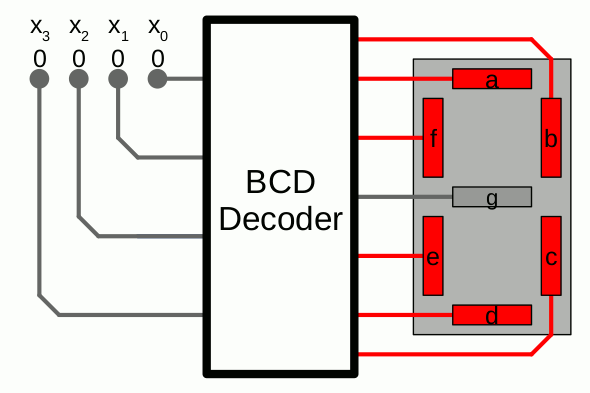
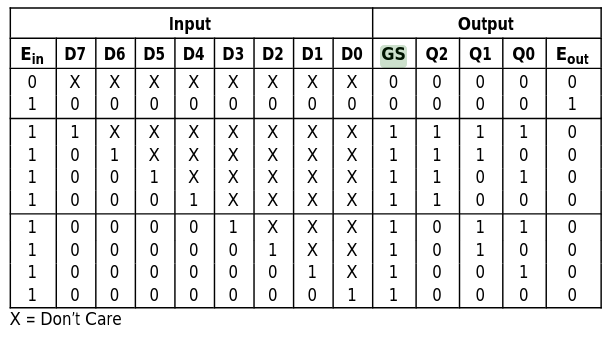
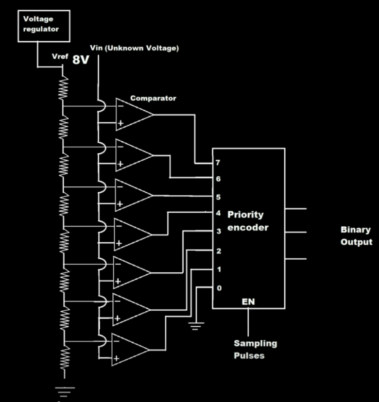
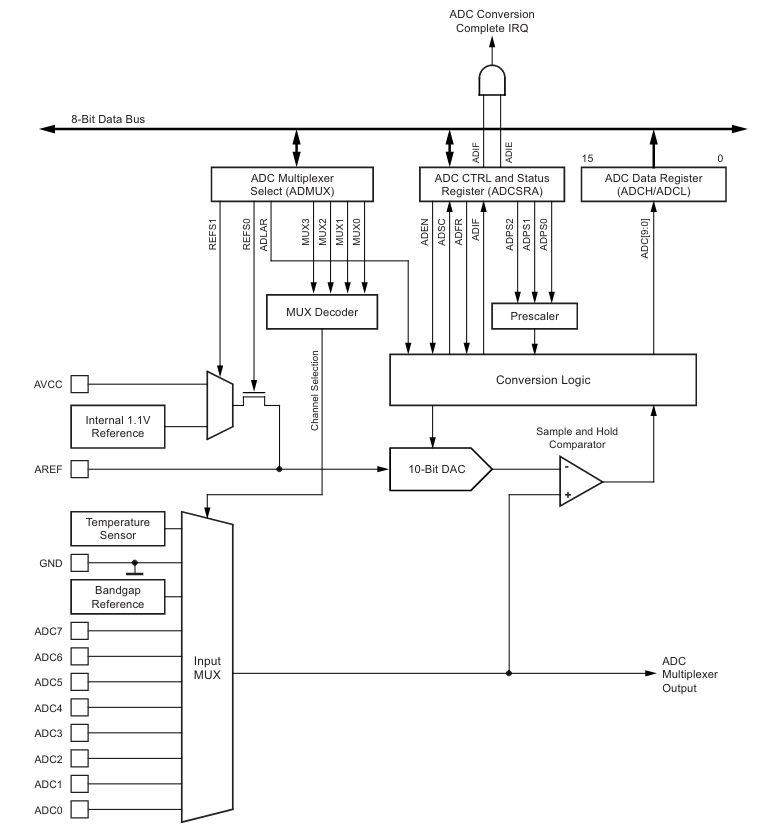
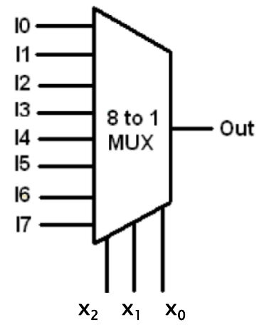

<!--

author:   Sebastian Zug & André Dietrich & Fabian Bär
email:    sebastian.zug@informatik.tu-freiberg.de & andre.dietrich@informatik.tu-freiberg.de & fabian.baer@student.tu-freiberg.de
version:  0.0.9
language: de
narrator: Deutsch Female

import:   https://raw.githubusercontent.com/liaTemplates/AVR8js/main/README.md
          https://raw.githubusercontent.com/LiaTemplates/DigiSim/master/README.md
          https://raw.githubusercontent.com/TUBAF-IfI-LiaScript/VL_EingebetteteSysteme/master/config.md

mark: <span style="background-color: @0;
                           display: flex;
                           width: calc(100% + 32px);
                           margin: -16px;
                           padding: 6px 16px 6px 16px;
                           ">@1</span>

red:  @mark(#FF888888,@0)
blue: @mark(lightblue,@0)
gray: @mark(gray,@0)
-->

[](https://liascript.github.io/course/?https://raw.githubusercontent.com/TUBAF-IfI-LiaScript/VL_EingebetteteSysteme/master/05_Standardschaltnetze.md#1)

# Standardschaltnetze

| Parameter                | Kursinformationen                                                                                                                                                                                          |
| ------------------------ | ------------------------------------------------------------------------------------------------------------------------------------------------------------------------------------------ |
| **Veranstaltung:**       | @config.lecture                                                                                          |
| **Semester:**            | @config.semester                                                                                         |
| **Hochschule:**          | `Technische Universität Freiberg`                                                                        |
| **Inhalte:**             | `Multiplexer, Demultiplexer, Encoder, Decoder und programmierbare Logikbausteine`                      |
| **Link auf GitHub:**     | https://github.com/TUBAF-IfI-LiaScript/VL_EingebetteteSysteme/blob/master/05_Standardschaltnetze.md    |
| **Autoren:**             | @author                                                                                                  |


---------------------------------------------------------------------

** Fragen an die Veranstaltung**

+ Unterscheiden Sie Multiplexer und Demultiplexer.
+ Wie lassen sich mit einem Multiplexer beliebige Wahrheitstafeln abbilden? Welche Grenzen hat dieser Ansatz?
+ Welche Aufgaben realisieren Dekoder?
+ Nennen Sie Anwendungsbeispiele für einen Multiplexer.

---------------------------------------------------------------------

<!--
style="width: 80%; min-width: 420px; max-width: 720px;"
-->
```ascii

                Abstraktionsebenen

           +----------------------------+ -.
  Ebene 6  | Problemorientierte Sprache |  |
           +----------------------------+  |
                                           ⎬ Anwendungssoftware
           +----------------------------+  |
  Ebene 5  | Assemblersprache           |  |
           +----------------------------+ -.

           +----------------------------+
  Ebene 4  | Betriebssystem             |     Systemsoftware
           +----------------------------+

           +----------------------------+
  Ebene 3  | Instruktionsset            |     Maschinensprache
           +----------------------------+

           +----------------------------+  -.
  Ebene 2  | Mikroarchitektur           |   |
           +----------------------------+   |
                                            ⎬ Automaten, Speicher, Logik
           +----------------------------+   |       ╔═══════════════╗
  Ebene 1  | Digitale Logik             |   |    ◀══║ HIER SIND WIR!║
           +----------------------------+  -.       ╚═══════════════╝

           +----------------------------+
  Ebene 0  | E-Technik, Physik          |     Analoge Phänomene
           +----------------------------+                                      .
```

---------------------------------------------------------------------

## Dekodierer / Kodierer

In der digitalen Elektronik ist ein Binärdecoder eine kombinatorische Logikschaltung, die binäre Informationen von den $n$ codierten Eingängen in maximal $k = 2^n$ eindeutige Ausgänge umwandelt. Sie werden zum Beispiel für die Ansteuerung von Siebensegmentanzeigen und als Adressdecoder für Speicher und Port-mapped I/O genutzt.

<!--
style="width: 80%; min-width: 420px; max-width: 720px;"
-->
```ascii

        Dekodierer              Kodierer
               +                  +
              /| ...............> |\
             / | ---------------> | \
            +  | ---------------> |  +
Input   --> |  | ---------------> |  | --->  Output
        --> |  | ---------------> |  | --->
        --> |  | ---------------> |  | --->
            +  | ---------------> |  +
             \ | ---------------> | /
              \| ---------------> |/
               +                  +                                            .
```

So kann z.B. ein abgewandeltes NOT Gatter als 1:2-Binärdecoder mit 1-Eingang und 2-Ausgänge  klassifiziert werden, da er mit einem Eingang A zwei Ausgänge $A$ und $\overline{A}$ hat.

### n-zu-k Dekodierer

**3-8 Dekodierer**

<!-- data-type="none" style="table-layout: fixed; max-width:580px;"-->
| $A$ | $B$ | $C$ | $y_0$ | $y_1$ | $y_2$ | $y_3$ | $y_4$ | ... |
|-----|-----|-----|-------|-------|-------|-------|-------|-----|
| 0   | 0   | 0   | 1     | 0     | 0     | 0     | 0     | ... |
| 0   | 0   | 1   | 0     | 1     | 0     | 0     | 0     | ... |
| 0   | 1   | 0   | 0     | 0     | 1     | 0     | 0     | ... |
| 0   | 1   | 1   | 0     | 0     | 0     | 1     | 0     | ... |
| 1   | 0   | 0   | 0     | 0     | 0     | 0     | 1     | ... |
| 1   | 0   | 1   | 0     | 0     | 0     | 0     | 0     | ... |
| 1   | 1   | 0   | 0     | 0     | 0     | 0     | 0     | ... |
| 1   | 1   | 1   | 0     | 0     | 0     | 0     | 0     | ... |


Für jede Eingangskombination wird genau 1 Ausgang aktiviert.

$$
\begin{aligned}
y_0 &= \overline{A} \cdot \overline{B} \cdot \overline{C} \\
y_1 &= \overline{A} \cdot \overline{B} \cdot C \\
y_2 &= \overline{A} \cdot B \cdot \overline{C} \\
y_3 &= \overline{A} \cdot B \cdot C
\end{aligned}
$$

```json @DigiSim.evalJson
{"devices":{"a":{"label":"A","type":"Button","propagation":0,"position":{"x":-90,"y":65}},"b":{"label":"B","type":"Button","propagation":0,"position":{"x":-90,"y":115}},"c":{"label":"C","type":"Button","propagation":0,"position":{"x":-100,"y":210}},"y0":{"label":"y0","type":"Lamp","propagation":0,"position":{"x":590,"y":45}},"y1":{"label":"y1","type":"Lamp","propagation":0,"position":{"x":590,"y":105}},"y2":{"label":"y2","type":"Lamp","propagation":0,"position":{"x":595,"y":175}},"y3":{"label":"y3","type":"Lamp","propagation":0,"position":{"x":590,"y":230}},"y4":{"label":"y4","type":"Lamp","propagation":0,"position":{"x":595,"y":285}},"y5":{"label":"y5","type":"Lamp","propagation":0,"position":{"x":590,"y":345}},"y6":{"label":"y6","type":"Lamp","propagation":0,"position":{"x":595,"y":415}},"y7":{"label":"y7","type":"Lamp","propagation":0,"position":{"x":595,"y":480}},"notA":{"label":"NOT a","type":"Not","propagation":0,"bits":1,"position":{"x":55,"y":90}},"notB":{"label":"NOT b","type":"Not","propagation":0,"bits":1,"position":{"x":40,"y":165}},"notC":{"label":"NOT c","type":"Not","propagation":0,"bits":1,"position":{"x":35,"y":375}},"and1":{"label":"~A and ~B","type":"And","propagation":0,"bits":1,"position":{"x":230,"y":95}},"and2":{"label":"~A and B","type":"And","propagation":0,"bits":1,"position":{"x":230,"y":195}},"and3":{"label":"A and ~B","type":"And","propagation":0,"bits":1,"position":{"x":235,"y":290}},"and4":{"label":"A and B","type":"And","propagation":0,"bits":1,"position":{"x":230,"y":410}},"and5":{"label":"~A and ~B and ~C","type":"And","propagation":0,"bits":1,"position":{"x":420,"y":40}},"and6":{"label":"~A and ~B and C","type":"And","propagation":0,"bits":1,"position":{"x":430,"y":100}},"and7":{"label":"~A and B and ~C","type":"And","propagation":0,"bits":1,"position":{"x":435,"y":170}},"and8":{"label":"~A and B and C","type":"And","propagation":0,"bits":1,"position":{"x":440,"y":225}},"and9":{"label":"A and ~B and ~C","type":"And","propagation":0,"bits":1,"position":{"x":430,"y":280}},"and10":{"label":"A and ~B and C","type":"And","propagation":0,"bits":1,"position":{"x":430,"y":340}},"and11":{"label":"A and B and ~C","type":"And","propagation":0,"bits":1,"position":{"x":435,"y":410}},"and12":{"label":"A and B and C","type":"And","propagation":0,"bits":1,"position":{"x":445,"y":475}}},"connectors":[{"from":{"id":"a","port":"out"},"to":{"id":"notA","port":"in"}},{"from":{"id":"b","port":"out"},"to":{"id":"notB","port":"in"}},{"from":{"id":"c","port":"out"},"to":{"id":"notC","port":"in"}},{"from":{"id":"and1","port":"out"},"to":{"id":"and5","port":"in1"}},{"from":{"id":"and1","port":"out"},"to":{"id":"and6","port":"in1"}},{"from":{"id":"and2","port":"out"},"to":{"id":"and7","port":"in1"}},{"from":{"id":"and2","port":"out"},"to":{"id":"and8","port":"in1"}},{"from":{"id":"and3","port":"out"},"to":{"id":"and9","port":"in1"}},{"from":{"id":"and3","port":"out"},"to":{"id":"and10","port":"in1"}},{"from":{"id":"and4","port":"out"},"to":{"id":"and11","port":"in1"}},{"from":{"id":"and4","port":"out"},"to":{"id":"and12","port":"in1"}},{"from":{"id":"notA","port":"out"},"to":{"id":"and1","port":"in1"}},{"from":{"id":"notB","port":"out"},"to":{"id":"and1","port":"in2"}},{"from":{"id":"notA","port":"out"},"to":{"id":"and2","port":"in1"}},{"from":{"id":"b","port":"out"},"to":{"id":"and2","port":"in2"},"vertices":[{"x":130,"y":160}]},{"from":{"id":"a","port":"out"},"to":{"id":"and3","port":"in1"},"vertices":[{"x":10,"y":215}]},{"from":{"id":"notB","port":"out"},"to":{"id":"and3","port":"in2"}},{"from":{"id":"a","port":"out"},"to":{"id":"and4","port":"in1"},"vertices":[{"x":10,"y":225},{"x":155,"y":395}]},{"from":{"id":"b","port":"out"},"to":{"id":"and4","port":"in2"},"vertices":[{"x":130,"y":160}]},{"from":{"id":"c","port":"out"},"to":{"id":"and6","port":"in2"},"vertices":[{"x":295,"y":265}]},{"from":{"id":"notC","port":"out"},"to":{"id":"and5","port":"in2"},"vertices":[{"x":330,"y":335}]},{"from":{"id":"c","port":"out"},"to":{"id":"and8","port":"in2"},"vertices":[{"x":310,"y":275}]},{"from":{"id":"notC","port":"out"},"to":{"id":"and7","port":"in2"},"vertices":[{"x":330,"y":335},{"x":370,"y":295}]},{"from":{"id":"notC","port":"out"},"to":{"id":"and9","port":"in2"},"vertices":[{"x":335,"y":335}]},{"from":{"id":"notC","port":"out"},"to":{"id":"and11","port":"in2"},"vertices":[{"x":320,"y":345}]},{"from":{"id":"c","port":"out"},"to":{"id":"and10","port":"in2"}},{"from":{"id":"c","port":"out"},"to":{"id":"and12","port":"in2"},"vertices":[{"x":360,"y":370}]},{"from":{"id":"and5","port":"out"},"to":{"id":"y0","port":"in"}},{"from":{"id":"and6","port":"out"},"to":{"id":"y1","port":"in"}},{"from":{"id":"and7","port":"out"},"to":{"id":"y2","port":"in"}},{"from":{"id":"and8","port":"out"},"to":{"id":"y3","port":"in"}},{"from":{"id":"and9","port":"out"},"to":{"id":"y4","port":"in"}},{"from":{"id":"and10","port":"out"},"to":{"id":"y5","port":"in"}},{"from":{"id":"and11","port":"out"},"to":{"id":"y6","port":"in"}},{"from":{"id":"and12","port":"out"},"to":{"id":"y7","port":"in"}}],"subcircuits":{}}
```


**Adressdekoder**

<!--
style="width: 80%; min-width: 420px; max-width: 720px;"
-->
```ascii
                         Adressbus [A_2, A_3 ...]
    +---------------------------------------------------------+
    |                                                         |
---------+          +--------+ D_0     +--------------+       |
     A_0 | -------->| A      |-------->|cs   Mem 0    |<------+
         |          |        |         +--------------+       |
     A_1 | -------->| B      |                :               |
         |          |        | D_1     +--------------+       |
         |  Adress- |        |-------->|cs   Mem 1    |<------+
         |  bus     |        |         +--------------+       |
Mikro    |          | 2-zu-4 |                :               |
prozessor|          | Dekoder| D_2     +--------------+       |
         |          |        |-------->|cs   Mem 2    |<------+
         |          |        |         +--------------+       |
         |          |        |                :               |
         |          |        | D_3     +--------------+       |
         |          |        |-------->|cs   Mem 3    |<------+
---------+          +--------+         +--------------+
    :                                         :                 cs = Chip Select
    ...........................................
                          Datenbus
```


**BCD Dekoder für 7 Segmentanzeige**


<!-- width="50%" -->

<div>
<wokwi-7segment port="D" digits="1" pin="7"></wokwi-7segment>
</div>

``` cpp  sevenSegmentDisplay.ino
const int PINS[] = {0, 1, 2, 3, 4, 5, 6};
const int PAUSE = 1000;
byte segDigits[10][8] = {
  { 1,1,1,1,1,1,1,0 },  // = 0
  { 0,1,1,0,0,0,0,0 },  // = 1
  { 1,1,0,1,1,1,0,1 },  // = 2
  { 1,1,1,1,1,0,0,1 },  // = 3
  { 0,1,1,0,0,0,1,1 },  // = 4rtragen Sie die Funktion in ein Karnaugh-Veitch-Di
};
void setup() {
  for(int i=0;i<8;i++){
    pinMode(PINS[i], OUTPUT);
  }
}

void loop() {
  for (int count = 0; count <=9; ++count) {
    for(int i=0; i<10; i++) {
      digitalWrite(PINS[i], segDigits[count][i]);
    }
    delay(PAUSE);
  }
}
```
@AVR8js.sketch

**Verschaltung von Dekodern**

Realisierung eines 4-zu-16 Dekoders auf der Basis von zwei 3-zu-8 Dekodern

<!--
style="width: 80%; min-width: 420px; max-width: 720px;"
-->
```ascii
               3-zu-8 Dekoder
               +----------+
A ------------>| 2^0     0|---->  0
B ------------>| 2^1     1|---->  1
C ------------>| 2^2     2|---->  2
D --+          |         3|---->  3
    |  |\      |         4|---->  4
    +--+ o---->| EN      5|---->  5
    |  |/      |         6|---->  6
    |          |         7|---->  7
    |          +----------+
    |
    |          +----------+
    |     A  ->| 2^0     0|---->  8
    |     B -->| 2^1     1|---->  9
    |     C--->| 2^2     2|----> 10
    |          |         3|----> 11
    |          |         4|----> 12
    +--------->| EN      5|----> 13
               |         6|----> 14
               |         7|----> 15
               +----------+                                                    .
```


### n-zu-k Kodierer

+ n Ausgänge $y_0$, $y_1$, ... ,$y_{n-1}$
+ $k = 2^n$ Eingänge $x_0$, $x_1$, ... ,$x_{k-1}$
+ nur genau eine Eingangsleitung darf auf 1 sein: $x_i = 1$, $xj<>i = 0$

Jeder Eingangsleitung ist genau eine Kombination der möglichen Belegungen der Ausgangsleitungen zugeordnet, z.B. ihre binäre Repräsentation.

**8-3 Kodierer**

<!-- data-type="none" style="table-layout: fixed; max-width:800px;"-->
| $x_0$    | $x_1$    | $x_2$    | $x_3$    | $x_4$    | $x_5$    | $x_6$    | $x_7$    | $y_2$ | $y_1$ | $y_0$ |
|----------|----------|----------|----------|----------|----------|----------|----------|-------|-------|-------|
| @blue(1) | 0        | 0        | 0        | 0        | 0        | 0        | 0        | 0     | 0     | 0     |
| 0        | @blue(1) | 0        | 0        | 0        | 0        | 0        | 0        | 0     | 0     | 1     |
| 0        | 0        | @blue(1) | 0        | 0        | 0        | 0        | 0        | 0     | 1     | 0     |
| 0        | 0        | 0        | @blue(1) | 0        | 0        | 0        | 0        | 0     | 1     | 1     |
| 0        | 0        | 0        | 0        | @blue(1) | 0        | 0        | 0        | 1     | 0     | 0     |
| 0        | 0        | 0        | 0        | 0        | @blue(1) | 0        | 0        | 1     | 0     | 1     |
| 0        | 0        | 0        | 0        | 0        | 0        | @blue(1) | 0        | 1     | 1     | 0     |
| 0        | 0        | 0        | 0        | 0        | 0        | 0        | @blue(1) | 1     | 1     | 1     |


$$
\begin{aligned}
y_0 &= x_1 + x_3 + x_5 + x_7 \\
y_1 &= x_2 + x_3 + x_6 + x_7 \\
y_2 &= x_4 + x_5 + x_6 + x_7
\end{aligned}
$$

> Achtung: Die Wahrheitstafel ist unvollständig !

1. Falsche Ausgangszustände sind möglich!
2. Was passiert wenn alle Pegel 0 sind?

``` json @DigiSim.evalJson
{"devices":{"x0":{"label":"x0","type":"Button","propagation":0,"position":{"x":0,"y":0}},"x1":{"label":"x1","type":"Button","propagation":0,"position":{"x":0,"y":50}},"x2":{"label":"x2","type":"Button","propagation":0,"position":{"x":0,"y":105}},"x3":{"label":"x3","type":"Button","propagation":0,"position":{"x":0,"y":160}},"x4":{"label":"x4","type":"Button","propagation":0,"position":{"x":0,"y":215}},"x5":{"label":"x5","type":"Button","propagation":0,"position":{"x":0,"y":265}},"x6":{"label":"x6","type":"Button","propagation":0,"position":{"x":0,"y":320}},"x7":{"label":"x7","type":"Button","propagation":0,"position":{"x":0,"y":375}},"y0":{"label":"y0","type":"Lamp","propagation":0,"position":{"x":570,"y":185}},"y1":{"label":"y1","type":"Lamp","propagation":0,"position":{"x":530,"y":210}},"y2":{"label":"y2","type":"Lamp","propagation":0,"position":{"x":485,"y":240}},"or1":{"label":"x1 or x3","type":"Or","propagation":0,"bits":1,"position":{"x":190,"y":80}},"or2":{"label":"x5 or x7","type":"Or","propagation":0,"bits":1,"position":{"x":195,"y":140}},"or3":{"label":"x1 or x3 or x5 or x7","type":"Or","propagation":0,"bits":1,"position":{"x":345,"y":120}},"or4":{"label":"x2 or x3","type":"Or","propagation":0,"bits":1,"position":{"x":200,"y":200}},"or5":{"label":"x6 or x7","type":"Or","propagation":0,"bits":1,"position":{"x":205,"y":290}},"or6":{"label":"x2 or x3 or x6 or x7","type":"Or","propagation":0,"bits":1,"position":{"x":350,"y":225}},"or7":{"label":"x4 or x5","type":"Or","propagation":0,"bits":1,"position":{"x":200,"y":360}},"or8":{"label":"x4 or x5 or x6 or x7","type":"Or","propagation":0,"bits":1,"position":{"x":360,"y":320}}},"connectors":[{"from":{"id":"x1","port":"out"},"to":{"id":"or1","port":"in1"}},{"from":{"id":"x3","port":"out"},"to":{"id":"or1","port":"in2"}},{"from":{"id":"x5","port":"out"},"to":{"id":"or2","port":"in1"},"vertices":[{"x":135,"y":170}]},{"from":{"id":"x7","port":"out"},"to":{"id":"or2","port":"in2"},"vertices":[{"x":145,"y":310}]},{"from":{"id":"x2","port":"out"},"to":{"id":"or4","port":"in1"}},{"from":{"id":"x3","port":"out"},"to":{"id":"or4","port":"in2"}},{"from":{"id":"x6","port":"out"},"to":{"id":"or5","port":"in1"},"vertices":[{"x":90,"y":335}]},{"from":{"id":"x7","port":"out"},"to":{"id":"or5","port":"in2"}},{"from":{"id":"x4","port":"out"},"to":{"id":"or7","port":"in1"},"vertices":[{"x":95,"y":290}]},{"from":{"id":"x5","port":"out"},"to":{"id":"or7","port":"in2"}},{"from":{"id":"or1","port":"out"},"to":{"id":"or3","port":"in1"}},{"from":{"id":"or2","port":"out"},"to":{"id":"or3","port":"in2"}},{"from":{"id":"or4","port":"out"},"to":{"id":"or6","port":"in1"}},{"from":{"id":"or5","port":"out"},"to":{"id":"or6","port":"in2"}},{"from":{"id":"or5","port":"out"},"to":{"id":"or8","port":"in1"}},{"from":{"id":"or7","port":"out"},"to":{"id":"or8","port":"in2"}},{"from":{"id":"or3","port":"out"},"to":{"id":"y0","port":"in"}},{"from":{"id":"or6","port":"out"},"to":{"id":"y1","port":"in"}},{"from":{"id":"or8","port":"out"},"to":{"id":"y2","port":"in"}}],"subcircuits":{}}
```

**Prioritätsencoder**

Abhilfe schafft der Prioritätsencoder. Hier wird eine explizite Auswahl für verschiedene Eingangskonfigurationen getroffen.

<!-- data-type="none" -->
| $x_3$ | $x_2$    | $x_1$    | $x_0$    | $y_1$ | $y_0$ | Bemerkung |
|-------|----------|----------|----------|-------|-------|-----------|
| 0     | 0        | 0        | 0        | 0     | 0     | ungültig  |
| 0     | 0        | 0        | 1        | 0     | 0     |           |
| 0     | 0        | 1        | @gray(X) | 0     | 1     |           |
| 0     | 1        | @gray(X) | @gray(X) | 1     | 0     |           |
| 1     | @gray(X) | @gray(X) | @gray(X) | 1     | 1     |           |

$$
\begin{aligned}
y_0 &= \overline{x}_3 \overline{x}_2 x_1 +  x_3 \\
y_1 &= \overline{x}_3 x_2 \\
\end{aligned}
$$

Und im echten Leben? Kommen noch einige Spezialeingänge / -ausgänge dazu [Link](https://www.onsemi.com/pub/Collateral/MC14532B-D.PDF).

<!-- width="70%" -->

[^1]: Datenblatt MC14532B - 8-Bit Priority Encoder, Firma ON Semiconductor

> Aufgabe: Vereinfachen Sie die Funktionen für $Q_2$!

$$
\begin{aligned}
Q_2 &= D_4 + D_5 + D_6 + D_7 \\
\end{aligned}
$$

**Analog Digitalwandler**

Wir werden dem Encoder bei der Diskussion der Peripherie eines Mikrocontrollers sehr häufig wiederbegegnen. Das Video zeigt einen Anwendungsfall - das Mapping der Ergebnisse eines Analog-Digital-Wandlers auf eine binäre Ausgabe.

<!-- width="80%" --> [^2]

[^2]: Autor: Always Be Positive, Youtube Video - Flash or Parallel ADC (Analog to Digital Converter)

!?[Erläuterung Flashwandler](https://www.youtube.com/watch?v=lhnKZDLtYvQ)

## Multiplexer / Demultiplexer

Eine Mulitplexerschaltung bildet analoge oder digitale Eingangssignale auf einen Kommunikationskanal ab, der Demultiplexer übernimmt die Abbildung auf n Ausgangsleitungen.

<!--
style="width: 80%; min-width: 420px; max-width: 720px;"
-->
```ascii

    Multiplexer             Demultiplexer
        +                        +
------> |\                      /|------>
        | \                    / |
------> |  +                  +  |------>
        |  | ................>|  |
------> |  +                  +  |------>
        | /                    \ |
------> |/|                    |\|------>
        +||                    ||+
         ||                    ||
       "$a_0$ $a_1$"         "$a_0$ $a_1$"                                       .
```

| Multiplexer                                       | Dekoder                                                      |
|---------------------------------------------------|--------------------------------------------------------------|
| mehrere Eingänge, ein Ausgang                     | mehrere Eingänge, mehrere Ausgänge                           |
| Steuerleitungen konfiguriereren die Weiterleitung | das Mapping wird durch die interne Logik bestimmt |
| bildet den Pegel einer Eingangsleitung auf die Ausgangsleitung ab  | wandelt den binären Code in einen unären Code um == aktiviert eine Ausgangsleitung             |

### Multiplexer

Generelle Konfiguration eines 1-aus-k Multiplexer:

+ $n$ Steuerleitungen: $s_{n-1}, ... , s_1, s_0$
+ $k = 2^n$ Eingänge: $x_0, x_1, ... , x_{k-1}$
+ ein Ausgang: y
+ $y = x_i$ für $(s_{n-1}, ... , s_1 , s_0)_2 = i$

**Beispiel: 1-zu-4 Multiplexer**

Eine Wahrheitstabelle mit 4 Eingangsvariablen und 2 Steuersignalen würde eine entsprechende Größe aufweisen. Allerdings kann die Funktion auch sehr einfach hergeleitet werden. Ein Inputsignal wird nur dann durchgeleitet, wenn die zugehörige Kombination von Steuersignalen anliegt.

<!-- data-type="none" style="table-layout: fixed; max-width:400px;"-->
| $a_1$ | $a_2$ | Signal |
|-------|-------|--------|
| 0     | 0     | $x_0$  |
| 0     | 1     | $x_1$  |
| 1     | 0     | $x_2$  |
| 1     | 1     | $x_3$  |

$y = \overline{a_1} \cdot \overline {a_2} \cdot x_0 + \overline{a_1} \cdot a_2 \cdot x_1 + a_1 \cdot \overline {a_2} \cdot x_2 + a_1 \cdot a_2 \cdot x_3$

``` json @DigiSim.evalJson
{"devices":{"a0":{"label":"a0","type":"Button","propagation":0,"position":{"x":-185,"y":10}},"a1":{"label":"a1","type":"Button","propagation":0,"position":{"x":-180,"y":-55}},"x0":{"label":"x0","type":"Button","propagation":0,"position":{"x":-185,"y":80}},"x1":{"label":"x1","type":"Button","propagation":0,"position":{"x":-185,"y":125}},"x2":{"label":"x2","type":"Button","propagation":0,"position":{"x":-185,"y":180}},"x3":{"label":"x3","type":"Button","propagation":0,"position":{"x":-185,"y":240}},"y":{"label":"y","type":"Lamp","propagation":0,"position":{"x":560,"y":180}},"not1":{"label":"~a0","type":"Not","propagation":0,"bits":1,"position":{"x":-95,"y":40}},"not2":{"label":"~a1","type":"Not","propagation":0,"bits":1,"position":{"x":-95,"y":-25}},"and1":{"label":"~a1 and ~a0","type":"And","propagation":0,"bits":1,"position":{"x":65,"y":40}},"and2":{"label":"~a1 and a0","type":"And","propagation":0,"bits":1,"position":{"x":55,"y":120}},"and3":{"label":"a1 and ~a0","type":"And","propagation":0,"bits":1,"position":{"x":65,"y":190}},"and4":{"label":"a1 and a0","type":"And","propagation":0,"bits":1,"position":{"x":70,"y":270}},"and5":{"label":"~a1 and ~a0 and x0","type":"And","propagation":0,"bits":1,"position":{"x":210,"y":55}},"and6":{"label":"~a1 and a0 and x1","type":"And","propagation":0,"bits":1,"position":{"x":210,"y":130}},"and7":{"label":"a1 and ~a0 and x2","type":"And","propagation":0,"bits":1,"position":{"x":210,"y":205}},"and8":{"label":"a1 and a0 and x3","type":"And","propagation":0,"bits":1,"position":{"x":210,"y":280}},"or1":{"label":"or","type":"Or","propagation":0,"bits":1,"position":{"x":420,"y":175}},"or2":{"label":"or","type":"Or","propagation":0,"bits":1,"position":{"x":360,"y":110}},"or3":{"label":"or","type":"Or","propagation":0,"bits":1,"position":{"x":360,"y":225}}},"connectors":[{"from":{"id":"a1","port":"out"},"to":{"id":"not2","port":"in"}},{"from":{"id":"a0","port":"out"},"to":{"id":"not1","port":"in"}},{"from":{"id":"not2","port":"out"},"to":{"id":"and1","port":"in1"}},{"from":{"id":"not1","port":"out"},"to":{"id":"and1","port":"in2"}},{"from":{"id":"a0","port":"out"},"to":{"id":"and2","port":"in2"},"vertices":[{"x":-75,"y":100}]},{"from":{"id":"a0","port":"out"},"to":{"id":"and4","port":"in2"},"vertices":[{"x":-15,"y":160}]},{"from":{"id":"not2","port":"out"},"to":{"id":"and2","port":"in1"},"vertices":[{"x":5,"y":85}]},{"from":{"id":"a1","port":"out"},"to":{"id":"and3","port":"in1"},"vertices":[{"x":-105,"y":10}]},{"from":{"id":"a1","port":"out"},"to":{"id":"and4","port":"in1"},"vertices":[{"x":-100,"y":25},{"x":-100,"y":55},{"x":30,"y":185}]},{"from":{"id":"not1","port":"out"},"to":{"id":"and3","port":"in2"},"vertices":[{"x":20,"y":100}]},{"from":{"id":"x0","port":"out"},"to":{"id":"and5","port":"in2"}},{"from":{"id":"and1","port":"out"},"to":{"id":"and5","port":"in1"}},{"from":{"id":"and2","port":"out"},"to":{"id":"and6","port":"in1"}},{"from":{"id":"and3","port":"out"},"to":{"id":"and7","port":"in1"}},{"from":{"id":"and4","port":"out"},"to":{"id":"and8","port":"in1"}},{"from":{"id":"x1","port":"out"},"to":{"id":"and6","port":"in2"},"vertices":[{"x":-45,"y":180},{"x":75,"y":180}]},{"from":{"id":"x2","port":"out"},"to":{"id":"and7","port":"in2"}},{"from":{"id":"x3","port":"out"},"to":{"id":"and8","port":"in2"},"vertices":[{"x":-20,"y":310}]},{"from":{"id":"and5","port":"out"},"to":{"id":"or2","port":"in1"}},{"from":{"id":"and6","port":"out"},"to":{"id":"or2","port":"in2"}},{"from":{"id":"and7","port":"out"},"to":{"id":"or3","port":"in1"}},{"from":{"id":"and8","port":"out"},"to":{"id":"or3","port":"in2"}},{"from":{"id":"or2","port":"out"},"to":{"id":"or1","port":"in1"}},{"from":{"id":"or3","port":"out"},"to":{"id":"or1","port":"in2"},"vertices":[{"x":420,"y":205}]},{"from":{"id":"or1","port":"out"},"to":{"id":"y","port":"in"}}],"subcircuits":{}}
```

**Anwendung in Microcontrollern**

<!-- width="70%" -->

[^3]: Firma Microchip - ATmega328P8-bit AVR Microcontroller Datasheet [Link](https://ww1.microchip.com/downloads/en/DeviceDoc/Atmel-7810-Automotive-Microcontrollers-ATmega328P_Datasheet.pdf)

**Multiplexer als universelle boolesche Funktionsrepräsentation**


<!-- data-type="none" -->
| $x_2$ | $x_1$ | $x_0$ | $y$ |
|-------|-------|-------|-----|
| 0     | 0     | 0     | 1   |
| 0     | 0     | 1     | 0   |
| 0     | 1     | 0     | 0   |
| 0     | 1     | 1     | 1   |
| 1     | 0     | 0     | 1   |
| 1     | 0     | 1     | 0   |
| 1     | 1     | 0     | 1   |
| 1     | 1     | 1     | 1   |

<!-- width="30%" -->


### Demultiplexer

Generelle Konfiguration eines 1-aus-k Multiplexer:

+ $n$ Steuerleitungen: $s_{n-1}, ... , s_1, s_0$
+ $k = 2^n$ Ausgänge: $y_0, y_1, ... , y_{k-1}$
+ ein Eingang: x
+ $y = x_i$ für $(s_{n-1}, ... , s_1 , s_0)_2 = i$

**Beispiel: 2 Bit Adresse -> 4 Ausgänge**

<!-- data-type="none" -->
| $a_0$ | $a_1$ | $x$ | $y_0$ | $y_1$ | $y_2$ | $y_3$ |
|-------|-------|-----|-------|-------|-------|-------|
| 0     | 0     | 0   |       |       |       |       |
| 0     | 0     | 1   | 1     |       |       |       |
| 0     | 1     | 0   |       |       |       |       |
| 0     | 1     | 1   |       | 1     |       |       |
| 1     | 0     | 0   |       |       |       |       |
| 1     | 0     | 1   |       |       | 1     |       |
| 1     | 1     | 0   |       |       |       |       |
| 1     | 1     | 1   |       |       |       | 1     |

$y_0 = x \cdot \overline{a_1} \cdot \overline{a_0}$

$y_1 = x \cdot \overline{a_1} \cdot a_0$

$y_2 = x \cdot a_1 \cdot \overline{a_0}$

$y_3 = x \cdot a_1 \cdot a_0$

```json @DigiSim.evalJson
{"devices":{"x":{"label":"x","type":"Button","propagation":0,"position":{"x":-50,"y":0}},"a0":{"label":"a0","type":"Button","propagation":0,"position":{"x":-45,"y":185}},"a1":{"label":"a1","type":"Button","propagation":0,"position":{"x":-50,"y":100}},"y0":{"label":"y0","type":"Lamp","propagation":0,"position":{"x":495,"y":15}},"y1":{"label":"y1","type":"Lamp","propagation":0,"position":{"x":495,"y":75}},"y2":{"label":"y2","type":"Lamp","propagation":0,"position":{"x":495,"y":130}},"y3":{"label":"y3","type":"Lamp","propagation":0,"position":{"x":500,"y":185}},"not1":{"label":"~a0","type":"Not","propagation":0,"bits":1,"position":{"x":85,"y":225}},"not2":{"label":"~a1","type":"Not","propagation":0,"bits":1,"position":{"x":45,"y":110}},"and1":{"label":"x and ~a1","type":"And","propagation":0,"bits":1,"position":{"x":150,"y":55}},"and2":{"label":"x and a1","type":"And","propagation":0,"bits":1,"position":{"x":160,"y":155}},"and3":{"label":"x and ~a1 and ~a0","type":"And","propagation":0,"bits":1,"position":{"x":345,"y":10}},"and4":{"label":"x and ~a1 and a0","type":"And","propagation":0,"bits":1,"position":{"x":345,"y":70}},"and5":{"label":"x and a1 and ~a0","type":"And","propagation":0,"bits":1,"position":{"x":345,"y":125}},"and6":{"label":"x and a1 and a0","type":"And","propagation":0,"bits":1,"position":{"x":350,"y":180}}},"connectors":[{"from":{"id":"not2","port":"out"},"to":{"id":"and1","port":"in2"}},{"from":{"id":"x","port":"out"},"to":{"id":"and1","port":"in1"}},{"from":{"id":"x","port":"out"},"to":{"id":"and2","port":"in1"},"vertices":[{"x":85,"y":75},{"x":110,"y":115}]},{"from":{"id":"and1","port":"out"},"to":{"id":"and3","port":"in1"}},{"from":{"id":"and1","port":"out"},"to":{"id":"and4","port":"in1"}},{"from":{"id":"and2","port":"out"},"to":{"id":"and5","port":"in1"},"vertices":[{"x":285,"y":135}]},{"from":{"id":"and2","port":"out"},"to":{"id":"and6","port":"in1"}},{"from":{"id":"not1","port":"out"},"to":{"id":"and3","port":"in2"},"vertices":[{"x":290,"y":225},{"x":290,"y":155}]},{"from":{"id":"not1","port":"out"},"to":{"id":"and5","port":"in2"},"vertices":[{"x":285,"y":200}]},{"from":{"id":"and3","port":"out"},"to":{"id":"y0","port":"in"}},{"from":{"id":"and4","port":"out"},"to":{"id":"y1","port":"in"}},{"from":{"id":"and5","port":"out"},"to":{"id":"y2","port":"in"}},{"from":{"id":"and6","port":"out"},"to":{"id":"y3","port":"in"}},{"from":{"id":"a1","port":"out"},"to":{"id":"not2","port":"in"}},{"from":{"id":"a1","port":"out"},"to":{"id":"and2","port":"in2"},"vertices":[{"x":35,"y":145},{"x":65,"y":185}]},{"from":{"id":"a0","port":"out"},"to":{"id":"not1","port":"in"}},{"from":{"id":"a0","port":"out"},"to":{"id":"and4","port":"in2"},"vertices":[{"x":305,"y":200}]},{"from":{"id":"a0","port":"out"},"to":{"id":"and6","port":"in2"}}],"subcircuits":{}}
```

## Komperatoren

... siehe Hausaufgabe

## Ausblick

Nunmehr können boolesche Funktionen als Schaltnetze abbilden? Was fehlt für den Rechner? Zwei Dinge ... Speicher und arithmetische Operationen.

## Hausaufgaben

1. Entwerfen Sie einen Komperator, der zwei zweistellige Zahlen vergleicht. Definieren Sie dazu zunächst einen Ein-Bit Komperator und nutzen sie diesen als Grundlage für die Zwei-Bit-Variante

2. Entwickeln Sie ein Schaltnetz, dass die Teilbarkeit durch drei von einer 4-stelligen binären Zahl prüft. Stellen Sie dazu eine Wahrheitstafel auf, minimieren Sie den Ausdruck soweit wie möglich und skizzieren Sie die Verdrahtung der Gatter.

> Wer möchte sich mit dem NE555 beschäftigen? 
