<!--

author:   Sebastian Zug & André Dietrich & Fabian Bär
email:    sebastian.zug@informatik.tu-freiberg.de & andre.dietrich@informatik.tu-freiberg.de & fabian.baer@student.tu-freiberg.de
version:  0.0.7
language: de
narrator: Deutsch Female

import: https://raw.githubusercontent.com/liaTemplates/AVR8js/main/README.md
        https://raw.githubusercontent.com/LiaTemplates/DigiSim/master/README.md
        https://github.com/LiaTemplates/Pyodide

mark: <span style="background-color: @0;
                           display: flex;
                           width: calc(100% + 32px);
                           margin: -16px;
                           padding: 6px 16px 6px 16px;
                           ">@1</span>

red:  @mark(#FF888888,@0)
blue: @mark(lightblue,@0)
gray: @mark(gray,@0)
-->

[](https://liascript.github.io/course/?https://raw.githubusercontent.com/TUBAF-IfI-LiaScript/VL_EingebetteteSysteme/master/06_FlipFlops.md#1)

# FlipFlops

| Parameter                | Kursinformationen                                                                                                                                                                          |
| ------------------------ | ------------------------------------------------------------------------------------------------------------------------------------------------------------------------------------------ |
| **Veranstaltung:**   | `Digitale Systeme / Eingebettete Systeme`                                                                                                                                                                  |
| **Semester**         | `Wintersemester 2022/23`                                                                                                                                                                                   |
| **Hochschule:**          | `Technische Universität Freiberg`                                                                                                                                                          |
| **Inhalte:**             | `Flip-Flop Schaltungen`                                                                                      |
| **Link auf GitHub:** | [https://github.com/TUBAF-IfI-LiaScript/VL_Softwareentwicklung/blob/master/06_FlipFlops.md](https://github.com/TUBAF-IfI-LiaScript/VL_EingebetteteSysteme/blob/master/06_FlipFlops.md) |
| **Autoren**              | @author                                                                                                                                                                                    |


---------------------------------------------------------------------

** Fragen an die Veranstaltung**

+ Erläutern Sie die Notwendigkeit von Speicherelementen für die Umsetzung eines Rechners.
+ Worin besteht der Unterschied zwischen Schaltfunktionen/Schaltnetzen und Schaltwerken?
+ Beschreiben Sie die Eingangsbelegungen und korrespondierenden Zustandsänderungen am RS-Flip-Flop.
+ Welche anderen Flip-Flop-Typen kennen sie, wo liegen die Vorteile gegenüber dem RS-Flip-Flop?
+ Erläutern Sie die Begriffe „zustandsgesteuert“ und „flankengesteuert“.
+ Welche Kernelemente hat ein Schaltwerk? Worin unterscheiden sich die Varianten von Mealy und Moore?
+ Welches Vorgehen ist für die Umsetzung eines Schaltwerkes notwendig?
+ An welcher Stelle ist die invertierte Wahrheitstabelle eines Flip-Flops wichtig?

---------------------------------------------------------------------

<!--
style="width: 80%; min-width: 420px; max-width: 720px;"
-->
```ascii

                Abstraktionsebenen

           +----------------------------+ -.
  Ebene 6  | Problemorientierte Sprache |  |
           +----------------------------+  |
                                           ⎬ Anwendungssoftware
           +----------------------------+  |
  Ebene 5  | Assemblersprache           |  |
           +----------------------------+ -.

           +----------------------------+
  Ebene 4  | Betriebssystem             |     Systemsoftware
           +----------------------------+

           +----------------------------+
  Ebene 3  | Instruktionsset            |     Maschinensprache
           +----------------------------+

           +----------------------------+  -.
  Ebene 2  | Mikroarchitektur           |   |
           +----------------------------+   |
                                            ⎬ Automaten, Speicher, Logik
           +----------------------------+   |       ╔═══════════════╗
  Ebene 1  | Digitale Logik             |   |    ◀══║ HIER SIND WIR!║
           +----------------------------+  -.       ╚═══════════════╝

           +----------------------------+
  Ebene 0  | E-Technik, Physik          |     Analoge Phänomene
           +----------------------------+                                      .
```

---------------------------------------------------------------------


## Einführung sequenzieller Logik

Kombinatorische Logik wird durch Schaltnetze repräsentiert, die durch zyklenfreie Graphen dargestellt werden können, sprich es gibt keine Eigenschaften:

1. Zustandslos: Ausgabe ist nur von der Eingabe abhängig;
2. One-Way: keine Rückkopplungen im Schaltnetz;
3. 0-Verzögerung: keine Berücksichtigung der Gatterlaufzeit.

Frage: Können wir die bisherigen Konzepte und Techniken der logischen Schaltungen einsetzen, um wesentliche Elemente eines Rechners zu beschreiben wie z.B. :

+ Ablaufsteuerungen
+ Speicherelemente
+ Takterzeuger

> Merke: Es fehlt ein Speicher!

Was geschieht in einer digitalen Schaltung bei der Rückkopplung eines Gatterausganges?

### Erster Ansatz

__Verwendung eines rückgekoppelten AND-Bausteins.__

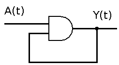

<!-- data-type="none" -->
| $A(t)$ | $Y(t)$ | $Y(t+\Delta t)$ | $Y(t+2\Delta t)$ | $Y(t+3\Delta t)$ |
| ------ | ------ | --------------- | ---------------- | ---------------- |
| 1      | 1      | 1               | 1                | 1                |
| 0      | 1      | 0               | 0                | 0                |
| 1      | 0      | 0               | 0                | 0                |
| 0      | 0      | 0               | 0                | 0                |

<!-- data-type="none" -->
| $A(t)$ | $Y(t+\Delta t)$ | $Y(t+2\Delta t)$ | $Y(t+3\Delta t)$ |
| ------ | --------------- | ---------------- | ---------------- |
| 1      | $Y(t)$          | $Y(t)$           | $Y(t)$           |
| 0      | 0               | 0                | 0                |

Offenbar behalten wir bei der Eingabe von 1 den aktuellen Zustand bei. Aus der Eingabe einer 0 folgt das "Löschen" des Zustandes.

### Zweiter Ansatz

__Verwendung eines rückgekoppelten OR-Bausteins.__

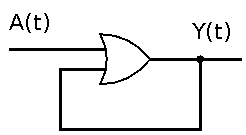

<!-- data-type="none" -->
| $A(t)$ | $Y(t)$ | $Y(t+\Delta t)$ | $Y(t+2\Delta t)$ | $Y(t+3\Delta t)$ |
| ------ | ------ | --------------- | ---------------- | ---------------- |
| 1      | 1      | 1               | 1                | 1                |
| 0      | 1      | 1               | 1                | 1                |
| 1      | 0      | 1               | 1                | 1                |
| 0      | 0      | 0               | 0                | 0                |

<!-- data-type="none" -->
| $A(t)$ | $Y(t+\Delta t)$ | $Y(t+2\Delta t)$ | $Y(t+3\Delta t)$ |
| ------ | --------------- | ---------------- | ---------------- |
| 1      | 1               | 1                | 1                |
| 0      | $Y(t)$          | $Y(t)$           | $Y(t)$           |

...

``` json @DigiSim.evalJson
{"devices":{"a":{"label":"A","type":"Button","propagation":0,"position":{"x":-85,"y":55}},"y":{"label":"Y","type":"Lamp","propagation":0,"position":{"x":275,"y":60}},"or":{"label":"or","type":"Or","propagation":0,"bits":1,"position":{"x":85,"y":70}}},"connectors":[{"from":{"id":"or","port":"out"},"to":{"id":"y","port":"in"}},{"from":{"id":"a","port":"out"},"to":{"id":"or","port":"in2"}},{"from":{"id":"or","port":"out"},"to":{"id":"or","port":"in1"},"vertices":[{"x":40,"y":50}]}],"subcircuits":{}}
```

### Dritter Ansatz (SR-Latch)
__Gesteuerte Rückkopplung über OR-Baustein.__

Wir fügen eine weitere Eingangsgröße hinzu, die die Logik des Speichers auf der Basis des rückgekoppelten OR vervollständigt. Durch die Einbettung des AND-Gatters können wir die Rückkopplung kontrollieren! Die Rückkopplung einer 1 erfolgt nur dann, wenn unser `R` Eingang nicht selbst eine 1 abbildet. Sobald wir an S eine 1 anlegen, wird diese auf Y sichtbar und gespeichert.

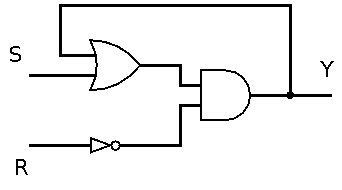

<!-- data-type="none" -->
| $R(t)$ | $S(t)$ | $Y(t)$ | $Y(t+2\Delta t)$ | Bedeutung      |
| ------ | ------ | ------ | ---------------- | -------------- |
| 0      | 0      | 0      | 0                | Speichern      |
| 0      | 0      | 1      | 1                | Speichern      |
| 0      | 1      | 0      | 1                | Setzen         |
| 0      | 1      | 1      | 1                | Setzen$^*$     |
| 1      | 0      | 0      | 0                | Rücksetzen$^*$ |
| 1      | 0      | 1      | 0                | Rücksetzen     |
| 1      | 1      | 0      | 0                | Vermeiden$^*$  |
| 1      | 1      | 1      | 0                | Vermeiden      |

Die mit * markierten Einträge werden jeweils aus dem benachbarten Zustand erreicht. Wenn wir zum Beispiel von einem Zustand $Y=0$ beim Setzen ausgehen, generieren wir mit $S==1$ ein $Y(t+2\Delta t)$ einen 1-Pegel. Dies entspricht der Zeile 4 der Wahrheitstabelle.

Der Zeitversatz von $2\Delta t$ ergibt sich aus dem Schaltverhalten der beiden Bauteile. In obigem Schaubild sind noch drei Typen (OR, AND und NOT), im folgenden wird diese Konfiguration auf NAND- und NOR-Gatter vereinheitlicht. Entsprechend kann dann von einem einheitlichen $\Delta t$ ausgegangen werden.

Werden beide Eingänge auf 1-Pegel gesetzt, führen beide Ausgänge 1-Pegel. Dieser Zustand kann nicht gespeichert werden. In der Literatur wird dieser Zustand als "unbestimmt" oder "verboten" bezeichnet. Doch die Unbestimmtheit tritt nur in dem Fall ein, wenn beide Eingänge nach diesem Zustand gleichzeitig 0-Pegel erhalten. Dieser Folgezustand ist "unbestimmt", weil nicht klar ist, welcher Ausgang 1-Pegel führt.

``` json @DigiSim.evalJson
{"devices":{"s":{"label":"S","type":"Button","propagation":0,"position":{"x":0,"y":0}},"r":{"label":"R","type":"Button","propagation":0,"position":{"x":0,"y":55}},"y":{"label":"Y","type":"Lamp","propagation":0,"position":{"x":430,"y":25}},"or":{"label":"or","type":"Or","propagation":0,"bits":1,"position":{"x":135,"y":-45}},"and":{"label":"and","type":"And","propagation":0,"bits":1,"position":{"x":255,"y":-10}},"not":{"label":"not","type":"Not","propagation":0,"bits":1,"position":{"x":130,"y":50}}},"connectors":[{"from":{"id":"r","port":"out"},"to":{"id":"not","port":"in"}},{"from":{"id":"not","port":"out"},"to":{"id":"and","port":"in2"}},{"from":{"id":"s","port":"out"},"to":{"id":"or","port":"in2"}},{"from":{"id":"or","port":"out"},"to":{"id":"and","port":"in1"}},{"from":{"id":"and","port":"out"},"to":{"id":"or","port":"in1"},"vertices":[{"x":270,"y":-75}]},{"from":{"id":"and","port":"out"},"to":{"id":"y","port":"in"}}],"subcircuits":{}}
```


Daraus folgt die Wertetabelle eines RS-Flip-Flops. Anhand dieser Darstellung wird klar, dass die Eingangsgrößen $R$ und $S$ ihre Kürzel aus gutem Grund tragen: `Reset` und `Set`.

<!-- data-type="none" -->
| $R(t)$ | $S(t)$ | $Y'(t) = Y(t+2\Delta t)$ |
| ------ | ------ | ------------------------ |
| 0      | 0      | $Y(t)$                   |
| 0      | 1      | 1                        |
| 1      | 0      | 0                        |
| 1      | 1      | Vermeiden                |

Nun können wir mit dem Theorem von de Morgan einige Anpassungen vornehmen:

$$\begin{aligned} Y' &= (Y + S) \cdot \overline{R} \\
                     &= \overline{\overline{Y+S} + R}
\end{aligned}$$

Damit sind wir in der Lage, unseren bistabilen Speicher mit zwei Gattern gleichen Typs zu realisieren.

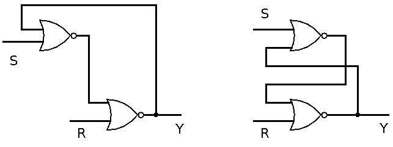

Die Darstellung des Flip-Flops kann auch mit Hilfe von NAND-Bausteinen erfolgen. Beachten Sie dabei die entsprechende Anpassung der Eingangsgrößen.

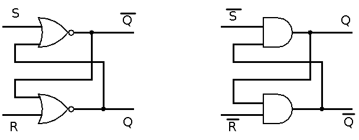

``` json @DigiSim.evalJson
{"devices":{"s":{"label":"S","type":"Button","propagation":0,"position":{"x":0,"y":0}},"r":{"label":"R","type":"Button","propagation":0,"position":{"x":0,"y":95}},"nots":{"label":"~S","type":"Button","propagation":0,"position":{"x":0,"y":180}},"notr":{"label":"~R","type":"Button","propagation":0,"position":{"x":0,"y":285}},"q1":{"label":"Q","type":"Lamp","propagation":0,"position":{"x":365,"y":85}},"notq1":{"label":"~Q","type":"Lamp","propagation":0,"position":{"x":370,"y":10}},"q2":{"label":"Q","type":"Lamp","propagation":0,"position":{"x":370,"y":205}},"notq2":{"label":"~Q","type":"Lamp","propagation":0,"position":{"x":365,"y":295}},"nor1":{"label":"nor","type":"Nor","propagation":0,"bits":1,"position":{"x":180,"y":80}},"nor2":{"label":"nor","type":"Nor","propagation":0,"bits":1,"position":{"x":175,"y":5}},"nand1":{"label":"nand","type":"Nand","propagation":0,"bits":1,"position":{"x":185,"y":185}},"nand2":{"label":"nand","type":"Nand","propagation":0,"bits":1,"position":{"x":185,"y":270}}},"connectors":[{"from":{"id":"s","port":"out"},"to":{"id":"nor2","port":"in1"}},{"from":{"id":"r","port":"out"},"to":{"id":"nor1","port":"in2"}},{"from":{"id":"nor2","port":"out"},"to":{"id":"notq1","port":"in"}},{"from":{"id":"nor1","port":"out"},"to":{"id":"q1","port":"in"}},{"from":{"id":"nor2","port":"out"},"to":{"id":"nor1","port":"in1"},"vertices":[{"x":255,"y":75}]},{"from":{"id":"nor1","port":"out"},"to":{"id":"nor2","port":"in2"},"vertices":[{"x":260,"y":55}]},{"from":{"id":"nots","port":"out"},"to":{"id":"nand1","port":"in1"}},{"from":{"id":"notr","port":"out"},"to":{"id":"nand2","port":"in2"}},{"from":{"id":"nand1","port":"out"},"to":{"id":"nand2","port":"in1"},"vertices":[{"x":265,"y":245}]},{"from":{"id":"nand2","port":"out"},"to":{"id":"nand1","port":"in2"},"vertices":[{"x":265,"y":260}]},{"from":{"id":"nand1","port":"out"},"to":{"id":"q2","port":"in"}},{"from":{"id":"nand2","port":"out"},"to":{"id":"notq2","port":"in"}}],"subcircuits":{}}
```

Diese Kombination wird in einem eigenen Symbol abstrahiert. Dabei wird unser Ausgang Y nun mit Q bezeichnet.

<!-- style="width: 15%; max-width: 500px" -->

### D-Latch

Der D-Latch macht sich die Tatsache zunutze, dass in den beiden aktiven Eingangskombinationen (01 und 10) eines gattergesteuerten SR-Latch R das Komplement von S ist.

<table>
<tr>
<td>
RS-Latch

<!-- data-type="none" -->
| $R(t)$ | $S(t)$ | $Y'(t) = Y(t+2\Delta t)$ |
| ------ | ------ | ------------------------ |
| 0      | 0      | $Y(t)$                   |
| 0      | 1      | 1                        |
| 1      | 0      | 0                        |
| 1      | 1      | nicht erlaubt            |
</td>
<td>
D-Latch

<!-- data-type="none" -->
| $E(t)$ | $D(t)$ | $Y'(t) = Y(t+2\Delta t)$ |
| ------ | ------ | ------------------------ |
| 0      | 0      | $Y(t)$                   |
| 0      | 1      | $Y(t)$                   |
| 1      | 0      | 0                        |
| 1      | 1      | 1                        |
</td>
</tr>
</table>

Die Eingangs-NAND-Stufe wandelt die beiden D-Eingangszustände (0 und 1) durch Invertieren des Dateneingangssignals in diese beiden Eingangskombinationen für den nächsten SR-Latch um.


<table>
<tr>
<td>
D-Latch auf der Basis eines NOR-RS-Gatters

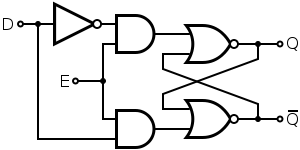<!-- style="max-width: 300px" -->
</td>
<td>
D-Latch auf der Basis eines NAND-RS-Gatters

<!-- style="max-width: 300px" -->
</td>
</tr>
</table>


``` json @DigiSim.evalJson
{"devices":{"d":{"label":"D","type":"Button","propagation":0,"position":{"x":-110,"y":110}},"e":{"label":"E","type":"Button","propagation":0,"position":{"x":-110,"y":210}},"q":{"label":"Q","type":"Lamp","propagation":0,"position":{"x":395,"y":130}},"notq":{"label":"~Q","type":"Lamp","propagation":0,"position":{"x":395,"y":230}},"nand1":{"label":"nand","type":"Nand","propagation":0,"bits":1,"position":{"x":235,"y":225}},"nand2":{"label":"nand","type":"Nand","propagation":0,"bits":1,"position":{"x":230,"y":125}},"nand3":{"label":"nand","type":"Nand","propagation":0,"bits":1,"position":{"x":55,"y":120}},"nand4":{"label":"nand","type":"Nand","propagation":0,"bits":1,"position":{"x":85,"y":215}}},"connectors":[{"from":{"id":"nand2","port":"out"},"to":{"id":"nand1","port":"in1"}},{"from":{"id":"nand1","port":"out"},"to":{"id":"nand2","port":"in2"}},{"from":{"id":"nand1","port":"out"},"to":{"id":"notq","port":"in"}},{"from":{"id":"nand2","port":"out"},"to":{"id":"q","port":"in"}},{"from":{"id":"e","port":"out"},"to":{"id":"nand4","port":"in2"}},{"from":{"id":"e","port":"out"},"to":{"id":"nand3","port":"in2"}},{"from":{"id":"d","port":"out"},"to":{"id":"nand3","port":"in1"}},{"from":{"id":"nand3","port":"out"},"to":{"id":"nand4","port":"in1"}},{"from":{"id":"nand3","port":"out"},"to":{"id":"nand2","port":"in1"}},{"from":{"id":"nand4","port":"out"},"to":{"id":"nand1","port":"in2"}}],"subcircuits":{}}
```

<!-- style="width: 15%; max-width: 500px" -->

> Das D-Latch kann auch als synchrones Flip-Flop verstanden werden. In diesem Fall würde `E` als Takt betrachtet werden.

## Anwendungsbeispiele

__Anwendungsbeispiel 1__

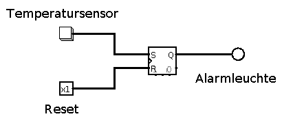

Der Temperatursensor hat einen digitalen Ausgang, der mit dem Überschreiten einen High-Pegel annimmt. Dieser wird in unserem Flip-Flop gespeichert `Q` bis der Zustand mit `R` wieder auf einen Low-Pegel geführt wird.

<!--
style="width: 80%; min-width: 420px; max-width: 720px;"
-->
```ascii
           ^
Temperatur |       +------+      +--+           +------+
S          |       |      |      |  |           |      |
           | ------+      +------+  +-----------+      +-----------------
           |                                               +------+
R          |                                               |      |
           | ----------------------------------------------+      +------
           |         +---------------------------------------+
Q          |         |                                       |
           | --------+                                       +-----------
           +-----------------------------------------------------------------> .
                                                                        Zeit
```

__Anwendungsbeispiel 2__

Ein Taster schaltet bei der Aktivierung nicht zu einem definierten Zeitpunkt sondern ist durch eine Übergangsphase gekennzeichnet.

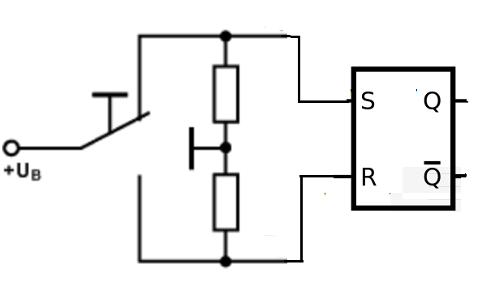<!-- style="width: 35%; max-width: 500px" -->

__Anwendungsbeispiel 3__

Wir wollen eine Schaltung entwerfen, die für einen Motor den abrupten Wechsel von einem Rechts- auf einen Links-Lauf vermeidet. Wie könnte dies umgesetzt werden?

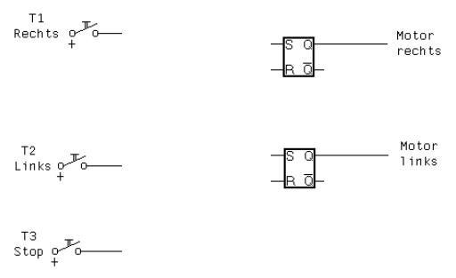<!-- style="width: 55%; max-width: 500px" -->

Der Motor soll nur aus einem Stop-Mode heraus in den Links-Lauf oder den Rechts-Lauf starten.

## Taktung von Schaltwerken

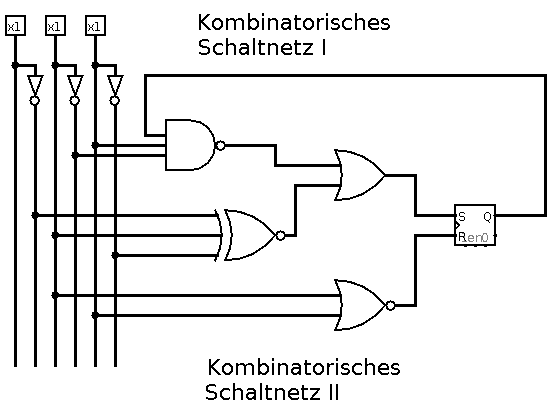

Wann sind die Werte am Ausgang Q gültig? Die Laufzeit der Schaltnetze bestimmt das Verhalten des Speicherelements!

> Zielstellung: Spezifische Zeiträume zur Übernahme von Eingabe und Ausgabewerten

__asynchrone Schaltwerke__

+ gesteuert durch Veränderung der Eingangssignale
+ Zeitpunkt, an dem wieder stabile Ausgangssignale vorliegen, ist nur durch Gatterlaufzeit festgelegt
+ aufwendiger Entwurf (Zeit ist „Echtzeit“)
+ sehr schnelle Schaltwerke möglich

__synchrone Schaltwerke__

+ gesteuert durch zentralen Takt
+ Übernahme der Änderung eines Eingangssignals erfolgt nur zu festen Zeiten (Zeiträumen oder Zeitpunkten)
+ einfacher, systematischer Entwurf (Zeit ist „Taktzeit“)
+ langsamste Komponente bestimmt maximale Taktfrequenz

### Synchrones SR-Latch

Für die Realisierung eines synchronisierten Zustandswechsels wird der Eingang unseres Flip-Flops um einen Takt `Clk` erweitert. Die Signale an R und S werden nur übernommen, wenn Taktsignal Clk aktiv ist:

+ bei Clk = 0 sind R und S irrelevant (d = „don't care“)
+ bei Clk = 1 stellt sich der neue Folgezustand Q ́ ein

<!-- data-type="none" -->
| $R(t)$                                | $S(t)$                                | $Clk(t)$ | $Q'(t)$       |
| ------------------------------------- | ------------------------------------- | -------- | ------------- |
| <span style="color: #ff0000">d</span> | <span style="color: #ff0000">d</span> | 0        | $Q$           |
| 0                                     | 0                                     | 1        | $Q$           |
| 0                                     | 1                                     | 1        | 1             |
| 1                                     | 0                                     | 1        | 0             |
| 1                                     | 1                                     | 1        | nicht erlaubt |

Beachten Sie, dass sich mit dem <span style="color: #ff0000">d</span> Zustand die Wertetabelle deutlich verkürzt.

<!--
style="width: 80%; min-width: 420px; max-width: 720px;"
-->
```ascii

    |       +------+      +------+      +------+      +------+
Clk |       |      |      |      |      |      |      |      |
    | ------+      +------+      +------+      +------+      +------
    |     +------+                        +--+    +--+
S   |     | :    |                        |  |    |  |
    | ----+ :    +------------------------+  +----+  +--------------
    |       :        +--+   +---+         :   +----+
R   |       :        |  |   |   |         :   |    |
    | ------:--------+  +---+   +---------:---+    +----------------
    |       :  +---------------+          :  +---+                    1
Q   |       :  |            :  |          :  |:  |
    |-------:--+            :  +----------:--+:  +------------------- 0
    +-------:--:------------:--:----------:--::--:-------------------->        .
             2t              2t            2t  2t
```


<table>
<tr>
<td>

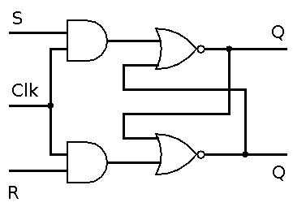
</td>
<td>

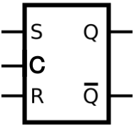<!-- style="width: 45%; max-width: 800px;" -->

</td>
</tr>
</table>


> Merke: Durch die Möglichkeit mehrerer Zustandsänderungen in einer Taktphase ist das zustandsgesteuerte RS Flip-Flop für viele Anwendungen ungeeignet.

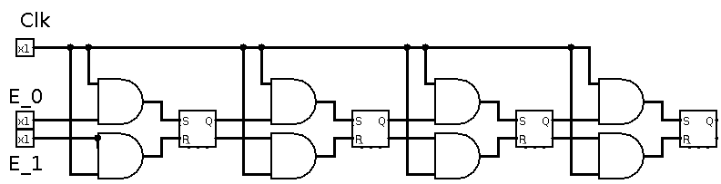<!-- style="width: 95%; max-width: 800px" -->

Gewünscht: Flip-Flop Variante, die Änderungen nur zu einem definierten Zeitpunkt zulässt

### Master-Slave Flip-Flops

Ein Master-Slave RS Flip-Flop besteht aus 2 hintereinander-geschalteten zustandsgesteuerten RS Flip-Flops (als „Master“ und als „Slave“ bezeichnet) zusätzlicher Inverter negiert Taktsignal für „Slave“.

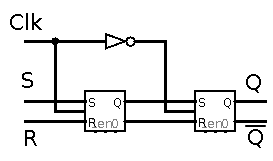

Ablauf einer Periode:

1. „Master“ übernimmt Eingangswerte bei Clk = 1 („Slave“ ändert sich nicht
2. „Slave“ übernimmt Werte vom „Master“ bei Clk = 0 („Master“ ändert sich nicht)

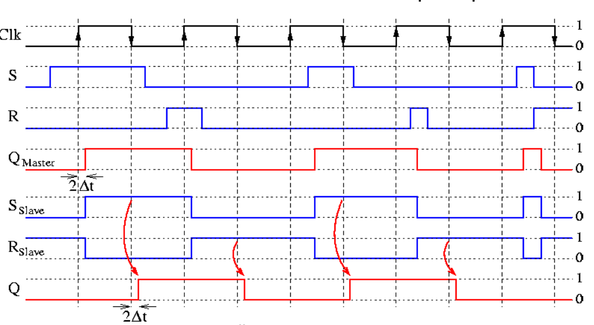<!-- style="width: 75%; max-width: 800px;" -->

> Frage: Welche maximale Verzögerung für ein eingehendes Signal ergibt sich also?

### Flankengesteuerte Flip-Flops

Durch eine spezielle Schaltungstechnik kann erreicht werden, dass auch die Eingangsleitungen nur

+ bei steigender Flanke (positive Flanke),
<!-- style="width: 20%; max-width: 300px;" -->

+ bei fallender Flanke (negative Flanke),
<!-- style="width: 20%; max-width: 300px;" -->

+ in beiden Fällen berücksichtigt werden!


Wie lässt sich ein Flankendetektor umsetzen? Wir machen uns das Laufzeitverhalten unserer Bauteile zu Nutze.

<table>
<tr>
<td>

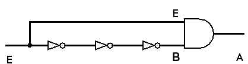<!-- style="width: 95%; max-width: 800px;" -->
</td>
<td>

<!--
style="width: 95%; max-width: 1000px;"
-->
```ascii
    ^
    |     +-------------- 1
E   |     |
    | ----+               0
    | -----+
    |      |
    |      +-------------
    |       +------------
    |       |
    | ------+
    |   -----+
B   |        |
    |        +-----------
    |
    |     +--+
A   |     |  |
    | ----+  +-------------
    +----------------------->    Zeit

```

</td>
</tr>
</table>

Die Signallaufzeiten sind für die ansteigende und fallende Signalflanke unterschiedlich und variieren mit den Schaltkreisfamilien (3 - 30ns)

Welches Verhalten ergibt sich für ein (positiv) flankengetriggertes RS-FlipFlop daraus?


<table>
<tr>
<td>
Zustandsgetrieben

<!--
style="width: 80%; min-width: 420px; max-width: 720px;"
-->
```ascii

    |       +------+      +------+      +------+      +-----
Clk |       |      |      |      |      |      |      |
    | ------+      +------+      +------+      +------+
    |     +------+                         +--+
S   |     | :    |                         |  |
    | ----+ :    +-------------------------+  +--------------
    |       :        +--+   +---+      +----+
R   |       :        |  |   |   |      |    |
    | ------:--------+  +---+   +------+    +----------------
    |       :  +---------------+                             1
Q   |       :  |            :  |
    |-------:--+            :  +---------------------------- 0
    +-------:--:------------:--:-------------------------------->          .
             2t              2t
```
</td>
<td>
Positiv Flankengetrieben

<!--
style="width: 80%; min-width: 420px; max-width: 720px;"
-->
```ascii

    |       +------+      +------+      +------+      +-----
Clk |       |      |      |      |      |      |      |
    | ------+      +------+      +------+      +------+
    |     +------+                      :  +--+
S   |     | :    |                      :  |  |
    | ----+ :    +----------------------:--+  +--------------
    |       :        +--+   +---+      +----+
R   |       :        |  |   |   |      |:   |
    | ------:--------+  +---+   +------+:   +----------------
    |       :  +---------------------------+                    1
Q   |       :  |                        :  |
    |-------:--+                        :  +------------------- 0
    +-------:--:------------------------:--:-------------------->          .
             2t                          2t
```
</td>
</tr>
</table>

### Weitere Flip-Flop Konfigurationen

**JK Flip-Flop**

JK-Flipflops wurden wahrscheinlich nach Jack Kilby benannt. Sie basieren auf dem asynchronen RS-Flipflop, sind aber flankengesteuert oder als Master-Slave-Flipflop ausgeführt. Mit dem Taktsignal und der Eingangsbelegung J = 1 und K = 0 wird am Ausgang eine 1 erzeugt und gespeichert, alternativ bei K = 1 und J = 0 eine 0. Der Zustand J = K = 1 ist erlaubt; in diesem Fall wechselt der Ausgangspegel mit jeder wirksamen Flanke des Taktsignals. Dieses Verhalten lässt die Bezeichnung als Toggle-Flipflop zu.

<!-- data-type="none" -->
| $J(t)$                                | $K(t)$                                | $Q'(t)$ bei Flankenwechsel       |
| ------------------------------------- | ------------------------------------- | ------------- |
| 0                                     | 0                                     | $Q$           |
| 0                                     | 1                                     | 0             |
| 1                                     | 0                                     | 1             |
| 1                                     | 1                                     | <span style="color: #ff0000">$\overline{Q}$</span>  |

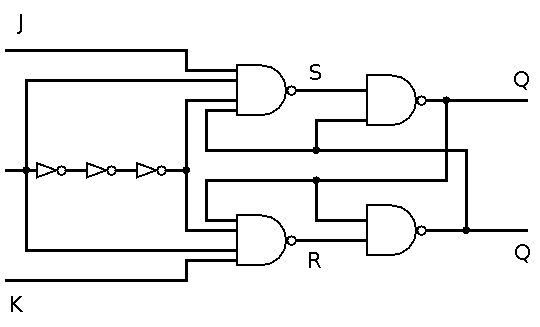<!-- style="width: 75%; max-width: 800px;" -->

<!--
style="width: 100%; min-width: 420px; max-width: 720px;"
-->
```ascii

    |       +------+      +------+      +------+      +-----
Clk |       |      |      |      |      |      |      |
    | ------+      +------+      +------+      +------+
    |     +------+        :            +----------------+
J   |     | :    |        :            |:             : |
    | ----+ :    +---------------------+:             : +---
    |       :        +------+   +---------+         +-----+
K   |       :        |    : |   |       : |         | :   |
    | ------:--------+    : +---+       : +---------+ :   +--
    |       :  +-------------+          :  +-------------+     1
Q   |       :  |          :  |          :  |          :  |
    |-------:--+          :  +-------------+          :  +---- 0
    +-------:--:------------------------:--:----------:--:------>          .
             2t                          2t
```

**T Flip-Flop**

Das synchrone T-Flipflop besitzt neben dem Clk-Takteingang einen T-Eingang. T steht dabei für toggle – hin- und herschalten. Es zeigt ein Wechselverhalten synchron zur aktiven Flanke immer dann und nur dann, wenn T = 1 ist. Er kann aus einem flankengesteuerten JK-Flipflop gebildet werden, indem J- und K-Eingang verbunden werden und gemeinsam als T-Eingang fungieren.

<!-- style="width: 20%; max-width: 800px;" -->

| $T(t)$ | $Q'(t)$ bei Flankenwechsel |
| ------ | -------------------------- |
| 0      | $Q$                        |
| 1      | $\overline{Q}$             |


### Anwendungen

**Asynchroner 3-Bit Zähler / Frequenzteiler**

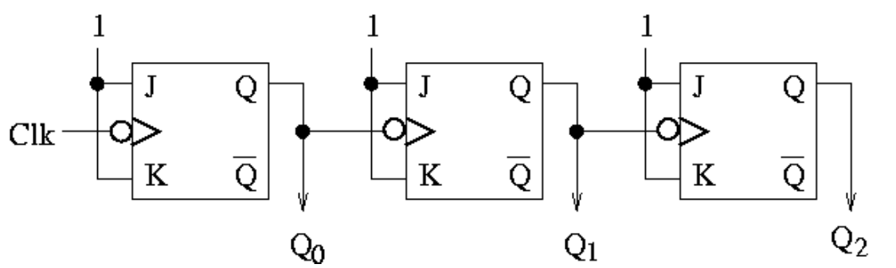<!-- style="width: 80%; max-width: 800px;" -->

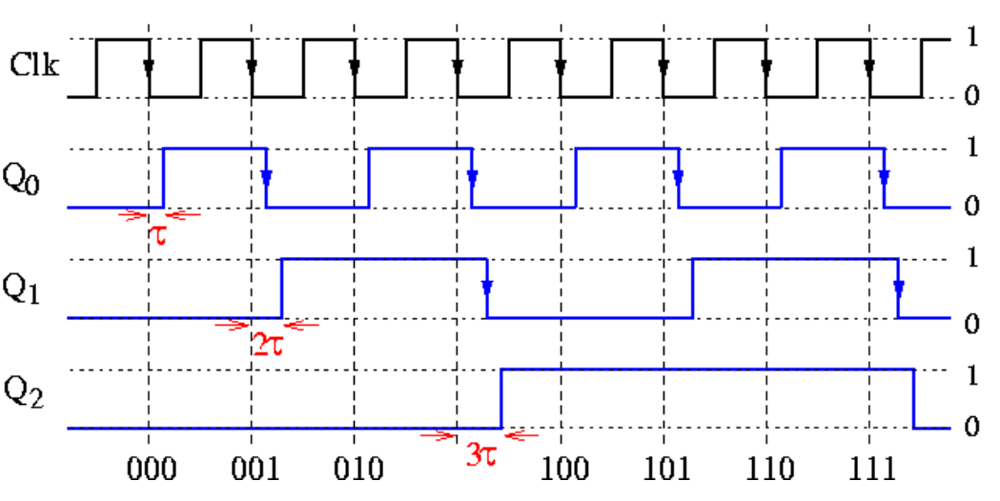<!-- style="width: 80%; max-width: 1200px;" -->

> Beachten Sie die Verzögerung der flanken-getriggerten JK-Flipflops - diese bestimmt die maximale Taktfrequenz


**4 Bit-Speicher Array**

DM74LS194A 4-Bit Bidirectional Universal Shift Register

http://www.datasheet-pdf.com/PDF/DM74LS194A-Datasheet-FairchildSemiconductor-518503


### Zusammenfassung

| Parameter                     | Latch                        | Flip-Flop                                    |
| ----------------------------- | ---------------------------- | -------------------------------------------- |
| Eingangssignal                | `Enable`                     | `Clock`                                      |
| Trigger                       | Pegelgetrieben               | Flankengesteuert                             |
| Reaktionszeit `R`             | kleiner oder gleich dem Takt | entspricht Implementierung der Periodendauer |
| Komplexität                   | einfach                      | aufwändigere Flankenerkennung                |
| Robustheit gegenüber Rauschen | kann Probleme generieren     |                                              |
| Anwendungen                   | Speichern einzelner Bytes    | Register, Counter, Frequenzteiler Register   |

## Einsatzbeispiel

Konfiguration eines einzelnen IO Pins eines AVR Mikrocontrollers mit Hilfe von 4 Flip-Flops.

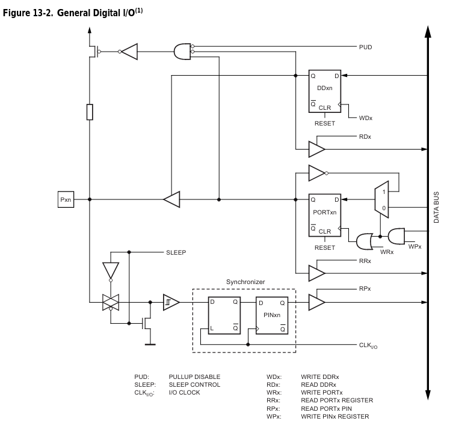

## Realisierungsbeispiel

Schaltung basierend auf 74HC00 IC (4x NAND)

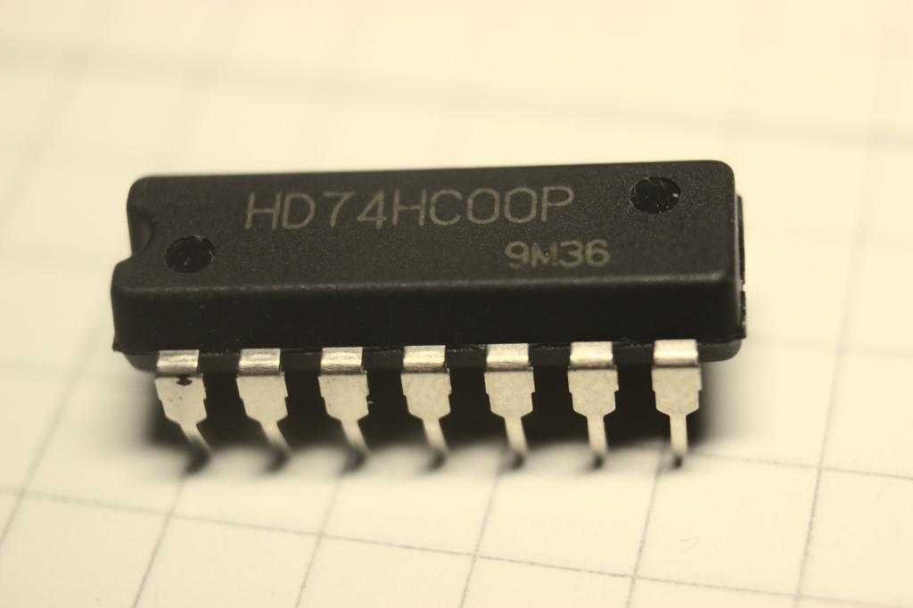<!-- style="width: 40%; max-width: 800px;" -->

Schaltung planen:

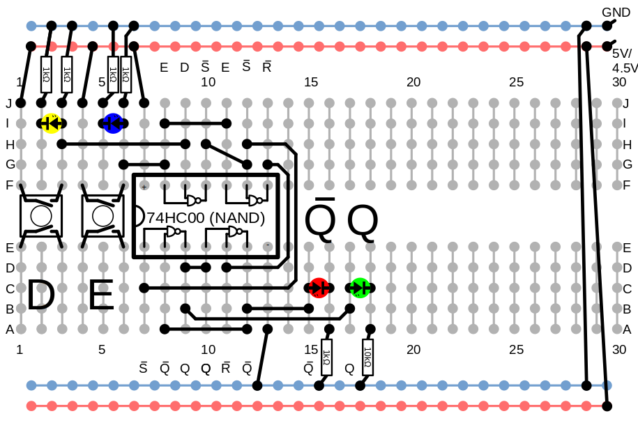

Aufbauen:

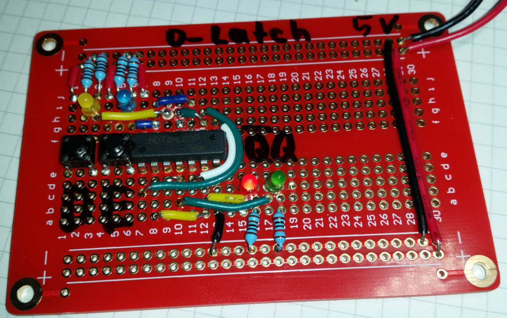<!-- style="width: 40%; max-width: 800px;" -->

## Übungsaufgaben

+ Weisen Sie nach, dass der zweite Ausgang P am RS-Flip-Flop den invertierten Wert von Q realisiert.
+ Experimentieren Sie mit der Elektroniksimulation TinkerCAD und einem vorgefertigen Beispiel für ein SR Flip-Flop [Link](https://www.tinkercad.com/things/2u00e0a3qoq-sr-flip-flop-using-nand-gate)
