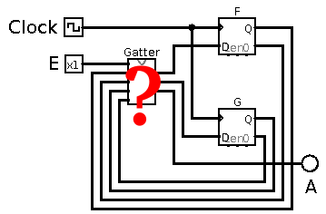
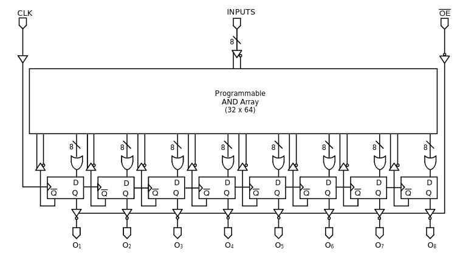
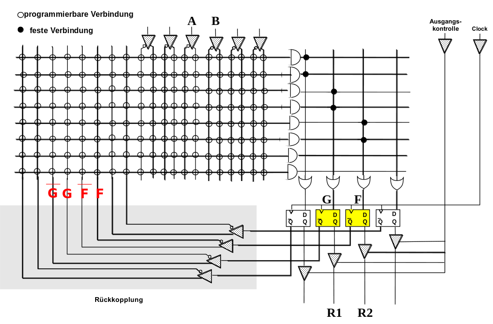
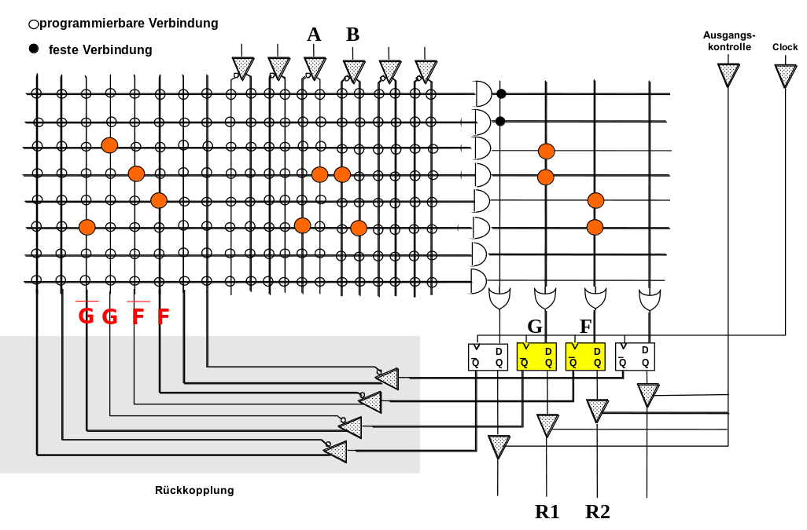

<!--

author:   Sebastian Zug & André Dietrich & Fabian Bär
email:    sebastian.zug@informatik.tu-freiberg.de & andre.dietrich@informatik.tu-freiberg.de & fabian.baer@student.tu-freiberg.de
version:  0.0.7
language: de
narrator: Deutsch Female

import: https://raw.githubusercontent.com/LiaTemplates/DigiSim/master/README.md
        https://raw.githubusercontent.com/liascript-templates/plantUML/master/README.md

mark: <span style="background-color: @0;
                           display: flex;
                           width: calc(100% + 32px);
                           margin: -16px;
                           padding: 6px 16px 6px 16px;
                           ">@1</span>

red:  @mark(#FF888888,@0)
blue: @mark(lightblue,@0)
gray: @mark(gray,@0)
-->

[](https://liascript.github.io/course/?https://raw.githubusercontent.com/TUBAF-IfI-LiaScript/VL_EingebetteteSysteme/master/07_Schaltwerke.md#1)

# Schaltwerke

| Parameter            | Kursinformationen                                                                                                                                                                          |
|----------------------|--------------------------------------------------------------------------------------------------------------------------------------------------------------------------------------------|
| **Veranstaltung:**   | `Digitale Systeme / Eingebettete Systeme`                                                                                                                                                  |
| **Semester**         | `Wintersemester 2022/23`                                                                                                                                                                   |
| **Hochschule:**      | `Technische Universität Freiberg`                                                                                                                                                          |
| **Inhalte:**         | `Konzepte und Methodik bei der Erstellung von Schaltwerken`                                                                                                                                |
| **Link auf GitHub:** | [https://github.com/TUBAF-IfI-LiaScript/VL_Softwareentwicklung/blob/master/07_Schaltwerke.md](https://github.com/TUBAF-IfI-LiaScript/VL_EingebetteteSysteme/blob/master/07_Schaltwerke.md) |
| **Autoren**          | @author                                                                                                                                                                                    |


---------------------------------------------------------------------

** Fragen an die Veranstaltung**

+ Welche Kernelemente hat ein Schaltwerk?
+ Worin unterscheiden sich die Varianten von Mealy und Moore?
+ Welches Vorgehen ist für die Umsetzung eines Schaltwerkes notwendig?
+ An welcher Stelle ist die invertierte Wahrheitstabelle eines Flip-Flops wichtig?

--------------------------------------------------------------------

<!--
style="width: 80%; min-width: 420px; max-width: 720px;"
-->
```ascii

                Abstraktionsebenen

           +----------------------------+ -.
  Ebene 6  | Problemorientierte Sprache |  |
           +----------------------------+  |
                                           ⎬ Anwendungssoftware
           +----------------------------+  |
  Ebene 5  | Assemblersprache           |  |
           +----------------------------+ -.

           +----------------------------+
  Ebene 4  | Betriebssystem             |     Systemsoftware
           +----------------------------+

           +----------------------------+
  Ebene 3  | Instruktionsset            |     Maschinensprache
           +----------------------------+

           +----------------------------+  -.
  Ebene 2  | Mikroarchitektur           |   |
           +----------------------------+   |
                                            ⎬ Automaten, Speicher, Logik
           +----------------------------+   |       ╔═══════════════╗
  Ebene 1  | Digitale Logik             |   |    ◀══║ HIER SIND WIR!║
           +----------------------------+  -.       ╚═══════════════╝

           +----------------------------+
  Ebene 0  | E-Technik, Physik          |     Analoge Phänomene
           +----------------------------+                                      .
```

---------------------------------------------------------------------


## Motivation

**In der kombinatorischen Logik:**

+ werden Gatter als verzögerungsfrei angenommen (Idealisierung, die oft zu Problemen führt !)
+ sind keine Rückkopplungen gestattet
+ werden Schaltungen als Schaltnetze bezeichnet
+ können Schaltungen als gerichteter azyklischer Graph dargestellt werden

<!--
style="width: 80%; min-width: 420px; max-width: 720px;"
-->
```ascii

Eingaben       +------------------+
  ------------>| Schaltnetz       |            Ausgaben
  ------------>|                  |------------>
  ------------>| kombinatorische  |------------>
  ------------>| Logik            |
               +------------------+                                            .
```


**In der sequentiellen Logik:**

+ sind Rückkopplungen gestattet
+ werden Schaltungen werden Schaltwerke bezeichnet
+ können Schaltungen als gerichteter zyklischer Graph dargestellt werden

<!--
style="width: 80%; min-width: 420px; max-width: 720px;"
-->
```ascii

Eingaben       +------------------+           Ausgaben
  ------------>| Schaltnetz       |------------>
  ------------>|                  |------------>
  ------------>| kombinatorische  |------+
          +--->| Logik            |----+ |
          |    +------------------+    | |
          |                            | |
          |    +------------------+    | |
          +----| Zustandsspeicher |<---+ |
               |                  |<-----+
               +------------------+                                        .
```

> Und wo brauche ich sequentielle Logik? Die Abarbeitung von Befehlen im Rechner basiert darauf. In diesem Fall wird über die Eingabesteuerleitungen ein Befehl codiert und der Zustandspeicher beinhaltet den erreichten Realisierungsschritt. **Damit wird jeder Rechner zu einem Schaltwerk!**


### Wiederholung: Beschreibung von Flip-Flops

                          {{0-1}}
*******************************************************************************

__Wahrheitstafel__ zeigt die Eingaben, die notwendig sind, um eine bestimmte Zustandsänderung herbeizuführen.

<!-- data-type="none" style="table-layout: fixed; max-width:580px;"-->
| $R(t)$ | $S(t)$ | $Q(t+1)$  |
|--------|--------|-----------|
| 0      | 0      | $Q$       |
| 0      | 1      | 1         |
| 1      | 0      | 0         |
| 1      | 1      | Vermeiden |

__Invertierte Wahrheitstafel__ zeigt die Eingaben, die notwendig sind, um eine bestimmte Zustandsänderung herbeizuführen.

<!-- data-type="none" style="table-layout: fixed; max-width:620px;"-->
| $Q(t)$ | $Q(t+1)$ | $S$ | $R$ |
|--------|----------|-----|-----|
| 0      | 0        | 0   | d   |
| 0      | 1        | 1   | 0   |
| 1      | 0        | 0   | 1   |
| 1      | 1        | d   | 0   |

> **Merke:** Die invertierte Wahrheitstafel beantwortet die Frage, wie die Eingänge beschaltet werden müssen, um einen bestimmten Zustand zu realisieren.

*******************************************************************************


                                {{1-3}}
*******************************************************************************

> **Aufgabe:** Stellen Sie die invertierten Wahrheitstafeln für ein D-Flip-Flop auf!


__D-Wahrheitstafel__

<!-- data-type="none" style="table-layout: fixed; max-width:480px;"-->
| $D(t)$ | $Q(t+1)$ | Modus   |
|--------|----------|---------|
| 0      | $0$      | Löschen |
| 1      | $1$      | Setzen  |

__D-Invertierte Wahrheitstafel__


*******************************************************************************

{{1-2}}
<!-- data-type="none" style="table-layout: fixed; max-width:460px;"-->
| $Q(t)$ | $Q(t+1)$ | $D$ |
|--------|----------|-----|
| $0$    | $0$      |     |
| $0$    | $1$      |     |
| $1$    | $0$      |     |
| $1$    | $1$      |     |


{{2-3}}
<!-- data-type="none" style="table-layout: fixed; max-width:460px;"-->
| $Q(t)$ | $Q(t+1)$ | $D$ |
|--------|----------|-----|
| $0$    | $0$      | $0$ |
| $0$    | $1$      | $1$ |
| $1$    | $0$      | $0$ |
| $1$    | $1$      | $1$ |

                      {{3-5}}
*******************************************************************************

> **Aufgabe:** ... und noch mal!

__JK-Wahrheitstafel__

<!-- data-type="none" style="table-layout: fixed; max-width:760px;"-->
| $J(t)$ | $K(t)$ | $Q(t+1)$       | Modus       |
|--------|--------|----------------|-------------|
| 0      | 0      | $Q$            | Beibehalten |
| 0      | 1      | $0$            | Löschen     |
| 1      | 0      | $1$            | Setzen      |
| 1      | 1      | $\overline{Q}$ | Toggeln     |


__JK-Invertierte Wahrheitstafel__

*******************************************************************************

{{3-4}}
<!-- data-type="none" style="table-layout: fixed; max-width:640px;"-->
| $Q(t)$ | $Q(t+1)$ | $J$ | $K$ |
|--------|----------|-----|-----|
| $0$    | $0$      |     |     |
| $0$    | $1$      |     |     |
| $1$    | $0$      |     |     |
| $1$    | $1$      |     |     |

{{4}}
<!-- data-type="none" style="table-layout: fixed; max-width:640px;"-->
| $Q(t)$ | $Q(t+1)$ | $J$ | $K$ |
|--------|----------|-----|-----|
| 0      | 0        | 0   | $d$ |
| 0      | 1        | 1   | $d$ |
| 1      | 0        | $d$ | $1$ |
| 1      | 1        | $d$ | $0$ |


### Grundkonzept

                             {{0-1}}
*******************************************************************************

Wie kann man systematisch ein synchrones Schaltwerk ausgehend von
der Problembeschreibung entwerfen ?

Automat ist gekennzeichnet durch:

+ beliebige (jedoch endliche) Menge von Zuständen
+ Zustandsübergänge in jedem Takt abhängig von Eingangssignalen
+ Ausgangssignale werden durch ein Schaltnetz generiert

Mathematisch kann ein Deterministischer Endlicher Automat als Tupel $A = (Q, \Sigma, \delta, q_0, F)$

+ Q ist eine endliche Zustandsmenge.
+ $\Sigma$ ist das endliche Eingabealphabet, also die Menge erlaubter Eingabesymbole.
+ $\delta : Q \times \Sigma \rightarrow Q$ ist die Übergangsfunktion (oder Transitionsfunktion). Sie ordnet jedem Paar bestehend aus einem Zustand $q\in Q$ und einem Eingabesymbol $a\in \Sigma$ einen Nachfolgezustand $p\in Q$ zu.
+ $q\in Q$ ist der Startzustand (auch Anfangszustand oder Initalzustand).
+ $F\subseteq Q$ ist die Menge der akzeptierenden Zustände, die sogenannten Finalzustände (oder Endzustände).


*******************************************************************************

                          {{1-2}}
*******************************************************************************

>Beispiel I:  __Zustand einer Tür__

Darstellung als Graph


Darstellung in einer Übergangstabelle

|                     | "Öffnen"            | "Schließen"               |
|---------------------|---------------------|---------------------------|
| Zustand offen       | offen (unverändert) | geschlossen               |
| Zustand geschlossen | offen               | geschlossen (unverändert) |


*******************************************************************************

                          {{2-5}}
*******************************************************************************


> Beispiel II:  __Codeschloss für die Erfassung der Sequenzfolge `7022`__


Welche Beschränkungen sehen Sie in diesem Entwurf? 

*******************************************************************************

{{3}}
Was passiert bei der Sequenzfolge `707022`?

{{4}}
> **Wie realisieren wir nun aber das theoretische Modell des endlichen Automaten mit realen Bauteilen?**

### Beispiel

Binärsequenzdetektor der drei aufeinander folgende `1` erkennt. Dabei gehen wir davon aus, dass die Übernahme der Werte mit den steigenden Flanken des Taktsignales erfolgt.

<!--
style="width: 80%; min-width: 420px; max-width: 720px;"
-->
```ascii
      |   +---+   +---+   +---+   +---+   +---+   +---+   +---+   +---+   +---+
Takt  |   |   |   |   |   |   |   |   |   |   |   |   |   |   |   |   |   |   |
      |---+   +---+   +---+   +---+   +---+   +---+   +---+   +---+   +---+   +
      |
      | +------+        +------+        +-------------------------------+
E     | | 1    | 0      | 1    |  0     | 1       1       1       1     | 0
      |-+      +--------+      +--------+                               +-------
      |
      |                                                 +---------------+
Y     |                                                 | 1       1     | 0
      |-------------------------------------------------+               +-------
      +-------------------------------------------------------------------------->
```


```text @plantUML.png
@startuml
digraph finite_state_machine {
    rankdir=LR;

    node [shape = point ]; qi
    node[shape=circle]
    A[label="A \n Y=0"];
    B[label="B \n Y=0"];
    C[label="C \n Y=0"];
    D[label="D \n Y=1"];

    qi -> A;
    A  -> A  [ label = "E=0" ];
    A  -> B  [ label = "E=1" ];
    B  -> A  [ label = "E=0" ];
    B  -> C  [ label = "E=1" ];
    C  -> A  [ label = "E=0" ];
    C  -> D  [ label = "E=1", fontcolor=blue ];
    D  -> D  [ label = "E=1", fontcolor=blue ];
    D  -> A  [ label = "E=0" ];
}
@enduml
```

- Zustand `A`: die letzte Eingabe war keine `1` (`0` oder Start)
- Zustand `B`: die letzte Eingabe war `1`, die davor war nicht `1`
- Zustand `C`: die letzten beiden Eingaben waren `1`, die davor war nicht `1`
- Zustand `D`: mindestens die letzten drei Eingaben waren `1`


Zustandsübergänge

<!-- data-type="none" style="table-layout: fixed; max-width:560px;"-->
| aktueller Zustand | Eingabe E | neuer Zustand |
|-------------------|-----------|---------------|
| A                 | 0         | A             |
| B                 | 0         | A             |
| C                 | 0         | A             |
| D                 | 0         | A             |
| A                 | 1         | B             |
| B                 | 1         | C             |
| C                 | 1         | D             |
| D                 | 1         | D             |


Kodierung

Für unsere digitalen Bauteile müssen wir diese Zustände aber mit `1` und `0` kodieren.

<!-- data-type="none" style="table-layout: fixed; max-width:799px;"-->
| Zustände | Flip-Flops | Mögliche Zustände | Ungenutzte Zustände |
|----------|------------|-------------------|---------------------|
| 1        | -          | -                 | -                   |
| 2        | 1          | 2                 | 0                   |
| 3        | 2          | 4                 | 1                   |
| 4        | 2          | 4                 | 0                   |
| 5        | 3          | 8                 | 3                   |
| ...      |            |                   |                     |
| 8        | 3          | 8                 | 0                   |
| 9        | 4          | 16                | 7                   |
| ...      |            |                   |                     |

Da wir insgesamt 4 Zustände haben braucht es $\lceil log_2(4)\rceil = 2$ Speicherelemente, also Flip-Flops.
Die zwei Flip-Flops werden im folgenden als `F` und `G` bezeichnet. Die Ausgabe bezeichnen wir mit `X`.

Mit unserem Schaltwerk wollen wir also eine Funktion abbilden, die die Ausgabe `X` in Abhängigkeit von (historischen) `E` Eingaben generiert. Um letztgenannten Anteil zu integrieren, braucht es die Zustände die in `F` und `G` erfasst sind.

<!-- data-type="none" style="table-layout: fixed; max-width:420px;"-->
| Zustand | Flip-Flop F | Flip-Flop G |
|---------|-------------|-------------|
| A       | 0           | 0           |
| B       | 0           | 1           |
| C       | 1           | 0           |
| D       | 1           | 1           |

Damit ergibt sich dann eine neue Zustandstabelle

<!-- data-type="none" style="table-layout: fixed; max-width:820px;"-->
| Zustand | F | G | E | Zustand' | F' | G' |
|---------|---|---|---|----------|----|----|
| A       | 0 | 0 | 0 | A        | 0  | 0  |
| B       | 0 | 1 | 0 | A        | 0  | 0  |
| C       | 1 | 0 | 0 | A        | 0  | 0  |
| D       | 1 | 1 | 0 | A        | 0  | 0  |
| A       | 0 | 0 | 1 | B        | 0  | 1  |
| B       | 0 | 1 | 1 | C        | 1  | 0  |
| C       | 1 | 0 | 1 | D        | 1  | 1  |
| D       | 1 | 1 | 1 | D        | 1  | 1  |

Realisierung der Schaltfunktion



Um die entsprechende Schaltfunktionen für die Änderung der Zustände und die Ausgabe aufzustellen, brauchen wir die invertierte Wahrheitstafel des intendierten Flip-Flops.

> __Merke:__  Unterschiedliche Flip-Flops für die Speicherung der Zustände führen zu  unterschiedlichen Beschaltungen!

Zustandstabelle

<!-- data-type="none" style="table-layout: fixed; max-width:380px;"-->
| F | G | E | F'                                    | G'                                    |
|---|---|---|---------------------------------------|---------------------------------------|
| 0 | 0 | 0 | 0                                     | 0                                     |
| 0 | 1 | 0 | 0                                     | 0                                     |
| 1 | 0 | 0 | 0                                     | 0                                     |
| 1 | 1 | 0 | 0                                     | 0                                     |
| 0 | 0 | 1 | 0                                     | <span style="color: #ff0000">1</span> |
| 0 | 1 | 1 | <span style="color: #ff0000">1</span> | 0                                     |
| 1 | 0 | 1 | <span style="color: #ff0000">1</span> | <span style="color: #ff0000">1</span> |
| 1 | 1 | 1 | <span style="color: #ff0000">1</span> | <span style="color: #ff0000">1</span> |


Ausgaben

<!-- data-type="none" style="table-layout: fixed; max-width:320px;"-->
| F | G | A                                     |
|---|---|---------------------------------------|
| 0 | 0 | 0                                     |
| 0 | 1 | 0                                     |
| 1 | 0 | 0                                     |
| 1 | 1 | <span style="color: #ff0000">1</span> |


$$
\begin{aligned}
F` &= \overline{F}GE + F\overline{G}E + FGE  \\
   &= GE + FE \\
G` &= \overline{F}\overline{G}E + F\overline{G}E + FGE  \\
   &= \overline{G}E + FE \\
A  &= FG
\end{aligned}
$$

Bitte mit Eingabe 0 starten, um Startzustand korrekt zu setzen!

```json @DigiSim.evalJson
{"devices":{"e":{"label":"E","type":"Button","propagation":0,"position":{"x":-160,"y":10}},"clk":{"label":"Clk","type":"Button","propagation":0,"position":{"x":-160,"y":-50}},"not":{"label":"~G","type":"Not","propagation":0,"bits":1,"position":{"x":-135,"y":110}},"and1":{"label":"FE","type":"And","propagation":0,"bits":1,"position":{"x":30,"y":190}},"and2":{"label":"GE","type":"And","propagation":0,"bits":1,"position":{"x":10,"y":20}},"and3":{"label":"(~G)E","type":"And","propagation":0,"bits":1,"position":{"x":20,"y":100}},"and4":{"label":"FG","type":"And","propagation":0,"bits":1,"position":{"x":245,"y":175}},"or1":{"label":"GE + FE","type":"Or","propagation":0,"bits":1,"position":{"x":165,"y":15}},"or2":{"label":"(~G)E + FE","type":"Or","propagation":0,"bits":1,"position":{"x":175,"y":90}},"fff":{"label":"F FlipFlop","type":"Dff","propagation":0,"polarity":{"clock":true},"bits":1,"initial":"x","position":{"x":335,"y":30}},"ffg":{"label":"G FlipFlop","type":"Dff","propagation":0,"polarity":{"clock":true},"bits":1,"initial":"x","position":{"x":340,"y":95}},"a":{"label":"A","type":"Lamp","propagation":0,"position":{"x":395,"y":180}}},"connectors":[{"from":{"id":"or1","port":"out"},"to":{"id":"fff","port":"in"}},{"from":{"id":"or2","port":"out"},"to":{"id":"ffg","port":"in"}},{"from":{"id":"not","port":"out"},"to":{"id":"and3","port":"in2"}},{"from":{"id":"e","port":"out"},"to":{"id":"and2","port":"in1"}},{"from":{"id":"e","port":"out"},"to":{"id":"and3","port":"in1"}},{"from":{"id":"and2","port":"out"},"to":{"id":"or1","port":"in1"}},{"from":{"id":"and3","port":"out"},"to":{"id":"or2","port":"in1"}},{"from":{"id":"and1","port":"out"},"to":{"id":"or2","port":"in2"}},{"from":{"id":"and1","port":"out"},"to":{"id":"or1","port":"in2"}},{"from":{"id":"e","port":"out"},"to":{"id":"and1","port":"in1"}},{"from":{"id":"ffg","port":"out"},"to":{"id":"not","port":"in"},"vertices":[{"x":410.95,"y":240},{"x":325,"y":240}]},{"from":{"id":"ffg","port":"out"},"to":{"id":"and2","port":"in2"},"vertices":[{"x":440,"y":210},{"x":405,"y":240},{"x":-90,"y":195},{"x":-145,"y":140},{"x":-120,"y":85}]},{"from":{"id":"fff","port":"out"},"to":{"id":"and1","port":"in2"},"vertices":[{"x":460,"y":255}]},{"from":{"id":"clk","port":"out"},"to":{"id":"fff","port":"clk"},"vertices":[{"x":270,"y":-35}]},{"from":{"id":"clk","port":"out"},"to":{"id":"ffg","port":"clk"},"vertices":[{"x":275,"y":-35}]},{"from":{"id":"and4","port":"out"},"to":{"id":"a","port":"in"}},{"from":{"id":"fff","port":"out"},"to":{"id":"and4","port":"in1"},"vertices":[{"x":460,"y":165}]},{"from":{"id":"ffg","port":"out"},"to":{"id":"and4","port":"in2"},"vertices":[{"x":390,"y":240},{"x":225,"y":240}]}],"subcircuits":{}}
```

## Vorgehensweise

1. Schritt: Spezifikation des Zustandsdiagramms
2. Schritt: Transformation in eine Zustandstabelle
3. Schritt: Zuordnung von Zuständen zu Flip-Flop Belegungen
4. Schritt: Erstellung der Wahrheitstafel für Zustände und Ausgaben
5. Schritt: Ableitung einer KNF oder DNF
6. Schritt: Minimierung

### Automaten Typen

**Moore-Automat**

Edward Forrest Moore (1925 – 2003, Bell Labs)

<!--
style="width: 80%; min-width: 420px; max-width: 720px;"
-->
```ascii
  +------------------------------------------+
  |   +--------------+     +--------------+  |   +--------------+
  +-->|              |     |              |  |   |              |   Y
      | Eingabelogik |---->| Speicher     |--+-->| Ausgabelogik |---->
----->| (Schaltnetz) |     | (Flip-Flops) |      | (Schaltnetz) |
 E    +--------------+     +--------------+      +--------------+
                                                                               .
```

```text @plantUML.png
@startuml
digraph finite_state_machine {
    rankdir=LR;

    node [shape = point ]; qi
    node[shape=circle]
    A[label="A, 0"];
    B[label="B, 0"];
    C[label="C, 0"];
    D[label="D, 1"];

    qi -> A;
    A  -> A  [ label = "E=0" ];
    A  -> B  [ label = "E=1" ];
    B  -> A  [ label = "E=0" ];
    B  -> C  [ label = "E=1" ];
    C  -> A  [ label = "E=0" ];
    C  -> D  [ label = "E=1"];
    D  -> D  [ label = "E=1"];
    D  -> A  [ label = "E=0" ];
}
@enduml
```

> **Die Ausgabelogik bestimmt Ausgabe Y hängt nur vom aktuellen Zustand ab.**

**Mealy-Automat**

George H. Mealy (1927 – 2010, IBM)

<!--
style="width: 80%; min-width: 420px; max-width: 720px;"
-->
```ascii
  +------------------------------------------+
  |   +--------------+     +--------------+  |
  +-->|              |     |              |  |   +--------------+
      | Eingabelogik |---->| Speicher     |--+-->|              |    Y
---+->| (Schaltnetz) |     | (Flip-Flops) |      | Ausgabelogik |---->
 E |  +--------------+     +--------------+      | (Schaltnetz) |
   +-------------------------------------------->|              |
                                                 +--------------+

                                                                               .
```

```text @plantUML.png
@startuml
digraph finite_state_machine {
    rankdir=LR;

    node [shape = point ]; qi
    node [shape = point ]; qi1
    node[shape=circle]
    A[label="A"];
    B[label="B"];
    C[label="C"];
    D[label="D"];

    qi -> A;
    A  -> A  [ label = "E=0 \n A=0" ];
    A  -> B  [ label = "E=1 \n A=0" ];
    B  -> A  [ label = "E=0 \n A=0" ];
    B  -> C  [ label = "E=1 \n A=0" ];
    C  -> A  [ label = "E=0 \n A=0", fontcolor=green];
    C  -> D  [ label = "E=1 \n A=1", fontcolor=blue ];
    D  -> D  [ label = "E=1 \n A=1", fontcolor=blue ];
    D  -> A  [ label = "E=0 \n A=0", fontcolor=green];
}
@enduml
```

>**Die Ausgabe Y hängt jedoch die Ausgabelogik vom aktuellen Zustand und vom Eingabesignal E ab**


Der Mealy-Automat ist die generellere Form. Der Moore-Automat unterbindet den Einfluss des Einganges. Eine weitere Spezialisierung ist der sogenannte Medwedew-Automat, bei dem ganz auf die Ausgabelogik verzichtet wird.

|          | Mealy-Automat                                                                                                                                     | Moore-Automat                                                                                           |
|----------|---------------------------------------------------------------------------------------------------------------------------------------------------|---------------------------------------------------------------------------------------------------------|
| Vorteile | schnellere Reaktion auf Veränderung der Eingabesignale E                                                                                          | taktsynchrone Ausgabe A, asynchron auftretende Störungen der Eingabesignale wirken sich nicht auf A aus |
|          | Realisierung ist mit einer kleineren Anzahl an Zuständen möglich, wenn mehrere Zustandsübergänge zu einem Zustand verschiedene Ausgaben erfordern | geringerer Schaltungsaufwand für Ausgabelogik, wenn Ausgabe A eigentlich nur vom Zustand abhängt        |

Noch mal zurück zum Beispiel des Binärsequenzdetektors. Welche Konsequenzen hätte die Umsetzung als Mealy-Automat?

```text @plantUML.png
@startuml
digraph finite_state_machine {
    rankdir=LR;

    node [shape = point ]; qi
    node [shape = point ]; qi1
    node[shape=circle]
    A[label="A"];
    B[label="B"];
    C[label="C"];
    D[label="D"];

    qi -> A;
    A  -> A  [ label = "E=0 \n A=0" ];
    A  -> B  [ label = "E=1 \n A=0" ];
    B  -> A  [ label = "E=0 \n A=0" ];
    B  -> C  [ label = "E=1 \n A=0" ];
    C  -> A  [ label = "E=0 \n A=0", fontcolor=green];
    C  -> D  [ label = "E=1 \n A=1", fontcolor=blue ];
    D  -> D  [ label = "E=1 \n A=1", fontcolor=blue ];
    D  -> A  [ label = "E=0 \n A=0", fontcolor=green];
}
@enduml
```

```text @plantUML.png
@startuml
digraph finite_state_machine {
    rankdir=LR;

    node [shape = point ]; qi1
    node[shape=circle]
    A1[label="A"];
    B1[label="B"];
    C1[label="C"];

    qi1 -> A1;
    A1  -> A1  [ label = "E=0 \n A=0" ];
    A1  -> B1  [ label = "E=1 \n A=0" ];
    B1  -> A1  [ label = "E=0 \n A=0" ];
    B1  -> C1  [ label = "E=1 \n A=0" ];
    C1  -> A1  [ label = "E=0 \n A=0", fontcolor=green ];
    C1  -> C1  [ label = "E=1 \n A=1", fontcolor=blue ];
}
@enduml
```

Zustandstabelle

<!-- data-type="none" style="table-layout: fixed; max-width:780px;"-->
| Zustand | F | G | E | Zustand'  | F' | G' |
|---------|---|---|---|-----------|----|----|
| A       | 0 | 0 | 0 | A         | 0  | 0  |
| B       | 0 | 1 | 0 | A         | 0  | 0  |
| C       | 1 | 0 | 0 | A         | 0  | 0  |
| D       | 1 | 1 | 0 | dont care | d  | d  |
| A       | 0 | 0 | 1 | B         | 0  | 1  |
| B       | 0 | 1 | 1 | C         | 1  | 0  |
| C       | 1 | 0 | 1 | C         | 1  | 0  |
| D       | 1 | 1 | 1 | dont care | d  | d  |

Ausgaben
<!-- data-type="none" style="table-layout: fixed; max-width:320px;"-->
| F | G | E | A |
|---|---|---|---|
| 0 | 0 | 0 | 0 |
| 0 | 1 | 0 | 0 |
| 1 | 0 | 0 | 0 |
| 1 | 1 | 0 | d |
| 0 | 0 | 1 | 0 |
| 0 | 1 | 1 | 0 |
| 1 | 0 | 1 | 1 |
| 1 | 1 | 1 | d |

$$
\begin{aligned}
F` &= \overline{F}GE + F\overline{G}E \\
G` &= \overline{F}\overline{G}E \\
A  &= F\overline{G}E
\end{aligned}
$$


Wir nutzen die `dont care` Zustände noch weiter aus und ermöglichen eine zusätzliche Vereinfachung.

<!--
style="width: 80%; min-width: 420px; max-width: 720px;"
-->
```ascii
         __   _          _                        __   _          _
 F'      FG   FG   FG   FG                A       FG   FG   FG   FG
     _  +----+----+----+----+                 _  +----+----+----+----+
     E  |    |    | d  |    |                 E  |    |    | d  |    |
        +----+----+----+----+                    +----+----+----+----+
     E  |    | 1  | d  | 1  |                 E  |    |    | d  | 1  |
        +----+----+----+----+                    +----+----+----+----+
         __   _          _
 G'      FG   FG   FG   FG
     _  +----+----+----+----+
     E  |    |    | d  |    |
        +----+----+----+----+
     E  | 1  |    | d  |    |
        +----+----+----+----+                                                  .
```

$$
\begin{aligned}
F` &= \overline{F}GE + F\overline{G}E \\
   &= GE + FE \\
G` &= \overline{F}\overline{G}E  \\
A  &= F\overline{G}E + FGE = FE
\end{aligned}
$$

Damit ergibt sich eine alternative Realisierung unseres Schaltwerkes.

Bitte mit Eingabe 0 starten, um Flipflops zurück zu setzen!

```json @DigiSim.evalJson
{"devices":{"e":{"label":"E","type":"Button","propagation":0,"position":{"x":-160,"y":10}},"clk":{"label":"Clk","type":"Button","propagation":0,"position":{"x":-160,"y":-50}},"not1":{"label":"~G","type":"Not","propagation":0,"bits":1,"position":{"x":-135,"y":110}},"not2":{"label":"~F","type":"Not","propagation":0,"bits":1,"position":{"x":110,"y":145}},"and1":{"label":"FE","type":"And","propagation":0,"bits":1,"position":{"x":30,"y":190}},"and2":{"label":"GE","type":"And","propagation":0,"bits":1,"position":{"x":10,"y":20}},"and3":{"label":"(~G)E","type":"And","propagation":0,"bits":1,"position":{"x":20,"y":100}},"or1":{"label":"GE + FE","type":"Or","propagation":0,"bits":1,"position":{"x":165,"y":15}},"and4":{"label":"(~F)(~G)E","type":"And","propagation":0,"bits":1,"position":{"x":175,"y":90}},"fff":{"label":"F FlipFlop","type":"Dff","propagation":0,"polarity":{"clock":true},"bits":1,"initial":"x","position":{"x":335,"y":30}},"ffg":{"label":"G FlipFlop","type":"Dff","propagation":0,"polarity":{"clock":true},"bits":1,"initial":"x","position":{"x":345,"y":90}},"a":{"label":"A","type":"Lamp","propagation":0,"position":{"x":340,"y":180}}},"connectors":[{"from":{"id":"or1","port":"out"},"to":{"id":"fff","port":"in"}},{"from":{"id":"not1","port":"out"},"to":{"id":"and3","port":"in2"}},{"from":{"id":"e","port":"out"},"to":{"id":"and2","port":"in1"}},{"from":{"id":"e","port":"out"},"to":{"id":"and3","port":"in1"}},{"from":{"id":"and2","port":"out"},"to":{"id":"or1","port":"in1"}},{"from":{"id":"and1","port":"out"},"to":{"id":"or1","port":"in2"}},{"from":{"id":"e","port":"out"},"to":{"id":"and1","port":"in1"}},{"from":{"id":"ffg","port":"out"},"to":{"id":"not1","port":"in"},"vertices":[{"x":430,"y":215},{"x":325,"y":240}]},{"from":{"id":"ffg","port":"out"},"to":{"id":"and2","port":"in2"},"vertices":[{"x":440,"y":210},{"x":405,"y":240},{"x":-90,"y":195},{"x":-145,"y":140},{"x":-120,"y":85}]},{"from":{"id":"and1","port":"out"},"to":{"id":"a","port":"in"}},{"from":{"id":"fff","port":"out"},"to":{"id":"and1","port":"in2"},"vertices":[{"x":460,"y":255}]},{"from":{"id":"clk","port":"out"},"to":{"id":"fff","port":"clk"},"vertices":[{"x":270,"y":-35}]},{"from":{"id":"not2","port":"out"},"to":{"id":"and4","port":"in2"}},{"from":{"id":"and3","port":"out"},"to":{"id":"and4","port":"in1"}},{"from":{"id":"fff","port":"out"},"to":{"id":"not2","port":"in"},"vertices":[{"x":460,"y":255},{"x":90,"y":225}]},{"from":{"id":"and4","port":"out"},"to":{"id":"ffg","port":"in"}},{"from":{"id":"clk","port":"out"},"to":{"id":"ffg","port":"clk"},"vertices":[{"x":275,"y":-35}]}],"subcircuits":{}}
```

In der Simulation sehen Sie dass wir gegenüber dem Moore-Automaten ...


### Bedeutung des Flip-Flop Typs

Nehmen wir an, dass die Realisierung nicht mit einem D sondern einen JK-Flip-Flop erfolgen soll.

<!-- data-type="none" style="table-layout: fixed; max-width:480px;"-->
| $J$ | $K$ | $Q(t+1)$          |
|-----|-----|-------------------|
| 0   | 0   | $Q(t)$            |
| 0   | 1   | 0                 |
| 1   | 0   | 1                 |
| 1   | 1   | $\overline{Q(t)}$ |

Der JK-Flip-Flop wechselt beim setzen von $J$ in einen 1 Zustand und kann mit K resetet werden. Eine gleichzeitige Aktivierung beider Eingänge führt zu einem Togglen des Zustandes.

<!-- data-type="none" style="table-layout: fixed; max-width:680px;"-->
| $Q(t)$ | $Q(t+1)$ | $J$ | $K$ |
|--------|----------|-----|-----|
| 0      | 0        | 0   | $d$ |
| 0      | 1        | 1   | $d$ |
| 1      | 0        | $d$ | 1   |
| 1      | 1        | $d$ | 0   |

Der Wechsel von $Q(t)=0$ nach $Q(t+1)=1$ kann entweder über ein Setzen ($J=1$) oder ein Togglen ($J=K=1$) umgesetzt werden. Daher spielt der Zustand des Einganges $K$ keine Rolle.

Zwar haben wir es nun mit jeweils zwei Eingängen für den Flip-Flop zu tuen (im Unterschied zum D-Flip-Flop). Dies äußert sich in einer zusätzlichen Spalte der Zustandsübergangstabelle. Die _don't care_ Konfigurationen ermöglichen aber eine höhere Flexibilität beim Entwurf.

Wie muss also die Beschaltung vorgenommen werden, um die bereits bekannte Zustandsübergangstabelle mit dem JK-Flip-Flop umzusetzen? Beginnen wir zunächst mit unserem ersten Flip-Flop F und seinen Eingängen JF und KF.

<!-- data-type="none" style="table-layout: fixed; max-width:790px;"-->
| F                                     | G | E | F'                                    | G' | JF | KF | JG | KG |
|---------------------------------------|---|---|---------------------------------------|----|----|----|----|----|
| <span style="color: #ff0000">0</span> | 0 | 0 | <span style="color: #00ff00">0</span> | 0  | 0  | d  |    |    |
| <span style="color: #ff0000">0</span> | 1 | 0 | <span style="color: #00ff00">0</span> | 0  | 0  | d  |    |    |
| <span style="color: #ff0000">1</span> | 0 | 0 | <span style="color: #00ff00">0</span> | 0  | d  | 1  |    |    |
| <span style="color: #ff0000">1</span> | 1 | 0 | <span style="color: #00ff00">0</span> | 0  | d  | 1  |    |    |
| <span style="color: #ff0000">0</span> | 0 | 1 | <span style="color: #00ff00">0</span> | 1  | 0  | d  |    |    |
| <span style="color: #ff0000">0</span> | 1 | 1 | <span style="color: #00ff00">1</span> | 0  | 1  | d  |    |    |
| <span style="color: #ff0000">1</span> | 0 | 1 | <span style="color: #00ff00">1</span> | 1  | d  | 0  |    |    |
| <span style="color: #ff0000">1</span> | 1 | 1 | <span style="color: #00ff00">1</span> | 1  | d  | 0  |    |    |

Analog wird die Zustandsübergangstabelle für JG und KG befüllt.

<!-- data-type="none" style="table-layout: fixed; max-width:790px;"-->
| F | G                                     | E | F' | G'                                    | JF | KF | JG | KG |
|---|---------------------------------------|---|----|---------------------------------------|----|----|----|----|
| 0 | <span style="color: #ff0000">0</span> | 0 | 0  | <span style="color: #00ff00">0</span> | 0  | d  | 0  | d  |
| 0 | <span style="color: #ff0000">1</span> | 0 | 0  | <span style="color: #00ff00">0</span> | 0  | d  | d  | 1  |
| 1 | <span style="color: #ff0000">0</span> | 0 | 0  | <span style="color: #00ff00">0</span> | d  | 1  | 0  | d  |
| 1 | <span style="color: #ff0000">1</span> | 0 | 0  | <span style="color: #00ff00">0</span> | d  | 1  | d  | 1  |
| 0 | <span style="color: #ff0000">0</span> | 1 | 0  | <span style="color: #00ff00">1</span> | 0  | d  | 1  | d  |
| 0 | <span style="color: #ff0000">1</span> | 1 | 0  | <span style="color: #00ff00">0</span> | 1  | d  | d  | 1  |
| 1 | <span style="color: #ff0000">0</span> | 1 | 0  | <span style="color: #00ff00">1</span> | d  | 0  | 1  | d  |
| 1 | <span style="color: #ff0000">1</span> | 1 | 0  | <span style="color: #00ff00">1</span> | d  | 0  | d  | 0  |

<!--
style="width: 80%; min-width: 420px; max-width: 720px;"
-->
```ascii
         __   _          _                        __   _          _
JF       FG   FG   FG   FG                JG      FG   FG   FG   FG
     _  +----+----+----+----+                 _  +----+----+----+----+
     E  |    |    | d  | d  |                 E  |    | d  | d  |    |
        +----+----+----+----+                    +----+----+----+----+
     E  |    | 1  | d  | d  |                 E  | 1  | d  | d  | 1  |
        +----+----+----+----+                    +----+----+----+----+

         __   _          _                        __   _          _
KF       FG   FG   FG   FG                KG      FG   FG   FG   FG
     _  +----+----+----+----+                 _  +----+----+----+----+
     E  | d  | d  | 1  | 1  |                 E  | d  | 1  | 1  | d  |
        +----+----+----+----+                    +----+----+----+----+
     E  | d  | d  |    |    |                 E  | d  | 1  |    |    |
        +----+----+----+----+                    +----+----+----+----+         .
```

Damit lassen sich folgende Funktionen ablesen:

$$
\begin{aligned}
JF &= GE \\
KF &= \overline{E} \\
JG &= E \\
KG &= \overline{E} + \overline{F}
\end{aligned}
$$

Und die Ausgabe? Die bleibt ja unabhängig von der konkreten Umsetzung mit Flip-Flops. Entsprechend gilt $A = EF$

Damit ergibt sich folgendes Simulationsbild:

Bitte am Anfang `start` auf AN, dann `clk` puls, dann `start` auf AUS, um JK Flipflops in den Startzustand zu versetzen.

```json @DigiSim.evalJson
{"devices":{"e":{"label":"E","type":"Button","propagation":0,"position":{"x":19.341666221618652,"y":0}},"start":{"label":"start","type":"Button","propagation":0,"position":{"x":205,"y":-85}},"clk":{"label":"clk","type":"Button","propagation":0,"position":{"x":19.341666221618652,"y":100}},"a":{"label":"A","type":"Lamp","propagation":1,"position":{"x":730,"y":105}},"not1":{"label":"not","type":"Not","propagation":1,"bits":1,"position":{"x":100,"y":55}},"not2":{"label":"not","type":"Not","propagation":1,"bits":1,"position":{"x":75,"y":225}},"and1":{"label":"GE","type":"And","propagation":1,"bits":1,"position":{"x":240,"y":40}},"and2":{"label":"~E + ~F","type":"Or","propagation":1,"bits":1,"position":{"x":240,"y":200}},"and3":{"label":"EF","type":"And","propagation":1,"bits":1,"position":{"x":575,"y":25}},"jkffF":{"label":"JKFF F","type":"Subcircuit","propagation":0,"celltype":"jkffms","position":{"x":400,"y":35}},"jkffG":{"label":"JKFF G","type":"Subcircuit","propagation":0,"celltype":"jkffms","position":{"x":400,"y":175}}},"connectors":[{"from":{"id":"start","port":"out"},"to":{"id":"jkffF","port":"start"}},{"from":{"id":"start","port":"out"},"to":{"id":"jkffG","port":"start"},"vertices":[{"x":330,"y":-20},{"x":330,"y":238}]},{"from":{"id":"and1","port":"out"},"to":{"id":"jkffF","port":"J"}},{"from":{"id":"and2","port":"out"},"to":{"id":"jkffG","port":"K"}},{"from":{"id":"not2","port":"out"},"to":{"id":"and2","port":"in2"}},{"from":{"id":"e","port":"out"},"to":{"id":"not1","port":"in"}},{"from":{"id":"not1","port":"out"},"to":{"id":"and2","port":"in1"}},{"from":{"id":"e","port":"out"},"to":{"id":"and1","port":"in1"}},{"from":{"id":"jkffF","port":"q"},"to":{"id":"not2","port":"in"},"vertices":[{"x":525,"y":130},{"x":550,"y":310}]},{"from":{"id":"jkffG","port":"q"},"to":{"id":"and1","port":"in2"},"vertices":[{"x":375,"y":140}]},{"from":{"id":"clk","port":"out"},"to":{"id":"jkffF","port":"clk"},"vertices":[{"x":295,"y":115}]},{"from":{"id":"clk","port":"out"},"to":{"id":"jkffG","port":"clk"}},{"from":{"id":"e","port":"out"},"to":{"id":"jkffG","port":"J"},"vertices":[{"x":74.34,"y":180}]},{"from":{"id":"and3","port":"out"},"to":{"id":"a","port":"in"}},{"from":{"id":"jkffF","port":"q"},"to":{"id":"and3","port":"in2"}},{"from":{"id":"e","port":"out"},"to":{"id":"and3","port":"in1"}},{"from":{"id":"not1","port":"out"},"to":{"id":"jkffF","port":"K"}}],"subcircuits":{"jkffms":{"devices":{"j":{"label":"J","type":"Input","propagation":0,"bits":1,"net":"J","position":{"x":15,"y":0}},"k":{"label":"K","type":"Input","propagation":0,"bits":1,"net":"K","position":{"x":20,"y":105}},"clk":{"label":"clk","type":"Input","propagation":0,"bits":1,"net":"clk","position":{"x":15,"y":50}},"start":{"label":"start","type":"Input","propagation":0,"bits":1,"net":"start","position":{"x":15,"y":150}},"q":{"label":"q","type":"Output","propagation":1,"bits":1,"net":"q","position":{"x":960,"y":45}},"qnot":{"label":"~q","type":"Output","propagation":1,"bits":1,"net":"qnot","position":{"x":960,"y":105}},"or1":{"label":"or","type":"Or","propagation":1,"bits":1,"position":{"x":190,"y":-40}},"or2":{"label":"or","type":"Or","propagation":1,"bits":1,"position":{"x":195,"y":160}},"and1":{"label":"and","type":"And","propagation":1,"bits":1,"position":{"x":225,"y":15}},"and2":{"label":"and","type":"And","propagation":1,"bits":1,"position":{"x":220,"y":95}},"nand1":{"label":"nand","type":"Nand","propagation":1,"bits":1,"position":{"x":370,"y":25}},"nand2":{"label":"nand","type":"Nand","propagation":1,"bits":1,"position":{"x":380,"y":90}},"nand3":{"label":"nand","type":"Nand","propagation":1,"bits":1,"position":{"x":805,"y":45}},"nand4":{"label":"nand","type":"Nand","propagation":1,"bits":1,"position":{"x":680,"y":30}},"nand5":{"label":"nand","type":"Nand","propagation":1,"bits":1,"position":{"x":675,"y":85}},"nand6":{"label":"nand","type":"Nand","propagation":1,"bits":1,"position":{"x":805,"y":95}},"nand7":{"label":"nand","type":"Nand","propagation":1,"bits":1,"position":{"x":525,"y":30}},"nand8":{"label":"nand","type":"Nand","propagation":1,"bits":1,"position":{"x":525,"y":85}},"not1":{"label":"not","type":"Not","propagation":1,"bits":1,"position":{"x":390,"y":170}}},"connectors":[{"from":{"id":"nand3","port":"out"},"to":{"id":"q","port":"in"}},{"from":{"id":"nand6","port":"out"},"to":{"id":"qnot","port":"in"}},{"from":{"id":"j","port":"out"},"to":{"id":"and1","port":"in2"}},{"from":{"id":"k","port":"out"},"to":{"id":"and2","port":"in1"}},{"from":{"id":"start","port":"out"},"to":{"id":"or2","port":"in2"}},{"from":{"id":"start","port":"out"},"to":{"id":"or1","port":"in1"}},{"from":{"id":"clk","port":"out"},"to":{"id":"nand1","port":"in2"}},{"from":{"id":"clk","port":"out"},"to":{"id":"nand2","port":"in1"}},{"from":{"id":"clk","port":"out"},"to":{"id":"not1","port":"in"}},{"from":{"id":"not1","port":"out"},"to":{"id":"nand5","port":"in1"},"vertices":[{"x":635,"y":190}]},{"from":{"id":"nand7","port":"out"},"to":{"id":"nand8","port":"in1"}},{"from":{"id":"nand8","port":"out"},"to":{"id":"nand7","port":"in2"}},{"from":{"id":"not1","port":"out"},"to":{"id":"nand4","port":"in2"},"vertices":[{"x":635,"y":190}]},{"from":{"id":"nand2","port":"out"},"to":{"id":"nand8","port":"in2"}},{"from":{"id":"nand1","port":"out"},"to":{"id":"nand7","port":"in1"}},{"from":{"id":"and1","port":"out"},"to":{"id":"nand1","port":"in1"}},{"from":{"id":"and2","port":"out"},"to":{"id":"nand2","port":"in2"}},{"from":{"id":"or2","port":"out"},"to":{"id":"and2","port":"in2"}},{"from":{"id":"or1","port":"out"},"to":{"id":"and1","port":"in1"},"vertices":[{"x":310,"y":5}]},{"from":{"id":"nand3","port":"out"},"to":{"id":"nand6","port":"in1"}},{"from":{"id":"nand6","port":"out"},"to":{"id":"nand3","port":"in2"},"vertices":[{"x":765,"y":145}]},{"from":{"id":"nand4","port":"out"},"to":{"id":"nand3","port":"in1"}},{"from":{"id":"nand5","port":"out"},"to":{"id":"nand6","port":"in2"}},{"from":{"id":"nand8","port":"out"},"to":{"id":"nand5","port":"in2"}},{"from":{"id":"nand7","port":"out"},"to":{"id":"nand4","port":"in1"}},{"from":{"id":"nand3","port":"out"},"to":{"id":"or2","port":"in1"},"vertices":[{"x":815,"y":295}]},{"from":{"id":"nand6","port":"out"},"to":{"id":"or1","port":"in2"},"vertices":[{"x":425,"y":-60}]}]}}}
```

Welche Unterschiede sehen Sie gegenüber der Realisierung mit D-Flip-Flops?

<table style="valign: top;">
<tr>
<td  style="border-bottom:  1px solid black;">
Lösung
</td>
<td  style="border-left: 1px solid black;border-bottom:  1px solid black;">
JK-Flip-Flop
</td>
<td  style="border-left: 1px solid black;border-bottom:  1px solid black;">
D Flip-Flop
</td>
</tr>
<tr>
<td>
Gleichungen
</td>
<td style="border-left: 1px solid black;">
$$
\begin{aligned}
JF &= GE \\
KF &= \overline{E} \\
JG &= E \\
KG &= \overline{E} + \overline{F} \\
A &= EF
\end{aligned}
$$
</td>
<td style="border-left: 1px solid black;">
$$
\begin{aligned}
F` &= GE + FE \\
G` &= \overline{G}E + FE \\
A &= EF
\end{aligned}
$$
</td>
</tr>
<tr>
<td>
Bauteile
</td>
<td style="border-left: 1px solid black;">
Negation von E,
</td>
<td style="border-left: 1px solid black;">
3 x AND,
</td>
</tr>
<tr>
<td>
</td>
<td style="border-left: 1px solid black;">
2 x AND,
</td>
<td style="border-left: 1px solid black;">
2 x OR
</td>
</tr>
<tr>
<td>
</td>
<td style="border-left: 1px solid black;">
1 x OR
</td>
<td style="border-left: 1px solid black;">
</td>
</tr>
</table>

> Merke: Jeder beliebige getaktete Flip-Flop Typ kann für die Umsetzung verwendet werden.

Dabei wirken sich die unterschiedlichen inversen Zustandsübergangstabellen mit entsprechenden „don‘t care“ Einträgen auf die Komplexität des Schaltwerkes aus.

### Realisierung von Schaltwerken

Eine Umsetzungsmöglichkeit für Schaltnetze sind die sogenannten PAL (Programmable Array Logic) die bereits in der Vorlesung 4 eingeführt wurden [Link](https://liascript.github.io/course/?https://raw.githubusercontent.com/TUBAF-IfI-LiaScript/VL_EingebetteteSysteme/master/04_Schaltnetze.md#13).

An dieser Stelle wurden die 2 stufigen Schaltfunktionen mit einem programmierbaren `AND` Array vorgestellt.

 <!--style="width: 30%;" -->

 <!--style="width: 60%;"-->

[^1]: Datenblatt PAL16R8 Family, Advanced Micro Devices, [link](http://www.applelogic.org/files/PAL16R8.pdf), 1996

Diese erweitern wir nun um die Speicherglieder und deren Rückkopplung. Beachten Sie die Ergänzung auf der Ausgangsseite und die zusätzliche Clockleitung.

 <!--style="width: 60%;"-->

[^2]: Datenblatt PAL16R8 Family, Advanced Micro Devices, [link](http://www.applelogic.org/files/PAL16R8.pdf), 1996


## Beispielanwendung

Sequentieller Binärzahlenvergleicher - zwei Zahlenwerte werden sequenziell entsprechend ihren Stellen durch den Vergleicher bewegt und verglichen. Das Schaltwerk speichert das Resultat sobald ein Wert größer als der andere .

<!--
style="width: 80%; min-width: 420px; max-width: 720px;"
-->
```ascii

           <------ Linksshift
         +---+---+---+---+---+---+---+
  +----- | 1 | 1 | 0 | 0 | 1 | 0 | 1 |   Shiftregister A
  |      +---+---+---+---+---+---+---+
  |
  |
  |      +---+---+---+---+---+---+---+
  |  +-- | 1 | 1 | 0 | 1 | 1 | 1 | 0 |   Shiftregister B
  |  |   +---+---+---+---+---+---+---+
  |  |
  |  |   +-------------+               +------------------+----+----+
  |  |   |             |               |                  | R1 | R2 |
  |  +-> | Vergleicher | --> R1        +------------------+----+----+
  |      |             |               | Equal   E: A = B | 0  | 0  |
  |      |             |               | Greater G: A > B | 1  | 0  |
  +----> |             | --> R2        | Less    L: A < B | 0  | 1  |
         |             |               +------------------+----+----+
         +-------------+                                                       .
```

**1. Schritt: Aufgabenspezifikation, Erstellen eines Zustandsdiagramms**

Für die Aufgabe ergibt sich folgender Graph:

```text @plantUML.png
@startuml
digraph finite_state_machine {
    rankdir=LR;

    node [shape = point ]; qi
    node[shape=circle]
    E[label="E"];
    G[label="G"];
    L[label="L"];


    qi -> E;
    E  -> E  [ label = "AB={00, 11}" ];
    E  -> G  [ label = "AB=10" ];
    G  -> G  [ label = "AB={00, 01, \n10, 11}"];
    E  -> L  [ label = "AB=01" ];
    L  -> L  [ label = "AB={00, 01, \n10, 11}"];
}
@enduml
```

Im Beispiel liegt ein Medwedew-Automat vor. Die Zustände werden direkt auf den Ausgang abgebildet.

**2. Schritt: Erstellen der Zustandstabelle**

Hier wäre eine Zustandstabelle denkbar, die alle Eingangskombinationen mit allen Zuständen zeilenweise verknüpft.

<!-- data-type="none" style="table-layout: fixed; max-width:660px;"-->
| aktueller Zustand | A | B | Folge-zustand |
|-------------------|---|---|---------------|
| E                 | 0 | 0 | E             |
| E                 | 0 | 1 | L             |
| E                 | 1 | 0 | G             |
| ...               |   |   |               |

Eine kompaktere Darstellung fasst die Kombinationen der Eingänge zusammen und ordnet sie den Folgezuständen zu.

<!-- data-type="none" style="table-layout: fixed; max-width:860px;"-->
| aktueller Zustand | AB==00 | AB==01 | AB==10 | AB==11 |
|-------------------|--------|--------|--------|--------|
| E                 | E      | L      | G      | E      |
| G                 | G      | G      | G      | G      |
| L                 | L      | L      | L      | L      |

**Schritt 3: Auswahl einer binären Zustandskodierung und Generierung einer binären Zustandstabelle**

Insgesamt sind 3 Zustände zu kodieren, entsprechend werden wiederum 2 Flip-Flops benötigt. Dabei wird die Kodierung wie folgt vorgenommen:

<!-- data-type="none" style="table-layout: fixed; max-width:520px;"-->
| Zustand | F | G |
|---------|---|---|
| E       | 0 | 0 |
| G       | 0 | 1 |
| L       | 1 | 0 |

Damit ergibt sich folgende binäre Zustandstabelle

<!-- data-type="none" style="table-layout: fixed; max-width:820px;"-->
| aktueller Zustand | AB==00 | AB==01 | AB==10 | AB==11 |
|-------------------|--------|--------|--------|--------|
| 00                | 00     | 10     | 01     | 00     |
| 01                | 01     | 01     | 01     | 01     |
| 10                | 10     | 10     | 10     | 10     |

In der traditionellen Darstellung zeigt sich diese wie folgt:

<!-- data-type="none" style="table-layout: fixed; max-width:560px;"-->
| $F_{t}$ | $G_{t}$ | $A_{t}$ | $B_{t}$ | @gray($F_{t+1}$) | @gray($G_{t+1}$) |
|---------|---------|---------|---------|------------------|------------------|
| 0       | 0       | 0       | 0       | @gray(0)         | @gray(0)         |
| 0       | 0       | 0       | 1       | @gray(1)         | @gray(0)         |
| 0       | 0       | 1       | 0       | @gray(0)         | @gray(1)         |
| 0       | 0       | 1       | 1       | @gray(0)         | @gray(0)         |
| 0       | 1       | 0       | 0       | @gray(0)         | @gray(1)         |
| 0       | 1       | 0       | 1       | @gray(0)         | @gray(1)         |
| 0       | 1       | 1       | 0       | @gray(0)         | @gray(1)         |
| 0       | 1       | 1       | 1       | @gray(0)         | @gray(1)         |
| 1       | 0       | 0       | 0       | @gray(1)         | @gray(0)         |
| 1       | 0       | 0       | 1       | @gray(1)         | @gray(0)         |
| 1       | 0       | 1       | 0       | @gray(1)         | @gray(0)         |
| 1       | 0       | 1       | 1       | @gray(1)         | @gray(0)         |
| 1       | 1       | 0       | 0       | @gray(D)         | @gray(D)         |
| 1       | 1       | 0       | 1       | @gray(D)         | @gray(D)         |
| 1       | 1       | 1       | 0       | @gray(D)         | @gray(D)         |
| 1       | 1       | 1       | 1       | @gray(D)         | @gray(D)         |

**Schritt 4: Auswahl eines Flip-Flop Typs und Ermittlung der für jeden Zustandsübergang benötigten Flip-Flop Ansteuerungen**

Wir entscheiden uns für einen D Flip-Flop für die Realisierung. Die entsprechende invertierte Wahrheitstafel haben Sie zwischenzeitlich im Kopf:

<!-- data-type="none" style="table-layout: fixed; max-width:460px;"-->
| $Q(t)$ | $Q(t+1)$ | $D$ |
|--------|----------|-----|
| $0$    | $0$      | $0$ |
| $0$    | $1$      | $1$ |
| $1$    | $0$      | $0$ |
| $1$    | $1$      | $1$ |

Damit lässt sich die Zustandsübergangstabelle entsprechend einfach um die zugehörige Eingangsbelegung ergänzen. Für die D-Flip-Flops ist dies einfach eine Kopie der Zustandsspalten.

<!-- data-type="none" style="table-layout: fixed; max-width:560px;"-->
| $F_{t}$ | $G_{t}$ | $A_{t}$ | $B_{t}$ | @gray($F_{t+1}$) | @gray($G_{t+1}$) | $DF$    | $DG$     |
|---------|---------|---------|---------|------------------|------------------|---------|----------|
| 0       | 0       | 0       | 0       | @gray(0)         | @gray(0)         | 0       | 0        |
| 0       | 0       | 0       | 1       | @gray(1)         | @gray(0)         | @red(1) | 0        |
| 0       | 0       | 1       | 0       | @gray(0)         | @gray(1)         | 0       | @blue(1) |
| 0       | 0       | 1       | 1       | @gray(0)         | @gray(0)         | 0       | 0        |
| 0       | 1       | 0       | 0       | @gray(0)         | @gray(1)         | 0       | @blue(1) |
| 0       | 1       | 0       | 1       | @gray(0)         | @gray(1)         | 0       | @blue(1) |
| 0       | 1       | 1       | 0       | @gray(0)         | @gray(1)         | 0       | @blue(1) |
| 0       | 1       | 1       | 1       | @gray(0)         | @gray(1)         | 0       | @blue(1) |
| 1       | 0       | 0       | 0       | @gray(1)         | @gray(0)         | @red(1) | 0        |
| 1       | 0       | 0       | 1       | @gray(1)         | @gray(0)         | @red(1) | 0        |
| 1       | 0       | 1       | 0       | @gray(1)         | @gray(0)         | @red(1) | 0        |
| 1       | 0       | 1       | 1       | @gray(1)         | @gray(0)         | @red(1) | 0        |
| 1       | 1       | 0       | 0       | @gray(D)         | @gray(D)         | D       | D        |
| 1       | 1       | 0       | 1       | @gray(D)         | @gray(D)         | D       | D        |
| 1       | 1       | 1       | 0       | @gray(D)         | @gray(D)         | D       | D        |
| 1       | 1       | 1       | 1       | @gray(D)         | @gray(D)         | D       | D        |

> **Aufgabe:** Lesen Sie die minimale Funktion für `DF` und `DG` ab!

$$
\begin{aligned}
DF &= F +\overline{G}\,\overline{A}\,B\\
DG &= G +\overline{F}\,A\,\overline{B}
\end{aligned}
$$

> **Aufgabe:** Setzen Sie die Gleichungen mit einem PAL um!

 <!--style="width: 80%;"-->

{{1}}
 <!--style="width: 80%;"-->

> AND-Verbindungen, welche dasselbe OR-Gatter besitzen, sind kommutativ.

## Übungsaufgaben

+ Entwerfen Sie einen Sequenzdetektor, der für ein alternatives Muster, als das behandelte die Evaluation eines Datenstromes übernimmt.
