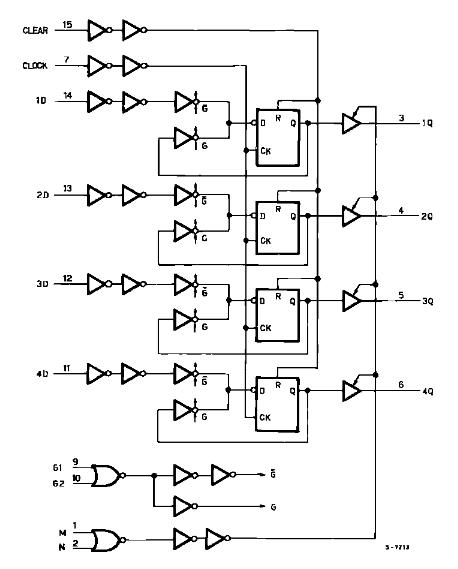
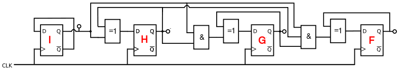

<!--

author:   Sebastian Zug & André Dietrich & Fabian Bär
email:    sebastian.zug@informatik.tu-freiberg.de & andre.dietrich@informatik.tu-freiberg.de & fabian.baer@student.tu-freiberg.de
version:  0.0.5
language: de
narrator: Deutsch Female

import:  https://raw.githubusercontent.com/liascript-templates/plantUML/master/README.md
         https://raw.githubusercontent.com/LiaTemplates/DigiSim/master/README.md

mark: <span style="background-color: @0;
                                  display: flex;
                                  width: calc(100% + 32px);
                                  margin: -16px;
                                  padding: 6px 16px 6px 16px;
                                  ">@1</span>
red:  @mark(#FF888888,@0)
blue: @mark(lightblue,@0)
gray: @mark(gray,@0)

-->

# Standardschaltwerke

**TU Bergakademie Freiberg - Wintersemester 2020 / 21**

Link auf die aktuelle Vorlesung im Versionsmanagementsystem GitHub

[https://github.com/TUBAF-IfI-LiaScript/VL_EingebetteteSysteme/blob/08_StandardSchaltwerke](https://github.com/TUBAF-IfI-LiaScript/VL_EingebetteteSysteme/blob/dev/08_StandardSchaltwerke)

Die interaktive Form ist unter diesem [Link](https://liascript.github.io/course/?https://raw.githubusercontent.com/TUBAF-IfI-LiaScript/VL_EingebetteteSysteme/master/08_StandardSchaltwerke.md) zu finden.

---------------------------------------------------------------------

** Fragen an die Veranstaltung**

+ Welche Kernelemente hat ein Schaltwerk?
+ Worin unterscheiden sich die Varianten von Mealy und Moore?
+ Welches Vorgehen ist für die Umsetzung eines Schaltwerkes notwendig?
+ An welcher Stelle ist die invertierte Wahrheitstabelle eines Flip-Flops wichtig?

<!--
style="width: 80%; min-width: 420px; max-width: 720px;"
-->
```ascii

                Abstraktionsebenen

           +----------------------------+ -.
  Ebene 6  | Problemorientierte Sprache |  |
           +----------------------------+  |
                                           ⎬ Anwendungssoftware
           +----------------------------+  |
  Ebene 5  | Assemblersprache           |  |
           +----------------------------+ -.

           +----------------------------+
  Ebene 4  | Betriebssystem             |     Systemsoftware
           +----------------------------+

           +----------------------------+
  Ebene 3  | Istruktionsset             |     Maschinensprache
           +----------------------------+

           +----------------------------+  -.
  Ebene 2  | Mikroarchitektur           |   |
           +----------------------------+   |
                                            ⎬ Automaten, Speicher, Logik
           +----------------------------+   |       ╔═══════════════╗
  Ebene 1  | Digitale Logik             |   |    ◀══║ HIER SIND WIR!║
           +----------------------------+  -.       ╚═══════════════╝

           +----------------------------+
  Ebene 0  | E-Technik, Physik          |     Analoge Phänomene
           +----------------------------+                                      .
```


---------------------------------------------------------------------

## Übungsbeispiel

                          {{0-1}}
*******************************************************************************

Wir wollen eine Ampelanlage entwerfen, die durch einen Eingang $E$ getrieben wird, wobei der Wechsel zwischen den Zuständen von E eine Änderung der Ampelphase bewirkt. Die Umsetzung erfolgt als Moore-Automat.

<!--
style="width: 80%; min-width: 420px; max-width: 720px;"
-->
```ascii
      ^
      | --+--------+----------------+-----------+--------+--
Phase |   | Rot    | Rot-Gelb       | Grün      | Gelb   |
      | --+--------+----------------+-----------+--------+--
      |
      |   +--------+                +-----------+
E     |   |        |                |           |
      |---+        +----------------+           +---------
      +--------------------------------------------------+                          .
```

**1. Schritt: Aufstellen des Automatenmodels**

```text @plantUML
@startuml
digraph finite_state_machine {
    rankdir=LR;

    node [shape = point ]; qi
    node[shape=circle]
    A[label="Rot"];
    B[label="Rot\nGelb"];
    C[label="Grün"];
    D[label="Gelb"];

    qi -> A;
    A  -> A  [ label = "E=1" ];
    A  -> B  [ label = "E=0" ];
    B  -> B  [ label = "E=0"];
    B  -> C  [ label = "E=1" ];
    C  -> C  [ label = "E= 1"];
    C  -> D  [ label = "E= 0"];
    D  -> D  [ label = "E= 0"];
    D  -> A [ label = "E= 1"];
}
@enduml
```
@plantUML

*******************************************************************************

                               {{0-3}}
*******************************************************************************
**2. Schritt: Erstellen der Zustandstabelle**

| Vorhergehender Zustand | Eingabe $E$ | Nachfolgezustand |
| ---------------------- | ----------- | ---------------- |
| Rot                    | 0           | RotGelb          |
| Rot                    | 1           | Rot              |
| RotGelb                | 0           | RotGelb          |
| RotGelb                | 1           | Grün             |
| Grün                   | 0           | Gelb             |
| Grün                   | 1           | Grün             |
| Gelb                   | 0           | Gelb             |
| Gelb                   | 1           | Rot              |


*******************************************************************************

                               {{1-3}}
*******************************************************************************

**Schritt 3: Auswahl einer binären Zustandskodierung und Generierung einer binären Zustandstabelle**

| Zustand | G   | F   |
| ------- | --- | --- |
| Rot     | 0   | 0   |
| RotGelb | 0   | 1   |
| Grün    | 1   | 0   |
| Gelb    | 1   | 1   |

> **Aufgabe:** Ergänzen Sie die Zustandsübergangstabelle!

| G   | F   | E   | G'  | F'  |
| --- | --- | --- | --- | --- |
|     |     | 0   |     |     |
|     |     | 1   |     |     |
|     |     | 0   |     |     |
|     |     | 1   |     |     |
|     |     | 0   |     |     |
|     |     | 1   |     |     |
|     |     | 0   |     |     |
|     |     | 1   |     |     |

*******************************************************************************

                               {{2-3}}
*******************************************************************************

Lösung:

| Vorhergehender Zustand | G   | F   | Eingabe $E$ | Nachfolgezustand | G'  | F'  |
| ---------------------- | --- | --- | ----------- | ---------------- | --- | --- |
| Rot                    | 0   | 0   | 0           | RotGelb          | 0   | 1   |
| Rot                    | 0   | 0   | 1           | Rot              | 0   | 0   |
| RotGelb                | 0   | 1   | 0           | RotGelb          | 0   | 1   |
| RotGelb                | 0   | 1   | 1           | Grün             | 1   | 0   |
| Grün                   | 1   | 0   | 0           | Gelb             | 1   | 1   |
| Grün                   | 1   | 0   | 1           | Grün             | 1   | 0   |
| Gelb                   | 1   | 1   | 0           | Gelb             | 1   | 1   |
| Gelb                   | 1   | 1   | 1           | Rot              | 0   | 0   |

*******************************************************************************

                              {{3-5}}
*******************************************************************************

**Schritt 4: Auswahl eines Flip-Flop Typs und Ermittlung der für jeden Zustandsübergang benötigten Flip-Flop Ansteuerungen**

Wir entscheiden uns für einen JK-Flip-Flop für die Realisierung. Die entsprechende invertierte Wahrheitstafel haben Sie zwischenzeitlich im Kopf:

| $Q(t)$ | $Q(t+1)$ | $J$ | $K$ |
| ------ | -------- | --- | --- |
| 0      | 0        | 0   | $d$ |
| 0      | 1        | 1   | $d$ |
| 1      | 0        | $d$ | 1   |
| 1      | 1        | $d$ | 0   |

Schauen wir zunächst auf den Flip-Flop G, dessen Eingangsbelegung muss also auf die erwarteten Zustandsübergänge abgebildet werden.

| @blue(G) | F   | E   | @blue(G') | F'  | @gray(JG) | @gray(KG) | JF  | KF  |
| -------- | --- | --- | --------- | --- | --------- | --------- | --- | --- |
| @blue(0) | 0   | 0   | @blue(0)  | 1   | @gray(0)  | @gray(d)  |     |     |
| @blue(0) | 0   | 1   | @blue(0)  | 0   | @gray(0)  | @gray(d)  |     |     |
| @blue(0) | 1   | 0   | @blue(0)  | 1   | @gray(0)  | @gray(d)  |     |     |
| @blue(0) | 1   | 1   | @blue(1)  | 0   | @gray(1)  | @gray(d)  |     |     |
| @blue(1) | 0   | 0   | @blue(1)  | 1   | @gray(d)  | @gray(0)  |     |     |
| @blue(1) | 0   | 1   | @blue(1)  | 0   | @gray(d)  | @gray(0)  |     |     |
| @blue(1) | 1   | 0   | @blue(1)  | 1   | @gray(d)  | @gray(0)  |     |     |
| @blue(1) | 1   | 1   | @blue(0)  | 0   | @gray(d)  | @gray(1)  |     |     |

> **Aufgabe:** Ergänzen Sie die Einträge für $JF$ und $KF$!

*******************************************************************************

                              {{4-5}}
*******************************************************************************


| G   | @blue(F) | E   | G'  | @blue(F') | JG  | KG  | @gray(JF) | @gray(KF) |
| --- | -------- | --- | --- | --------- | --- | --- | --------- | --------- |
| 0   | @blue(0) | 0   | 0   | @blue(1)  | 0   | d   | @gray(1)  | @gray(d)  |
| 0   | @blue(0) | 1   | 0   | @blue(0)  | 0   | d   | @gray(0)  | @gray(d)  |
| 0   | @blue(1) | 0   | 0   | @blue(1)  | 0   | d   | @gray(d)  | @gray(0)  |
| 0   | @blue(1) | 1   | 1   | @blue(0)  | 1   | d   | @gray(d)  | @gray(1)  |
| 1   | @blue(0) | 0   | 1   | @blue(1)  | d   | 0   | @gray(1)  | @gray(d)  |
| 1   | @blue(0) | 1   | 1   | @blue(0)  | d   | 0   | @gray(0)  | @gray(d)  |
| 1   | @blue(1) | 0   | 1   | @blue(1)  | d   | 0   | @gray(d)  | @gray(0)  |
| 1   | @blue(1) | 1   | 0   | @blue(0)  | d   | 1   | @gray(d)  | @gray(1)  |

*******************************************************************************

                              {{5-7}}
*******************************************************************************

**Minimieren der Schaltung**

| G   | F   | E   | JG  | KG  | JF  | KF  |
| --- | --- | --- | --- | --- | --- | --- |
| 0   | 0   | 0   | 0   | d   | 1   | d   |
| 0   | 0   | 1   | 0   | d   | 0   | d   |
| 0   | 1   | 0   | 0   | d   | d   | 0   |
| 0   | 1   | 1   | 1   | d   | d   | 1   |
| 1   | 0   | 0   | d   | 0   | 1   | d   |
| 1   | 0   | 1   | d   | 0   | 0   | d   |
| 1   | 1   | 0   | d   | 0   | d   | 0   |
| 1   | 1   | 1   | d   | 1   | d   | 1   |

<!--
style="width: 80%; min-width: 420px; max-width: 720px;"
-->
```ascii
         __    _           _               __    _          _
JG       GF    GF    GF   GF        JF     GF    GF   GF   GF
     _  +----+----+----+----+         _  +----+----+----+----+
     E  |    |    |  d | d  |         E  | 1  | d  | d  | 1  |
        +----+----+----+----+            +----+----+----+----+
     E  |    |  1 |  d | d  |         E  |    | d  | d  |    |
        +----+----+----+----+            +----+----+----+----+

         __    _          _                __   _          _
KG       GF    GF   GF   GF         KF     GF   GF   GF   GF
     _  +----+----+----+----+         _  +----+----+----+----+
     E  | d  | d  |    |    |         E  | d  |    |    | d  |
        +----+----+----+----+            +----+----+----+----+
     E  | d  | d  |  1 |    |         E  | d  | 1  | 1  | d  |
        +----+----+----+----+            +----+----+----+----+                .
```


> **Aufgabe:** Lesen Sie die minimierten Funktionen für die Flip-Flop-Eingänge ab!

*******************************************************************************

                              {{6-7}}
*******************************************************************************

Damit lassen sich folgende Funktionen ablesen:

$$
\begin{aligned}
JG &= FE \\
KG &= FE \\
JF &= \overline{E} \\
KF &= E \\
\end{aligned}
$$

*******************************************************************************

                              {{7-8}}
*******************************************************************************

**Ausgabelogik**

Die Ansteuerung der drei Ausgabeleitungen R, Gr, Ge ergibt sich aus den Zuständen:

| Zustand | G   | F   | @gray($R$) | @gray($Gr$) | @gray($Ge$) |
| ------- | --- | --- | ---------- | ----------- | ----------- |
| Rot     | 0   | 0   | @gray($1$) | @gray($0$)  | @gray($0$)  |
| RotGelb | 0   | 1   | @gray($1$) | @gray($0$)  | @gray($1$)  |
| Grün    | 1   | 0   | @gray($0$) | @gray($1$)  | @gray($0$)  |
| Gelb    | 1   | 1   | @gray($0$) | @gray($0$)  | @gray($1$)  |

$$
\begin{aligned}
R  &= \overline{G} \\
Gr &= G\overline{F} \\
Ge &= F
\end{aligned}
$$

*******************************************************************************

## Register

> **Merke** Register bilden das Zusammenspiel mehrerer Flip-Flops.

<!--
style="width: 80%; min-width: 420px; max-width: 720px;"
-->
```ascii

   +-------------------------+      1-Bit Speicherzelle
   |  +                      |
   |  |\                     |
   +--| +       +-------+    |    |\
      | |-------| D   Q |----o----| +--
   ---| +       |       |         |/
Daten |/     +--|">"    |          |
      +|     |  +-------+          |
       |     |                     |
   enable   clock                enable
   write                         out                             .
```

Aggregieren wir nun mehrere D-Flip-Flops in einem Baustein, können wir wie nachfolgend gezeigt 4 Bit damit speichern. Der Flip-Flop $1Q$ könnte dabei die niedrigste Stelle in unser Zahlenrepresentation einnehmen, $Q4$ die höchste. Um also $1011$ in unserem Speicher abzulegen, müssten wir and den Inputs $D_1$ bis $D_4$ die zugehörigen Pinbelegungen realisieren, die dann mit dem nächsten Taktflankenwechsel übernommen werden. Die Übernahme der daten wird dabei durch zwei Enable Flags definiert, die $G, \overline{G}$ konfiguriert.

Die Eingabe der Daten kann seriell (serial input, SI) oder parallel erfolgen (parallel input, PI), ebenso die Ausgabe (serial output, SO bzw. parallel output, PO).

<!--
style="width: 80%; min-width: 420px; max-width: 720px;"
-->
```ascii
                                      |   |   |   |
SISO                          PISO    v   v   v   v
      +---+---+---+---+             +---+---+---+---+
 ---->|   |   |   |   |---->        |   |   |   |   |---->
      +---+---+---+---+             +---+---+---+---+

                                      |   |   |   |
SIPO                          PIPO    v   v   v   v
      +---+---+---+---+             +---+---+---+---+
 ---->|   |   |   |   |             |   |   |   |   |
      +---+---+---+---+             +---+---+---+---+
        |   |   |   |                 |   |   |   |
        v   v   v   v                 v   v   v   v                            .
```

| Prinzip | Anwendung                                                                         |
| ------- | --------------------------------------------------------------------------------- |
| SISO    | FIFO-Speicher (first-in-first-out), Multiplikation bzw. Division mit dem Faktor 2 |
| SIPO    | Umwandlung serielles Datenformat in paralleles Datenformat                        |
| PISO    | Umwandlung paralleles Datenformat in serielles Datenformat                        |
| PIPO    | Register zum reinen Zwischenspeichern, z. B. Akkumulator                          |

Schauen wir uns das Ganze mal am Beispiel eines 4 Bit PIPO Registers an:

<!-- style="width: 55%; max-width: 1800px;" --> [^1]

[^1]: SGS Thomson, Datenblatt 74HC173, "Quad D-Type Register", [Link](https://cdn-reichelt.de/documents/datenblatt/A240/74HC173%23STM.pdf)

<!--
style="width: 80%; min-width: 420px; max-width: 720px;"
-->
```ascii
        +----------------+         Vier Bit Register
  ------| D_0        Q_0 |------
  ------| D_1        Q_1 |------
  ------| D_2        Q_2 |------
  ------| D_3        Q_3 |------
        |                |
  ------|">"             |
  ------| enable write   |
  ------| enable read    |
  ------| clear          |
        +----------------+                                                     .
```


In der Summe brauchen wir damit 4 Eingangsleitungen, 4 Ausgangsleitungen sowie diverse Steuerleitungen - für eine größere Anzahl an Registern eine zu aufwändige Realisierung - wir brauchen einen "Zuteilungsmechanismus".

Entsprechend führen wir eine Adresse ein, diese kodiert, welches Register konkret angesprochen werden soll. Die Datenbreite bleibt erhalten.

<!--
style="width: 80%; min-width: 420px; max-width: 720px;"
-->
```ascii

Clock  ---------------------------+
Clear  ----                       |       +----------------+
                                  | ------| D_0        Q_0 |---+
D_0    ----                       | ------| D_1        Q_1 |---|--+
D_1    ----                       | ------| D_2        Q_2 |---|--|--+
D_2    ----                       | ------| D_3        Q_3 |---|--|--|--+
D_3    ----                       |       |                |   |  |  |  |
                                  +-------|">"             |   |  |  |  |
                          +-------|-------| enable write   |   |  |  |  |
                          |       | ------| enable read    |   |  |  |  |
                          |       | ------| clear          |   |  |  |  |
             Register-    |       |       +----------------+   |  |  |  |
             Schreib-     |       |                            |  |  |  |
             auswahl      |       |       +----------------+   |  |  |  |
                 +        |       | ------| D_0        Q_0 |---+  |  |  |
                /|--------+       | ------| D_1        Q_1 |---|--+  |  |
               + |---------+      | ------| D_2        Q_2 |---|--|--+  |
A0     -----+--| |-------+ |      | ------| D_3        Q_3 |---|--|--|--+
A1     ---+-|--| |       | |      |       |                |   |  |  |  |
          | |  + |       | |      +-------|">"             |   |  |  |  |
          | |   \|       | +------|-------| enable write   |   |  |  |  |
          | |   |+       |        | ------| enable read    |   |  |  |  |
enable ---| |---+        |        | ------| clear          |   |  |  |  |
write     | |            |        |       +----------------+   |  |  |  |
          | |            |        |                            |  |  |  |
          | |            |        |       +----------------+   |  |  |  |
          | |    +       |        | ------| D_0        Q_0 |---+  |  |  |
          | |   /|-      |        | ------| D_1        Q_1 |---|--+  |  |
          | |  + |-      |        | ------| D_2        Q_2 |---|--|--+  |
          | +--| |-      |        | ------| D_3        Q_3 |---|--|--|--+
          +----| |       |        |       |                |   |  |  |  |
               + |       |        +-------|">"             |   +--|--|--|--- Q_0
                \|       +----------------| enable write   |   |  +--|--|--- Q_1
                |+                  ------| enable read    |   |  |  +--|--- Q_2
enable ---------+                   ------| clear          |   |  |  |  +--- Q_3
out          Register-                    +----------------+
             Lese-
          Auswahl
                                                    ....                 .
```

An diesem Schaubild werden zwei zentrale Größen einer Rechnerarchitektur deutlich. Die Adressbusbreite und die Wortlänge bzw.. die Datenbusbreite des Systems z. B. 8, 16, 32 oder 64 Bit.

An dieser Stelle sei noch einmal auf die Erläuterungen zum Schieberegister aus der Veranstaltung L6 verwiesen. Dieses erweitert die Funktionalität und ermöglicht neben dem Abspeichern und Lesen auch Shiftoperationen.

## Zähler

Eine sequentielle Schaltung, die Eingangsimpulse auf Zustände abbildet nennt man Zähler. Mit ihnen lassen sich zeitlich aufeinander folgende Ereignisse registrieren aber auch erzeugen.

+ **Synchron vs. asynchron** In einem synchronen Zähler sind alle Zähler-Speicher durch eine Taktleitung getriggert. Der Zustandswechsel wird immer zugleich vollzogen. Asynchrone Zähler heben diese Trennung auf und erlauben eine vereinfachte Umsetzung. Allerdings ist die Gültigkeit der Ergebnisse dann von dem Laufzeitverhalten der Komponenten abhängig.

<!-- style="width: 80%; max-width: 800px;" -->

<!-- style="width: 80%; max-width: 1200px;" -->


+ **Zahlenformat** Die binäre Zahlenrepräsentation ist die intuitive Darstellung des Zahlenwertes. Alternativ lassen sich aber auch Dezimale Zähler, beruhend auf z. B. dem BCD-Code oder Zähler mit anderen Codes arbeiten, z. B. Gray-Code umsetzen.

+ **Zählrichtung** Unidirektionale Zähler können ausschließlich vorwärts oder rückwärts zählen (inkrementieren/dekrementieren). Bidirektionale Zähler unterstützen beide Zählrichtungen, benötigen aber auch eine separate Steuerleitung.

Leiten wir uns einen synchronen 4 Bit Zähler zur Vertiefung des Verständnisses noch mal her:

```text @plantUML
@startuml
digraph finite_state_machine {
    rankdir=LR;

    node [shape = point ]; qi
    node[shape=circle]
    A[label="0000"];
    B[label="0001"];
    C[label="..."];
    D[label="1111"];

    qi -> A;
    A  -> A  [ label = "E=0" ];
    A  -> B  [ label = "E=1" ];
    B  -> B  [ label = "E=0"];
    B  -> C  [ label = "E=1" ];
    C  -> C  [ label = "E= 0"];
    C  -> D  [ label = "E= 1"];
    D  -> D  [ label = "E= 0"];
    D  -> A  [ label = "E= 1"];
}
@enduml
```
@plantUML

Offenbar sind 4 Zustände notwendig, um die Zahlen von 0-15 abbilden zu können. Die Zustandsübergangstabelle ergibt sich folglich zu.

| F   | G   | H   | I   | F'  | G'  | H'  | I'  |
| --- | --- | --- | --- | --- | --- | --- | --- |
| 0   | 0   | 0   | 0   | 0   | 0   | 0   | 1   |
| 0   | 0   | 0   | 1   | 0   | 0   | 1   | 0   |
| 0   | 0   | 1   | 0   | 0   | 0   | 1   | 1   |
| 0   | 0   | 1   | 1   | 0   | 1   | 0   | 0   |
| 0   | 1   | 0   | 0   | 0   | 1   | 0   | 1   |
| 0   | 1   | 0   | 1   | 0   | 1   | 1   | 0   |
| 0   | 1   | 1   | 0   | 0   | 1   | 1   | 1   |
| 0   | 1   | 1   | 1   | 1   | 0   | 0   | 0   |
| 1   | 0   | 0   | 0   | 1   | 0   | 0   | 1   |
| 1   | 0   | 0   | 1   | 1   | 0   | 1   | 0   |
| 1   | 0   | 1   | 0   | 1   | 0   | 1   | 1   |
| 1   | 0   | 1   | 1   | 1   | 1   | 0   | 0   |
| 1   | 1   | 0   | 0   | 1   | 1   | 0   | 1   |
| 1   | 1   | 0   | 1   | 1   | 1   | 1   | 0   |
| 1   | 1   | 1   | 0   | 1   | 1   | 1   | 1   |
| 1   | 1   | 1   | 1   | 0   | 0   | 0   | 0   |

Unter der Vorgabe, dass wir D-Flip-Flops für die Umsetzung verwenden, sind die Eingänge der Speicher mit den Zuständen F' bis I' zu beschalten.

In der Vereinfachung ergeben sich daraus folgende Gleichungen:

$$
\begin{aligned}
DF &= \overline{I}F + \overline{G}F + \overline{H}F + IHG\overline{F} \\
DG &= \overline{I}G + \overline{H}G + IH\overline{G}\\
DH &= I\overline{H}+\overline{I}H\\
DI &= \overline{I} \\
\end{aligned}
$$

<!-- style="width: 90%; max-width: 800px;" -->

Das nachfolgende Beispiel realisiert eine alternative Umsetzung und integriert zu Demonstrationszwecken einen Reset-Kanal. Aktivieren Sie zunächst die Clock-Leitung einmal. Für den Zählmechanismus muss dann $\overline{RESET}$ gesetzt sein.

```json @DigiSim.evalJson
{"devices":{"and5":{"label":"anew and ~reset","type":"And","propagation":1,"bits":1,"position":{"x":355,"y":5}},"and6":{"label":"bnew and ~reset","type":"And","propagation":1,"bits":1,"position":{"x":355,"y":80}},"and7":{"label":"cnew and ~reset","type":"And","propagation":1,"bits":1,"position":{"x":355,"y":145}},"and8":{"label":"dnew and ~reset","type":"And","propagation":1,"bits":1,"position":{"x":355,"y":215}},"resetButton":{"label":"~reset","type":"Button","propagation":0,"position":{"x":25,"y":265}},"countButton":{"label":"count  (dflip)","type":"Button","propagation":0,"position":{"x":-95,"y":245}},"clkButton":{"label":"clk","type":"Button","propagation":0,"position":{"x":195,"y":345}},"lampa":{"label":"a","type":"Lamp","propagation":1,"position":{"x":655,"y":5}},"lampb":{"label":"b","type":"Lamp","propagation":1,"position":{"x":655,"y":70}},"lampc":{"label":"c","type":"Lamp","propagation":1,"position":{"x":655,"y":140}},"lampd":{"label":"d","type":"Lamp","propagation":1,"position":{"x":655,"y":210}},"lampco":{"label":"carry out","type":"Lamp","propagation":1,"position":{"x":630,"y":-60}},"dffa":{"label":"dff a","type":"Dff","propagation":1,"polarity":{"clock":true},"bits":1,"initial":"x","position":{"x":505,"y":5}},"dffb":{"label":"dff b","type":"Dff","propagation":1,"polarity":{"clock":true},"bits":1,"initial":"x","position":{"x":505,"y":90}},"dffc":{"label":"dff c","type":"Dff","propagation":1,"polarity":{"clock":true},"bits":1,"initial":"x","position":{"x":505,"y":160}},"dffd":{"label":"dff d","type":"Dff","propagation":1,"polarity":{"clock":true},"bits":1,"initial":"x","position":{"x":510,"y":235}},"and1":{"label":"aflip and a  (carryOut)","type":"And","propagation":1,"bits":1,"position":{"x":135,"y":-65}},"and2":{"label":"bflip and b  (aflip)","type":"And","propagation":1,"bits":1,"position":{"x":60,"y":0}},"and3":{"label":"cflip and c  (bflip)","type":"And","propagation":1,"bits":1,"position":{"x":35,"y":80}},"and4":{"label":"dflip and d  (cflip)","type":"And","propagation":1,"bits":1,"position":{"x":-30,"y":150}},"xor1":{"label":"a xor aflip","type":"Xor","propagation":1,"bits":1,"position":{"x":210,"y":5}},"xor2":{"label":"b xor bflip","type":"Xor","propagation":1,"bits":1,"position":{"x":215,"y":70}},"xor3":{"label":"c xor cflip","type":"Xor","propagation":1,"bits":1,"position":{"x":210,"y":130}},"xor4":{"label":"d xor dflip","type":"Xor","propagation":1,"bits":1,"position":{"x":210,"y":200}}},"connectors":[{"from":{"id":"countButton","port":"out"},"to":{"id":"xor4","port":"in2"}},{"from":{"id":"countButton","port":"out"},"to":{"id":"and4","port":"in1"},"vertices":[{"x":-80,"y":190}]},{"from":{"id":"and3","port":"out"},"to":{"id":"and2","port":"in1"},"vertices":[{"x":25,"y":65},{"x":5,"y":65}]},{"from":{"id":"and4","port":"out"},"to":{"id":"and3","port":"in1"},"vertices":[{"x":-15,"y":125}]},{"from":{"id":"and4","port":"out"},"to":{"id":"xor3","port":"in2"}},{"from":{"id":"and3","port":"out"},"to":{"id":"xor2","port":"in2"}},{"from":{"id":"and2","port":"out"},"to":{"id":"xor1","port":"in2"}},{"from":{"id":"dffa","port":"out"},"to":{"id":"xor1","port":"in1"},"vertices":[{"x":315,"y":-5}]},{"from":{"id":"and2","port":"out"},"to":{"id":"and1","port":"in1"},"vertices":[{"x":95,"y":-10}]},{"from":{"id":"and1","port":"out"},"to":{"id":"lampco","port":"in"}},{"from":{"id":"clkButton","port":"out"},"to":{"id":"dffd","port":"clk"},"vertices":[{"x":435,"y":360}]},{"from":{"id":"clkButton","port":"out"},"to":{"id":"dffc","port":"clk"},"vertices":[{"x":435,"y":360}]},{"from":{"id":"clkButton","port":"out"},"to":{"id":"dffb","port":"clk"},"vertices":[{"x":455,"y":340}]},{"from":{"id":"clkButton","port":"out"},"to":{"id":"dffa","port":"clk"}},{"from":{"id":"and8","port":"out"},"to":{"id":"dffd","port":"in"}},{"from":{"id":"xor1","port":"out"},"to":{"id":"and5","port":"in1"}},{"from":{"id":"xor2","port":"out"},"to":{"id":"and6","port":"in1"}},{"from":{"id":"xor3","port":"out"},"to":{"id":"and7","port":"in1"}},{"from":{"id":"xor4","port":"out"},"to":{"id":"and8","port":"in1"}},{"from":{"id":"and7","port":"out"},"to":{"id":"dffc","port":"in"}},{"from":{"id":"and6","port":"out"},"to":{"id":"dffb","port":"in"}},{"from":{"id":"and5","port":"out"},"to":{"id":"dffa","port":"in"}},{"from":{"id":"resetButton","port":"out"},"to":{"id":"and8","port":"in2"}},{"from":{"id":"resetButton","port":"out"},"to":{"id":"and7","port":"in2"},"vertices":[{"x":305,"y":255}]},{"from":{"id":"resetButton","port":"out"},"to":{"id":"and6","port":"in2"},"vertices":[{"x":305,"y":255}]},{"from":{"id":"resetButton","port":"out"},"to":{"id":"and5","port":"in2"},"vertices":[{"x":305,"y":255}]},{"from":{"id":"dffd","port":"out"},"to":{"id":"lampd","port":"in"}},{"from":{"id":"dffc","port":"out"},"to":{"id":"lampc","port":"in"}},{"from":{"id":"dffb","port":"out"},"to":{"id":"lampb","port":"in"}},{"from":{"id":"dffa","port":"out"},"to":{"id":"lampa","port":"in"}},{"from":{"id":"dffd","port":"out"},"to":{"id":"xor4","port":"in1"},"vertices":[{"x":310,"y":210},{"x":190,"y":185}]},{"from":{"id":"dffd","port":"out"},"to":{"id":"and4","port":"in2"},"vertices":[{"x":185,"y":180},{"x":15,"y":200}]},{"from":{"id":"dffc","port":"out"},"to":{"id":"xor3","port":"in1"},"vertices":[{"x":545,"y":140},{"x":285,"y":110}]},{"from":{"id":"dffc","port":"out"},"to":{"id":"and3","port":"in2"},"vertices":[{"x":545,"y":140},{"x":285,"y":110},{"x":130,"y":130}]},{"from":{"id":"dffb","port":"out"},"to":{"id":"and2","port":"in2"},"vertices":[{"x":340,"y":60}]},{"from":{"id":"dffb","port":"out"},"to":{"id":"xor2","port":"in1"},"vertices":[{"x":510,"y":60}]},{"from":{"id":"dffa","port":"out"},"to":{"id":"and1","port":"in2"},"vertices":[{"x":310,"y":-5}]}],"subcircuits":{}}
```

## Übungsaufgaben

+ Entwerfen Sie einen Zähler, der eine Zählrichtungsvorgabe ermöglicht und evaluieren Sie Ihre Lösung mit einem Simulator.

   [logisim-evolution](https://github.com/reds-heig/logisim-evolution)

+ Implementieren Sie einen Logik-Analysator für eine gegebene Schaltung. Dieser testet die Zustände systematisch ab und generiert daraus eine Tabelle.
