<!--

author:   Sebastian Zug & André Dietrich & Fabian Bär
email:    sebastian.zug@informatik.tu-freiberg.de & andre.dietrich@informatik.tu-freiberg.de & fabian.baer@student.tu-freiberg.de
version:  0.0.3
language: de
narrator: Deutsch Female

import:  https://raw.githubusercontent.com/liascript-templates/plantUML/master/README.md
          https://github.com/liascript/CodeRunner

mark: <span style="background-color: @0;
                                  display: flex;
                                  width: calc(100% + 32px);
                                  margin: -16px;
                                  padding: 6px 16px 6px 16px;
                                  ">@1</span>
red:  @mark(#FF888888,@0)
blue: @mark(lightblue,@0)
gray: @mark(gray,@0)

import: https://raw.githubusercontent.com/LiaTemplates/DigiSim/master/README.md
-->

# Rechnerarithmetik

**TU Bergakademie Freiberg - Wintersemester 2020 / 21**

Link auf die aktuelle Vorlesung im Versionsmanagementsystem GitHub

[https://github.com/TUBAF-IfI-LiaScript/VL_EingebetteteSysteme/blob/09_Rechnerarithmetik.md](https://github.com/TUBAF-IfI-LiaScript/VL_EingebetteteSysteme/blob/master/09_Rechnerarithmetik.md)

Die interaktive Form ist unter [diesem Link](https://liascript.github.io/course/?https://raw.githubusercontent.com/TUBAF-IfI-LiaScript/VL_EingebetteteSysteme/master/09_Rechnerarithmetik.md#1) zu finden

---------------------------------------------------------------------

** Fragen an die Veranstaltung**

+ Was ist der Unterschied zwischen einem Stellenwertsystem und einem additiv-wirkenden Zahlensystem?
+ Zu welcher Basis werden duale, oktale, hexadezimale Zahlen gebildet?
+ Wie lassen sich Zahlen zwischen diesen Systemen umrechnen?
+ Wie resultiert daraus der Zahlenraum für 2 Stellen?
+ Welchen Vorteil bringt die komplementäre Zahlendarstellung mit sich?
+ Warum arbeiten heutige Rechner ausschließlich mit der 2er-Komplementdarstellung?
+ Wie sehen die Basis Addier-/Subtrahier Schaltungen aus? Was ist ein Volladdierer / Halbaddierer?
+ Welchen Vorteil bringt der Carry-Look-Ahead Addierer gegenüber dem Carry-Ripple-Addierer mit?
+ Warum werden beide Ansätze kombiniert?

<!--
style="width: 80%; min-width: 420px; max-width: 720px;"
-->
```ascii

                Abstraktionsebenen

           +----------------------------+ -.
  Ebene 6  | Problemorientierte Sprache |  |
           +----------------------------+  |
                                           ⎬ Anwendungssoftware
           +----------------------------+  |
  Ebene 5  | Assemblersprache           |  |
           +----------------------------+ -.

           +----------------------------+
  Ebene 4  | Betriebssystem             |     Systemsoftware
           +----------------------------+

           +----------------------------+
  Ebene 3  | Istruktionsset             |     Maschinensprache
           +----------------------------+

           +----------------------------+  -.
  Ebene 2  | Mikroarchitektur           |   |
           +----------------------------+   |
                                            ⎬ Automaten, Speicher, Logik
           +----------------------------+   |       ╔═══════════════╗
  Ebene 1  | Digitale Logik             |   |    ◀══║ HIER SIND WIR!║
           +----------------------------+  -.       ╚═══════════════╝

           +----------------------------+
  Ebene 0  | E-Technik, Physik          |     Analoge Phänomene
           +----------------------------+                                      .
```

---------------------------------------------------------------------

## Zahlendarstellung

Ganzzahlige Zahlensystem
====================================

            {{0-1}}
********************************************************************************

**Frühe Zahlensysteme**

Als römische Zahlen werden die Zahlzeichen einer in der römischen Antike entstandenen und noch für Nummern und besondere Zwecke gebräuchlichen Zahlschrift bezeichnet.

Es handelt sich um eine additive Zahlschrift, mit ergänzender Regel für die subtraktive Schreibung bestimmter Zahlen, aber ohne Stellenwertsystem und ohne Zeichen für Null.

|    |1        | 2   | 3   | 4   | 5   | 6   | 7   | 8   | 9   | 10  | 11  | 12  | 50  | 100 | 500 | 1000 | 5000 | 10.000 | 50.000 | 100.000 |     |
| -------- | --- | --- | --- | --- | --- | --- | --- | --- | --- | --- | --- | --- | --- | --- | ---- | ---- | ------ | ------ | ------- | --- |
| Majuskel | Ⅰ   | Ⅱ   | Ⅲ   | Ⅳ   | Ⅴ   | Ⅵ   | Ⅶ   | Ⅷ   | Ⅸ   | Ⅹ   | Ⅺ   | Ⅻ   | Ⅼ   | Ⅽ   | Ⅾ    | Ⅿ    | ↁ      | ↂ      | ↇ       | ↈ   |
| Minuskel | ⅰ   | ⅱ   | ⅲ   | ⅳ   | ⅴ   | ⅵ   | ⅶ   | ⅷ   | ⅸ   | ⅹ   | ⅺ   | ⅻ   | ⅼ   | ⅽ   | ⅾ    | ⅿ    |        |        |         |     |

<!-- style="width: 50%; max-width: 800px;" --> [^1]

[^1]: WarpFlyght, Eingang des Kolosseums mit der römischen Zahl LII (52), https://commons.wikimedia.org/wiki/File:Colosseum-Entrance_LII.jpg

********************************************************************************

          {{1-2}}
********************************************************************************

**Dezimale Zahlen**

Darstellung positiver ganzer Zahlen in positionaler Notation (auch als Stellenwertsystem bezeichnet) mit 10 Symbolen $x_i \in \{0,1,2,3,4,5,6,7,8,9\}$.

$$
\begin{aligned}
x &= (x_{n-1} x_{n-2} x_{n-3} ... x_{2}x_{1}x_{0})_{10} \\
x &= x_{n-1} \cdot 10^{n-1} + x_{n-2} \cdot 10^{n-2} + .... + x_{1} \cdot 10^{1} + x_{0} \cdot 10^{0}\\
\end{aligned}
$$

Beispiel $259_{10}=2 \cdot 10^2 + 5 \cdot 10^1 + 9 \cdot 10^0 = 200 + 50 + 9$

**Binäre Zahlen**

$$
\begin{aligned}
y &= (y_{n-1} y_{n-2} y_{n-3} ... y_{2} y_{1}x_{0})_{2} \\
y &= y_{n-1} \cdot 2^{n-1} + y_{n-2} \cdot 2^{n-2} + .... + y_{1} \cdot 2^{1} + y_{0} \cdot 2^{0}\\
\end{aligned}
$$

Beispiel $11101_{2}=1 \cdot 2^4 + 1 \cdot 2^3 + 1 \cdot 2^2 + 0 \cdot 2^1 +1 \cdot 2^0 = 16 + 8 + 4 +1 = 29$

********************************************************************************

          {{2-3}}
********************************************************************************

**Verallgemeinerung b-adische Zahlensysteme**

Jede natürliche Zahl $z$ mit $0 \leq z \leq b^n–1$ ist eindeutig als $n$-stellige Zahl zur Basis $b$ darstellbar:

$$
\begin{aligned}
z &= (z_{n-1} z_{n-2} z_{n-3} ... z_{2} z_{1} z_{0})_{2} \\
z &= z_{n-1} \cdot b^{n-1} + z_{n-2} \cdot b^{n-2} + .... + z_{1} \cdot b^{1} + z_{0} \cdot b^{0}\\
\end{aligned}
$$

Typische Werte für die Basis $b$:

| Zahlensystem      | $b$        | Ziffern                                       |
| ----------------- | ---------- | --------------------------------------------- |
| Dualzahlen        | 2 ($2^1$)  | $x_i \in \{0, 1\}$                            |
| Oktalzahlen       | 8  ($2^3$) | $x_i \in \{0,1,2,3,4,5,6,7\}$                 |
| Dezimalzahlen     | 10         | $x_i \in \{0,1,2,3,4,5,6,7,8,9\}$             |
| Hexadezimalzahlen | 16 ($2^4$) | $x_i \in \{0,1,2,3,4,5,6,7,8,9,A,B,C,D,E,F\}$ |

Beispiel $FE01_{16}=15 \cdot 16^3 + 14 \cdot 16^2 + 0 \cdot 16^1 + 1 \cdot 16^0 = 65040$

> **Aufgabe:** Informieren Sie sich über das _Sexagesimalsystem_ der babylonischen Mathematik! Warum verwendete man die 60 als Grundlage?

> **Merke:** Mit der Darstellung einer Zahl im binären Zahlensystem sinkt die Zahl der Ziffernsymbole gleichzeitig steigt die Zahl der notwendigen Stellen an! Wir brauchen mehr Platz.

Beispiel: $214_{10}$

| Zahlensystem | $x_{7}$ | $x_{6}$ | $x_{5}$ | $x_{4}$ | $x_{3}$ | $x_{2}$ | $x_{1}$ | $x_{0}$ |
| ------------ | ------- | ------- | ------- | ------- | ------- | ------- | ------- | ------- |
| Dual         | 1       | 1       | 0       | 1       | 0       | 1       | 1       | 0       |
| Oktal        |         |         |         |         |         | 3       | 2       | 6       |
| Dezimal      |         |         |         |         |         | 2       | 1       | 4       |
| Hexadezimal  |         |         |         |         |         |         | D       | 6       |

********************************************************************************

          {{3-5}}
********************************************************************************

Algorithmus zur Umwandlung einer ganzen Zahl z aus dem Dezimalsystem in eine Zahl x zur Basis b:

```
i=0
wiederhole, bis z=0:
  berechne z=z/b     (ganzzahlige Division mit Rest)
  notiere Rest r[i]
  i=i+1
spiegele r
```

Reste stellen das gesuchte Ergebnis dar: $x =(r_{i-1} ... r_1 r_0)_b$

Beispiel: Wandlung von $29_{10}$ in eine binäre Zahl

<!--
style="width: 80%; min-width: 420px; max-width: 720px;"
-->
```ascii
Der Teiler definiert das avisierte Zahlensystem
       |
       v
  29 / 2 = 14    Rest   1   |
  14 / 2 =  7    Rest   0   |
   7 / 2 =  3    Rest   1   |
   3 / 2 =  1    Rest   1   |
   1 / 2 =  0    Rest   1   v                                                  .

```


> **Aufgabe:** Wandeln Sie die Zahl $523_{10}$ in eine binäre Zahl um.

********************************************************************************

          {{4}}
********************************************************************************
<!--
style="width: 80%; min-width: 420px; max-width: 720px;"
-->
```ascii
  523 / 2 = 261   Rest   1   |
  261 / 2 = 130   Rest   1   |
  130 / 2 =  65   Rest   0   |
   65 / 2 =  32   Rest   1   |
   32 / 2 =  16   Rest   0   |
   16 / 2 =   8   Rest   0   |                                            .
    8 / 2 =   4   Rest   0   |
    4 / 2 =   2   Rest   0   |
    2 / 2 =   1   Rest   1   v
```

********************************************************************************

### Gebrochene Zahlen

Die Römer nutzten Brüche mit der Basis 12(!). Die Nutzung der 12 lag nahe, weil sich die am häufigsten benötigten Brüche _eine Hälfte_, _ein Drittel_ und _ein Viertel_ durch Vielfache von $1/12$ darstellen lassen. Der römische Name für ein Zwölftel ist Uncia, ein Wort, das später zum Gewichtsmaß _Unze_ wurde. Für Brüche, deren Zähler um 1 kleiner als der Nenner ist, wurde teilweise eine subtraktive Bezeichnung verwendet.

Die Darstellung einer gebrochenen Zahl ist in einem $b$-adischen System mit $n$ Vorkomma und $m$ Nachkommastellen definiert mit:

$$
\begin{aligned}
z &= (z_{n-1} ... z_{1} z_{0}, z_{-1} ... z_{-m+1} z_{-m})\\
z &= z_{n-1}\cdot b^{n-1} + .... + z_{0} \cdot b^{0}, z_{-1} \cdot b^{-1} + ... + z_{-m} \cdot b^{-m}\\
\end{aligned}
$$

| $2^7$ | $2^6$ | $2^5$ | $2^4$ | $2^3$ | $2^2$ | $2^1$ | $2^0$ | $2^{-1}$ | $2^{-2}$ | $2^{-3}$ | $2^{-4}$ |
| ----- | ----- | ----- | ----- | ----- | ----- | ----- | ----- | -------- | -------- | -------- | -------- |
| 128      |  64     |   32    | 16      |  8     |  4     |    2   | 1     | 0.5      | 0.25     | 0.125    | 0.0625   |

Beispiel: $1011,1101 = 4 + 2 + 1 + 0.5 + 0.25 +0.625 = 11.8125$

```
i=0
wiederhole, bis z=0:
  berechne z=2∙z
  wenn z > 1
    notiere 1 für r[i]
    z=z-1
  sonst
    notiere 0 für r[i]
  i++
```

Beispiel 1: Wandeln Sie $0.8125_{10}$ in eine duale Zahl

<!--
style="width: 80%; min-width: 420px; max-width: 720px;"
-->
```ascii
Der Faktor definiert das avisierte Zahlensystem
         |
         v
  0.8125 ∙ 2 = 1.625  1  Rest   0.625
  0.625  ∙ 2 = 1.25   1  Rest   0.25
  0.25   ∙ 2 = 0.5    0  Rest   0.5
  0.5    ∙ 2 = 1      1  Rest   0                                             .

```

Ergebnis $0.8125_{10} = 0.1011$

> Beispiel 2: Wandeln Sie $0.1_{10}$ in eine duale Zahl

                           {{1}}
********************************************************************************
<!--
style="width: 80%; min-width: 420px; max-width: 720px;"
-->
```ascii
  0.1 ∙ 2 = 0.2  0  Rest   0.2
  0.2 ∙ 2 = 0.4  0  Rest   0.4
  0.4 ∙ 2 = 0.8  0  Rest   0.8
  0.8 ∙ 2 = 1.6  1  Rest   0.6
  0.6 ∙ 2 = 1.2  1  Rest   0.2
  0.2 ∙ 2 = 0.4  0  Rest   0.4
  0.4 ∙ 2 = 0.8  0  Rest   0.8
  0.8 ∙ 2 = 1.6  1  Rest   0.6
  0.6 ∙ 2 = 1.2  1  Rest   0.2                                             .
```

Ergebnis Offenbar ist für den Wert $0.1_{10}$ keine exakte Repräsentation im dualen System möglich $0,0001100110011...._2$. Welche Konsequenzen hat das?

```python                      Check01.cpp
x = .0
a = 1/10.
for i in range(0, 1000000):
  x = x + a
print("{0:50.50f}\n{1}".format(a, x))
```
@LIA.eval(`["main.py"]`, `python3 -m compileall .`, `python3 main.py`)

********************************************************************************

### Wechsel zwischen Zahlensystemen mit Basis $2^n$

**Manuelle Vorgehensweise**


| Binär - $2^1$ | Oktal - $2^3$     | Hexdezimal - $2^4$ |
| ------------- | ----------------- | ------------------ |
| $011,1011011$ | 011,101 101 1(00) | 0011,1011 011(0)   |
|               | 3,558             | 3,B6               |
| $1110,11011$  | 001 110,110 11(0) | 1110,1101 1(000)   |
|               | 16,66             | E,D8               |

> **Merke:** Eine Zahl, die einmal in einem $2^k$ Zahlensystem vorliegt, kann einfach durch die blockweise Transformation in eine Darstellung in einem $2^n$ System umgewandelt werden.

**Zahlensystemwechsel im Rechner**

```python                      Check01.cpp
#include <iostream>
#include <bitset>

int main()
{
  int a=11;
  std::cout << "Ausgabe für a=11 " << a << std::endl;
  a = 011;
  std::cout << "Ausgabe für a=011 " << a << std::endl;
  a = 0x11;
  std::cout << "Ausgabe für a=0x11 " << a << std::endl;

  // Binäre Zahlendarstellung
  std::string binary = std::bitset<8>(128).to_string();
  std::cout<<binary<<"\n";

  unsigned long decimal = std::bitset<8>(binary).to_ulong();
  std::cout<<decimal<<"\n";

  return 0;
}
```
@LIA.eval(`["main.c"]`, `g++ -Wall main.c -o a.out `, `./a.out`)

### Addition Binärer Zahlen

Die Addition zweier positiver n-stelliger Binärzahlen $a$ und $b$ kann stellenweise von rechts nach links durchgeführt werden. In jeder Stelle $i$ kann ein Übertrag $c_i = 1$ auftreten („Carry“). Gilt für die Summe $s = a + b \geq 2^n$, so kann das Ergebnis nicht mehr als n-Bit Zahl dargestellt werden; es entsteht ein (n+1)-tes Summenbit, das als Überlauf („Overflow“) bezeichnet wird.

|            | $0$        | $0$        | $0$        | $1$        | $0$        | $1$        | $1$        | $1$           | Summand A $(23)_{10}$ |
| ---------- | ---------- | ---------- | ---------- | ---------- | ---------- | ---------- | ---------- | ------------- | --------------------- |
| +          | $0$        | $1$        | $0$        | $1$        | $0$        | $1$        | $1$        | $0$           | Summand B $(86)_{10}$ |
| @red($0$) | @blue($0$) | @blue($0$) | @blue($1$) | @blue($0$) | @blue($1$) | @blue($1$) | @blue($0$) | @blue( $0$  ) | @blue($Carry$)        |
|            | $0$        | $1$        | $1$        | $0$        | $1$        | $1$        | $0$        | $1$           | Ergebnis $(109)^{10}$ |

Kein Überlauf!

> **Aufgabe:** Berechnen Sie binär die Summe aus $55$ und $214$. Müssten Sie den Prozessor darüber informieren, dass ein Überlauf eingetreten ist?

<!--
style="width: 80%; min-width: 420px; max-width: 720px;"
-->
```ascii
  55 / 2 = 27    Rest   1   |            214 / 2 = 107    Rest   0   |
  27 / 2 = 13    Rest   1   |            107 / 2 =  53    Rest   1   |
  13 / 2 =  6    Rest   1   |             53 / 2 =  26    Rest   1   |
   6 / 2 =  3    Rest   0   |             26 / 2 =  13    Rest   0   |
   3 / 2 =  1    Rest   1   |             13 / 2 =   6    Rest   1   |
   1 / 2 =  0    Rest   1   v              6 / 2 =   3    Rest   0   |
                                           3 / 2 =   1    Rest   1   |
                                           1 / 2 =   0    Rest   1   v         .
```

          {{1}}
********************************************************************************

|     | $0$ | $0$ | $1$ | $1$ | $0$ | $1$ | $1$ | $1$ | Summand A $(55)_{10}$  |
| --- | --- | --- | --- | --- | --- | --- | --- | --- | ---------------------- |
| +   | $1$ | $1$ | $0$ | $1$ | $0$ | $1$ | $1$ | $0$ | Summand B $(214)_{10}$ |
| @red($1$)   | @blue($1$)  | @blue($1$)  | @blue($1$)  | @blue($1$)  |@blue($0$)    | @blue($1$)   | @blue($1$)  |@blue( $0$  )    | @blue($Carry$)              |
|     | $0$ | $1$ | $1$ | $0$ | $1$ | $1$ | $0$ | $1$ | Ergebnis $(269)^{10}$  |

Der Intel 4004 hatte eine Datenbreite von 4 Bit. Er verknüpfte für die Akkumulation von 2 32 Bit Zahlen 4 Einzelkalkulationen und reichte das Carry-Flag entsprechend weiter.

********************************************************************************

### Negative Zahlen


          {{0-1}}
********************************************************************************

> "... aber wie hältst Du es mit den negativen Zahlen?"

| Kriterien                           | Erläuterung                                                                     |
| ----------------------------------- | ------------------------------------------------------------------------------- |
| Einheitlichkeit von Addition Subtraktion |  Können wir die Subtraktion und Addition über ein Rechenwerk umsetzen?                                                                               |
| Symmetrie                           | Ist das Spektrum der darstellbaren Zahlenwerte im positiv wie negativen gleich? |
|                                     |                                                                                 |

********************************************************************************

          {{1-2}}
********************************************************************************

**Intuitiver Ansatz - Betrag mit Vorzeichen**

<!--
style="width: 80%; min-width: 420px; max-width: 720px;"
-->
```ascii
                  -56                                        56
    +---+---+---+---+---+---+---+---+      +---+---+---+---+---+---+---+---+
    | 1 | 0 | 1 | 1 | 1 | 0 | 0 | 0 |      | 0 | 0 | 1 | 1 | 1 | 0 | 0 | 0 |
    +---+---+---+---+---+---+---+---+      +---+---+---+---+---+---+---+---+

        |                           |
        .-----------+  +------------.
                     \/
Vorzeichen         Betrag
                                                                              .
```


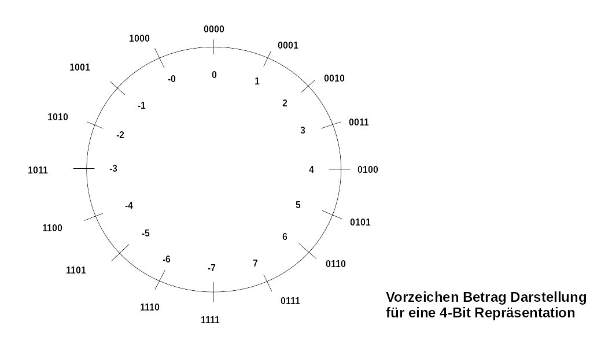<!-- style="width: 70%; max-width: 800px;" -->

<!--
style="width: 80%; min-width: 420px; max-width: 720px;"
-->
```ascii
Addition            Subtraktion

  0101    5           1100    -4
+ 0001    1         + 0010    +2
-----------         ------------
  0110    6           1110    -6  falsch!                                      .
```


| Darstellung | Pros                               | Cons                                                        |
| ----------- | ---------------------------------- | ----------------------------------------------------------- |
|             | + Einfache Bildung des Komplements | - Doppelte „0“ - $0000...0_2$ und $1000...1_2$              |
|             |                                    | - Addition / Subtraktion  über unterschiedliche Rechenwerke |

********************************************************************************

          {{2-5}}
********************************************************************************

**Komplement Darstellung**

<!--
style="width: 80%; min-width: 420px; max-width: 720px;"
-->
```ascii
                         10-er Komplement            9-er Komplement
0  ------------------   ------------------         ------------------
        ||   |                ||   |                     ||   |
        ||   |                ||   |                     ||   |
        ||   |  345           ||   | 345                 ||   | 345
        ||   |                ||   |                     ||   |
    612 ||   |            612 ||   |                612  ||   |
        ||   :                ||   :  |                  ||   :  |
        ||   :                ||   :  |                  ||   :  |
        ||   :                ||   :  | 1000-345         ||   :  | 999-345
                               !      | 655               !      | 654
    612-345 = 267              !      |                   !      |
                        -------!---------          -------!---------
                               !                          !
                               !                          !
                        612 + 655 = (1)267          612 + 654 + 1 = (1)267     .
```

********************************************************************************

          {{3-5}}
********************************************************************************

**Einer-Komplement**

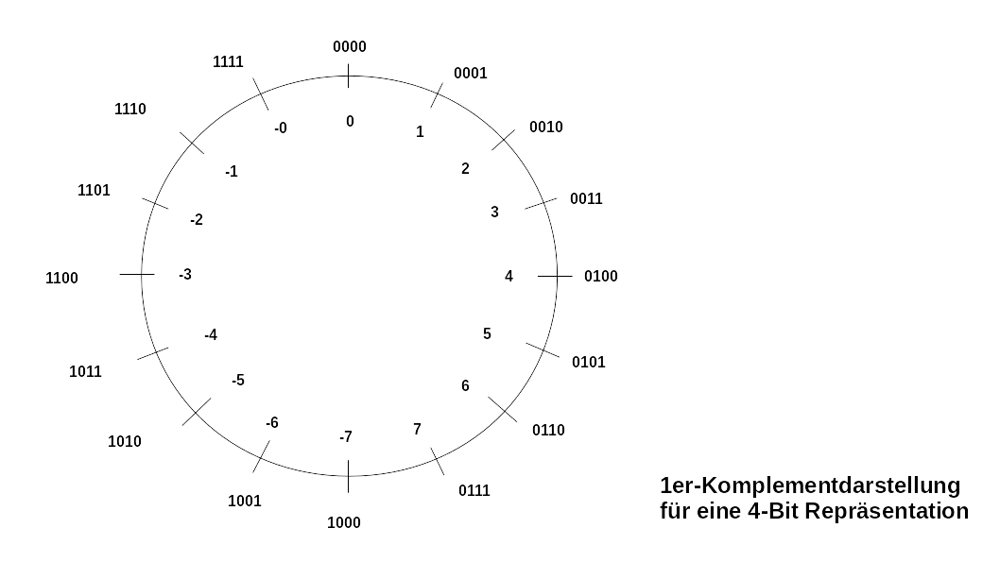<!-- style="width: 70%; max-width: 800px;" -->

| Darstellung | Pros                                                                                                   | Cons                                                                |
| ----------- | ------------------------------------------------------------------------------------------------------ | ------------------------------------------------------------------- |
|             | + der darstellbare Zahlenbereich ist symmetrisch zu 0                                                  | - Doppelte „0“ - $0000...0_2$ und $1111...1_2$                      |
|             | + sehr einfache Umwandlung von positiver zu negativer Zahl und umgekehrt durch Invertierung aller Bits | - Addierwerke sind aufwendiger, da die Summe korrigiert werden muss |

********************************************************************************

          {{4-5}}
********************************************************************************

**Zweier-Komplement**

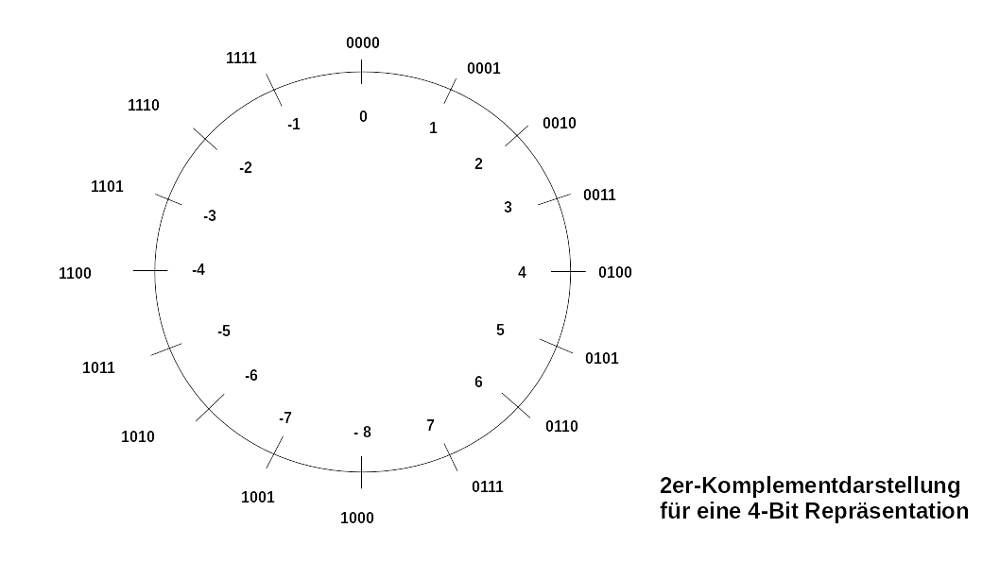<!-- style="width: 70%; max-width: 800px;" -->

Die Zweierkomplementdarstellung benötigt, anders als die Einerkomplementdarstellung, keine Fallunterscheidung, ob mit negativen oder mit positiven Zahlen gerechnet wird. Das Problem der Einerkomplementdarstellung, zwei Darstellungen für die Null zu haben, tritt nicht auf.

| Darstellung | Pros                                              | Cons                                                                                                                                     |
| ----------- | ------------------------------------------------- | ---------------------------------------------------------------------------------------------------------------------------------------- |
|             | + eindeutige Darstellung der Null als $000...0_2$ | - darstellbarer Zahlenbereich ist asymmetrisch (Zweierkomplement der kleinsten negativen Zahl ist nicht darstellbar!)                    |
|             |                                                   | + Umwandlung von positiver zu negativer Zahl und umgekehrt erfordert die Invertierung aller Bits sowie ein Addierwerk zur Addition von 1 |

********************************************************************************

          {{5}}
********************************************************************************

**Zusammenfassung**

| Darstellung | Pros                               | Cons                                                        |
| ----------- | ---------------------------------- | ----------------------------------------------------------- |
| Vorzeichen / Betrag             | + Einfache Bildung des Komplements | - Doppelte „0“ - $0000...0_2$ und $1000...1_2$              |
|             |                                    | - Addition / Subtraktion  über unterschiedliche Rechenwerke |
| Einerkomplement           | + der darstellbare Zahlenbereich ist symmetrisch zu 0                                                  | - Doppelte „0“ - $0000...0_2$ und $1111...1_2$                      |
|             | + sehr einfache Umwandlung von positiver zu negativer Zahl und umgekehrt durch Invertierung aller Bits | - Addierwerke sind aufwendiger, da die Summe korrigiert werden muss |
| Zweierkomplement               | + eindeutige Darstellung der Null als $000...0_2$ | - darstellbarer Zahlenbereich ist asymmetrisch (Zweierkomplement der kleinsten negativen Zahl ist nicht darstellbar!)                    |
|             |                                                   | + Umwandlung von positiver zu negativer Zahl und umgekehrt erfordert die Invertierung aller Bits sowie ein Addierwerk zur Addition von 1 |


> **Merke:** In aktuellen Rechnern wird ausschließlich das Zweierkomplement verwandt.

********************************************************************************

### Überlauf bei arithmetischen Operationen

> **Merke:** Wir müssen von einer festen Länge der Zahlenrepräsentation ausgehen!

+ begrenzte Genauigkeit bei der Darstellung von Kommazahlen (Gegenstand der Vorlesung im Sommersemester)
+ keine Abgeschlossenheit der Grundoperationen wie Addition und Multiplikation

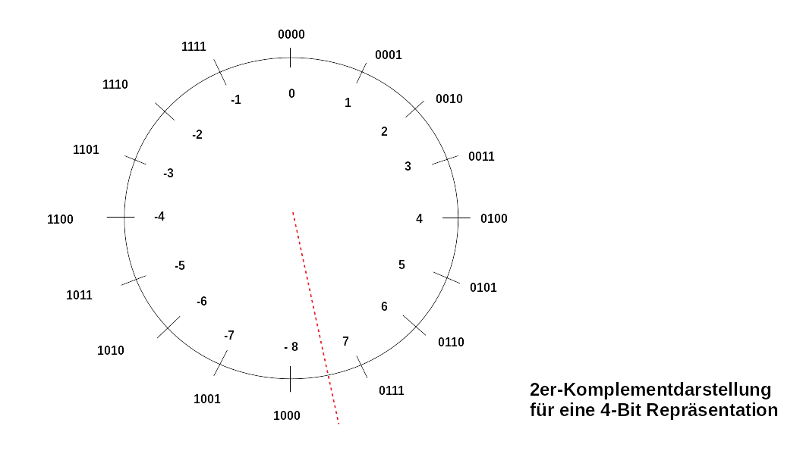<!-- style="width: 70%; max-width: 800px;" -->

```
           3 + 6 =         -3+(-8) =

4 Bit        0011             1101
           + 0110           + 1000
           ------           ------
             1001             0101

5 Bit       00011            11101
          + 00110          + 11000
           ------           ------
            01001 = 9        10101 = -11
```

Bei beliebig großen Registern zur Aufnahme der Komplementdarstellung einer binären Zahl können Addition und Subtraktion ohne Einschränkungen ausgeführt werden. ABER: Mit der Beschränkung kann de

+ Addition zweier positiver Zahlen kann eine negative Zahl ergeben !
+ Addition zweier negativer Zahlen kann eine positive Zahle ergeben !

Entsprechend müssen Überschreitungen des Zahlenbereiches erkannt und behandelt werden. Die Bedingungen dafür sind: Gegeben die Operanden $a$ und $b$  und das Ergebnis $s$

+ (a > 0) und (b > 0) und (s < 0) oder
+ (a < 0) und (b < 0) und (s > 0)

Dafür werden die höchstrangigen Bits der Summanden und des Ergebnisses ausgewertet.

## Schaltwerke für arithmetische Operationen

           {{0}}
********************************************************************************

Wir starten aus der Sicht eines einzigen Bits und erweitern die Konzepte dann auf die notwendigen Registerbreiten (8 - 64 Bit).

| A   | B   | Addition                                                   | Subtraktion                                                | Multiplikation                                                   |
| --- | --- | ---------------------------------------------------------- | ---------------------------------------------------------- | ---------------------------------------------------------------- |
| 0   | 0   | $0$                                                        | $0$                                                        | $0$                                                              |
| 0   | 1   | $1$                                                        | $1$ (borrow)                                               | $0$                                                              |
| 1   | 0   | $1$                                                        | $1$                                                        | $0$                                                              |
| 1   | 1   | $0$ (carry)                                                | $0$                                                        | $1$                                                              |
|     |     |  |  |  |
|     |     | Vierteladdierer                                            | Viertelsubtrahierer                                        | 1-Bit Multiplizierer                                                                 |


********************************************************************************

          {{1-2}}
********************************************************************************

**Halbaddierer**

Um das Ergebnis komplett darzustellen müsen wir für die Addition (Subtraktion als Komplementoperation) neben dem Ergebnis $S$ auch die Carry Flags $C$ berücksichtigen.

<table>
<tr>
<td>
Erweiterte Wahrheitstabelle
</td>
<td>
Gleichungen
</td>
</tr>
<tr>
<td>
| $A$ | $B$ | $S$ | $C$ |
| --- | --- | --- | --- |
| 0   | 0   | 0   | 0   |
| 0   | 1   | 1   | 0   |
| 1   | 0   | 1   | 0   |
| 1   | 1   | 0   | 1   |
</td>
<td>
$$
\begin{aligned}
S &= \overline{A}  \cdot B + A  \cdot \overline{B} = A \oplus B \\
C &= A \cdot B
\end{aligned}
$$
</td>
</tr>
</table>

Die Wahrheitstafel lässt sich mit folgendem Schaltnetz umsetzen:

<!-- style="width: 40%; max-width: 800px;" -->
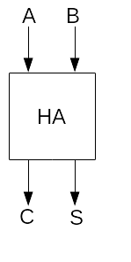<!-- style="width: 15%; max-width: 600px;" -->

``` json @DigiSim.evalJson
{"devices":{"a":{"label":"a","type":"Button","propagation":0,"position":{"x":15,"y":0}},"b":{"label":"b","type":"Button","propagation":0,"position":{"x":15,"y":50}},"s":{"label":"s","type":"Lamp","propagation":1,"position":{"x":315,"y":45}},"cout":{"label":"cout","type":"Lamp","propagation":1,"position":{"x":315,"y":0}},"xor":{"label":"a xor b","type":"Xor","propagation":1,"bits":1,"position":{"x":160,"y":50}},"and":{"label":"a and b","type":"And","propagation":1,"bits":1,"position":{"x":155,"y":-5}}},"connectors":[{"from":{"id":"a","port":"out"},"to":{"id":"and","port":"in1"}},{"from":{"id":"b","port":"out"},"to":{"id":"and","port":"in2"}},{"from":{"id":"and","port":"out"},"to":{"id":"cout","port":"in"}},{"from":{"id":"a","port":"out"},"to":{"id":"xor","port":"in1"}},{"from":{"id":"b","port":"out"},"to":{"id":"xor","port":"in2"}},{"from":{"id":"xor","port":"out"},"to":{"id":"s","port":"in"}}],"subcircuits":{}}
```

********************************************************************************

          {{2-3}}
********************************************************************************

**Volladierer**

Die allgemeingültige Addition von  $A_i$, $B_i$ und $C_{i–1}$  an den Bitpositionen  $i = 1, ... , n–1$  erfordert einen Volladdierer (FA = „Full Adder“), der die Summe $S_i$ und den Übertrag $C_i$ bestimmt:

<table>
<tr>
<td>
Erweiterte Wahrheitstabelle
</td>
<td>
Gleichungen
</td>
</tr>
<tr>
<td>
| $A_i$ | $B_i$ | $C_{i-1}$ | $S_i$ | $C_i$ |
| ----- | ----- | --------- | ----- | ----- |
| 0     | 0     | 0         | 0     | 0     |
| 0     | 0     | 1         | 1     | 0     |
| 0     | 1     | 0         | 1     | 0     |
| 0     | 1     | 1         | 0     | 1     |
| 1     | 0     | 0         | 1     | 0     |
| 1     | 0     | 1         | 0     | 1     |
| 1     | 1     | 0         | 0     | 1     |
| 1     | 1     | 1         | 1     | 1     |
</td>
<td>
$$
\begin{aligned}
S_i &= A_i \oplus B_i \oplus C_i\\
C_i &= \overline{A_i}B_i C_{i-1} + A_i\overline{B_i}C_{i-1} + A_iB_i\overline{C}_{i-1} + A_iB_iC_{i-1} \\
C_i &= (\overline{A_i}B_i + A_i\overline{B_i} )C_{i-1} + A_iB_i \\
    &= (A_i \oplus B_i)C_{i-1} + A_iB_i \\
C_i &= (A_i + B_i)C_{i-1} + A_iB_i \\
\end{aligned}
$$
</td>
</tr>
</table>

> **Aufgabe:** Die obige Gleichungen sind identisch und unterscheiden sich nur durch $/oplus$ und $+$. Erklären Sie den vermeintlichen Widerspruch.

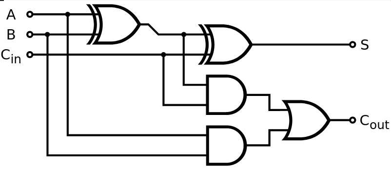<!-- style="width: 45%; max-width: 600px;" -->
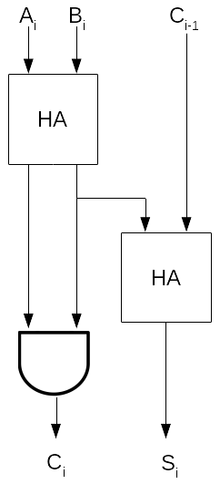<!-- style="width: 15%; max-width: 800px;" -->

``` json @DigiSim.evalJson
{"devices":{"a":{"label":"a","type":"Button","propagation":0,"position":{"x":15,"y":0}},"b":{"label":"b","type":"Button","propagation":0,"position":{"x":15,"y":50}},"cin":{"label":"cin","type":"Button","propagation":0,"position":{"x":15,"y":100}},"s":{"label":"s","type":"Lamp","propagation":1,"position":{"x":470,"y":70}},"cout":{"label":"cout","type":"Lamp","propagation":1,"position":{"x":540,"y":-5}},"xor1":{"label":"a xor b","type":"Xor","propagation":1,"bits":1,"position":{"x":140,"y":20}},"xor2":{"label":"(a xor b) xor cin","type":"Xor","propagation":1,"bits":1,"position":{"x":275,"y":75}},"and1":{"label":"(a xor b) and cin","type":"And","propagation":1,"bits":1,"position":{"x":290,"y":25}},"and2":{"label":"a and b","type":"And","propagation":1,"bits":1,"position":{"x":210,"y":-25}},"or":{"label":"((a xor b) and cin) or (a and b)","type":"Or","propagation":1,"bits":1,"position":{"x":380,"y":-30}}},"connectors":[{"from":{"id":"xor2","port":"out"},"to":{"id":"s","port":"in"}},{"from":{"id":"xor1","port":"out"},"to":{"id":"xor2","port":"in1"}},{"from":{"id":"cin","port":"out"},"to":{"id":"xor2","port":"in2"}},{"from":{"id":"a","port":"out"},"to":{"id":"xor1","port":"in1"}},{"from":{"id":"b","port":"out"},"to":{"id":"xor1","port":"in2"}},{"from":{"id":"cin","port":"out"},"to":{"id":"and1","port":"in2"},"vertices":[{"x":225,"y":115}]},{"from":{"id":"xor1","port":"out"},"to":{"id":"and1","port":"in1"}},{"from":{"id":"a","port":"out"},"to":{"id":"and2","port":"in1"}},{"from":{"id":"b","port":"out"},"to":{"id":"and2","port":"in2"},"vertices":[{"x":105,"y":25}]},{"from":{"id":"and1","port":"out"},"to":{"id":"or","port":"in2"}},{"from":{"id":"and2","port":"out"},"to":{"id":"or","port":"in1"}},{"from":{"id":"or","port":"out"},"to":{"id":"cout","port":"in"}}],"subcircuits":{}}
```

********************************************************************************


## Umsetzung von Addierwerken

Wie können wir also ein paralleles binäres Addierwerk umsetzen? Für die Addition zweier n-Bit Zahlen bedarf es $n$ Volladierer, die miteinander verkettet werden.

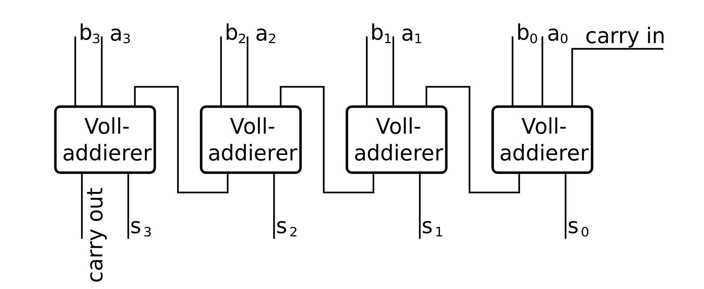<!-- style="width: 100%; max-width: 800px;" --> [^1]

[^1]: Mik81, Carry-Ripple Addierer, [Link](https://commons.wikimedia.org/wiki/File:Ripple-carry-adder.svg)

Das Carry wird von Stelle zu Stelle weitergegeben, woraus der Name „Ripple Carry“-Addierer resultiert. Das Ergebnis steht damit erst nach dem kompletten Durchlauf durch alle Volladdierer zur Verfügung.

          {{1-3}}
********************************************************************************

Wie lässt sich ausgehend von diesen Überlegungen ein 4-Bit Addier-/Subtrahierwerk realisieren. Wir wollen die Funktion $A+B$ sowie $A-B$ umsetzen können.

> **Aufgabe:** Entwerfen Sie die externe Beschaltung!

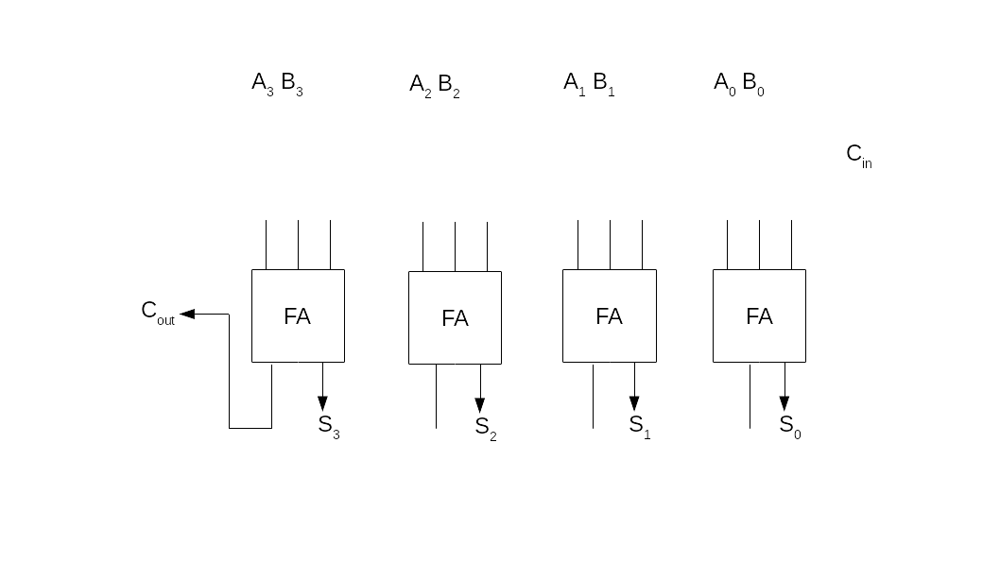<!-- style="width: 100%; max-width: 800px;" -->

********************************************************************************


          {{2}}
********************************************************************************

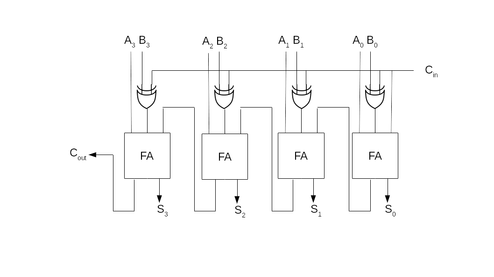<!-- style="width: 100%; max-width: 800px;" -->

********************************************************************************

### Carry Look Ahead Addierer

Die Verzögerung bei der sequenziellen Berechnung ist für realistische Systeme nicht tolerabel. Entsprechend suchen wir nach alternativen Vorgehensweisen. Ein Konzept implementiert der "Carry Look Ahead Addierer", Anstelle des sequentiellen Übertrag-Durchlaufs eine parallele Vorausberechnung aller Überträge $C_i$ vornimmt.

$$
\begin{aligned}
C &=  A_iB_i + (A_i + B_i)C_{i-1} \\
  &= G_i + P_i \cdot C_{i-1} \\
\end{aligned}
$$

+ „Generate“:  $G_i = A_i \cdot B_i$ gibt an, ob in Stelle $i$ ein Übertrag erzeugt wird
+ „Propagate“: $P_i  = A_i + B_i$ gibt an, ob in Stelle i ein Übertrag propagiert wird $(P_i = 1)$ oder nicht $(P_i = 0)$

Damit ergeben sich für die Übergänge $C_i$ folgende Zusammenhänge:

$$
\begin{aligned}
C_0 &= A_0 \cdot B_0 := G_0 \\
C_1 &= A_1B_1 + (A_1 + B_1)C_0 := G_1 + P_1G_0\\
C_2 &= G_2 + P_2G_1 + P_2P_1G_0 \\
C_3 &= G_3 + P_3G_2 + P_3P_2G_1 + P_3P_2P_1G_0 \\
C_4 &= G_4 + P_4G_3 + P_4P_3G_2 + P_4P_3P_2G_1 + P_4P_3P_2P_1G_0 \\
C_5 &= ._..
\end{aligned}
$$

Offenbar lässt sich die Funktion mit einem zweistufigen Schaltnetz umsetzen und generiert eine Laufzeit, die von $n$ unabhänig ist.

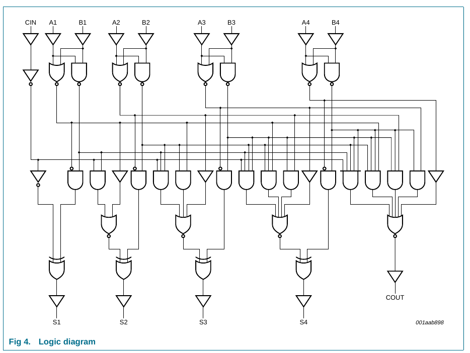<!-- style="width: 100%; max-width: 800px;" -->[^2]

[^2]: Philips Semiconductors, Datenblatt 74HC283

An der Schaltung wird deutlich, dass Gatter mit bis zu n + 1 Eingängen erforderlich sind. Man spricht an der Stelle von einem hohen „fan-in“. Gleichzeitig sind die Gatterausgänge $P_i$ und $G_i$ mit bis zu $(n+1)^2/4$ Gattereingängen verbunden (hoher "fan-out"). Damit ist ein vollständiger Carry-Look-Ahead Addierer nicht praktikabel und wird durch die sequenzielle Verschaltung in $m$-Bit Blöcken umgesetzt.

### Carry Save Addierer

Ein Carry-Save-Addierer wird verwendet, um die Summe von drei oder mehr Binärzahlen effizient zu berechnen. Er unterscheidet sich von anderen digitalen Addierern dadurch, dass er als Ergebnis eine Summe ohne Carries und die Carries separat ausgibt.

```
  10011 (a)                       19
+ 11001 (b)                       25
+ 01011 (c)                       11
-------                         ----
  00001 Summe ohne Carrys         45
 11011  Carry Flags               1
 ------                         ----
 110111 Gesamtsumme               55
```

Man beachte, dass das Ergebnis der ersten Stufe der Berechnung parallel ausgeführt werden kann. Danach bedarf es eine Carry-Look-Ahead Addierers um die Gesamtsumme zu berechnen.

Damit ergibt sich für Additionen von zwei Summanden kein Vorteil, mit einer größeren Zahl lässt sich aber ein deutlicher Geschwindigkeitsvorteil erzielen. Dazu werden die Ergebnisse jeweils in Blöcken zu jeweils 3 Summanden zusammengefasst.

## Exkurs: Multiplikation

```
     Faktor A   Faktor B   (211 x 206)
     11010011 x 11001110
(1)             00000000  0 x Faktor A
(2)            11010011   1 x Faktor A x 2
(3)           11010011    1 x Faktor A x 4
(4)          11010011
(5)         00000000
(6)        00000000
(7)       11010011
(8)      11010011
     -------------------
        1010100111001010   (43466)
```

Alle Einzelprodukte können mit Hilfe eines AND Gates parallel abgebildet werden. Dafür ist allerdings eine $n^2$ Zahl von Gates notwendig. Die Frage ist nun, wie die sogeannten Partialprodukte (1) bis (8) addiert werden können.

Hierfür kommt unser Carry Save Addierer zum Einsatz. Durch die Parallelisierung der Berechnungen können wir jeweils 3 Partialprodukte Berechnen, um dann die Ergebnisse S und C wiederum an die nächste Ebene zu übergeben. Im Beispiel wurde der Übersichtlichkeit wegen eine alternative Kombination gewählt. Dies ist aus der Kommutativität der Additionsoperation möglich.

```
Stufe 1:

(1)        00000000           (4)     11010011000  <-Achtung(!)
(2)       11010011            (5)    00000000
(3)      11010011             (6)   00000000
-------------------           -------------------
S1       1011101010           S2    0011010011000
C1       1000001000           C2    0000000000000

Stufe 2:
S1       1011101010           C2       0000000000
C1       1000001000           (7)  11010011000000
S2    0011010011000           (8) 110100110000000
---  --------------           -------------------
S3      11001111010           S4  101110101000000
C3    0010100010000           C4  100000100000000

Stufe 3:

S3      11001111010
C3    0010100010000
S4  101110101000000
-------------------
S5  001111000101010
C5  100101010100000

Stufe 4:

S5  001111000101010
C5  100101010100000
C4  100000100000000
-------------------
S6  001010110001010
C6 1001010001000000

Finale Aggregation

S6          001010110001010
C6       + 1001010001000000
        -------------------
Ergebnis:  1010100111001010 (43466)
```

+ Schritt 1: Partielle Produkte
+ Schritt 2: Aggregation der Partiellen Produkte
+ Schritt 3: Finale Addition

## Übungsaufgaben

+ Implementieren Sie einen 2Bit Multiplikator in einer Simulation. Welche Breite braucht man für das Ausgangsregister.
+ Realisieren Sie ein Subtraktions- / Additionswerk
