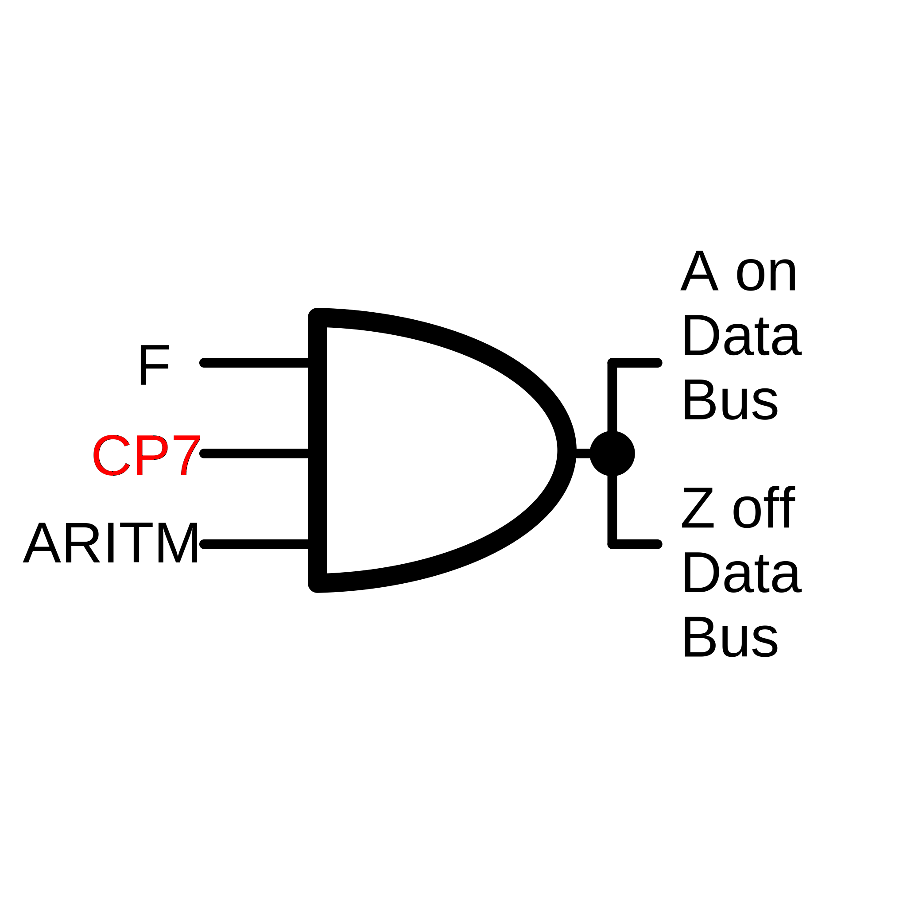
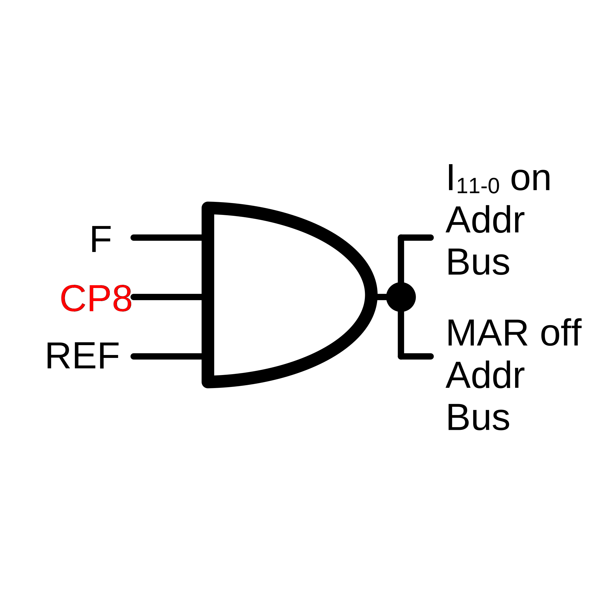
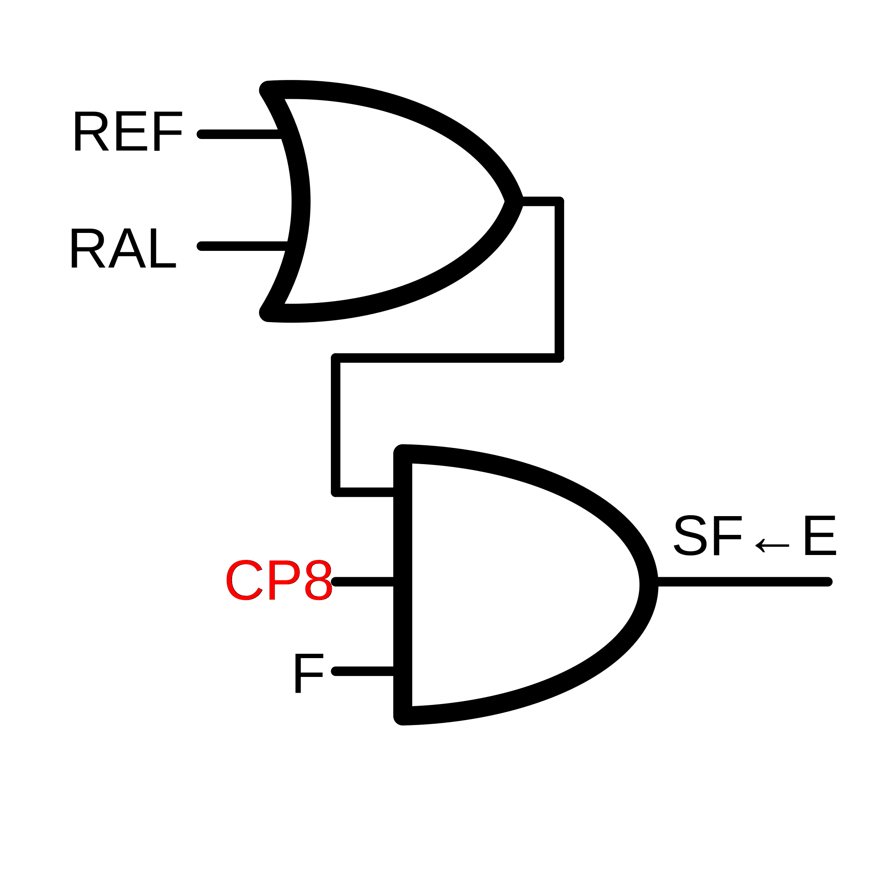

<!--

author:   Sebastian Zug & André Dietrich & Fabian Bär
email:    sebastian.zug@informatik.tu-freiberg.de & andre.dietrich@informatik.tu-freiberg.de & fabian.baer@student.tu-freiberg.de
version:  0.0.4
language: de
narrator: Deutsch Female

import:  https://raw.githubusercontent.com/liascript-templates/plantUML/master/README.md

mark: <span style="background-color: @0;
                                  display: flex;
                                  width: calc(100% + 32px);
                                  margin: -16px;
                                  padding: 6px 16px 6px 16px;
                                  ">@1</span>
red:  @mark(#FF888888,@0)
blue: @mark(lightblue,@0)
gray: @mark(gray,@0)
-->

# Modell CPU

**TU Bergakademie Freiberg - Wintersemester 2020 / 21**

Link auf die aktuelle Vorlesung im Versionsmanagementsystem GitHub

[https://github.com/TUBAF-IfI-LiaScript/VL_EingebetteteSysteme/blob/11_Modell_CPU.md](https://github.com/TUBAF-IfI-LiaScript/VL_EingebetteteSysteme/blob/master/11_Modell_CPU.md)

Die interaktive Form ist unter [diesem Link](https://liascript.github.io/course/?https://raw.githubusercontent.com/TUBAF-IfI-LiaScript/VL_EingebetteteSysteme/master/11_Modell_CPU.md#1) zu finden

---------------------------------------------------------------------

** Fragen an die Veranstaltung**

+ Welche Funktionalität sollte eine ALU bereitstellen?
+ Welcher Trade-Off ist mit der Entscheidung über die Wortbreite einer
+ CPU und der Breite des möglichen OP-Codes verbunden?
+ Welche Register gehören zum Programmiermodell eines Rechners?
+ Welche Register sind für das Laden der Programmbefehle erforderlich und wir arbeiten sie zusammen?
+ Erklären Sie die Vorgänge in der Fetch- und Execute-Phase der Befehlsabarbeitung.

<!--
style="width: 80%; min-width: 420px; max-width: 720px;"
-->
```ascii

                Abstraktionsebenen

           +----------------------------+ -.
  Ebene 6  | Problemorientierte Sprache |  |
           +----------------------------+  |
                                           ⎬ Anwendungssoftware
           +----------------------------+  |
  Ebene 5  | Assemblersprache           |  |
           +----------------------------+ -.

           +----------------------------+
  Ebene 4  | Betriebssystem             |     Systemsoftware
           +----------------------------+

           +----------------------------+
  Ebene 3  | Istruktionsset             |     Maschinensprache
           +----------------------------+

           +----------------------------+  -.      ╔═══════════════╗
  Ebene 2  | Mikroarchitektur           |   |   ◀══║ HIER SIND WIR!║
           +----------------------------+   |      ╚═══════════════╝
                                            ⎬ Automaten, Speicher, Logik
           +----------------------------+   |
  Ebene 1  | Digitale Logik             |   |
           +----------------------------+  -.

           +----------------------------+
  Ebene 0  | E-Technik, Physik          |     Analoge Phänomene
           +----------------------------+                                      .
```

---------------------------------------------------------------------

## Ausgangspunkt

```text @plantUML.png
@startuml
ditaa
               +------------------+
               |c88F              |
               |     Speicher     |
               |                  |
               +---------+-+------+
                       ^ | ^
                       | | |
+----------+  Adresse  | | |               +-----+-----+
|cF88      +-----------+ | |               |  A  |  B  |
|          |             | |        Daten  +-----+-----+
|          |   Befehl    | +-------------->+cFF4       |
|  Steuer- |<------------+                 |           |
|   werk   |                     Kontrolle |    ALU    |
|          +------------------------------>+           |
|          |                               |           |
|          |                       Status  |           |
|          |<------------------------------+           |
|          |                               |           |
|          | Kontrolle                     |           |
|          +-------------+         Daten   |           |
|          |             | +-------------->|           |
|          |  Status     | |               |           |
|          |<----------+ | |               |           |
+----------+           | | |               +-----------+
                       | | |
                       | V V
               +-------+-----------+
               |c8F8               |
               |    Ein/Ausgabe    |
               |                   |
               +-------------------+
@enduml
```

Der Prozessor ist die Einheit eines Rechners, die Daten nach einem vom Anwender spezifizierten Programm manipuliert. Das Programm wird als eine Folge von Anweisungen oder Befehlen für die CPU formuliert. Die CPU besteht daher:

1. aus einer Komponente, welche die Befehle liest, interpretiert und die korrekte Folge der Befehlsabarbeitung einhält - das Steuerwerk
2. aus einer Komponente, welche die Operationen auf den Daten, die durch die Befehle spezifiziert werden, ausführt

Das Steuerwerk besteht im wesentlichen aus einem Befehlsdecoder und einer Ablaufsteuerung. Befehle werden aus dem Befehlsspeicher gelesen und dekodiert.

| Befehl | Codierung | $F_0-F_2$ | $Z$ | $S_0-S_1$ |
| ------ | --------- | --------- | --- | --------- |
| ADD_B  | 0110      | 011       | 0   | 11        |

Der Programmzähler berechnet welcher Befehl im nächsten Schritt bearbeitet werden soll. Die Ablaufsteuerung erzeugt, entsprechend dem auszuführenden Befehl, die Steuer- oder Kontrollsignale, um Daten zu lesen, im Datenpfad zu bearbeiten und die Resultate zu speichern.

Bei der Bearbeitung der Daten werden vom Datenpfad Statussignale generiert, die wiederum den Ablauf des Programms beeinflussen können, wie z.B. eine Programmverzweigung, die abhängig davon ist, ob das Resultat einer Berechnung größer oder kleiner einem bestimmten Wert ist.

Der Datenpfad besteht aus der ALU, die im einfachsten Falle arithmetische und logische Grundoperationen ausführen kann und einem Registersatz, in dem Daten bei der Verarbeitung zwischengespeichert werden.

Auf dieser Basis wollen wir nun einen Modellrechner entwerfen, an dem die zentralen Komponenten eingehender Untersucht werden können. Wo fangen wir an?

## Wortformate

Um einen konkreten Maschinenbefehlssatz festlegen zu können, müssen die Randbedingungen unseres Prozessors betrachtet werden. Ein entscheidender Parameter ist die Wortbreite der Speicherschnittstelle. Die Wortbreite der Speicherschnittstelle bestimmt,
wie viele Bits in einem Speicherzugriff zwischen Prozessor und Speicher transferiert
werden können. Der intuitive Ansatz, diese Schnittstelle möglichst breit zu machen,
hat weitreichende Auswirkungen auf die Rechnerarchitektur insgesamt.

> Was nützt es, wenn wir zwar die Daten schnell aus dem Speicher lesen können, diese aber nur mit der halben Breite verarbeiten?
> Die Wortbreite des Speicher und der Breite der Verarbeitungseinheiten des Prozessors müssen abgestimmt sein.

Da Befehle und Daten **in unserem Modellrechner** in ein- und demselben Schreib/Lesespeicher stehen, muss die Wortbreite der Speicherschnittstelle auch für das Befehlswort berücksichtigt werden. Für unseren Modellrechner wählen wir eine Wortbreite von 16 Bit.

Welche Befehle soll unser Modellrechner nativ umsetzen können? Wir gehen von einem einfachen System aus, das arithmetisch/logische Operationen umsetzt, Sprünge realisiert und Eingaben von einem Schalterfeld lesen kann.

| Opcode | Mnemonic | Opperand | Beschreibung                                                                                                                                                                                         |     |
| ------ | -------- | -------- | ---------------------------------------------------------------------------------------------------------------------------------------------------------------------------------------------------- |
| 0000   | HLT      |          | HLT hält den Computer an. Kann auch manuell eingegeben werden. Nach HLT  kann der Rechner nur  manuell gestartet werden. Fortsetzung beim nächsten Befehl.                                            |
| 0001   | JMA      | addr     | (Jump on Minus) Bedingter Sprung. Wenn das Ergebnis einer Berechnung negativ ist. Die Adresse  "addr" wird in den Befehlszähler geladen. Der nächste Befehl wird von "addr" genommen.                |
| 0010   | JMP      | addr     | Unbedingter Sprung. Die Adresse "addr" wird in den Befehlszähler geladen. Der nächste  Befehl wird von "addr" genommen.                                                                              |
| 0011   | JSR      | addr     | Unterprogrammsprung. Die Adresse, die im Befehlszähler enthalten ist, wird ins Register A geladen. Die Adresse "addr" wird in den Befehlszähler geladen. Der nächste Befehl wird von "addr" geladen. |
| 0100   | SWR       |          | (Copy Switch Register to A) Der Zustand der  Schalter wird in das Register A  geladen.                                                                                                               |
| 0101   | RAL      |          | (Rotate A Left) Zyklischer Links-Shift. Der Inhalt von Register A wird um 1 Stelle nach  links rotiert. Ringshift : Bit A0 ← Bit A15                                                                 |
| 0110   | INP      |          |  INPUT                                                                                                                                                                                                |
| 0111   | OUT      |          | OUTPUT                                                                                                                                                                                               |
| 1000   | NOT      |          | Komplementbildung des Inhalts von Register A.                                                                                                                                                        |
| 1001   | LDA      | addr     | Laden des Registers A von Speicheradresse addr.                                                                                                                                                      |
| 1010   | STA      | addr     | Speichern des Registerinhalts auf Speicheradresse addr .                                                                                                                                             |
| 1011   | ADD      | addr     | Inhalt des Speicherwortes mit Adresse adr wird auf den Inhalt des Registers A addiert. Der  ursprünglich Inhalt von A wird mit dem Ergebnis überschrieben.                                           |
| 1100   | XOR      | addr     | Inhalt des Speicherwortes mit Adresse adr wird mit dem Inhalt des Registers A durch XOR verknüpft. Der ursprüngliche Inhalt von A wird mit dem Ergebnis überschrieben.                       |
| 1101   | AND      | addr     | Inhalt des Speicherwortes mit Adresse adr wird mit dem Inhalt des Registers a durch log.  UND verknüpft. Der ursprünglich Inhalt von A wird mit dem Ergebnis überschrieben.                          |
| 1110   | IOR      | addr     | Inhalt des Speicherwortes mit Adresse adr wird mit dem Inhalt des Registers A durch log.  ODER verknüpft. Der ursprünglich Inhalt von A wird mit dem Ergebnis überschrieben.                         |
| 1111   | NOP      |          | (No Operation) Der Befehlszähler wird um 1 erhöht.                                                                                                                                                  |

Nun muss die Aufteilung ein Befehlswort in ein Feld für den Operationscode und ein Feld zur Adressierung des Operanden aufgeteilt werden. Mit 16 Bit für das Operandenfeld können insgesamt 64 k Worte adressiert werden. Jedes Bit, das wir für die Codierung der Befehle brauchen, halbiert diesen Wert. Als einen Kompromiss zwischen der Größe des Speicheradressraums und einem Befehlssatz, der die wesentlichen arithmetisch/logischen Operationen enthält, nehmen wir eine Aufteilung vor in ein:

Befehlsformat:

```text @plantUML.png
@startuml
ditaa
15         12 11                             0
+------------+-------------------------------+
|c00F OPCODE | cFF0 Operantenaddresse        |
+------------+-------------------------------+
@enduml
```

Datenformat:

```text @plantUML.png
@startuml
ditaa
   15    14                                  0
+-------+------------------------------------+
|cF00 V | cFF0                               |
+-------+------------------------------------+
@enduml
```

## Wie sieht ein Programm dann aus?

**Beispiel Variabler Linksshift**

Das Programm belegt 15 aufeinander folgende Speicherplätze. Die nächste Spalte gibt die binäre Repräsentation des
Programms an. Die mnemotechnische Darstellung und ein Kommentarfeld sind in den
folgenden Spalten dargestellt.

Unser Rechner wird nur ein echtes Register $A$ haben. Entsprechend müssen wir die Variablen im Speicher ablegen und von dort wieder laden. Das Programm besteht dann aus zwei Teilen

| Adresse  | Speicherinhalt    |                  Programmzeilen                   | Kommentar                                                               |
| -------- | ----------------- |:-------------------------------------------------:| ----------------------------------------------------------------------- |
| 00010000 | $1001$ $10000001$ | `         LDA 10000001`<!-- style="white-space: pre;"--> | Lade Anzahl der Rechts-Shifts aus dem Speicher $10000001$ in Register a |
| 00010001 | $1000$ $ -------$ | `         NOT         `<!-- style="white-space: pre;"-->   | Komplementieren von a                                                   |
| 00010010 | $1011$ $10000010$ | `         ADD 10000010`<!-- style="white-space: pre;"-->   | 2-Komplement                                                            |
| 00010011 | $1011$ $10000100$ | `         ADD 10000100`<!-- style="white-space: pre;"-->    | Berechne : 16 + (-AR)                                                   |
| 00010100 | $1010$ $10000011$ | `         STA 10000011`<!-- style="white-space: pre;"--> | Speichere Anzahl der Links-Shifts                                       |
| 00010101 | $1001$ $10000000$ | ` NEXT:   LDA 10000000`<!-- style="white-space: pre;"--> | Lade Datum                                                              |
| 00010110 | $0101$ $ -------$ | `         RAL         `<!-- style="white-space: pre;"--> | Links-Shift                                                             |
| 00010111 | $1010$ $10000000$ | `         STA 10000000`<!-- style="white-space: pre;"--> | Speichere Datum                                                         |
| 00011000 | $1001$ $10000010$ | `         LDA 10000010`<!-- style="white-space: pre;"--> | Lade  Konstante “1“                                                     |
| 00011001 | $1000$ $ -------$ | `         NOT         `<!-- style="white-space: pre;"--> | Komplementieren von a                                                   |
| 00011010 | $1011$ $10000010$ | `         ADD 10000010`<!-- style="white-space: pre;"--> | 2-Komplement                                                            |
| 00011011 | $1011$ $10000011$ | `         ADD 10000011`<!-- style="white-space: pre;"--> | Decrementiere Anzahl der L-Shifts                                       |
| 00011100 | $1010$ $10000011$ | `         STA 10000011`<!-- style="white-space: pre;"--> | Speichere verbleibende Anzahl der L-Shifts                              |
| 00011101 | $0001$ $00011111$ | `         JMA DONE    `<!-- style="white-space: pre;"--> | Bed. Sprung, wenn alle L-Shifts ausgeführt wurden                       |
| 00011110 | $0010$ $00010101$ | `         JMP NEXT    `<!-- style="white-space: pre;"--> | Unbed. Sprung zum Anfang der Schleife                                   |
| 00011111 | $0000$ $ -------$ | ` DONE:   HLT         `<!-- style="white-space: pre;"--> |                                                                         |

Der entsprechende Speicherauszug dazu:

| Adresse  | 15  |     |     |     |     |     |     |     |     |     |     |     |     |     |     | 1   | Bemerkung                          |
| -------- | --- | --- | --- | --- | --- | --- | --- | --- | --- | --- | --- | --- | --- | --- | --- | --- | ---------------------------------- |
| 10000000 | 0   | 0   | 0   | 0   | 0   | 0   | 0   | 0   | 0   | 0   | 0   | 0   | 1   | 1   | 0   | 1   | D: Zu shiftender Wert              |
| 10000001 | 0   | 0   | 0   | 0   | 0   | 0   | 0   | 0   | 0   | 0   | 0   | 0   | 0   | 1   | 0   | 1   | AR: Anzahl der Rechts-Shifts       |
| 10000010 | 0   | 0   | 0   | 0   | 0   | 0   | 0   | 0   | 0   | 0   | 0   | 0   | 0   | 0   | 0   | 1   | “1“: Konstante “1“                 |
| 10000011 | 0   | 0   | 0   | 0   | 0   | 0   | 0   | 0   | 0   | 0   | 0   | 0   | 0   | 0   | 0   | 0   | TMP: Temp. Anzahl der Links-Shifts |
| 10000100 | 0   | 0   | 0   | 0   | 0   | 0   | 0   | 0   | 0   | 0   | 0   | 1   | 0   | 0   | 0   | 0   | “16“: Konstante “16“               |

Da wir als Befehl nur den zyklischen Linksshift (`RAL`) um 1 Stelle zur Vefügung haben, müssen wir den zyklischen Rechtsshift um eine beliebige Anzahl (<215-1) von Stellen durch ein Programm simulieren. Im Modellrechner kann in einem Befehl kein Direktoperand angegeben werden. Deshalb werden alle Konstanten und Variablen im Speicher ablegen.


## Elemente des Modelle-Rechners

Die Elemente des Rechners lassen sich, wie bereits in der vergangen Vorlesung dargestellt, in 4 Kategorien einteilen - Speicher, Rechenwerk, Steuerwerk und Ein-Ausgabe.

### Speicherbezogene Komponente

```text @plantUML.png
@startuml
ditaa
+-----------------------------------------------------+
| Speicherbezogene Komponenten                        |
| c88F                                                |
| +-----------+                                       |
| |Memory     |                                       |
| |           |<-----------------------+              |
| +-----------+                        |              |
|     |  ^                             |              |
| 15  V  |              0   11         |          0   |
| +------+---------------+ +-----------+-----------+  |
| |Memory Buffer Register| |Memory Address Register|  |
| |                      | |                       |  |
| +----------------------+ +-----------------------+  |
+-----------------------------------------------------+

@enduml
```


In einem Speicherzyklus muss der Prozessor zunächst eine Adresse liefern, die während des gesamten Speicherzyklus anliegen muss. Für einen Schreibzyklus betrifft dies auch das entsprechend abzulegende Datum. Bei einem Lesezyklus steht das gewünschte Wort erst mit einer gewissen Verzögerung an der Schnittstelle zur Verfügung. Da der Speicher sowohl zum Schreiben als auch zum Auslesen eines Wortes länger braucht als die Zeit, in der der Prozessor eine elementare Operation ausführen kann, sind zwei Pufferregister vorgesehen:

1. Das Speicher-Adress-Register (MAR : Memory Address Register), in das die Adresse zu Beginn des Speicherzyklus geschrieben wird. In unserem Fall ist das MAR 16 Bit breit.

2. Das Speicher-Puffer-Register (MBR : Memory Buffer Register). Bei einer Schreiboperation legt der Prozessor ein Datenwort hier ab, so dass es durch den (langsamen) Schreibvorgang im Speicher unter der Adresse abgespeichert wird, die im MAR spezifiziert ist. Beim Lesen stößt der Prozessor den Lesevorgang an und kann später das adressierte Wort aus dem MBR auslesen. Die Adresse ist bei uns 11Bit breit. Wir können also 2^11 Adressen ansprechen, die jeweils 16 Bit Daten repräsentieren.

Durch MBR und MAR sind Prozessor und Speicher bezüglich ihrer Zykluszeiten weitgehend entkoppelt.

### Datenpfadbezogene Komponente

Der Datenpfad besteht aus der ALU, dem allgemeinen Register A (Akkumulator), einem Hilfsregister Z und dem Eingang-Ausgang-Schalterregister SWR. Die zweistelligen arithmetischen und logischen Befehle haben alle die Form:

< OPCODE, addr >

Sie setzen voraus, daß der eine Operand in A steht, der zweite Operand muß aus dem Speicher von Adresse "addr" gelesen wird. Dabei gehen wir davon aus, dass der Operand im MBR zur Verfügung steht. Da die ALU rein kombinatorisch aufgebaut werden soll, müssen beide Operanden während der Verarbeitungszeit an den Eingängen anliegen. Das Ergebnis der Operation wird in A verfügbar gemacht. Damit das Ergebnis der Operation nicht einen der Operanden in A überschreibt, ist das Hilfsregister Z vorgesehen. Während der Befehlsausführung wird der Operand aus A nach Z transferiert, damit das Ergebnis in A gespeichert werden kann.

```text @plantUML.png
@startuml
ditaa
+---------------------------------+
|  Datenpfadbezogene Komponenten  |
|  c88F                           |
|                                 |
| +-----------------------------+ |
| |        Z-Register           | |
| +-----------------------------+ |
| |                             | |
| |             ALU             | |
| |                             | |
| +-----------------------------+ |
|             |     ^             |
|             v     |             |
| +-----------------+-----------+ |
| |              A              | |
| +-----------------------------+ |
|             |     ^             |
|             V     |             |
| +-----------------+-----------+ |
| |            SWR              | |
| +-----------------------------+ |
+---------------------------------+
@enduml
```


### Steuerwerk

Die Kontrolleinheit besteht aus:

1. dem Programmzähler,
2. dem Befehls- oder Instruktionsregister,
3. dem RUN/HLT Flip-Flop,
4. dem State-Flip-Flop,
5. dem Automaten, der die der sequentiellen Kontrolle realisiert.

```text @plantUML.png
@startuml
ditaa
+-------------------------------------------------+
| 11                             0                |
| +-------------------------------+               |
| | Program Counter               |               |
| +-------------------------------+               |
|                                                 |
| 15         12 11                             0  |
| +------------+-------------------------------+  |
| | OPCODE     | Operand                       |  |
| +------------+-------------------------------+  |
|       Instruction Register                      |
|                                                 |
| +-----------------+   +-------------+           |
| | Control unit    |   |State FF     |           |
| |                 |   +-------------+           |
| |                 |                             |
| |                 |   +-------------+           |
| |                 |   |Run FF       |           |
| +-----------------+   +-------------+           |
| Kontrolleinheit bezogene Komponenten   c88F     |
+-------------------------------------------------+
@enduml
```

Der Prozessor liest eine neue Instruktution aus dem MBR in das Instruction Register. Die Control Unit interpretiert den Operationscode und startet die Ausführung, währenddessen wird der Programmzähler bereits auf die Adresse der Instruktion gesetzt, die als nächste ausgeführt werden soll. Über den Programmzähler wird also die Sequenzierung der Instruktionen bei der Abarbeitung eines Programms gesteuert. Das State FF  übernimmt die unterschiedliche Abarbeitung von Befehlen, die in einem Zyklus und zwei Zyklen umgesetzt werden können (HLT vs ADD).

> **Merke:** Das Steuerwerk implementiert einen Automaten für die Instruktionsabarbeitung des Prozessors.

### Und jetzt alles zusammen

```text @plantUML.png
@startuml
ditaa
+-----------------------------------------------------+  +---------------------------------+
| Speicherbezogene Komponenten                        |  |  Datenpfadbezogene Komponenten  |
| c88F                                                |  |  c88F                           |
| +-----------+                                       |  | +-----------------------------+ |
| |Memory     |                                       |  | |        Z-Register           | |
| |           |<-----------------------+              |  | +-----------------------------+ |
| +-----------+                        |              |  | |                             | |
|     |  ^                             |              |  | |             ALU             | |
| 15  V  |              0   11         |          0   |  | |                             | |
| +------+---------------+ +-----------+-----------+  |  | +-----------+-----------------+ |
| |Memory Buffer Register| |Memory Address Register|  |  |             |     ^             |
| |                      | |                       |  |  |             v     |             |
| +----------------------+ +-----------------------+  |  | +-----------------+-----------+ |
+-----------------------------------------------------+  | |              A              | |
                                                         | +-----------------------------+ |
+-----------------------------------------------------+  |             |     ^             |
| 11                             0                    |  |             V     |             |
| +-------------------------------+                   |  | +-----------------+-----------+ |
| | Program Counter               |                   |  | |              SWR            | |
| +-------------------------------+                   |  | +-----------------------------+ |
|                                                     |  +---------------------------------+
| 15         12 11                             0      |
| +------------+-------------------------------+      |
| | OPCODE     | Operand                       |      |
| +------------+-------------------------------+      |
|       Instruction Register                          |
|                                                     |
| +-----------------+   +-------------+               |
| | Control unit    |   |State FF     |               |
| |                 |   +-------------+               |
| |                 |                                 |
| |                 |   +-------------+               |
| |                 |   |Run FF       |               |
| +-----------------+   +-------------+               |
| Kontrolleinheit bezogene Komponenten          c88F  |
+-----------------------------------------------------+
@enduml
```

1. Der Akkumulator (`Register A`). In dem Modellrechner ist der Akkumulator das einzige allgemeine Register. Alle arithmetischen und logischen Befehle arbeiten auf diesem Register.
2. Das Schalterregister (`Switch Register: SWR`) besteht aus 16 Schaltern, die z.B. an der Frontplatte eines Rechners angebracht sind. Sie können manuell gesetzt und vom Rechner abgefragt werden.
3. Der Programmzähler (`Programm Counter`) wird beim Unterprogrammsprung(JSR, Jump Subroutine) in den Akkumulator geladen, durch den Befehl RTS (Return from Subroutine) wird der Inhalt des Akkumulators in den Programmzähler geladen.
4. Das `Halt-Flip-Flop` wird durch den Befehl HLT gesetzt. Es kann nur manuell zurückgesetzt werden.

## Beschreibung der prozessorinternen Vorgänge

| Schritt                        | Bedeutung                                                                                   |
| ------------------------------ | ------------------------------------------------------------------------------------------- |
| 1. Befehl holen                | Befehl entsprechend der Adressvorgabe aus dem MAR aus dem Speicher lesen und in MBR ablegen |
| 2. Befehl dekodieren           | aktuellen Befehl aus MBR nach IR verschieben und dekodieren                                 |
| 3. ggf Operanden bereitstellen | Daten entsprechend dem weiterbewegten PC (MAR) lesen und im MBR ablegen                     |
| 4. Befehl ausführen            | Kontrolleinheit definiert die entsprechenden Steuerleitungen                                |
|  5. ggf Ergebnis speichern                              |  Sichere den Inhalt von A ins MBR, Manipuliere den Inhalt des MBR                                                                                       |

```text @plantUML.png
@startuml
digraph finite_state_machine {
    node [shape = point ]; qi
    node[shape=Mrecord]
    A[label="{1. Befehlsholphase}"];
    B[label="{2. Befehlsdekodierung}"];
    C[label="{3. Operandenholphase}",style=filled,color=".7 .3 1.0"];
    D[label="{4. Ausführungsphase}",style=filled,color=".7 .3 1.0"];
    E[label="{5. Speichern}",style=filled,color=".7 .3 1.0"];
    F[label="{Fetch}"];
    G[label="{Execute}",style=filled,color=".7 .3 1.0"];

    qi -> A;
    A  -> B  [ label = "E == 7" ];
    B  -> C  [ label = "Zusätzlicher Operand \n notwendig" ];
    B  -> D  [ label = "kein Operand \n erforderlich" ];
    C  -> D  [ label = "" ];
    D  -> E  [ label = "" ];
    D  -> A  [ label = "keine Speicherung" ];
    E  -> A  [ label = "" ];
}
@enduml
```
@plantUML

### Register-Transfer-Sprache

Zur Bearbeitung einer Instruktion, z.b. einem "ADD addr", braucht der Prozessor mehrere Schritte. Wie lässt sich aber der Daten- und Kontrollfluss zwischen den einzelnen Komponenten abbilden?

Eine Möglichkeit der Darstellung ist die Beschreibung des der Struktur des Prozessors und die Beschreibung von dessen Verhalten auf der Register-Transfer Ebene:

1.  Strukturbeschreibung - umfasst z.B. die vorhandenen Register, die arithmetisch/logischen Einheiten und die dazugehörige Verbindungsstruktur
2.  Verhaltensbeschreibung - beschreibt das Zusammenspiel der Komponenten bei der Erfüllung einer bestimmten Aufgabe. Die Zustandsdiagramme, die wir zur Beschreibung von Automaten eingeführt haben, sind eine Form der Verhaltensbeschreibung.

Die hier verwendete Register-Transfer Sprache wurde von T.C. Bartee, I.L. Lebow, I.S. Reed: _Theory and Design of Digital Machines_ beschrieben

**Grundelemente von RTL**

| Element     | Darstellung  | Bedeutung                                                     |
| ----------- | ------------ | ------------------------------------------------------------- |
| Register    | $R_n$        | bezeichnet die Bitstellen $n,n-1,. . . , 0$ des Registers $R$, eine Slicing wird über die Indizes beschrieben $R_{5-11}$ |
| Transfer    | $\leftarrow$ |   $A \leftarrow B$ bezeichnet den Transfer des Inhalts von Register B nach A                                                            |
| Speicher    | $M[addr]$    |  bezeichnet den Inhalt der Speicherzelle mit der Adresse "addr"                                                             |
| Bedingungen | $B:$         |     bezeichnet den Inhalt der Speicherzelle mit d z.B. $R = 0: A \leftarrow B,$ oder  $CP7 \cdot RAL: A \leftarrow Z                                 $                           |

**Beispiele**

| Kategorie             | Beispiel                                                     | Bedeutung                                                                                                                                             |
| --------------------- | ------------------------------------------------------------ | ----------------------------------------------------------------------------------------------------------------------------------------------------- |
| Zwingende Operationen | $a_{3-0}\leftarrow b_{7-4}$                                  | Inhalt der Bits 4-7 werden aus Register b auf die Stellen 0-3 des Registers a übertragen.                                                             |
|                       | $a\leftarrow SUM (a, b)$                                     |                                                                                                                                                       |
|                       | $a\leftarrow SUM (a, 1)$                                     |                                                                                                                                                       |
|                       | $a\leftarrow M[576]$                                         | Das Speicherwort an der Adresse 576 wird in Register a transferiert.                                                                                  |
| Bedingte Operationen  | $R=0: a\leftarrow b$                                         | Wenn die Bedingung R gleich Null gilt, wird der Inhalt des Registers b nach a übertragen.                                                             |
|                       | $C_n\cdot CLR:  a\leftarrow 0, b\leftarrow 0, c\leftarrow 0$ | Wenn der Takt $C_n$ anliegt, un dder Befehl "HLT" wird der Run-Flip-Flop auf 0 gesetzt.                                                               |
|                       | $C_n\cdot JMP:  PC\leftarrow IR_{11-0}$                      | Wenn der Takt $C_n$ anliegt, und der Befehl "JMP" ausgeführt wird, erfolgt der Transfer des Inhaltes des Instruktionsregisters an den Programmzähler. |

### Abläufe der Befehlsabarbeitung

Einige Befehle, insbesondere die, welche keinen zweiten Operanden oder ALU-Aktivitäten benötigen, können vollständig in der IF-Phase abgearbeitet werden. Dies gilt für $HLT$, $NOP$, $CSA$, und die Sprungbefehle $JMP$, $JMA$ und $SRJ.$  Bei diesen Befehlen wird im letzten Prozessorzyklus (CP8) eine neue Adresse in das $MAR$ geladen, und dadurch der neue Speicherzyklus vorbereitet.

Während bei $HLT$, $NOP$ und $CSA$ der Programmzähler einfach inkrementiert wird, muss bei den Sprungbefehlen die Zieladresse des Sprungs, die im  Operandenfeld der Instruktion ($IR_{11-0}$) steht, aus dem $IR$ in das $MAR$ geladen werden.

Bei den Befehlen, zu deren Ausführung die EX-Phase benötigt wird, wird in CP8 das SF in den Zustand E (Execute) gesetzt. Wird ein zweiter Operand benötigt, wird das Operandenfeld der Instruktion, das die Adresse enthält, in das MAR geladen, um den neuen Speicherzyklus zu initiieren

In der EX-Phase werden die arithmetisch/logischen Operationen, sowie Speicherbefehle LOAD/STORE und Ein/Ausgabebefehle ausgeführt.

<table border="1">
<thead>
<tr>
<th>OPCode</th>
<th>0000</th>
<th>0001</th>
<th>0010</th>
<th>0011</th>
<th>0100</th>
<th>0101</th>
<th>0110</th>
<th>0111</th>
<th>1000</th>
<th>1001</th>
<th>1010</th>
<th>1011</th>
<th>1100</th>
<th>1101</th>
<th>1110</th>
<th>1111</th>
</tr>
</thead>
<tbody>
<tr>
<td>Befehl</td>
<td>HLT</td>
<td>JMA</td>
<td>JMP</td>
<td>JSR</td>
<td>SWR</td>
<td>RAL</td>
<td>INP</td>
<td>OUT</td>
<td>NOT</td>
<td>LDA</td>
<td>STA</td>
<td>ADD</td>
<td>XOR</td>
<td>AND</td>
<td>IOR</td>
<td>NOP</td>
</tr>
<tr>
<td>CP1</td>
<td colspan="16" style="text-align: center; vertical-align: middle;"> $MBR \leftarrow M[A]$</td>
</tr>
<tr>
<td>CP2</td>
<td></td>
<td></td>
<td></td>
<td></td>
<td></td>
<td></td>
<td></td>
<td></td>
<td></td>
<td></td>
<td></td>
<td></td>
<td></td>
<td></td>
<td></td>
<td></td>
</tr>
<tr>
<td>CP3</td>
<td colspan="16" style="text-align: center; vertical-align: middle;"> $PC \leftarrow PC + 1$</td>
</tr>
<tr>
<td>CP4</td>
<td colspan="16" style="text-align: center; vertical-align: middle;"> $IR \leftarrow MBR $ </td>
</tr>
<tr>
<td>CP5</td>
<td></td>
<td></td>
<td></td>
<td></td>
<td></td>
<td></td>
<td></td>
<td></td>
<td></td>
<td></td>
<td></td>
<td></td>
<td></td>
<td></td>
<td></td>
<td></td>
</tr>
<tr>
<td>CP6</td>
<td></td>
<td></td>
<td></td>
<td></td>
<td></td>
<td></td>
<td></td>
<td></td>
<td></td>
<td></td>
<td></td>
<td></td>
<td></td>
<td></td>
<td></td>
<td></td>
</tr>
<tr>
<td>CP7</td>
<td>$RF \leftarrow H$</td>
<td>$A_{15}=1:PC\leftarrow IR_{11-0}$</td>
<td>$PC\leftarrow IR_{11-0}$</td>
<td>$A_{11-0} \leftarrow  PC$</td>
<td>$A \leftarrow SWR$</td>
<td>$Z \leftarrow A$</td>
<td></td>
<td></td>
<td>$Z \leftarrow A$</td>
<td></td>
<td></td>
<td>$Z \leftarrow A$</td>
<td>$Z \leftarrow A$</td>
<td>$Z \leftarrow A$</td>
<td>$Z \leftarrow A$</td>
<td></td>
</tr>
<tr>
<td>CP8</td>
<td>$MAR \leftarrow PC$</td>
<td>$MAR \leftarrow PC$</td>
<td>$MAR \leftarrow PC$</td>
<td>$PC\leftarrow IR_{11-0}, MAR \leftarrow PC $</td>
<td>$MAR \leftarrow PC$</td>
<td>$SF\leftarrow E$</td>
<td></td>
<td></td>
<td>$SF\leftarrow E$</td>
<td colspan="6" style="text-align: center; vertical-align: middle;"> $SF\leftarrow E, MAR \leftarrow IR_{11-0}$</td>
<td>$MAR \leftarrow PC$</td>
</tr>
</tbody>
<tbody bgcolor='#898ae3'>
<tr>
<td>CP1</td>
<td></td>
<td></td>
<td></td>
<td></td>
<td></td>
<td></td>
<td></td>
<td></td>
<td></td>
<td>$MBR\leftarrow M[A]$</td>
<td></td>
<td>$MBR\leftarrow M[A]$</td>
<td>$MBR\leftarrow M[A]$</td>
<td>$MBR\leftarrow M[A]$</td>
<td>$MBR\leftarrow M[A]$</td>
<td></td>
</tr>
<tr>
<td>CP2</td>
<td></td>
<td></td>
<td></td>
<td></td>
<td></td>
<td>$A\leftarrow Z^*$</td>
<td></td>
<td></td>
<td>$A\leftarrow \overline{Z}$</td>
<td></td>
<td></td>
<td></td>
<td></td>
<td></td>
<td></td>
<td></td>
</tr>
<tr>
<td>CP3</td>
<td></td>
<td></td>
<td></td>
<td></td>
<td></td>
<td></td>
<td></td>
<td></td>
<td></td>
<td></td>
<td></td>
<td></td>
<td></td>
<td></td>
<td></td>
<td></td>
</tr>
<tr>
<td>CP4</td>
<td></td>
<td></td>
<td></td>
<td></td>
<td></td>
<td></td>
<td></td>
<td></td>
<td></td>
<td></td>
<td></td>
<td></td>
<td></td>
<td></td>
<td></td>
<td></td>
</tr>
<tr>
<td>CP5</td>
<td></td>
<td></td>
<td></td>
<td></td>
<td></td>
<td></td>
<td></td>
<td></td>
<td></td>
<td>$A\leftarrow MBR$</td>
<td>$MBR \leftarrow A$</td>
<td></td>
<td></td>
<td></td>
<td></td>
<td></td>
</tr>
<tr>
<td>CP6</td>
<td></td>
<td></td>
<td></td>
<td></td>
<td></td>
<td></td>
<td></td>
<td></td>
<td></td>
<td></td>
<td>$M[A] \leftarrow MBR$</td>
<td></td>
<td></td>
<td></td>
<td></td>
<td></td>
</tr>
<tr>
<td>CP7</td>
<td></td>
<td></td>
<td></td>
<td></td>
<td></td>
<td></td>
<td></td>
<td></td>
<td></td>
<td></td>
<td></td>
<td>$A \leftarrow Sum(MBR, Z)$</td>
<td>$A \leftarrow MBR \oplus Z$</td>
<td>$A \leftarrow MBR \cdot Z$</td>
<td>$A \leftarrow MBR + Z$</td>
<td></td>
</tr>
<tr>
<td>CP8</td>
<td></td>
<td></td>
<td></td>
<td></td>
<td></td>
<td>$MAR \leftarrow PC, SF \leftarrow F$</td>
<td></td>
<td></td>
<td colspan="7" style="text-align: center; vertical-align: middle;"> $ MAR \leftarrow PC, SF \leftarrow F$</td>
<td></td>
</tr>
</tbody>
</table>

Der folgende Automat bildet die Abarbeitung der Instruktionen `HLT`, `JMP`, `JMA` und `JSR` in einem Automaten ab.

```text @plantUML.png
@startuml
state "Memory read" as Fetch1 : MBR ← M[MAR]
state "Wait for memory read" as Fetch2 : (wait)
state "Increment PC" as Fetch3 : PC ← PC+1
state "Instruction load" as Fetch4 : IR ← MBR
state "Instruction decoding" as Fetch56 : (wait)
state decodefork <<fork>>
state "Hlt\n(Set Halt signal)" as Hlt : RF ← H
state "Prepare for reading" as Wait : MAR ← PC
state "Jmp to adress" as Jmp : PC ← IR_11-0
state jmafork <<fork>> : Evaluate A_15
state "Save PC" as Jsr1 : A ← PC_11-0
state "Call Subprogram" as Jsr2 : MBR ← IR_11-0\nPC ← IR_11-0
state "Reset\n" as Reset : PC ← 0x0000 \nMAR ← PC

[*] --> Reset
Reset --> Fetch1 : CP1
Fetch1 --> Fetch2 : CP2
Fetch2 --> Fetch3 : CP3
Fetch3 --> Fetch4 : CP4
Fetch4 --> Fetch56 : CP5
Fetch56 --> decodefork : CP7
decodefork --> Hlt : op == HLT
decodefork --> Wait : op == NOP⋅CP8
decodefork --> Jmp : op == JMP
decodefork --> jmafork : op == JMA
jmafork --> Jmp : A_15 == 1
jmafork --> Wait : A_15 == 0
decodefork --> Jsr1 : op == JSR
Hlt --> Wait
Jmp --> Wait
Wait --> Fetch1
Jsr1 --> Jsr2
Jsr2 --> Fetch1
@enduml
```

## Umsetzung als Schaltnetz / Schaltwerk

```text @plantUML.png
@startuml
ditaa
                           Instruction Register
                        +---------+------------+
                        |OPCODE   |            |
                        +-+-+-+-+-+------------+
                         | | | |
                         V V V V
         +-----------------------------------------------------------------+
         |                       1 aus 16 Dekodierer                       |
         |                                                                 |
         +--+---+---+---+---+---+---+---+---+---+---+---+---+---+---+---+--+
            |   |   |   |   |   |   |   |   |   |   |   |   |   |   |   |
            |   |   |   |   |   |   |   |   |   |   |   |   |   |   |   |
           HLT JMA JMP SRJ CSA RAL INP OUT NOT LDA STA ADD XOR IOR AND NOP
            |   |   |   |   |   |   |   |   |   |   |   |   |   |   |   |
            V   V   V   V   V   V   V   V   V   V   V   V   V   V   V   V
         +-----------------------------------------------------------------+  Steuersignale:
         |cF41                                                             +---> ALU,
         |                                                                 |     Register Kontrolle,
         |                                                                 +---> Speicher Kontrolle,
Clock--->|             Sequentielles Schaltnetz                            |     ...
         |                                                                 | ...
         |                                                                 |  Flags:
         |                                                                 |<--- Signum, Zero, Overflow, Carry, ...
         +-----------------------------------------------------------------+
@enduml
```

### Taktvorgabe

Die Kontrolleinheit benötigt einen Trigger für die Abarbeitung der Instruktionen. Grundlage für den Zeitablauf einer Maschinenoperation ist der Speicherzyklus und der Prozessortakt. Im Modellrechner wird der Ablauf in Phasen zu 8 Taktintervalle unterteilt. In jedem dieser Taktintervalle kann eine Instruktion vollständig oder zur Hälfte ausgeführt werden.

```text @plantUML.png
@startuml
ditaa
                                Dauer einer Phase Fetch/Execute
      RUN/HLT        3 Bit             |<-------------->|
          |          Zähler  +---+
          |  +---+   +---+   |   |     +-+              +-
+-------+ +->|   |   |  Q+-->|   +--> -+ +--------------+   CP1
|       |    | & +-->|T  |   |   |
|  +-+  +--->|   |   |   |   |   |       +-+
|  | |  |    +---+   |---|   |   +--> ---+ +--------------  CP2
| -+ +- |            |  Q+-->|   |
|       |            |   |   |   |          +-+
+-------+            |   |   |   +--> ------+ +-----------  CP3
Oscillator           |---|   |   |
                     |  Q+-->|   |            +-+
                     |   |   |   +--> --------+ +---------  CP4
                     |   |   |   |
                     +---+   |   |              +-+
                             |   +--> ----------+ +-------  CP5
                             |   |
                             |   |                +-+
                             |   +--> ------------+ +-----  CP6
                             |   |
                             |   |                  +-+
                             |   +--> --------------+ +---  CP7
                             |   |
                             |   |                    +-+
                             |   +--> ----------------+ +-  CP8
                             |   |
                             +---+
                           3 zu 8 Decoder
@enduml
```

### Integrierung der Taktvorgabe in Steuerwerk

Die folgende Abbildung gibt die Kontrolleinheit im schematische Aufbau wieder.  Die wesentlichen Komponenten sind:

1.  der 8-Phasen Taktgenerator
2.  der Instruktionsdekoder
3.  die Status-Flip-Flops
4.  das kombinatorische Schaltnetz zu Erzeugung der Steuersignale.

```text @plantUML.png
@startuml
ditaa
                                                       Instruction Register
                                                    +---------+------------+
                                                    |OPCODE   |            |
                                                    +-+-+-+-+-+------------+
                                                     | | | |
                                                     V V V V
                                     +-----------------------------------------------------------------+
                                     |                       1 aus 16 Dekodierer                       |
                                     |                                                                 |
Benutzer                             +--+---+---+---+---+---+---+---+---+---+---+---+---+---+---+---+--+
Eingaben    +---+                       |   |   |   |   |   |   |   |   |   |   |   |   |   |   |   |
   HLT----->| OR|<-----------------+    |   |   |   |   |   |   |   |   |   |   |   |   |   |   |   |
   RUN----+ +-+-+                  |   HLT JMA JMP SRJ CSA RAL INP OUT NOT LDA STA ADD XOR IOR AND NOP
          |   |                    |    |   |   |   |   |   |   |   |   |   |   |   |   |   |   |   |
          V   V     Status FF      |    V   V   V   V   V   V   V   V   V   V   V   V   V   V   V   V
        +-------+  +---+ +---+     | ++----------------------------------------------------------------+  Steuersignale:
        | R | H |  | F | | E |<-+  +-+HLT                                                              |
        +-+-----+  ++--+ +-+-+  |    |                                                                 |
          |Run FF   | ^    |    +----+E'                                                               |
          |         | |    +-------->|E                                                                |
          |         | +--------------+F'                                                               |
          |         +--------------->|F                                                                |
          |                          |                                                                 |
          |                  +---+   |cF41                                                             |
          |  +---+   +---+   |   |   |                                                                 |
+-------+ +->|   |   |  Q+-->|   +-->|CP1                                                              +---> ALU,
|       |    | & +-->|T  |   |   |   |                                                                 |     Register Kontrolle,
|  +-+  +--->|   |   |   |   |   +-->|CP2                 Kombinatorisches Schaltnetz                  +---> Speicher Kontrolle,
|  | |  |    +---+   |---|   |   |   |                                                                 |     ...
| -+ +- |            |  Q+-->|   +-->|CP3                                                              | ...
|       |            |   |   |   |   |                                                                 |  Flags:
+-------+            |   |   |   +-->|CP4                                                              |<--- Signum, Zero, Overflow, Carry, ...
Oscillator           |---|   |   |   |                                                                 |
                     |  Q+-->|   +-->|CP5                                                              |
                     |   |   |   |   |                                                                 |
   8-Phasen          |   |   |   +-->|CP6                                                              |
   Taktgeber         +---+   |   |   |                                                                 |
                     3 Bit   |   +-->|CP7                                                              |
                     Zähler  |   |   |                                                                 |
                             |   +-->|CP8                                                              |
                             |   |   |                                                                 |
                             +---+   +-----------------------------------------------------------------+
                      3 zu 8 Decoder
@enduml
```

### Realsierung der Kombinatorischen Logik in der Kontrolleinheit

<!-- width="80%" -->


<!-- width="20%" -->
<!-- width="20%" -->
<!-- width="20%" -->
<!-- width="20%" -->


## Beschränkungen der aktuellen Lösung

```text @plantUML.png
@startuml
ditaa
+----------------------------------+
|c42C                              +------->
|                                  |
|                                  +------->  Kontroll
|                                  |          Signale
|     Kombinatorische Logik        +------->
|                                  |
|                                  +------->
|                                  |
|                                  +------+
+-+-+-+-+---+----------+-----------+      |
  ^ ^ ^ ^   ^          ^Aktueller         |
  | | | |   |          |  Zustand         |
  | | | |   |     +----+-----------+      |
  | | | |   |     |Zustandsspeicher|      |
  | | | |   |     |cC42            |      |
  | | | |   |     | +--+ +--+      |      |
  | | | |   |     | |FF| |FF| ...  |      |
  | | | |   |     | +--+ +--+      |      |
  | | | |   |     +------------+---+      |
  | | | |   |          ^       ^          |
  Opcode    |          |       |          |
        Alu States     |       |          |
                       |       +----------+
                       |      Neuer Zustand
                       |
                     Clock
@enduml
```


| Aspekt                      | Kombinatorische Logik                  |
| --------------------------- | -------------------------------------- |
| Grundlegende Repräsentation | Endlicher Automat                      |
| Fortschaltung der Kontrolle | Expliziter Folgezustand                |
| Logische Repräsentation     | Boolsche Gleichungen                   |
| Implementierungstechnik     | Gatter, Programmierbare Logikbausteine |


```text @plantUML.png
@startuml
ditaa
         +----------------------------------+
         |c8C2                              +------->
         |                                  |
         |                                  +------->  Kontroll
         |                                  |          Signale
         |     Mikroprogramm Speicher       +------->
         |                                  |
         |                                  +------->
         |                                  |
         |                                  +-------+
         +-+--------------------------------+       |
           ^                    ^Aktuelle Microcode |
           |                    |Instruction Adresse|
           |  +-----------------+-----------+       |
           |  |Adressspeicher               |       |
 Alu States|  |                             |       |
           |  |  +--+ +--+ +--+             |       |
              |  |FF| |FF| |FF|  ...        |       |
              |  +--+ +--+ +--+         cC42|       |
              +-----------------------------+       |
                 ^             ^Folgeadresse        |
                 |             |                    |
                 |  +----------+----------+         |
                 |  |  Adress Generierung |         |
            Clock|  |cFF0                 |         |
                 |  ++-+-+-+------------+-+         |
                     ^ ^ ^ ^            ^           |
                     | | | |            |           |
                     | | | |            |           |
                     Opcodes            +-----------+
                                        Folgezustands
                                          Kontrolle
@enduml
```

| Aspekt                      | Kombinatorische Logik                  | Mikroprogramm     |
| --------------------------- | -------------------------------------- | ----------------- |
| Grundlegende Repräsentation | Endlicher Automat                      | Programm          |
| Fortschaltung der Kontrolle | Expliziter Folgezustand                | Programmzähler    |
| Logische Repräsentation     | Boolsche Gleichungen                   | Wahrheitstabelle  |
| Implementierungstechnik     | Gatter, Programmierbare Logikbausteine | R/W-Speicher, ROM |


Die Folgeadresse ergibt sich aus dem Folgezustand und bem Operation Decode aus dem Opcode.
Die Wörter im Mikroprogram Speicher enthalten Informationen zu den Kontroll Signalen und der Folgezustandkontrolle.

## Hausaufgaben

1. Entwerfen Sie die Implementierung einer Subtraktionsinstruktion für den Modellrechner.
2. Schreiben Sie ein Assemblerprogramm für den Modellrechner, dass im Speicher die Zahlen von 0-9 ablegt und darüber eine Summe bildet.
