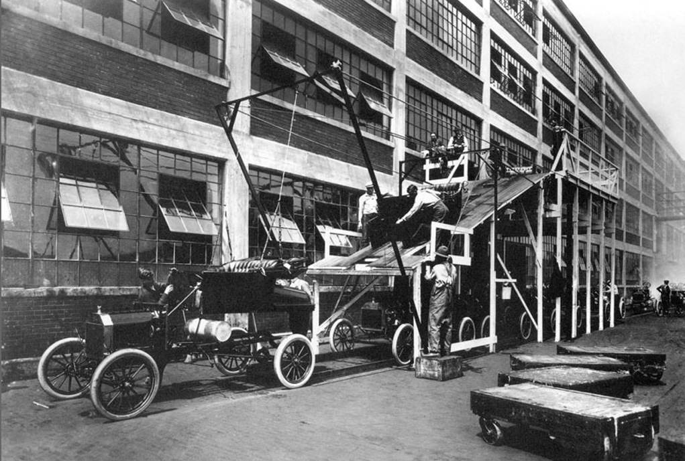
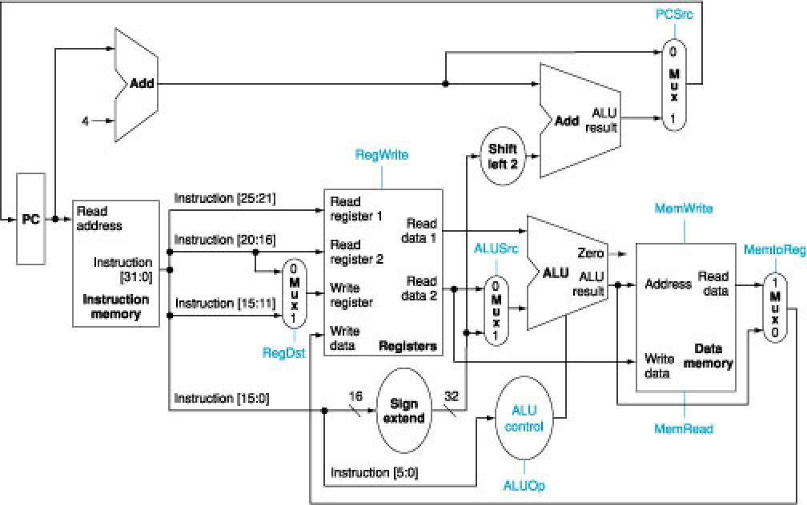
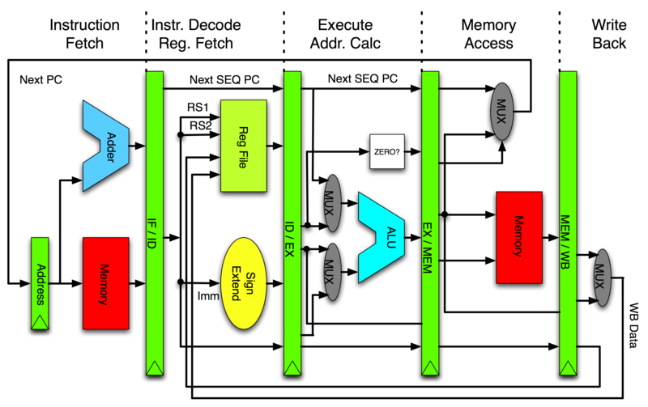
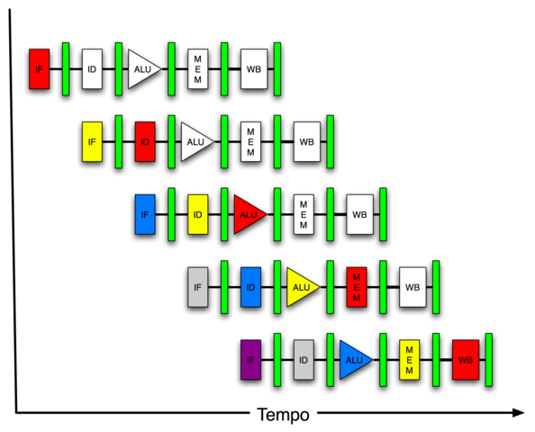
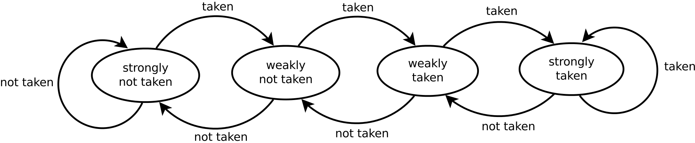
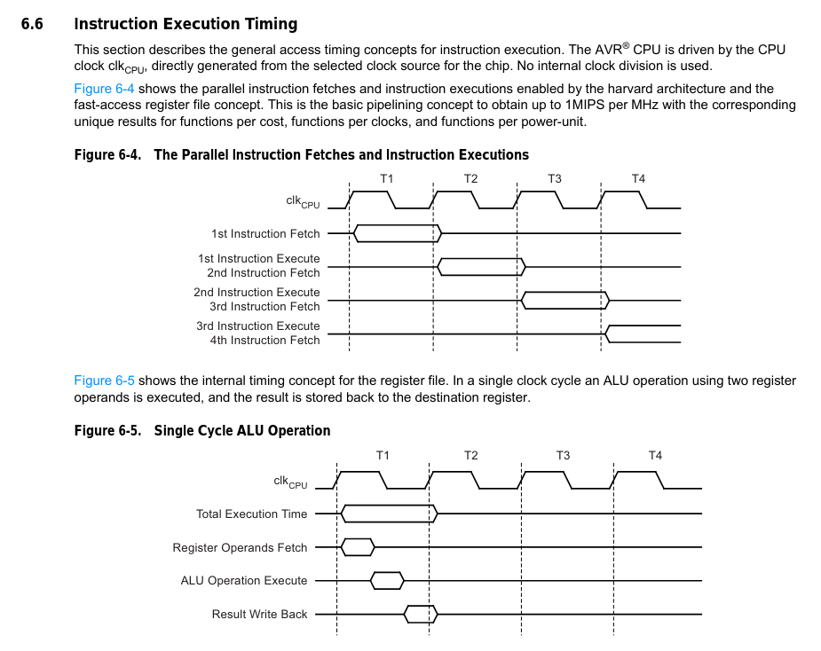

<!--

author:   Sebastian Zug & André Dietrich & Fabian Bär
email:    sebastian.zug@informatik.tu-freiberg.de & andre.dietrich@informatik.tu-freiberg.de & fabian.baer@student.tu-freiberg.de
version:  0.0.5
language: de
narrator: Deutsch Female

import:  https://raw.githubusercontent.com/liascript-templates/plantUML/master/README.md
         https://github.com/LiaTemplates/Pyodide

mark: <span style="background-color: @0;
                                  display: flex;
                                  width: calc(100% + 32px);
                                  margin: -16px;
                                  padding: 6px 16px 6px 16px;
                                  ">@1</span>
red:  @mark(#FF888888,@0)
blue: @mark(#898AE3,@0)
gray: @mark(gray,@0)
-->

[](https://liascript.github.io/course/?https://raw.githubusercontent.com/TUBAF-IfI-LiaScript/VL_EingebetteteSysteme/master/12_RISC_CISC.md#1)

# RISC vs. CISC

| Parameter            | Kursinformationen                                                                                                                                                                      |
| -------------------- | -------------------------------------------------------------------------------------------------------------------------------------------------------------------------------------- |
| **Veranstaltung:**   | `Eingebettete Systeme`                                                                                                                                                                 |
| **Semester**         | `Wintersemester 2021/22`                                                                                                                                                               |
| **Hochschule:**      | `Technische Universität Freiberg`                                                                                                                                                      |
| **Inhalte:**         | `Pipeline und RISC vs. CISC`                                                                                                                                                           |
| **Link auf GitHub:** | [https://github.com/TUBAF-IfI-LiaScript/VL_Softwareentwicklung/blob/master/12_RISC_CISC.md](https://github.com/TUBAF-IfI-LiaScript/VL_EingebetteteSysteme/blob/master/12_RISC_CISC.md) |
| **Autoren**          | @author                                                                                                                                                                                |


---------------------------------------------------------------------

** Fragen an die Veranstaltung**

+ Was bedeutet der Begriff der semantischen Lücke?
+ Wie versuchen CISC Systeme diese zu schließen?
+ Warum kann der Geschwindigkeitsgewinn, der mit Pipelining möglich ist nicht mit CISC Systemen umgesetzt werden?
+ Welche Pipelininghindernisse sind Ihnen bekannt? Welche Lösungsstrategien?
+ Was sind die Kernparameter einer RISC Computers?
+ Grenzen Sie RISC und CISC Systeme gegeneinander ab.
+ Welcher Strategie folgen aktuelle Controller?

<!--
style="width: 80%; min-width: 420px; max-width: 720px;"
-->
```ascii

                Abstraktionsebenen

           +----------------------------+ -.
  Ebene 6  | Problemorientierte Sprache |  |
           +----------------------------+  |
                                           ⎬ Anwendungssoftware
           +----------------------------+  |
  Ebene 5  | Assemblersprache           |  |
           +----------------------------+ -.

           +----------------------------+
  Ebene 4  | Betriebssystem             |     Systemsoftware
           +----------------------------+

           +----------------------------+
  Ebene 3  | Istruktionsset             |     Maschinensprache
           +----------------------------+         ╔═══════════════╗
                                               ◀══║ HIER SIND WIR!║
           +----------------------------+  -.     ╚═══════════════╝
  Ebene 2  | Mikroarchitektur           |   |
           +----------------------------+   |
                                            ⎬ Automaten, Speicher, Logik
           +----------------------------+   |
  Ebene 1  | Digitale Logik             |   |
           +----------------------------+  -.

           +----------------------------+
  Ebene 0  | E-Technik, Physik          |     Analoge Phänomene
           +----------------------------+                                      .
```

---------------------------------------------------------------------

## Motivation

Ausgangspunkt
---------------------

Enstehungsgründe für umfangreiche Maschinenbefehlssätze:

+ Geschwindigkeitsunterschied zwischen CPU und Hauptspeicher
+ Mikroprogrammierung
+ Kompakter Code
+ Unterstützung höherer Programmiersprachen
+ Aufwärtskompatibilität
+ Marktstrategie

### Lösungsansatz

| Kriterium                            | Einzelner Arbeiter                                                        | Gruppe                                                                                            | Fließband                                                                                |
| ------------------------------------ | ------------------------------------------------------------------------- | ------------------------------------------------------------------------------------------------- | ---------------------------------------------------------------------------------------- |
| Organisationsform                    | Jeder Arbeit baut ein vollständiges Auto                                  | Gruppen realisieren die Fahrzeuge parallel                                                        | Ein Fließband verbindet Arbeitsstationen, an denen ein spezielle Arbeit ausgeführt wird  |
| Spezialisierung                      | gering                                                                    | mittel                                                                                            | hoch                                                                                     |
| Fertigkeiten                         | hoch                                                                      | mittel                                                                                            | gering                                                                                   |
| Robustheit und Koordinierungsaufwand | Robust gegen Ausfälle und unterschiedliche Arbeitsgeschwindigkeiten       | Robust gegen Ausfälle und unterschiedliche Arbeitsgeschwindigkeiten im Vergleich zu anderen Teams | Empfindlich gegen Ausfälle und unterschiedliche Arbeitsgeschwindigkeiten                 |
| Erhöhung des Durchsatzes             | Erhöhung der Arbeitsleitung in Abstimmung mit der Gruppenarbeit einzelnen |                                                                                                   | Erhöhung der Arbeitsleitung des einzelnen in Abstimmung mit der Taktrate des Fließbandes |
|                                      | Erhöhung der Mitarbeiterzahl                                              | Erhöhung der Teamzahl                                                                             | Erhöhung der Anzahl der Fließbänder                                                      |

Ransom Eli Olds verwendete bereits 1902 für die Produktion seiner „Oldsmobile“ bewegliche Holzgestelle, auf denen die Fahrgestelle von Station zu Station geschoben wurden. Henry Ford mechanisierte und verfeinerte dieses Prinzip, indem er mit Hilfe seines Ingenieurs Charles E. Sorensen und des Vorarbeiters Lewis im Jahr 1913 ein permanentes Fließband aufbaute und so die erste „moving assembly line“ installierte.



[^WikipediaPipeline]: 1913 photograph Ford company, USA, https://commons.wikimedia.org/wiki/File:A-line1913.jpg

```text @plantUML.png
@startuml
ditaa

Sequentielle Abarbeitung
:            :            :            :            :            :
+----------+ +-----+ +--------+ +------+ +---------+
|cF88      | |cFF4 | |c88F    | |c8F8  | |cD10     |
+----------+ +-----+ +--------+ +------+ +---------+
:            :            :            :            :+----------+ +-----+
:            :            :            :            :|cF88      | |cFF4 |
:            :            :            :            :+----------+ +-----+
:            :            :            :            :             :

<--------- Fertigungsdauer eines Fahrzeuges -------> <-----
@enduml
```


```text @plantUML.png
@startuml
ditaa

Pipline Abarbeitung

+----------+ +----------+ +----------+ +----------+ +----------+ +----------+
|cF88      | |cF88      | |cF88      | |cF88      | |cF88      | |cF88      |
+----------+ +----------+ +----------+ +----------+ +----------+ +----------+
:            +-----+      +-----+      +-----+      +-----+    : +-----+    :
:            |cFF4 |      |cFF4 |      |cFF4 |      |cFF4 |    : |cFF4 |    :
:            +-----+      +-----+      +-----+      +-----+    : +-----+    :
:            :            +--------+   +--------+   +--------+ : +--------+ :
:            :            |c88F    |   |c88F    |   |c88F    | : |c88F    | :
:            :            +--------+   +--------+   +--------+ : +--------+ :
:            :            :            +-------+    +-------+  : +-------+  :
:            :            :            |c8F8   |    |c8F8   |  : |c8F8   |  :
:            :            :            +-------+    +-------+  : +-------+  :
:            :            :            :            +---------+: +---------+:
:            :            :            :            |cD10     |: |cD10     |:
:            :            :            :            +---------+: +---------+:


<--------------------- Befüllen der Pipeline ----------------->

@enduml
```

> Im idealen Zustand ist die Arbeit so zerlegt worden, dass alle Pipeline-Stufen die gleiche Zeitdauer haben.

Wie können wir den Performancegewinn $S$ einer Pipeline beschreiben?

Gegen wir davon aus, dass $n$ Operationen ausgeführt werden sollen. Die Tiefe der Pipeline ergibt sich zu $k$. Entsprechend sind bei der sequenziellen Arbeit also $n \cdot k$ Zeitslots notwendig. Im Pipelinemodus werden lediglich $(n-1)$ Schritte zum Befüllen der Pipeline gebraucht. Danach folgt mit jedem Takt eine abgeschlossene Operation.

$$
S = \frac{n \cdot k}{k + (n-1)}
$$

```python  VisualizePipeline.py
import numpy as np
import matplotlib.pyplot as plt

def calc_S(n, k):
  return (n * k) / (k + (n-1))

n = np.arange(0.0, 500.0, 5.0)

fig, ax = plt.subplots()

for k in [2, 10, 25, 50, 100]:
  S = np.array([calc_S(ni, k) for ni in n])
  ax.plot(n, S)

ax.grid(True, linestyle='-.')
ax.tick_params(labelcolor='r', labelsize='medium', width=3)

plt.show()

plot(fig)
```
@Pyodide.eval

{{1-3}}
> **Und jetzt sind Sie dran ... **

{{1-3}}
Verschiedenste Vorgänge können als Pipeline Prozesse betrachtet werden. So werden in einer Kantine die auszugebenden Essen in einem vierstufigem Prozess an einem Fließband zusammengestellt.

{{1-3}}
| Vorgang                   | Zeitdauer   |
| ------------------------- | ----------- |
| Teller, Tablett aufnehmen | $T_1 = 15s$ |
| Essen entgegennehmen      | $T_2 = 5s$  |
| Nachtisch auswählen       | $T_3 = 5s$  |
| Besteck nehmen            | $T_4 = 10s$ |

{{1-3}}
1. In welchen Zeitabständen kommt ein Studierender aus dem Bedienungbereich?

{{2}}
**Lösung:**  Jeweils nach der Dauer des längsten Teilprozesses erscheint ein Studierender $15s$

{{1-3}}
2. Nach welcher Zeit wurde das 1000. Essen ausgegeben?

{{2}}
**Lösung:**  $(1000)\cdot maxSchrittdauer + 1 \cdot (5 + 5 + 10) = 15000s + 20s = \underline{15020s}$

{{1-3}}
3. Wie lange hätte die Ausgabe der 1000 Essen ohne Fließband gedauert?

{{2}}
**Lösung:** $1000 \cdot Gesamtdauer= \underline{35000s}$

{{1-3}}
4. Welche Beschleunigung wurde durch die Fließbandverarbeitung erzielt?

{{2}}
**Lösung:** $\frac{35000}{15020}=\frac{3500}{1502}=\underline{\frac{1750}{751} \approx 2.33}$


## Pipeline im Rechner
<!--
colspan: <!--colspan="@0" style="text-align: center; vertical-align: middle;"-->
-->

                                  {{0-1}}
********************************************************************************

> **Piplining** Zerlegung einer Maschinenoperation in verschiedene Phasen, die von einer an sich serialisierten Verarbeitungskette taktsynchron bearbeitet werden, wobei jede Stufe zu jedem Zeitpunkt aktiv ist.

> **Pipeline-Stufe** Die k abtrennbaren Elemente einer Pipeline, die Pipeline-Stufen werden durch den Pipeline-Maschinentakt getriggert.

********************************************************************************

                                   {{1-2}}
********************************************************************************

Unser bisheriger Modellrechner kombiniert 2 Phasen, die Fetch und die Execute Phase. Können wir das Pipeliningkonzept darauf anwenden?

> **Merke: ** Nein!

Dagegen spricht:

+ die unterschiedliche Konstellation der Befehle - Einzyklus und Zweizyklus-Befehle
+ die "Wiederverwendung" der Komponenten bei den Zweizyklus-Befehlen.


<!--data-type="None"-->
| OPCode | 0000           | 0001  | 0010  | 0011  | 0100  | 0101  | 0110  | 0111  | 1000  | 1001  | 1010  | 1011  | 1100  | 1101  | 1110  | 1111  |
| ------ | -------------- | ----- | ----- | ----- | ----- | ----- | ----- | ----- | ----- | ----- | ----- | ----- | ----- | ----- | ----- | ----- |
|        | `HLT`          | `JMA` | `JMP` | `JSR` | `SWR` | `RAL` | `INP` | `OUT` | `NOT` | `LDA` | `STA` | `ADD` | `XOR` | `AND` | `IOR` | `NOP` |
| CP1    | @colspan(16) $MBR \leftarrow M[MAR]$ |
| CP2    |                |       |       |       |       |       |       |       |       |       |       |       |       |       |       |       |
| CP3    | @colspan(16) $PC \leftarrow PC + 1$     |
| CP4    | @colspan(16) $IR \leftarrow MBR $              |
| CP5    |                |       |       |       |       |       |       |       |       |       |       |       |       |       |       |       |
| CP6    |                |       |       |       |       |       |       |       |       |       |       |       |       |       |       |       |
| CP7    | $RF \leftarrow H$ | $A_{15}=1:PC\leftarrow IR_{11-0}$ | $PC\leftarrow IR_{11-0}$ | $A_{11-0} \leftarrow  PC$ | $A \leftarrow SWR$ | $Z \leftarrow A$ |  |  | $Z \leftarrow A$ |  |  | $Z \leftarrow A$ | $Z \leftarrow A$ | $Z \leftarrow A$ | $Z \leftarrow A$ |
| CP8    | $MAR \leftarrow PC$ | $MAR \leftarrow PC$ | $MAR \leftarrow PC$ | $PC\leftarrow IR_{11-0}, MAR \leftarrow PC $ | $MAR \leftarrow PC$ | $SF\leftarrow E$ |  |  | $SF\leftarrow E$ | @colspan(6) $SF\leftarrow E, MAR \leftarrow IR_{11-0}$ | $MAR \leftarrow PC$ |
| <!-- style="background-color: #898AE3;" --> $CP1$    | | | | | | | | | | $MBR\leftarrow M[MAR]$| | @colspan(4) $MBR\leftarrow M[MAR]$| |
| <!-- style="background-color: #898AE3;" --> $CP2$    | |    |     |     |     | $A\leftarrow Z^*$ |    |     | $A\leftarrow \overline{Z}$ |     |     |     |     |     |  | |
| <!-- style="background-color: #898AE3;" --> $CP3$     |                |       |       |       |       |       |       |       |       |       |       |       |       |       |       |       |
| <!-- style="background-color: #898AE3;" --> $CP4$     |                |       |       |       |       |       |       |       |       |       |       |       |       |       |       |       |
| <!-- style="background-color: #898AE3;" --> $CP5$     |   |  |  |  |  |  |  |  |  | $A\leftarrow MBR$ | $MBR \leftarrow A$ |  |  |  |  | |
| <!-- style="background-color: #898AE3;" --> $CP6$     |   |  |  |  |  |  |  |  |  |  | $M[MAR] \leftarrow MBR$ |  |  |  |  |  |
| <!-- style="background-color: #898AE3;" --> $CP7$     | | | | | | | | | | | | $A \leftarrow Sum(MBR, Z)$| $A \leftarrow MBR \oplus Z$| $A \leftarrow MBR \cdot Z$| $A \leftarrow MBR + Z$| |
| <!-- style="background-color: #898AE3;" --> $CP8$     |  |  |  |  |  | $MAR \leftarrow PC, SF \leftarrow F$ |  |  | @colspan(7) $ MAR \leftarrow PC, SF \leftarrow F$ |  |

********************************************************************************

                                      {{2-3}}
********************************************************************************

Entsprechend schauen wir uns die Frage des Pipelining an einem alternativen System an. Die MIPS-Architektur (englisch Microprocessor without interlocked pipeline stages) ist eine Befehlssatzarchitektur im RISC-Stil, die ab 1981 von John L. Hennessy. Wir wollen an dieser Stelle nur die Pipeline des Systems untersuchen, dass eine aufwändigere Struktur als unser Modellrechner hat.

<!-- width="60%" -->

Das Schaubild entstammt dem Open Source Projekt MIPS-Simulators des Autors _TechieForFun_ das auf die Realsierung einer MIPS auf einem FPGA abzielt (https://github.com/TechieForFun/mipsimulator).

+ Typ R Befehle: Register-Register Befehle (add, sub, ...)

| 31-26  | 25-21    | 20-16    | 15-11 | 10-6       | 5-0                    |
| ------ | -------- | -------- | ----- | ---------- | ---------------------- |
| OPCODE | rs       | rt       | rd    | shamt      | aluFunc                |
|        | Quelle 1 | Quelle 2 | Ziel  | Shiftweite | spezifische Funktionen |

Wie setzen wir also damit die Gleichung $f=g+h-i$ um?


```
add $t0, $s1, $s2 # t0=g+h (g=>s1, h=>s2)
sub $s0, $t0, $s3 # s0=t0-i (i=>s3, f in s0)
```

<!-- data-type="none" -->
|                     | 31-26 | 25-21 | 20-16 | 15-11 | 10-6 | 5-0 |
| ------------------- | ----- | ----- | ----- | ----- | ---- | --- |
| `add $t0, $s1, $s2` | 0     | 17    | 18    | 8     | 0    | 32  |
| `sub $s0, $t0, $s3` | 0     | 8     | 19    | 16    | 0    | 34  |

In der Maschinensprache heißt dass dann:

```
00000 10001 10010 01000 00000 10000
00000 01000 10011 10000 00000 10010
```


+ Typ I Befehle: Imediate-Register Befehle (addi, lw, ...)

| 31-26  | 25-21 | 20-16 | 15-0      |
| ------ | ----- | ----- | --------- |
| OPCODE | rs    | rt    | immediate |

```
addi $s0, $s1, 5
```

> __Aufgabe:__ Recherchieren Sie den Aufbau der MIPS I Befehle und leiten Sie den zugehörigen Maschinencode für den oben genannten Befehl ab.

Eine weitergehendere Beschäftigung mit dem eigentlichen Befehlssatz ist an dieser Stelle nicht notwendig. Für Interessierte Hörer sei ein Blick auf eine zugehörige Simulation der Uni-Hamburg empfohlen (https://tams.informatik.uni-hamburg.de/applets/hades/webdemos/76-mips/01-intro/chapter.html)

********************************************************************************

### Umsetzung der Pipeline

| Abkürzung | Bezeichnung                             | Funktion                                                                                                       |
| --------- | --------------------------------------- | -------------------------------------------------------------------------------------------------------------- |
| IF        | Instruction Fetch                       | Die nächste Instruktion wird unter Benutzung des Programmzählers (PC) geladen                                  |
| ID        | Instruction Decode and Operand Fetching | OPCODE und die Operanden in der Instruktion werden ausgewertet und die entsprechenden Kontrollsignale erzeugt. |
| EX        | Instruction Execution                   | durch den OPCODE spezifizierte Funktion wird ausgeführt                                                        |
| MA        | Memory Access                           | Daten werden aus dem Speicher geladen oder in den Speicher geschrieben                                         |
| WB        | Write Back                              | Resultat der Berechnung wird in ein Zielregister übertragen                                                    |





> Nach unserer Rechnung ließe sich mit einem solchen System eine Beschleunigung von
> $$ S = lim \frac{n \cdot 5}{5 + (n-1)} = 5 $$
> erreichen.

> Wo sehen Sie _Hemmnisse_ für das erreichen dieses Wertes?

1. Ressourcenkonflikte
2. Kontrollabhängigkeiten
3. Datenflussabhängigkeiten

[^MIPS]: Autor: Hellisp, Pipelined MIPS Microprocessor, https://commons.wikimedia.org/wiki/File:Pipeline_MIPS.png

### Pipelining Hindernisse

**Ressourcenkonflikte**
-------------------------

Ressourcenkonflikte treten auf, wenn auf bestimmte Elemente gleichermaßen zugegriffen werden soll, z. B. ein synchroner Zugriff auf einen Registerspeicher mit nur einem Eingang.

**Kontrollkonflikte**
---------------------------
Steuerkonflikte treten bei Instruktionen auf, die den Befehlszähler verändern, bei bedingten oder unbedingten Sprungbefehlen. Da der "richtige" Befehl erst am Ende des Auslesens des Sprungbefehls bekannt ist, muss die Pipeline ggf. komplett geleert werden.

```
add $s3, $s1, $s2   // s3 = s1 + s2
beq $s4, $s5, 100   // if s4 == s5 springe nach PC + 100
sub $s6, $s4, $s5   // sonst s6 = s4 - s5
```


<!--
style="width: 80%; min-width: 420px; max-width: 720px;"
-->
```ascii
                                         | Die Zieladresse liegt vor
                                         v
                   +----+----+----+----+----+
1) Sprungbefehl    | IF | ID | EX | MA | WB |
                   +----+----+----+----+----+

2-4)                        ....

                                       +----+----+----+----+----+
5) "richtiger Befehl"                  | IF | ID | EX | MA | WB |
                                       +----+----+----+----+----+              .
```


**Datenkonflikte**
---------------------------
Datenkonflikte ergeben sich aus Datenabhängigkeiten zwischen Befehlen im Programm

1. _Read after Write (RAW) oder Echte Abhängigkeit_ - Ein Operand wurde verändert und kurz darauf gelesen. Da der erste Befehl den Operanden evtl. noch nicht fertiggeschrieben hat (Pipeline-Stufe „store“ ist weit hinten), würde der zweite Befehl falsche Daten verwenden.

```
s1 = s2+s3
s4 = s1+1
```


<!--
style="width: 80%; min-width: 420px; max-width: 720px;"
-->
```ascii

                Hier wird s1 zur      |  | Hier ist s1 im Register File bereit
                Berechnung entnommen  |  v
                   +----+----+----+---|+----+
1) load s1, A      | IF | ID | EX | MA|| WB |
                   +----+----+----+---|+----+----+
2) load s2, B           | IF | ID | EX|| MA | WB |
                        +----+----+---v+----+----+----+
3) add s2, s1, s2            | IF | ID | EX | MA | WB |
                             +----+----+----+----+---^+----+
4) mul s1, s2, s1                 | IF | ID | EX | MA|| WB |
                                  +----+----+----+---|+----+
                                          ^          |
                    Hier wird s2 für die  |          | Hier liegt das Ergebnis von
                    Berechnung von 4)                  3) vor
                    entnommen.
```

2. _Write after Read (WAR) oder Gegenabhängigkeit_ - Ein Operand wird gelesen und kurz danach überschrieben. Da das Schreiben bereits vor dem Lesen vollendet sein könnte, könnte der Lese-Befehl die neu geschriebenen Werte erhalten.

```
   s1 = s2+s3    # Steht möglicherweise 2 schon in s2?
   s2 = 2         
```

3. _Write after Write (WAW) oder Ausgabeabhängigkeit_ - Zwei Befehle schreiben auf denselben Operanden. Der zweite könnte vor dem ersten Befehl beendet werden und somit den Operanden mit einem falschen Wert belassen.

```
   s1 = s2+s3
   s1 = 2        # Wird die zwei möglicherweise durch s2+s3 überschrieben?
```

Die beiden letztgenannten Datenkonflikte sind für die beschriebene Pipeline nicht relevant.

### Pipelining Lösungsansätze

                    {{0-1}}
********************************************************************************

Lösungsansätze für Ressourcenkonflikte
-----------------------------------------

In der MIPS-Implementierung wurde dafür Sorge getragen, dass die Bauteile, die
aus mehreren Pipeline-Stufen angesprochen werden, hardwaretechnisch dafür vorbereitet wurden. Das Register File, dass sowohl aus der Instruction Decode Phase UND der Write Back Phase angesprochen werden kann, wurden in Hardware die Vorkehrungen getroffen, um einen Zeitgleichen Zugriff zu ermöglichen. Dabei entsteht dann aber ggf. parallel ein Datenkonflikt!

vgl. Multipler Zugriff auf das Register-File

********************************************************************************

                    {{1-2}}
********************************************************************************

Lösungsansätze für Kontrollabhängigkeiten
------------------------------------------

1. Verzögern oder Verschieben - Einfügen von NOP oder von unabhängigen nachfolgenden Befehlen, um die ungewisse weitere Abfolge zu überbrücken

<!--
style="width: 80%; min-width: 420px; max-width: 720px;"
-->
```ascii
                    Flag aktiviert  |        | Die Zieladresse liegt vor
                                    v        v
                       +----+----+----+----+----+
    1) Sprungbefehl    | IF | ID | EX | MA | WB |
                       +----+----+----+----+----+----+
       nop                  | IF | ID | EX | MA | WB |
                            +----+----+----+----+----+----+
       nop                       | IF | ID | EX | MA | WB |
                                 +----+----+----+----+----+----+
       nop                            | IF | ID | EX | MA | WB |
                                      +----+----+----+----+----+----+
    5) "richtiger Befehl"                  | IF | ID | EX | MA | WB |
                                           +----+----+----+----+----+          .
```


2. Sprungvorhersagen - Prognose des weiteren Ausführungsweges

    Unter Sprungvorhersage versteht man die Vorhersage, ob ein bedingter Sprung ausgeführt wird und die Ermittlung der Zieladresse des Sprunges

    Eine 1-Bit-Sprungvorhersage (im Wesentlichen ein Flip-Flop) zeichnet das letzte Ergebnis der Verzweigung auf.

    Ein 2-Bit-Sprungvorhersage ist ein Zustandsautomat mit vier Zuständen:

       + Stark nicht besetzt
       + Schwach nicht besetzt
       + Schwach besetzt
       + Stark eingenommen

    Wenn ein Zweig ausgewertet wird, wird der entsprechende Zustandsautomat aktualisiert. Zweige, die als nicht belegt bewertet werden, ändern den Zustand in Richtung stark nicht belegt, und Zweige, die als belegt bewertet werden, ändern den Zustand in Richtung stark belegt. Der Vorteil des Zwei-Bit-Zählerschemas gegenüber einem Ein-Bit-Schema ist, dass ein bedingter Sprung zweimal von dem abweichen muss, was er in der Vergangenheit am meisten getan hat, bevor sich die Vorhersage ändert. Zum Beispiel wird ein schleifenschließender bedingter Sprung einmal und nicht zweimal falsch vorhergesagt.



[^BP] State diagram of 2-bit saturating counter for branch predictor [Link](https://en.wikipedia.org/wiki/Branch_predictor#/media/File:Branch_prediction_2bit_saturating_counter-dia.svg)

********************************************************************************

                    {{2-4}}
********************************************************************************

Lösungsansätze für Datenkonflikte
-----------------------------------------

1. Softwarelösungen - Einfügen von NOP Befehlen zur Auflösung

<!--
style="width: 80%; min-width: 420px; max-width: 720px;"
-->
```ascii
                                              | R2 ist bereit
                                              v
                        +----+----+----+----+----+
3) add r2, r1, r2       | IF | ID | EX | MA | WB |
                        +----+----+----+----+----+----+
3a) nop                      | IF | ID | EX | MA | WB |
                             +----+----+----+----+----+----+
3b) nop                           | IF | ID | EX | MA | WB |
                                  +----+----+----+----+----+----+
4) mul r1, r2, r1                      | IF | ID | EX | MA | WB |
                                       +----+----+----+----+----+
                                               ^
                                               | R2 wird gelesen
```

2. Softwarelösungen - Umsortieren der Abarbeitung

```asm
add r2, r0, r1    # r2 = r0 + r1
add r3, r4, r2
mul r7, r5, r6
mul r9, r7, r5
```

> **Aufgabe:** Bringen Sie die oben genannte Folge von Befehlen in eine konfliktfreie Reihung.

********************************************************************************

                    {{3-4}}
********************************************************************************

<!--
style="width: 80%; min-width: 420px; max-width: 720px;"
-->
```ascii
                        +----+----+----+----+----+
1) add r2, r0, r1       | IF | ID | EX | MA | WB |
                        +----+----+----+----+----+----+
2) mul r7, r5, r6            | IF | ID | EX | MA | WB |
                             +----+----+----+----+----+---+
3) nop                            | IF | ID | EX | MA | WB |
                                  +----+----+----+----+----+----+
4) add r3, r4, r2                      | IF | ID | EX | MA | WB |
                                       +----+----+----+----+----+----+
4) mul r9, r7, r5                           | IF | ID | EX | MA | WB |
                                            +----+----+----+----+----+

```

3. Hardwarelösung - Leerlauf der Pipeline (Hardware NOPs)

4. Hardwarelösungen - _Forwarding_

     + Rückführung von ALU-Ausgaben auf deren Eingabe (ME->ME)
     + Load Forwarding (WB->ID)


********************************************************************************

## CISC vs RISC

Kann das Konzept auf einen beliebigen Befehlssatz angewendet werden?

Der Intel iARX 432 Prozessor kannte 6 - 321 Bit breite Befehle, der Mikroprogrammspeicher hatte eine Größe von 64kB. Damit ließen sich Befehle wie

```c
void * memcopy (void * dst, void * src, size_t n)
```

in vier Zeilen Assemblercode ausdrücken.

```
MOV ESI, src
MOV EDI, dst
MOV ECX, n
REP MOVSB      // <- Wie lange läuft dieser Befehl?
```

Limitierungen für eine Pipeline:

+ Befehle unterschiedlicher unterschiedlicher Ausführungsdauer
+ Nachladen von Operatoren (unterschiedliche Größe)
+ Lange Ausführungs-Phasen (nicht vorhersagbar)

<!-- data-type="none" -->
| Platz | Befehl             | Häufigkeit in % | CumSum |
| ----- | ------------------ | --------------- | ------ |
| 1     | LOAD               | 22              | 22     |
| 2     | CONDITIONAL BRANCH | 20              | 42     |
| 3     | COMPARE            | 16              | 58     |
| 4     | STORE              | 12              | 70     |
| 5     | ADD                | 8               | 78     |
| 6     | AND                | 6               | 84     |
| 7     | SUB                | 5               | 89     |
| 8     | MOVE REGISTER      | 4               | 93     |
| 9     | CALL               | 1               | 94     |
| 10    | RETURN             | 1               | 95     |

Source: Hennessy und Patterson, Computer Architecture, Morgan Kaufmann, 1996

### RISC Konzept

Anforderungen:

+ single Cycle Instruktionen → Piplining
+ Einfache Instruktionen → Orientierung auf Hochsprache

RISC (Reduced Instruction Set) stellt tatsächlich eine “Entwurfs-Philosophie“ dar, in der das Ziel höchste
Leistung ist, die im Zusammenspiel von Hardware und einem optimierenden
Compiler erreicht wird. Im RISC-Ansatz wird in der der Instruktionssatz in
Hinblick auf Einfachheit und Regularität entworfen, so daß die Verwendung der
Instruktionen durch den Compiler einfach und überschaubar ist.

| Nachteile                                 | Vorteile                             |
| ----------------------------------------- | ------------------------------------ |
| Mehr Speicherplatz für Programme          | Einfachheit der Hardwarerealisierung |
| Aufwändigere Implementierung IM ASSEMBLER | höhere Taktraten                     |
|                                           | Ausnutzung von Pipelining Techniken  |

|                                   | CISC          | RISC     |
| --------------------------------- | ------------- | -------- |
| Ausführungszeit einer Instruktion | $geq 1$       | meist 1  |
| Instruktuionssatz                 | groß          | klein    |
| Instruktionsformat                | variabel      | strikt   |
| CPU-Abarbeitungslogik             | Mikroprogramm | Hardware |
| Komplexität                       | Hardware      | Compiler |

> **Merke: ** Die Abgrenzung zwischen Complex Instruction Set (CISC) vs Reduced Instruction Set (RISC) ist heute kaum noch präsent. Vielmehr verschmelzen die Konzepte in aktuellen Prozessoren.

D. Tabak entwarf in seine Buch _RISC-Architecture_ (John Wiley & Sons, 1987) einen Kriterienkatalog:

+ Anzahl der Instruktionen $<128$
+ Anzahl der Adressierungsmodi $<4$
+ Anzahl der Befehlsformate  $<4$
+ LOAD/STORE Architektur
+ Anzahl der Register $\geq32$
+ Single Cycle Instruktionen
+ Festverdrahtete Maschinenbefehle
+ HLL / Optimierende Compiler

Tabak argumentierte, dass 5 der Kriterien positiv evaluiert sein müssen, um ein RISC System zu identifizieren.

Womit haben wir es also bei unserem Modellrechner zu tuen?

### Atmega32 als RISC Architektur

Und wie geht es insgesamt weiter?




[^AVR_Handbuch]: Firma Microchip, Handbuch Atmega, https://ww1.microchip.com/downloads/en/DeviceDoc/Atmel-7810-Automotive-Microcontrollers-ATmega328P_Datasheet.pdf

## Hausaufgaben

1. Recherchieren Sie, was es mit der Byte-Order auf sich hat.
2. Welche Unterschiede werden beim Vergleich der Intel und der AT&T Syntax deutlich?
