<!--

author:   Sebastian Zug & André Dietrich & Fabian Bär
email:    sebastian.zug@informatik.tu-freiberg.de & andre.dietrich@informatik.tu-freiberg.de & fabian.baer@student.tu-freiberg.de
version:  0.0.5
language: de
narrator: Deutsch Female

import:  https://raw.githubusercontent.com/liascript-templates/plantUML/master/README.md
         https://github.com/liascript/CodeRunner
         https://fjangfaragesh.github.io/AVR8js-mem/INCLUDE.md
        https://raw.githubusercontent.com/TUBAF-IfI-LiaScript/VL_EingebetteteSysteme/master/config.md

script:   https://cdn.jsdelivr.net/chartist.js/latest/chartist.min.js
         link: https://cdn.jsdelivr.net/chartist.js/latest/chartist.min.css
         link: https://cdnjs.cloudflare.com/ajax/libs/animate.css/3.7.0/animate.min.css


mark: <span style="background-color: @0;
                                  display: flex;
                                  width: calc(100% + 32px);
                                  margin: -16px;
                                  padding: 6px 16px 6px 16px;
                                  ">@1</span>
red:  @mark(#FF888888,@0)
blue: @mark(#898AE3,@0)
gray: @mark(gray,@0)
-->

[](https://liascript.github.io/course/?https://raw.githubusercontent.com/TUBAF-IfI-LiaScript/VL_EingebetteteSysteme/master/14_ADC.md#1)

# Analog-Digital-Wandler

| Parameter                | Kursinformationen                                                                                                                                                                          |
| ------------------------ | ------------------------------------------------------------------------------------------------------------------------------------------------------------------------------------------ |
| **Veranstaltung:**       | @config.lecture                                                                                          |
| **Semester:**            | @config.semester                                                                                         |
| **Hochschule:**          | `Technische Universität Freiberg`                                                                        |
| **Inhalte:**             | `Grundlagen und Verwendung des Analog-Digital-Wandlers`                                                 |
| **Link auf GitHub:**     | https://github.com/TUBAF-IfI-LiaScript/VL_EingebetteteSysteme/blob/master/14_ADC.md                    |
| **Autoren:**             | @author                                                                                                  |


---------------------------------------------------------------------

** Fragen an die Veranstaltung**

+ Was bedeutet der Begriff Auflösung im Zusammenhang mit einem Analog-Digital-Wandler?
+ Welche Wandlungsmethoden kennen Sie, worin unterscheiden sich diese?
+ Welches Wandlungskonzept ist im AVR-Core implementiert?
+ Welche Störungen entstehen ggf. bei der Analog-Digital-Wandlung?
+ Wovon hängt die Wandlungsdauer beim AVR ab? Durch welche Paramter können Sie diese beeinflussen?

<!--
style="width: 80%; min-width: 420px; max-width: 720px;"
-->
```ascii

                Abstraktionsebenen

           +----------------------------+ -.
  Ebene 6  | Problemorientierte Sprache |  |
           +----------------------------+  |
                                           ⎬ Anwendungssoftware
           +----------------------------+  |        ╔═══════════════╗
  Ebene 5  | Assemblersprache           |  |     ◀══║ HIER SIND WIR!║
           +----------------------------+ -.        ╚═══════════════╝

           +----------------------------+
  Ebene 4  | Betriebssystem             |     Systemsoftware
           +----------------------------+   

           +----------------------------+   
  Ebene 3  | Istruktionsset             |     Maschinensprache
           +----------------------------+     

           +----------------------------+  -.
  Ebene 2  | Mikroarchitektur           |   |
           +----------------------------+   |
                                            ⎬ Automaten, Speicher, Logik
           +----------------------------+   |
  Ebene 1  | Digitale Logik             |   |
           +----------------------------+  -.

           +----------------------------+
  Ebene 0  | E-Technik, Physik          |     Analoge Phänomene
           +----------------------------+                                      .
```

---------------------------------------------------------------------

## Motivation

In der vorangegangenen Vorlesung sprachen wir insbesondere über die Erfassung
von digitalen Signalen. Eine Erfassung von analogen Werten ist allerdings notwendig, um Phänomene der Umgebung mit dem notwendigen Detailgrad beobachten zu können.  

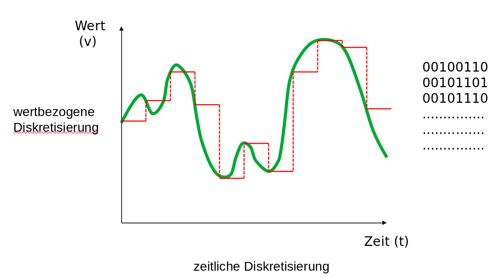<!-- style="width: 85%; max-width: 1000px" -->

Dabei wird das zeit- und wertkontinuierliche Eingangssignal in eine zeit- und wertdiskrete Darstellung überführt.

Die Idee besteht darin einem Spannungswert einer Zahlenrepräsentation zuzuordnen, die einen Indexwert innerhalb eines beschränkten Spannungswert repräsentiert.

<!--
style="width: 80%; min-width: 420px; max-width: 720px;"
-->
```ascii

            minimaler                     maximaler
              Wert                           Wert

Analog        0V                   <- Wert -> 8V

               |-------------------------------|                               .

Digital        | 0 | 1 | 2 | 3 | 4 | 5 | 6 | 7 |        3 Bit Auflösung   

               |   0   |   2   |   3   |   4   |        2 Bit        

               |       0       |       1       |        1 Bit           
```

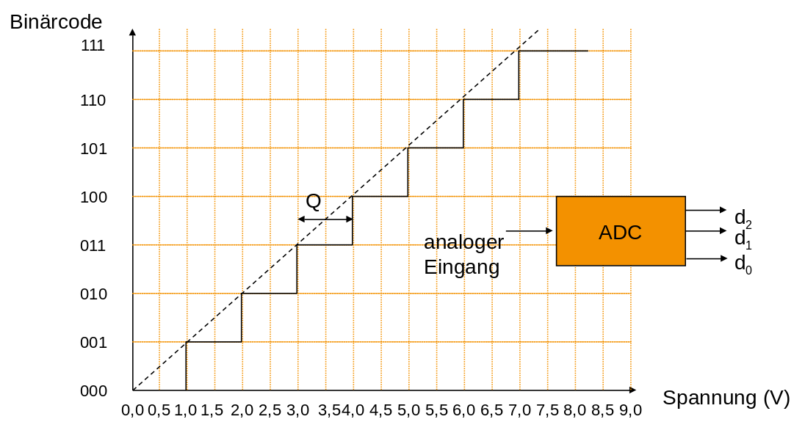<!-- style="width: 85%; max-width: 1000px" -->


Daraus ergibt sich die zentrale Gleichung für die Interpretation des Ausgaben eines Analog-Digital-Wandlers

$$
ADC = \frac{V_{in}}{V_{ref}} ADC_{res}
$$

oder

$$
\frac{ADC \cdot V_{ref}} {ADC_{res}} = V_{in}
$$

Für unser Beispiel aus der Grafik zuvor bedeutet die Ausgabe von "5" bei einem 3-Bit-Wandler, also

$$
\frac{5 \cdot 8V} {2^3} = 5 V
$$

Der potentielle Quantisierungsfehler `Q` beträgt

$$
Q = \frac{8V}{2^3} = 1V
$$

Dabei erfolgt die Wandlung in zwei generellen Schritten. Zunächst wird das Signal zeitlich diskretisiert und darauffolgend wertbezogenen gewandelt.

<!-- style="width: 85%; max-width: 1000px" -->

## Analog Komperator

Ein Komparator ist eine elektronische Schaltung, die zwei Spannungen vergleicht. Der Ausgang zeigt in binärer/digitaler Form an, welche der beiden Eingangsspannungen höher ist. Damit handelt es sich praktisch um einen 1-Bit-Analog-Digital-Umsetzer.

<!-- style="width: 35%; max-width: 300px" -->

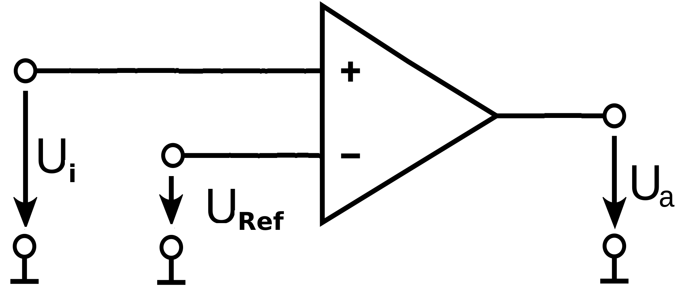<!-- style="width: 55%; max-width: 600px" -->

[^OPAMP]: Wikipedia, Autor Omegatron - Eigenes Werk, CC BY-SA 3.0, https://commons.wikimedia.org/w/index.php?curid=983276

<!--
style="width: 80%; min-width: 420px; max-width: 720px;"
-->
```ascii
                   ^
 Ideales       U_a |------------+
 Verhalten         |            |
                   |            |
                   |            |             U_i
                   +------------+------------->
                   |            | U_ref
                   |            |
                   |            |
                   |............+------------                                                .

                   ^
 Reales        U_a |--------+
 Verhalten         |        !\  
                   |        ! \  
                   |        !  \ U_ref        U_i
                   +--------!---+------------->
                   |        !    \  !
                   |        !     \ !  
                   |        !      \!
                   |........!.......+-----------                                                .

                            Hysterese
```

Im AVR findet sich ein Komperator, der unterschiedliche Eingänge miteinander vergleichen kann:
Für "+" sind dies die `BANDGAP Reference` und der Eingang `AIN0` und für "-" der Pin `AIN1` sowie alle analogen Eingänge.  

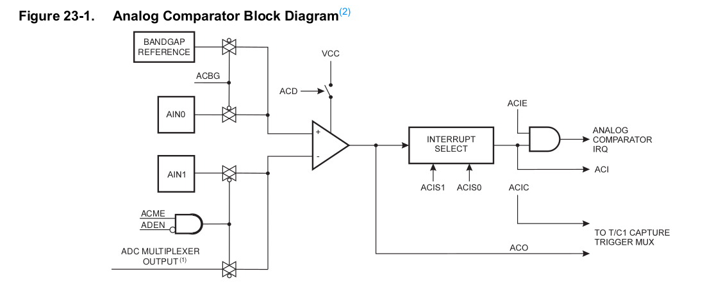<!-- style="width: 85%; max-width: 1000px" -->

Die grundlegende Konfiguration erfolgt über die Konfiguration der Bits / Register :

| Bits                   | Register | Bedeutung                                              |
| ---------------------- | -------- | ------------------------------------------------------ |
| `ACBG`                 | `ACSR`   | Analog Comparator Bandgap Select                       |
| `ACME`                 | `ADCSRB` | Analog Comparator Multiplexer Enable - Bit im Register |
| `ADEN`                 | `ADCSRA` | Analog Digital Enable                                  |
| `MUX2`, `MUX1`, `MUX0` | `ADMUX`  | Mulitiplexer Analog input                              |

Dazu kommen noch weitere Parameterisierungen bezüglich der Interrupts, der Aktivitierung von Timerfunktionalität oder der Synchronisierung.

Weitere Erläuterungen finden Sie im Handbuch auf Seite

> **Aufgabe:** An welchen Pins eines Arduino Uno Boards müssen Analoge Eingänge angeschlossen werden, um die zwei Signale mit dem Komperator zu vergleichen. Nutzen Sie den Belegungsplan (Schematics) des Kontrollers, der unter [Link](https://store.arduino.cc/arduino-uno-rev3) zu finden ist.

Ein Beispiel für den Vergleich eines Infrarot Distanzsensors mit einem fest vorgegebenen Spannungswert findet sich im _Example_ Ordner der Veranstaltung.

<!-- style="width: 85%; max-width: 1000px" -->

```cpp
#define F_CPU 16000000UL
#include <avr/io.h>

int main()
{
  ADCSRB = (1<<ACME);
  DDRB = (1<<PB5);

  while(1)
  {
    if (ACSR & (1<<ACO))/* Check ACO bit of ACSR register */
       PORTB &= ~(1 << PB5); /* Then turn OFF PB5 pin */
    else    /* If ACO bit is zero */
        PORTB = (1<<PB5); /* Turn ON PB5 pin */
  }
}
```

> **Hinweis** Um der Diskussion der Interupts nicht vorzugreifen wurde an dieser Stelle per Polling auf das Ergebnis des Comperators zugegriffen. Üblicherweise würde diese mit einer Interupt Service Routine (ISR) realisiert.

[^megaAVR]: Firma Microchip, megaAVR® Data Sheet, [Link](http://ww1.microchip.com/downloads/en/DeviceDoc/ATmega48A-PA-88A-PA-168A-PA-328-P-DS-DS40002061A.pdf)

## Analog Digital Wandler

Voraussetzung für den Wandlungsprozess ist die Sequenzierung des Signals. Mit einer spezifischen Taktrate wird das kontinuierliche Signal erfasst.  

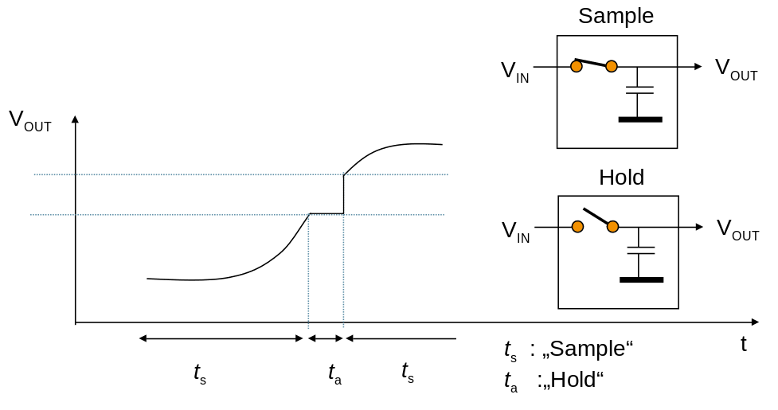<!-- style="width: 85%; max-width: 1000px" -->

Wie sollte die Taktrate für die Messung denn gewählt werden?

```python   PrintSampleResults.py
import numpy as np
import matplotlib.pyplot as plt

# Generierung der "Realen Messungen"
f = 40  # Hz
tmin = -0.3
tmax = 0.3
t = np.linspace(tmin, tmax, 400)
s = np.cos(2*np.pi*f*t)

# Abtastung mit einer Frequenz kleiner der Grenzfrequenz
T = 1/401.0
nmin = np.ceil((tmin) / T)
nmax = np.floor(tmax / T)
n = np.arange(nmin, nmax) * T
y = np.cos(2*np.pi*f*n)

# Fitting eines Cosinussignals anhand der Messungen
mfft=np.fft.fft(y)
imax=np.argmax(np.absolute(mfft))
mask=np.zeros_like(mfft)
mask[[imax]]=1
mfft*=mask
fdata=np.fft.ifft(mfft)

# Ausgabe
fig, ax = plt.subplots()
ax.plot(t, s)
ax.plot(n, y, '.', markersize=8)
ax.plot(n, fdata, '--', color='red', label=f"Estimated Signal")
ax.grid(True, linestyle='-.')
ax.tick_params(labelcolor='r', labelsize='medium', width=3)
ax.set_xlim([-0.15, 0.15])

#plt.show()
plt.savefig('foo.png')
```
@LIA.eval(`["main.py"]`, `none`, `python3 main.py`)s
Wenn ein kontinuierliches Signal, das keine Frequenzkomponenten hat, die über einer Frequenz  $f_c$ liegen mit einer Häufigkeit von größer $2f_c$ abgetatstet wird, kann das Originalsignal aus den gewonnenen Punkten unverzerrt rekonstruiert werden.

Falls dieses Kriterium nicht eingehalten wird, entstehen nichtlineare Verzerrungen, die auch als Alias-Effekt bezeichnet werden (vgl. Python Beispiel).  Die untere Grenze für eine Alias-freie Abtastung wird auch als _Nyquist-Rate_ bezeichnet.  

Als Erklärung kann eine Darstellung des Signals im Frequenzbereich dienen:

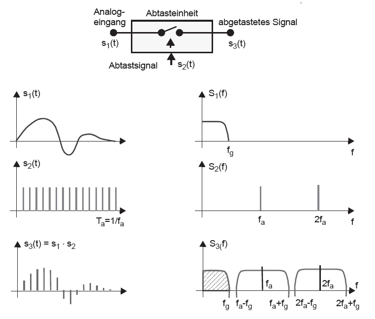<!-- style="width: 85%; max-width: 1000px" -->

### Flashwandler

3 Bit Flashwandler

 <iframe src="https://www.falstad.com/circuit/circuitjs.html?ctz=CQAgzCAMB0l3BWEA2aB2ATAFi2TXIBODMARjUJAQA4Q0rIqBTAWlNICgBDEUyLFAPLJBvRkkZ94cFNCyEFipUqrpSyamnlLIpLMiRT43MUNIZeaEewt8qUMdPFzlrhfQRqNW5bv2GnEz4hZEkrXlCxe0knRiwXN2VaTzR1TW1FPwNHYx5gkAxIWmECoqiJHPhwBMTFTVVU7wyFLIDpIP4ChGtwjG7yhyMqjBrahQa0nx09bKHIDoEwTpKloXFB2N5RsZEUyebCVsr5vM6wBFtw89t1mKcobbGJpt8ZtuMAJzoLWkwqEXEcA4Xz+-T++Tu8xBNwE4IuGyB0N48L+hUYkOB31KjFRWFoGKR2F+FgwhABOUxqLJWLAOARUJpdL+YGIDgQQIASljaGAfg44jj+Q8EBwAO5Y-r5frzcXg5bygQyrGkeH5FUWJWomT5NFQMVYommAp4vWyknUnXUzUWWlrRZ0pX5OVCQqmo3mGIhfH6tUaI0YdRunWBnXIRU+zoYMNGsgaiOLcwxyKOzrO416rk6oTUATYBwCdnVNBIMDoCowEUAcxprL+BHRepVueoPL913AftIdDZPquqqurMdA5JLfAg97IlWvBz4E6jpnU9IC5n88WM4wo7AK4nXWsrL6AJ9+8lrLwh-FpFPvU34SHIkKtF1D7dT7KurAfqV779G9b3ov4TqIwz5AS+ZSgc+H7ovqkGRL+HbQQB1iJgGyFxuKqG8Chgbtl+OHwvBuE7tGGB5tGX5kbmea2i+1F0oRDocE2BTUMB1LtqS1jgPYIoXgukasbO4YYYJnHGo+VowaJo4Hix-7iQU1KGs+X4ms+r7ybJ8GyTYL6SthaEvmpZQcWUSrth+PLwry8mmVZJLkRwWCXuAvTRlg-RRoq4D6hx0ZngUjnihx7G9JJwXWRurmTlF8wAPazuAGogAQhDFOisDwIQVjdH0Dg2owYAcAl2S8vmRDpZlkDIEozRoPQMDwF2XYWKVxUoDF5VpdEVVEDlyB5S1HU+SV9BlQK3USL12UGANhgFCgY0cEAA" title="W3Schools Free Online Web Tutorials" width="100%" height="600" style="border:none;"></iframe>

Verallgemeinerte Darstellung

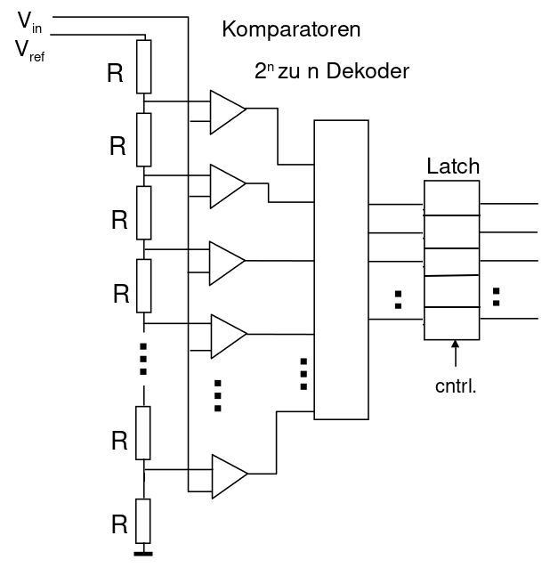<!-- style="width: 55%; max-width: 1000px" -->

Vorteil

+ Hohe Geschwindigkeit

Nachteil

+ Energieverbrauch größer
+ Hardwareaufwand für höhere Auflösungen

https://www.youtube.com/watch?v=x7oPVWLD59Y

### Sequenzielle Wandler

Sequenzielle Wandler umgehen die Notwendigkeit mehrerer Komperatoren, in dem das Referenzsignal variabel erzeugt wird.

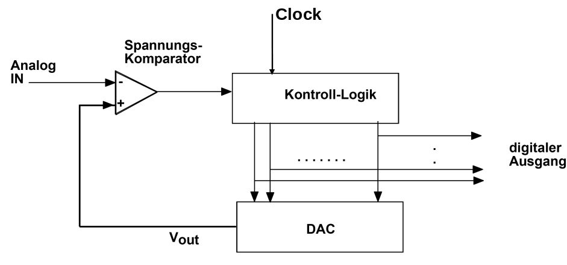<!-- style="width: 85%; max-width: 1000px" -->

Dafür ist allerdings ein Digital-Analog-Wandler nötig, der die Vergleichsspannung ausgehend von einer digitalen Konfiguration vornimmt.

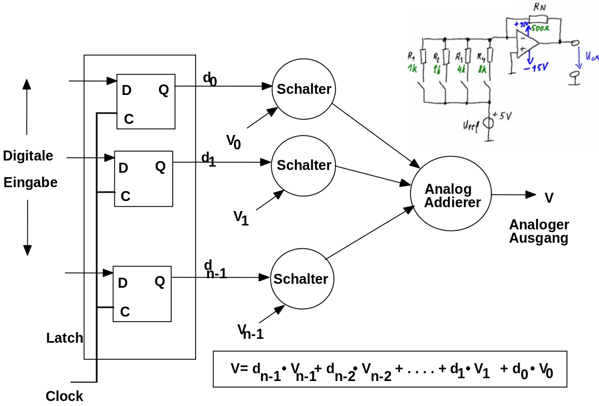<!-- style="width: 85%; max-width: 1000px" -->

**Zählverfahren**

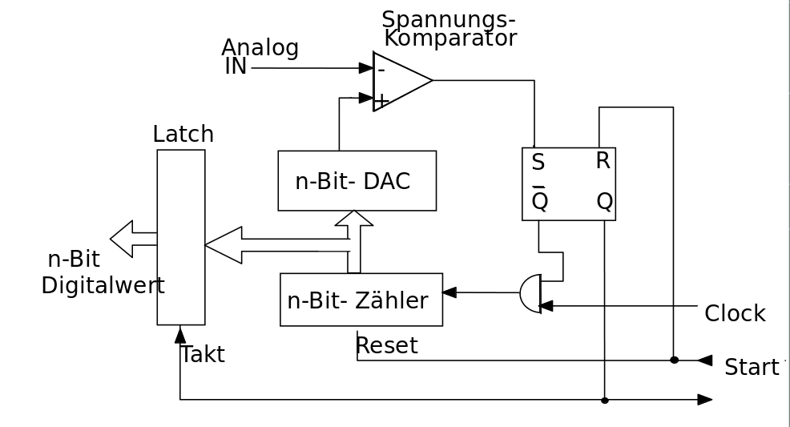<!-- style="width: 85%; max-width: 1000px" -->

Vorteil

+ sehr hohe Auflösungen möglich
+ Schaltung einfach umsetzbar – kritisches Element DAC/Komperator

Nachteil

+ Variierende Wandlungsdauer
+ langsam (verglichen mit dem Flashwandler)

**Sukzessive Approximation/Wägeverfahren**

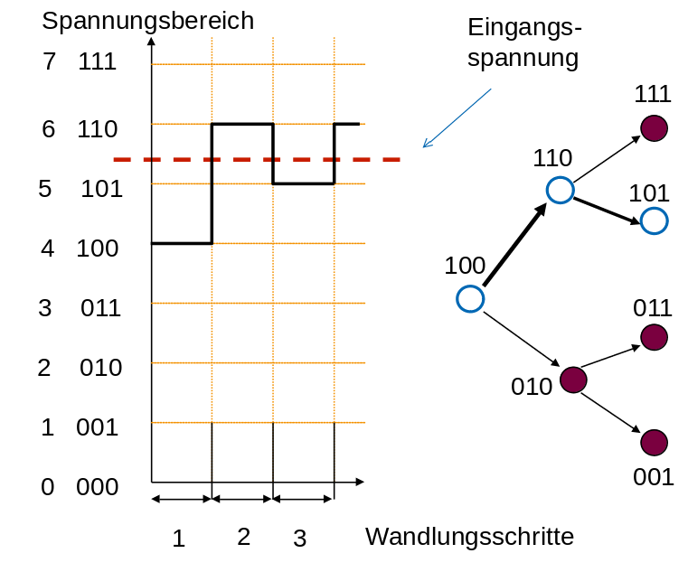<!-- style="width: 85%; max-width: 1000px" -->

Vorteil

+ Gleiche Wandlungsdauer

## Herausforderungen bei der Wandlung

**Fehlertypen**

<!-- style="width: 85%; max-width: 1000px" -->

+ Quantisierungsfehler sind bedingt durch die Auflösung des Wandlers
+ Offsetfehler ergeben sich aus einer Abweichung der Referenzspannung und führen zu einem konstanten Fehler.
+ Verstärkungsfehler im Analog-Digitalwandler wirken einen wertabhängigen Fehler.
+ Der Linearitätsfehler ist die Abweichung von der Geraden. Linearitätsfehler lassen sich nicht abgleichen.

> **Merke:** Die Fehlerparameter hängen in starkem Maße von der Konfiguration des Wandlers (Sample Frequenz, Arbeitsbreite, Umgebungstemperatur) ab!

<!-- style="width: 55%; max-width: 1000px" -->

[^Texas_TLC]: Firma Texas Instruments, Datenblatt AD-Wandler 8 Bit DIL-8, TLC0831, TLC0831IP

**Referenzspannung**

Eine Herausforderung liegt in der stabilen Bereitstellung der Referenzspannung für den Analog-Digital-Wandler.

## Parameter eines Analog-Digital-Wandlers

+ Auflösung
+ Messdauer
+ Leistungsaufnahme
+ Stabilität der Referenzspannung
+ Unipolare/Bipolare Messungen
+ Zahl der Eingänge
+ Ausgangsinterfaces (parallele Pins, Bus)
+ Temperaturabhängigkeit und Rauschverhalten (Gain, Nicht-Linearität, Offset)

## Umsetzung im AVR

| Handbuch des Atmega328p                             | Bedeutung                                                                                       |
| --------------------------------------------------- | ----------------------------------------------------------------------------------------------- |
| 10-Bit Auflösung                                    |                                                                                                 |
| 0.5 LSB Integral Non-Linearity                      | maximale Abweichung zwischen der idealen und der eigentlichen analogen Signalverlauf am Wandler |
| +/- 2 LSB Absolute Genauigkeit                      | Summe der Fehler inklusive Quantisierungsfehler, Offset Fehler etc.  (worst case Situation)     |
| 13 - 260μs Conversion Time                          | Die Dauer der Wandlung hängt von der Auflösung und der der vorgegebenen Taktrate  ab.                                                                                               |
| Up to 76.9kSPS (Up to 15kSPS at Maximum Resolution) |                                                                                                 |
| 0 - V CC ADC Input Voltage Range                    |  Es sind keine negativen Spannungen möglich.                                                                                               |
| Temperature Sensor Input Channel                    |                                                                                                 |
| Sleep Mode Noise Canceler                                                    |    Reduzierung des Streuquellen durch einen "Sleepmode" für die CPU                                                                                             |

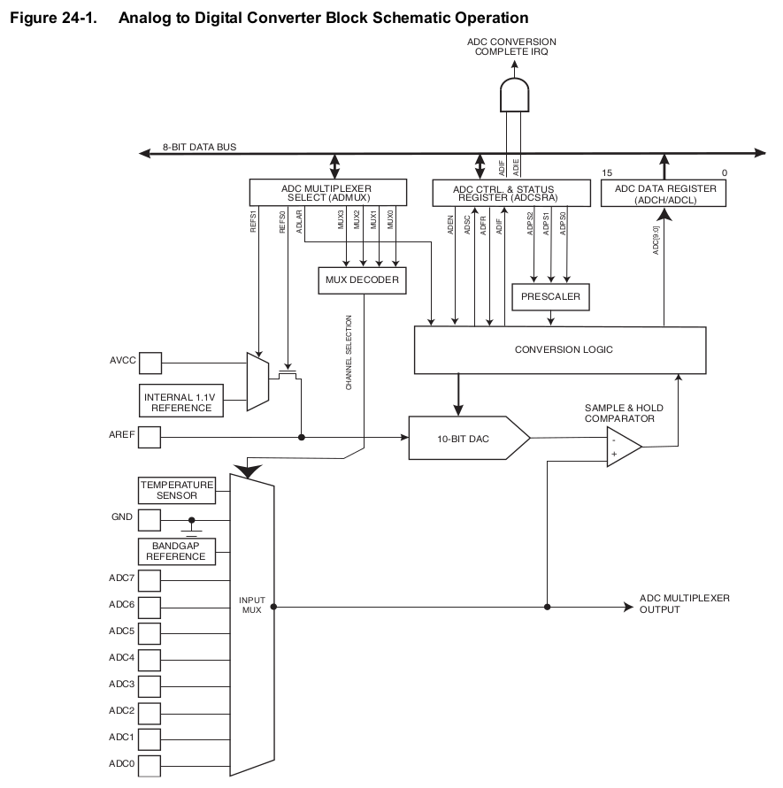<!-- style="width: 75%; max-width: 1000px" -->

**Trigger für den Wandlung**

Grundsätzlich sind 3 Modi für die Wandlung möglich:

+ Programmgetriggerte Ausführung der Wandlung
+ Kontinuierliche Wandlung
+ ereignisgetriebener Start

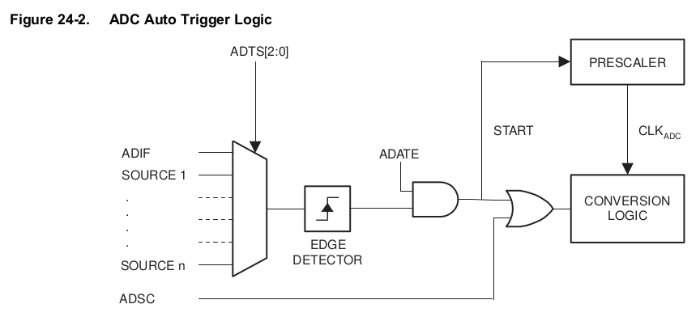<!-- style="width: 75%; max-width: 1000px" -->

<!-- style="width: 75%; max-width: 1000px" -->

**Ergebnisregister**

Die Atmega Prozessoren bieten eine Auflösung von 10Bit oder 8Bit für die analogen Wandlungen. Entsprechend stehen zwei Register `ADCL` und `ADCH` für die Speicherung bereit. Standardmäßig (d.h. `ADLAR == 0`) werden die niederwertigsten 8 im Register `ADCL` bereitgehalten und die zwei höherwertigsten im Register `ADCH`.

<!--
style="width: 80%; min-width: 420px; max-width: 720px;"
-->
```ascii
             ADCH                                   ADCL
  +---+---+---+---+---+---+---+---+   +---+---+---+---+---+---+---+---+
  |   |   |   |   |   |   |   |   |   |   |   |   |   |   |   |   |   |
  +---+---+---+---+---+---+---+---+   +---+---+---+---+---+---+---+---+
                            9   8       7   6   5   4   3   2   1   0
|                                                                      |
.----------------------------------------------------------------------.
                                ADCW

```

Das Ergebnis ergibt sich dann zu

```c
uint8_t theLowADC = ADCL
uint16_t theTenBitResults = ADCH<<8 | theLowADC;
```

Ist keine 10-bit Genauigkeit erforderlich, wird diese Zuordnung durch das Setzen des `ADLAR` Bits im `ADMUX` Register angepasst. Auf diese Weise kann das ADC Ergebnis direkt als 8 Bit Zahl aus `ADCH` ausgelesen werden.

<!--
style="width: 80%; min-width: 420px; max-width: 720px;"
-->
```ascii
             ADCH                                   ADCL
  +---+---+---+---+---+---+---+---+   +---+---+---+---+---+---+---+---+
  |   |   |   |   |   |   |   |   |   |   |   |   |   |   |   |   |   |
  +---+---+---+---+---+---+---+---+   +---+---+---+---+---+---+---+---+
    9   8   7   6   5   4   3   2       1   0
```

> **Merke: ** Immer zuerst ADCL und erst dann ADCH auslesen.

Beim Zugriff auf ADCL wird das ADCH Register gegenüber Veränderungen vom ADC gesperrt. Erst beim nächsten Auslesen des ADCH-Registers wird diese Sperre wieder aufgehoben. Dadurch ist sichergestellt, dass die Inhalte von ADCL und ADCH immer aus demselben Wandlungsergebnis stammen, selbst wenn der ADC im Hintergrund im Free-Conversion-Mode arbeitet.

[^megaAVR]: Firma Microchip, megaAVR® Data Sheet, [Link](http://ww1.microchip.com/downloads/en/DeviceDoc/ATmega48A-PA-88A-PA-168A-PA-328-P-DS-DS40002061A.pdf)

## Beispiele

Der Simulative Eingang x (0 bis 5V) ist an A0 angeschlossen.

<lia-keep>
    <div id="example_div8_id">
        <span id="simulation-time"></span><br>
         <voltage-slider-element min="0.0" max="5.0" value="1.0" analogPinNumber="0"></voltage-slider-element><br>
    </div>
</lia-keep>

``` cpp
void setup() {
   pinMode(A0,INPUT);
   Serial.begin(9600);
   //analogReference(INTERNAL);
}
void loop() {
  Serial.println(analogRead(A0));
  delay(25);
}
```
@AVR8jsMem.sketch(example_div8_id,100000,1)

> **Aufgabe:** Recherchieren Sie die Varianten von `analogReference()` für einzelne Vertreter der Arduino Familie. Warum unterscheiden sich die Parameter?

### Beispiel 1 - Heißleiter

 NTC-Widerstände (_Negative Temperature Coefficient_) werden zur Messung der Temperatur eingesetzt. Wichtigster Kennwert eines NTCs ist der Nennwiderstand R25 bei einer Nenntemperatur von 25 °C.


 NTC-Widerstand Kennlinie
   40     |  *                                    (* Temperaturverlauf)
          |    *                                    (r 25 Grad Celsius)
          |             
          |rrrrrrrrr*      
 R in kOhm|         r               
          |         r      *       
          |         r             *
          |         r                         *
          |         r
   0      +------------------------------------------
          0     Temperatur in Grad Celsius       100


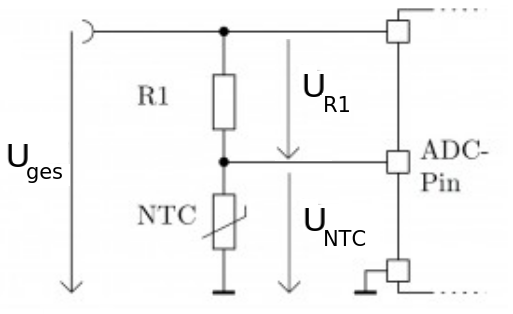<!-- style="width: 75%; max-width: 500px" -->


$$
\begin{aligned}
\frac{R_{NTC}}{R_1} &= \frac{U_{NTC}}{U_{R1}} = \frac{U_{NTC}}{(U_{ges} - U_{NTC})}  \\
R_{NTC} &= R_{1}  \cdot \frac{U_{NTC}}{(U_{ges} - U_{NTC})}
\end{aligned}
$$

Wenn wir davon ausgehen, dass die Referenzspannung des AD-Wandlers gleich $U_{ges}$ ist, generieren wir eine digitale Repräsentation $U_{NTC_d}$ entsprechend

$$
U_{NTC_d} = U_{NTC} \cdot \frac{U_{ges}}{ADC_{resolution}}
$$

Wie interpretieren wir somit einen beispielhaften Wert von `628` am Ende des Wandlungsprozesses?

$$
U_{NTC}  = U_{NTC_d} \cdot \frac{ADC_{resolution}}{U_{ges}}
$$

Mit diesem Spannungswert können wir nun den zugrundeliegenden Widerstand berechnen und letztendlich die Temperatur.

### Beispiel 2 - Lesen eines Analogen Distanzsensors

Für das Beispiel wird der AtMega2560 verwendet, der eine interne Referenzspannung von 2.56 V anstatt der des AtMega328 von 1.1 V bereit stellt.

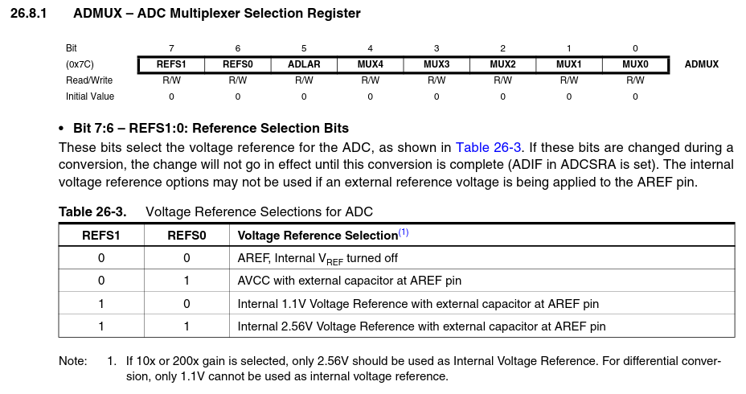<!-- style="width: 75%; max-width: 1000px" -->

[^megaAVR2560]: Firma Atmel, Atmel ATmega640/V-1280/V-1281/V-2560/V-2561/V, Seite 281, [Link](https://ww1.microchip.com/downloads/en/devicedoc/atmel-2549-8-bit-avr-microcontroller-atmega640-1280-1281-2560-2561_datasheet.pdf)

Die Bedeutung ergibt sich beim Blick ins Datenblatt des Sensors GP2D, dessen Maximalwertausgabewert liegt bei etwa 2.55V

```c
#ifndef F_CPU
#define F_CPU 16000000UL // 16 MHz Taktrate
#endif

#include <avr/io.h>
#include <util/delay.h>

int readADC(int channel) {
  int i; int result = 0;
  // Den ADC aktivieren und Teilungsfaktor auf 64 stellen
  ADCSRA = (1<<ADEN) | (1<<ADPS2) | (1<<ADPS1);
  // Kanal des Multiplexers & Interne Referenzspannung (2,56 V)
  ADMUX = channel | (1<<REFS1) | (1<<REFS0);
  // Den ADC initialisieren und einen sog. Dummyreadout machen
  ADCSRA |= (1<<ADSC);
  while(ADCSRA & (1<<ADSC));
  ADCSRA |= (1<<ADSC);
  while(ADCSRA & (1<<ADSC)); // Auf Ergebnis warten...
  // Lesen des Registers "ADCW" kümmert sich um das Lesen von ADCL und ADCH.
  result = ADCW;
  // ADC wieder deaktivieren
  ADCSRA = 0;
  return result;
}

int main(void)
{
  Serial.begin(9600);
  while (1) // Unendliche Schleife
  {
    int result_individual = readADC(0);
    Serial.println(result_individual);
    Serial.flush();
    _delay_ms(10); // Verzögerung von 1 Sekunde
  }
  return  0; // wird nie erreicht
}
```

> _The first ADC conversion result after switching reference voltage source may be inaccurate, and the user is advised to discard this result._ Handbuch Seite 252

### Beispiel 3 - Temperaturüberwachung des Controllers

> _The temperature measurement is based on an on-chip temperature sensor that is coupled to a single ended ADC8 channel. Selecting the ADC8 channel by writing the MUX3...0 bits in ADMUX register to "1000" enables the temperature sensor. The internal 1.1V voltage reference must also be selected for the ADC voltage reference source in the temperature sensor measurement. When the temperature sensor is enabled, the ADC converter can be used in single conversion mode to measure the voltage over the temperature sensor._ Handbuch Seite 256

```c
#ifndef F_CPU
#define F_CPU 16000000UL // 16 MHz clock speed
#endif

#include <avr/io.h>
#include <util/delay.h>

double getTemp(void)
{
    unsigned int wADC;
    double t;

    // Set the internal reference and mux.
    ADMUX = (1<<REFS1) | (1<<REFS0) | (1<<MUX3));
    ADCSRA |= (1<<ADEN);  // enable the ADC

    // wait for voltages to become stable.
    delay(20);

    // Start the ADC
    ADCSRA |= (1<<ADSC);

    // Detect end-of-conversion
    while (ADCSRA & (1<<ADSC));
    wADC = ADCW;

    // The offset of 324.31 could be wrong. It is just an indication.
    t = (wADC - 324.31 ) / 1.22;

    // The returned temperature is in degrees Celsius.
    return (t);
}

int main(void)
{
  Serial.begin(9600);
  while (1)
  {
    Serial.println(getTemp());
    Serial.flush();
    _delay_ms(10); //1 second delay
  }
  return  0; // wird nie erreicht
}
```

[^megaAVR]: Firma Microchip, megaAVR® Data Sheet, [Link](http://ww1.microchip.com/downloads/en/DeviceDoc/ATmega48A-PA-88A-PA-168A-PA-328-P-DS-DS40002061A.pdf)
