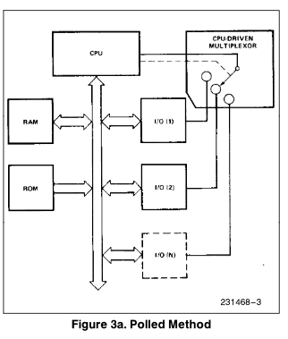
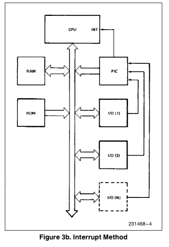
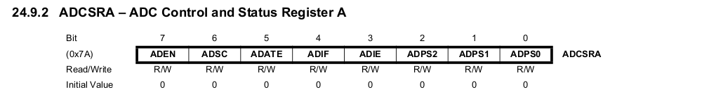
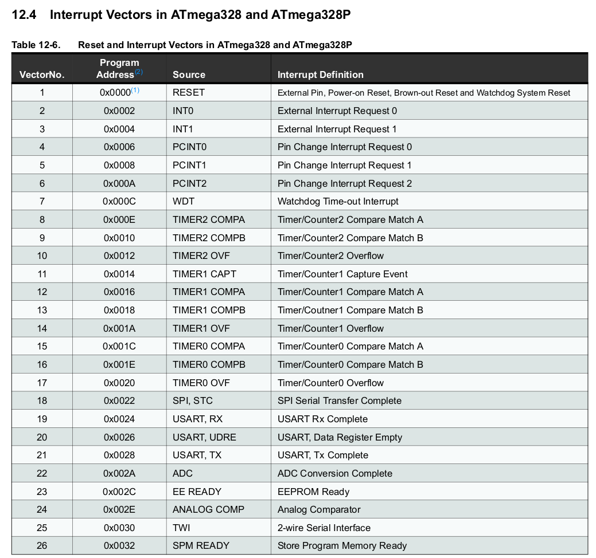
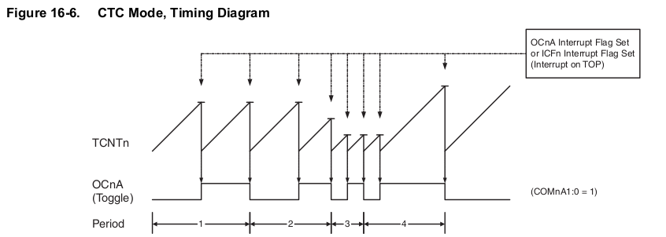
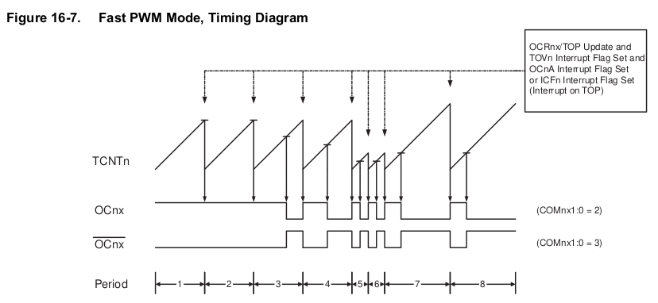
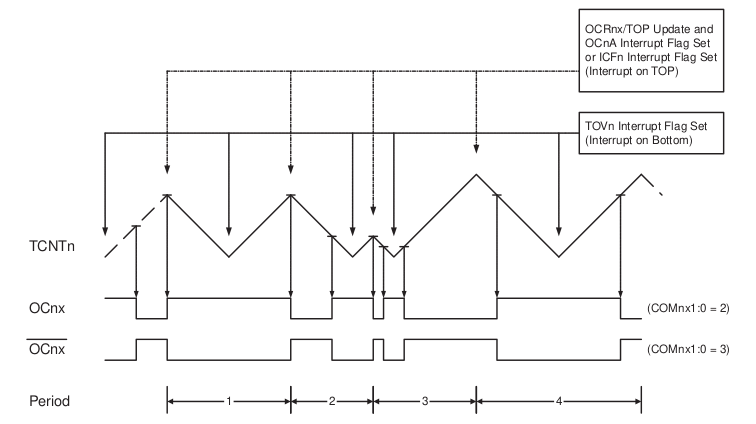
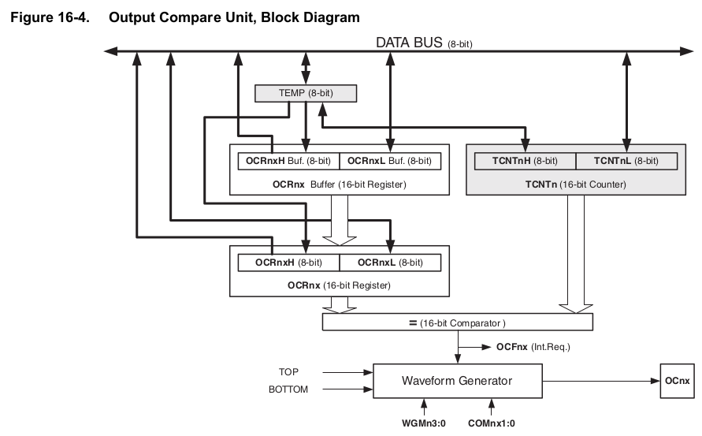

<!--

author:   Sebastian Zug & André Dietrich & Fabian Bär
email:    sebastian.zug@informatik.tu-freiberg.de & andre.dietrich@informatik.tu-freiberg.de & fabian.baer@student.tu-freiberg.de
version:  0.0.4
language: de
narrator: Deutsch Female

import:  https://raw.githubusercontent.com/liascript-templates/plantUML/master/README.md
         https://github.com/LiaTemplates/Pyodide
         https://github.com/LiaTemplates/AVR8js/main/README.md#10

mark: <span style="background-color: @0;
                                  display: flex;
                                  width: calc(100% + 32px);
                                  margin: -16px;
                                  padding: 6px 16px 6px 16px;
                                  ">@1</span>
red:  @mark(#FF888888,@0)
blue: @mark(#898AE3,@0)
gray: @mark(gray,@0)
-->

# Timer und Interrupts

**TU Bergakademie Freiberg - Wintersemester 2020 / 21**

Link auf die aktuelle Vorlesung im Versionsmanagementsystem GitHub

[https://github.com/TUBAF-IfI-LiaScript/VL_EingebetteteSysteme/blob/15_TimerUndInterrupts.md](https://github.com/TUBAF-IfI-LiaScript/VL_EingebetteteSysteme/blob/master/15_TimerUndInterrupts.md)

Die interaktive Form ist unter [diesem Link](https://liascript.github.io/course/?https://raw.githubusercontent.com/TUBAF-IfI-LiaScript/VL_EingebetteteSysteme/master/15_TimerUndInterrupts.md#1) zu finden

---------------------------------------------------------------------

** Fragen an die Veranstaltung**

+ Für welche Aufgaben werden die Timerfunktionen des Mikrocontrollers herangezogen?
+ Wie sind ein Timer grundlegend aufgebaut (Capture&Compare)?
+ Was ist PWM? Welche Arten der PWM Generierung gibt es?
+ Welche Schritte werden bei der Abarbeitung von Interrupts durchlaufen?
+ Welche Folgen können verpasste Interrupts haben? Beziehen Sie sich dabei insbesondere auf verschiedene Sensortypen, mit denen Sie in der Übung gearbeitet haben.
+ Woraus ergibt sich die Prioritätenfolge der Interrupts beim AVR?
+ Nennen Sie Interruptquellen beim AVR?
+ Wie viele Interrupts können sich beim Atmega stauen, ohne dass einer verloren geht?

<!--
style="width: 80%; min-width: 420px; max-width: 720px;"
-->
```ascii

                Abstraktionsebenen

           +----------------------------+ -.   
  Ebene 6  | Problemorientierte Sprache |  |     ╔═══════════════╗  
           +----------------------------+  |  ◀══║ HIER SIND WIR!║  
                                           ⎬     ╚═══════════════╝
           +----------------------------+  |  Anwendungssoftware
  Ebene 5  | Assemblersprache           |  |
           +----------------------------+ -.

           +----------------------------+
  Ebene 4  | Betriebssystem             |     Systemsoftware
           +----------------------------+

           +----------------------------+
  Ebene 3  | Istruktionsset             |     Maschinensprache
           +----------------------------+     

           +----------------------------+  -.
  Ebene 2  | Mikroarchitektur           |   |
           +----------------------------+   |
                                            ⎬ Automaten, Speicher, Logik
           +----------------------------+   |
  Ebene 1  | Digitale Logik             |   |
           +----------------------------+  -.

           +----------------------------+
  Ebene 0  | E-Technik, Physik          |     Analoge Phänomene
           +----------------------------+                                      .
```

---------------------------------------------------------------------

## Interrupts

Ein Interrupt beschreibt die kurzfristige Unterbrechung der normalen Programmausführung, um einen, in der Regel kurzen, aber zeitlich kritischen, Vorgang abzuarbeiten.

```text @plantUML.png
@startuml
ditaa
                         Hauptprogramm              Interrupt-Routine
                       +---------------+        
                       : ...           |              
                       +---------------+                                                             
                       : Instruktion 1 |      +-------------+                                         
                       +---------------+      |             |                        
Interrupt tritt auf -> : Instruktion 2 |      |             v                                       
                       +---------------+      |     +---------------+                             
                               |              |     : Instruktion A |                             
                               +--------------+     +---------------+                   
                                                    : Instruktion B |
                               +--------------+     +---------------+
                               |              |     : Instruktion C |
                       +---------------+      |     +---------------+
                       : Instruktion 3 |      |             |
                       +---------------+      +-------------+
                       : Instruktion 4 |
                       +---------------+
                       : ...           |
                       +---------------+

@enduml
```

Beispiele

| Trigger                     | Beispiel                                          |
| --------------------------- | ------------------------------------------------- |
| Pin Zustandswechsel         | Drücken des Notausbuttons                         |
| Kommunikationsschnittstelle | Eintreffen eines Bytes                            |
| Analog Comperator           | Resultat einer Analog-Comperator Auswertung       |
| Analog-Digital-Wandler      | Abschluss einer Wandlung                          |
| Timer                       | Übereinstimmung von Vergleichswert und Zählerwert |


{{1}}
|     | Polling (zyklisches Abfragen)                                                                        | Interrupts                                                                                        |
| --- | ---------------------------------------------------------------------------------------------------- | ------------------------------------------------------------------------------------------------- |
|     | <!-- style="width: 75%; max-width: 1000px" --> [^1] | <!-- style="width: 75%; max-width: 1000px" --> [^1] |
| Vorteile    | <ul> <li>Kein zusätzlicher Hardwareaufwand</li>
<li>Deterministisches Zeitverhalten</li>
</ul>                                                                                                 |         <ul>
<li>Effiziente Abarbeitung bezogen auf die Auftretenshäufigkeit </li>
</ul>                                                                                                    |
| Nachteile    | <ul> <li>Auslastung des Prozessors</li>
<li>Verzögerung der Reaktion durch periodisches Abarbeitungskonzept</li>
</ul>                                                                                                 |         <ul>
<li> Zusätzlicher Hardwareaufwand </li>
</ul>                                                                                                   |

[^1]: Firma Intel, Manual Intel 8259, Seite 3, [Link](https://pdos.csail.mit.edu/6.828/2011/readings/hardware/8259A.pdf)  

### Formen der Unterbrechungsbehandlung

+ Traps ... _a programmer initiated and expected transfer of control to a special handler routine (software interrupt)._

  + auf x86 Architekturen - INT
  + für AVR – kein eigner OP-Code

+ Exceptions ... _is an automatically generated trap (coerced rather than that occurs in response to some exceptional condition. requested)_

  + auf x86 – für Division durch 0, fehlerhaften Speicherzugriff, illegal OP Code
  + für AVR – alle Resetquellen

+ Interrupts (hardware interrupts) ... _are program control interruption based on an external hardware event (external to the CPU)_


Interupt Service Routine = {Trap handling, Exception handling, ...}


### Ablauf

| Schritt      | Beschreibung                                                                                                                                                                                                                                                                                                                                                                       |
| ------------ | ---------------------------------------------------------------------------------------------------------------------------------------------------------------------------------------------------------------------------------------------------------------------------------------------------------------------------------------------------------------------------------- |
|              | Normale Programmabarbeitung ...                                                                                                                                                                                                                                                                                                                                                    |
| Vorbereitung | <ul> <li>Beenden der aktuelle Instruktion </li> <li>(Deaktivieren der   Interrupts)</li><li>Sichern des Registersatzes auf dem Stack </li> </ul>                                                                                                                                                                                                                                    |
| Ausführung   | <ul> <li>Realisierung der Interrupt-Einsprung-Routine </li> <li>Sprung über die Interrupt-Einsprungtabelle zur Interrupt-Behandlungs-Routine </li><li>Ausführung der Interrupt-Behandlungs-Routine </li></ul> |
| Rücksprung             | <ul><li>Wiederherstellen des Prozessorzustandes und des Speichers vom Stack </li><li>Sprung in den Programmspeicher mit dem zurückgelesenen PC </li></ul>                                                                                                                                                                                                                                        |
|              | Fortsetzung des Hauptprogrammes ...                                                                                                                                                                                                                                                                                                                                                |
Notwendige Funktionalität und Herausforderungen:

+ Erkenne die Interruptquelle
+ Bewerte die Relevanz für das aktuelle Programm
+ Unterbreche den Programmablauf transparent und führe die ISR aus
+ Beachte unterschiedliche Prioritäten für den Fall gleichzeitig eintreffender Interrupts

> **Merke** ISRs sollten das Hauptprogramm nur kurz unterbrechen! Ein blockierendes Warten ist nicht empfehlenswert! Zudem darf die Abarbeitungsdauer nicht länger sein als die höchste Wiederauftretensfrequenz des Ereignisses.

### Umsetzung auf dem AVR

                        {{0}}
********************************************************************************

Interrupts müssen individuell aktiviert werden. Dazu dient auf praktisch allen Mikrocontrollern ein zweistufiges System.

+ Die Globale Interruptsteuerung erfolgt über ein generelles CPU-Statusbit, für den AVR Core is dies das I-Bit (Interrupt) im Statusregister (SREG).
+ Die jeweilige lokale Interruptsteuerung erlaubt die individuelle Aktivierung über ein Maskenbit jeder Interruptquelle.

Damit können wahlweise Interrupts generell deaktiviert werden während die einzelne Konfiguration unverändert bleibt. Umgekehrt lassen sich spezifische Funktionalitäten ansprechen.

Eine ISR wird demnach nur dann ausgeführt, wenn

+ die Interrupts global freigeschaltet sind
+ das individuelle Maskenbit gesetzt ist
+ der Interrupt (in dem konfigurierten Muster) eintritt

<!-- style="width: 75%; max-width: 1000px" -->[^3]

[^3]: Firma Microchip, megaAVR® Data Sheet, Seite 247, [Link](http://ww1.microchip.com/downloads/en/DeviceDoc/ATmega48A-PA-88A-PA-168A-PA-328-P-DS-DS40002061A.pdf)


<!-- style="width: 75%; max-width: 1000px" -->[^3]

[^3]: Firma Microchip, megaAVR® Data Sheet, Seite 258, [Link](http://ww1.microchip.com/downloads/en/DeviceDoc/ATmega48A-PA-88A-PA-168A-PA-328-P-DS-DS40002061A.pdf)


********************************************************************************

                         {{1}}
********************************************************************************

<!-- style="width: 75%; max-width: 1000px" -->[^1]

[^1]: Firma Microchip, megaAVR® Data Sheet, Seite 74, [Link](http://ww1.microchip.com/downloads/en/DeviceDoc/ATmega48A-PA-88A-PA-168A-PA-328-P-DS-DS40002061A.pdf)

Im Anschluss wird die Integration der Interrupt-Vektortabelle im Speicher dargestellt.

*******************************************************************************

                            {{2}}
********************************************************************************

Der AVR deaktiviert die Ausführung von Interrupts, wenn er eine ISR aktiv ist. Dies kann aber manuell überschrieben werden.

<!-- style="width: 75%; max-width: 1000px" -->[^3]

[^3]: Firma Microchip, megaAVR® Data Sheet, Seite 258, [Link](http://ww1.microchip.com/downloads/en/DeviceDoc/ATmega48A-PA-88A-PA-168A-PA-328-P-DS-DS40002061A.pdf)

_ADIF is cleared by hardware when executing the corresponding interrupt handling vector. Alternatively, ADIF is cleared by writing a logical one to the flag. Beware that if doing a Read-Modify-Write on ADCSRA, a pending interrupt can be disabled._

> **Merke:** Der "Speichermechanismus" ein und des selben Interrupts ist ein Bit groß. Von anderen Interrupts, die zwischenzeitlich eintreffen kann jeweils ein Auftreten gespeichert werden.

*******************************************************************************

### Praktische Interruptprogrammierung

**Atomarer Datenzugriff**

> **Merke:** Das Hauptprogramm kann grundsätzlich an jeder beliebigen Stelle unterbrochen werden, sofern die Interrupts aktiv sind.

Das bedeutet, dass entsprechende Variablen und Register, die sowohl im Hauptprogramm als auch in Interrupts verwendet werden, mit Sorgfalt zu behandeln sind.

Dies ist umso bedeutsamer, als das ein C Aufruf `port |= 0x03;` in drei Assemblerdirektiven übersetzt wird. An welcher Stelle wäre ein Interrupt kritisch?

```asm
  IN  r16, port
  ORI r16, 0x03
  OUT port, r16
```

```c
// Manuelle Methode
cli(); // Interrupts abschalten
port |= 0x03;
sei(); // Interrupts wieder einschalten

// Per Macros aus dem avr gcc, schöner lesbar und bequemer
// siehe Doku der avr-libc, Abschnitt <util/atomic.h>
ATOMIC_BLOCK(ATOMIC_FORCEON) {
  port |= 0x03;  
}
```

Mit Blick auf die Wiederverwendbarkeit des Codes sollte geprüft werden, ob die globalen Interrupts überhaupt aktiviert waren! Die avr-libc hält dafür die Methode ` ATOMIC_BLOCK(ATOMIC_RESTORESTATE)` bereit.

**Volatile Variablen**

`volatile` Variabeln untersagen dem Compiler Annahmen zu deren Datenfluss zu treffen. Mit

```c      volatile.c
volatile uint8_t i;

ISR( INT0_vect ){
  i++;
}

int main(){
  ...
  i = 0;
  while( 1 ) {
     Serial.println(i);
  }
}
```

### Einführungsbeispiele

**Externe Interrupts**

Wenden wir das Konzept mal auf einen konkreten Einsatzfall an und lesen die externen Interrupts in einer Schaltung. Dabei sollen Aktivitäten an einem externen Interruptsensiblen Pin überwacht werden.

> **Aufgabe:** Ermitteln Sie mit die PORT zugehörigkeit und die ID der Externen Interrupt PINs `ÌNT0` und `ÌNT1`. Welche Arduino Pin ID gehört dazu?

```cpp       main.cpp
#define F_CPU 16000000UL

#include <avr/io.h>
#include <avr/interrupt.h>

ISR(INT0_vect) {
  PORTB |= (1 << PB5);
}

int main (void) {
   DDRB |= (1 << PB5);
   DDRD &= ~(1 << DDD2);       // Pin als Eingang
   PORTD |= (1 << PORTD2);     // Pullup-Konfiguration
   EIMSK |= ( 1 << INT0);
   EICRA |= ( 1 << ISC01);
   sei();
   while (1);
   return 0;
}
```

**Analog Digitalwandler**

Das folgende Beispiel nutzt den Analog-Digital-Wandler in einem teilautonomen Betrieb. Innerhalb der Interrupt-Routine wird das Ergebnis ausgewertet und jeweils eine neue Wandlung aktiviert.

Als Demonstrator dient ein Spannungsteiler über einen lichtabhängigen Widerstand.

```c
#include <avr/io.h>
#include <avr/interrupt.h>

// Interrupt subroutine for ADC conversion complete interrupt
ISR(ADC_vect) {
   //Serial.println(ADCW);
   if(ADCW >= 600)            
       PORTB |= (1 << PB5);
   else
       PORTB &=~(1 << PB5);
   ADCSRA |= (1<<ADSC);       
}

int main(void){
    Serial.begin(9600);
    DDRB |= (1 << PB5);  
    ADMUX = (1<<REFS0);  
    ADCSRA |= (1 << ADPS2) | (1 << ADPS1) | (1<<ADPS0) | (1<<ADEN)|(1<<ADIE);              
    ADCSRA |= (1<<ADSC);              // Dummy read
    while(ADCSRA & (1<<ADSC));
    ADCSRA |= (1<<ADSC);              // Start conversion "chain"
    (void) ADCW;
    sei();                            // Set the I-bit in SREG

    int i = 0;
    while (1) {
       Serial.print("Ich rechne fleißig ... ");
       Serial.println(i++);
       _delay_ms(50);
    }

    return 0;                         
}
```

### Interrupt-Vektortabelle im AVR Programm

Und warum funktioniert das Ganze? Lassen Sie uns ein Blick hinter die Kulissen werfen.

Folgendes Programm, dass den externen Interrupt 0 auswertet wurde disassembliert.

```c
#define F_CPU 16000000UL

#include <avr/io.h>
#include <avr/interrupt.h>

ISR(INT0_vect) {
  PORTB |= (1 << PB5);
}

int main (void) {
   DDRB |= (1 << PB5);
   DDRD &= ~(1 << DDD2);    
   PORTD |= (1 << PORTD2);   
   EIMSK |= ( 1 << INT0);
   EICRA |= ( 1 << ISC01);
   sei();
   while (1);
   return 0;
}
```

```asm        main.asm
; Interrupt Vector Tabelle mit zugehörigen Sprungfunktionen
00000000 <__vectors>:
   0:	0c 94 34 00 	jmp	0x68	; 0x68 <__ctors_end>
   4:	0c 94 40 00 	jmp	0x80	; 0x80 <__vector_1>
   8:	0c 94 3e 00 	jmp	0x7c	; 0x7c <__bad_interrupt>

  60:	0c 94 3e 00 	jmp	0x7c	; 0x7c <__bad_interrupt>
  64:	0c 94 3e 00 	jmp	0x7c	; 0x7c <__bad_interrupt>

; Initialisierungsroutine für den Controller
00000068 <__ctors_end>:
  68:	11 24       	eor	r1, r1    ;       0 in R1
  6a:	1f be       	out	0x3f, r1	;       SREG = 0
  6c:	cf ef       	ldi	r28, 0xFF	; 255   
  6e:	d8 e0       	ldi	r29, 0x08	; 8     SP -> 0x8FF
  70:	de bf       	out	0x3e, r29	; 62    SPH (0x3e)
  72:	cd bf       	out	0x3d, r28	; 61    SPL (0x3d)
  74:	0e 94 4b 00 	call	0x96	; 0x96 <main>
  78:	0c 94 56 00 	jmp	0xac	; 0xac <_exit>

; Restart beim Erreichen eines nicht definierten Interrupts
0000007c <__bad_interrupt>:
  7c:	0c 94 00 00 	jmp	0	; 0x0 <__vectors>

; Interrupt Routine für External Interrupt 0
00000080 <__vector_1>:
  80:	1f 92       	push	r1
  82:	0f 92       	push	r0
  84:	0f b6       	in	r0, 0x3f	; 63
  86:	0f 92       	push	r0
  88:	11 24       	eor	r1, r1
  ; PORTB |= (1 << PB5);
  8a:	2d 9a       	sbi	0x05, 5	; 5
  8c:	0f 90       	pop	r0
  8e:	0f be       	out	0x3f, r0	; 63
  90:	0f 90       	pop	r0
  92:	1f 90       	pop	r1
  94:	18 95       	reti

00000096 <main>:
  ;DDRB |= (1 << PB5);
  96:	25 9a       	sbi	0x04, 5	; 4
  ; DDRD &= ~(1 << DDD2);    
  98:	52 98       	cbi	0x0a, 2	; 10
  ; PORTD |= (1 << PORTD2);   
  9a:	5a 9a       	sbi	0x0b, 2	; 11
  ; EIMSK |= ( 1 << INT0);
  9c:	e8 9a       	sbi	0x1d, 0	; 29
  ; EICRA |= ( 1 << ISC01);
  9e:	80 91 69 00 	lds	r24, 0x0069	; 0x800069 <__DATA_REGION_ORIGIN__+0x9>
  a2:	82 60       	ori	r24, 0x02	; 2
  a4:	80 93 69 00 	sts	0x0069, r24	; 0x800069 <__DATA_REGION_ORIGIN__+0x9>
  ; sei();
  a8:	78 94       	sei
  aa:	ff cf       	rjmp	.-2      	; 0xaa <main+0x14>

000000ac <_exit>:
  ac:	f8 94       	cli

000000ae <__stop_program>:
  ae:	ff cf       	rjmp	.-2      	; 0xae <__stop_program>
```

## Timer

Aufgaben von Timer/Counter Lösungen in einem Mikrocontroller:

+ Zählen von Ereignissen
+ Messen von Zeiten, Frequenzen, Phasen, Perioden
+ Erzeugen von Intervallen, Pulsfolgen, Interrupts
+ Überwachen von Ereignissen und Definition von Zeitstempeln

### Basisfunktionalität

Die Grundstruktur eines Zählerbaustein ergibt sich aus folgenden Komponenten:

```text @plantUML.png
@startuml
ditaa
+------------+
|            |
|            v                    
|   +-------------------+        interner   Interrupt
|   : Startwertregister |          Takt      
|   +-------------------+            |          ^            
|            |                       v          |            
|            v                    +-----------------+
|   +-------------------+         |                 | <---- Externer Takt
|   | Zählereinheit     |<------->| Steuerung       |       
|   | vorwärts/rückwärts|         | (Taktauswahl    | <---- Aktivierung
|   +-------------------+         |  Ausgabe)       |
|            |                    |                 | ----> Ausgabe
|            v                    +++++++++++++++++++
|   +-------------------+
|   : Zählerregister    |
|   +-------------------+
|            |
+------------+
@enduml
```

Capture/Compare-Einheiten Nutzen die Basis-Timerimplementierung. Sie können externe Signale aufnehmen und vergleichen, aber beispielsweise auch Pulsmuster erzeugen.

Sie besitzt meist mehrere Betriebsmodi:

+ Timer/Zähler-Modus: Aufwärtszählen mit verschiedenen Quellen als Taktgeber. Bei Zählerüberlauf kann ein Interrupt ausgelöst werden.

+ Capture-Modus: Beim Auftreten eines externen Signals wird der Inhalt des zugeordneten (laufenden) Timers gespeichert. Auch hier kann ein Interrupt ausgelöst werden.

```text @plantUML.png
@startuml
ditaa
+------------+
|            |
|            v                             +-------------------+  
|   +-------------------+        interner  | Interrupt cFF4    |
|   : Startwertregister |          Takt    +-------------------+   
|   +-------------------+            |          ^            
|            |                       v          |            
|            v                    +-----------------+
|   +-------------------+         |                 | <---- Externer Takt
|   | Zählereinheit     |<------->| Steuerung       |       +-------------------------+
|   | vorwärts/rückwärts|         | (Taktauswahl    | <---- |Aktivierung über Pin cFF4|
|   +-------------------+         |  Ausgabe)       |       +-------------------------+
|            |                    |                 | ----> Ausgabe
|            v                    +++++++++++++++++++
|   +-------------------+
|   : Zählerregister    |
|   +-------------------+
|            |     |
+------------+     v
                +--------------------+
                |Captureregister cFF4|
                +--------------------+
@enduml
```

+ Compare-Modus: Der Zählerstand des zugeordneten Timers wird mit dem eines Registers verglichen. Bei Übereinstimmung kann ein Interrupt ausgelöst werden.

```text @plantUML.png
@startuml
ditaa
+------------+
|            |
|            v                             +-------------------+  
|   +-------------------+        interner  | Interrupt cFF4    |
|   : Startwertregister |          Takt    +-------------------+   
|   +-------------------+            |          ^            
|            |                       v          |            
|            v                    +-----------------+
|   +-------------------+         |                 | <---- Externer Takt
|   | Zählereinheit     |<------->| Steuerung       |       
|   | vorwärts/rückwärts|         | (Taktauswahl    | <---- Aktivierung über Pin
|   +-------------------+   +---->|  Ausgabe,       |       +-------------------------+
|            |              |     |  Vergleich)     | ----> | Ausgabe             cFF4|
|            v              |     +++++++++++++++++++       +-------------------------+
|   +-------------------+   |             ^
|   : Zählerregister    |---+             |
|   +-------------------+                 v
|            |                   +--------------------+   
+------------+                   |Compareregister cFF4|   
                                 +--------------------+           
@enduml
```

> **Merke:** Diese Vorgänge laufen ausschließlich in der Peripherie-Hardware ab, beanspruchen also, abgesehen von eventuellen Interrupts, keine Rechenzeit.

Entsprechend ergibt sich für den Compare-Modus verschiedene Anwendungen und ein zeitliches Verhalten entsprechend den nachfolgenden Grafiken.

<!-- style="width: 75%; max-width: 1000px" -->

<!-- style="width: 75%; max-width: 1000px" -->

### Umsetzung im AVR

Der AtMega328 bringt 4 unabhängige Timersysteme mit:

+ _Two 8-bit Timer/Counters with Separate Prescaler and Compare Mode_
+ _One 16-bit Timer/Counter with Separate Prescaler, Compare Mode, and Capture Mode_
+ _Real Time Counter with Separate Oscillator_
+ _Six PWM Channels_

Dabei soll die Aufmerksamkeit zunächst auf dem 16-bit Timer/Zähler liegen.

<!-- style="width: 75%; max-width: 1000px" -->[^1]

[^1]: Firma Microchip, megaAVR® Data Sheet, Seite 250, [Link](http://ww1.microchip.com/downloads/en/DeviceDoc/ATmega48A-PA-88A-PA-168A-PA-328-P-DS-DS40002061A.pdf)

Folgende Fragen müssen wir die Nutzung des Timers beantwortet werden:

+ Wer dient als Trigger?
+ Wie groß wird der Prescaler gewählt?
+ Welche maximalen und die minimalen Schranken des Zähler werden definiert?
+ Wird ein Ausgang geschaltet?

#### Timer Modi

Timer-Modi bestimmen das Verhalten des Zählers und der angeschlossenen Ausgänge / Interrupts. Neben dem als Normal-Mode bezeichneten Mechanismus existieren weitere Konfigurationen, die unterschiedliche Anwendungsfelder bedienen.

**Clear to Compare Mode (CTC)**

<!-- style="width: 75%; max-width: 1000px" -->[^4]

Die Periode über eine `OCnA` Ausgang ergibt sich entsprechend zu

$$
f_{OCnA} = \frac{f_{clk_i/o}}{2 \cdot N \ cdot (1 + OCRnA)}
$$

Der Counter läuft zwei mal durch die Werte bis zum Vergleichsregister `OCRnA`. Die Frequenz kann durch das Setzen eine Prescalers korrigiert werden.

**Fast PWM**

<!-- style="width: 75%; max-width: 1000px" -->[^4]

Die Periode des Signals an `OCRnA` wechselt während eines Hochzählens des Counters. Damit kann eine größere Frequenz bei gleicher Auflösung des Timers verglichen mit CTC erreicht werden.

$$
f_{OCnA} = \frac{f_{clk_i/o}}{N \ cdot (1 + TOP)}
$$

**Phase Correct PWM**

<!-- style="width: 75%; max-width: 1000px" -->[^4]

[^4]: Firma Microchip, megaAVR® Data Sheet, Seite 141, [Link](http://ww1.microchip.com/downloads/en/DeviceDoc/ATmega48A-PA-88A-PA-168A-PA-328-P-DS-DS40002061A.pdf)

$$
f_{OCnA} = \frac{f_{clk_i/o}}{2 \cdot N \ cdot TOP)}
$$

#### Timer-Funktionalität (Normal-Mode)

Für die Umsetzung eines einfachen Timers, der wie im nachfolgenden Beispiel jede
Sekunde aktiv wird, genügt es einen entsprechenden Vergleichswert zu bestimmen,
den der Zähler erreicht haben muss.

<!-- style="width: 75%; max-width: 1000px" -->[^2]

[^2]: Firma Microchip, megaAVR® Data Sheet, Seite 126, [Link](http://ww1.microchip.com/downloads/en/DeviceDoc/ATmega48A-PA-88A-PA-168A-PA-328-P-DS-DS40002061A.pdf)

<div>
  <wokwi-led color="red" pin="13" port="B" label="13"></wokwi-led>
  <span id="simulation-time"></span>
</div>
```cpp       avrlibc.cpp
#ifndef F_CPU
#define F_CPU 16000000UL // 16 MHz clock speed
#endif

//16.000.000 Hz / 1024 = 15.625

int main(void)
{
  Serial.begin(9600);
  DDRB |= (1 << PB5);  // Ausgabe LED festlegen
  // Timer 1 Konfiguration
  //         keine Pins verbunden
  TCCR1A  = 0;
  TCCR1B  = 0;
  // Timerwert
  TCNT1   = 0;
  TCCR1B |= (1 << CS12) | (1 <<CS10);  // 1024 als Prescale-Wert

  while (1) //infinite loop
  {
     if (TCNT1>15625){
        TCNT1 = 0;  
        PINB = (1 << PB5); // LED ein und aus
     }
  }
}
```
@AVR8js.sketch

> Was stört Sie an dieser Umsetzung?

Wir lassen den Controller den Vergleichswert kontinuierlich auslesen. Damit haben wir noch nichts gewonnen, weil der Einsatz der Hardware unser eigentliches System nicht entlastet. Günstiger wäre es, wenn wir ausgehend von unseren Zählerzuständen gleich eine Schaltung des Ausganges vornehmen würden.

#### Compare Mode

Wir verknüpfen unseren Timer im Comparemodus mit einem entsprechenden Ausgang und stellen damit sicher, dass wir die Ausgabe ohne entsprechende Ansteuerung im Hauptprogramm aktivieren.

<!-- style="width: 75%; max-width: 1000px" -->[^2]

[^2]: Firma Microchip, megaAVR® Data Sheet, Seite 126, [Link](http://ww1.microchip.com/downloads/en/DeviceDoc/ATmega48A-PA-88A-PA-168A-PA-328-P-DS-DS40002061A.pdf)

> **Frage:** Welchen physischen Pin des Controllers können wir mit unserem Timer 1 ansteuern?

Setzen wir also die Möglichkeiten des Timers vollständig ein, um das Blinken im Hintergrund ablaufen zu lassen. Ab Zeile 13 läuft dieser Prozess komplett auf der
Hardware und unser Hauptprogramm könnte eigenständige Aufgaben wahrnehmen.

**Normal Mode Konfiguration**

<div>
  <wokwi-led color="green" pin="9" port="B" label="B1"></wokwi-led>
  <span id="simulation-time"></span>
</div>
```cpp       avrlibc.cpp
#ifndef F_CPU
#define F_CPU 16000000UL // 16 MHz clock speed
#endif

int main(void)
{
  DDRB |= (1 << PB1);  // Ausgabe LED festlegen
  TCCR1A = 0;
  TCCR1B = 0;
  TCCR1B |= (1 << CS12) | (1 <<CS10);  // 1024 als Prescale-Wert
  TCCR1A |= (1 << COM1A0);
  OCR1A = 15625;

  while (1) _delay_ms(500);
}
```
@AVR8js.sketch

Was passiert, wenn die Aktivierung und Deaktivierung mit einer höheren Frequenz vorgenommen wird? Die effektiv wirkende Spannung wird durch den Mittelwert repräsentiert. Damit ist eine Quasi-Digital-Analoge Ausgabe ohne eine entsprechende Hardware möglich.

> **Merke:** Reale Analog-Digital-Wandler würden ein Ergebnis zwischen 0 und $2^n$ projiziert auf eine Referenzspannung ausgeben. PWM generiert diesen Effekt durch ein variierendes Verhältnis zwischen an und aus Phasen.

<!--
style="width: 80%; min-width: 420px; max-width: 720px;"
-->
```ascii
            Tastverhältnis
         ^  "1/4"    "2/3"
Spannung |  +---+........       +----
         |  |   |       .       |
         |  |   |       .       |
         |  |   |       .       |
         |  |   |       .       |
         |  |   |       .       |
         |--+   +---------------+
         +------------------------------->
            <------------------>
                  Periode                                                       .
```

Im folgenden wird der **Fast PWW Mode** genutzt, um auf diesem Wege die LED an
PIN 9 zu periodisch zu dimmen. Dazu wird der Vergleichswert, der in OCR1A enthalten ist kontinuierlich verändert.

```cpp       avrlibc.cpp
#ifndef F_CPU
#define F_CPU 16000000UL // 16 MHz clock speed
#endif

int main(void){
  DDRB |=  (1<<PORTB1); //Define OCR1A as Output
  TCCR1A |= (1<<COM1A1) | (1<<WGM10);  //Set Timer Register   
  TCCR1B |= (1<<WGM12) | (1<<CS11);
  OCR1A = 0;
  int timer;
  while(1) {
  		while(timer < 255){ //Fade from low to high
  		   timer++;
  		   OCR1A = timer;
  		   _delay_ms(50);
  		}
  		while(timer > 1){ //Fade from high to low
  		   timer--;
  		   OCR1A = timer;
  		   _delay_ms(50);
  		}
   }
}
```

#### Capture Mode

<!-- style="width: 75%; max-width: 1000px" -->[^2]

[^2]: Firma Microchip, megaAVR® Data Sheet, Seite 126, [Link](http://ww1.microchip.com/downloads/en/DeviceDoc/ATmega48A-PA-88A-PA-168A-PA-328-P-DS-DS40002061A.pdf)

```cpp       avrlibc.cpp
#include <avr/io.h>
#include <util/delay.h>

int main(void)
{
  Serial.begin(9600);
  DDRB = 0;
  PORTB = 0xFF;

  TCCR1A = 0; // Normal Mode
  TCCR1B = 0;
  //         1024 als Prescale-Wert     Rising edge
  TCCR1B  = (1 << CS12) | (1 <<CS10) | (1 << ICES1);  
  TIFR1 = (1<<ICF1);  // Löschen des Zählerwertes

  while (1)
  {
      Serial.println("Waiting for Button push");
      Serial.flush();
      TCNT1 = 0;  // Löschen des Zählerwertes
      while ((TIFR1 & (1<<ICF1)) == 0);
      TIFR1 = (1<<ICF1);
      Serial.println(ICR1);
      Serial.flush();
      _delay_ms(500);
  }
  return  0;
}
```

Mit dem Schreiben des Flags `ICF1` kann der Eintrag gelöscht werden.

__This flag is set when a capture event occurs on the ICP1 pin. When the Input Capture Register (ICR1) is set by the WGM13:0 to be used as the TOP value, the ICF1 Flag is set when the counter reaches the TOP value. ICF1 is automatically cleared when the Input Capture Interrupt Vector is executed. Alternatively, ICF1 can be cleared by writing a logic one to its bit location._

Entwicklung des Timerinhalts
80000  |
       |                +                              
       |               +                               
       |              +        
       |             +  
Zähler |    +       +                      
       |   +       +                     
       |  +    +  +                      
       | +    +  +       +                             
       |+    +  +       +    
 0     +------------------------------------------
        0     Zeit in Ticks nach Prescaler     100

> **Frage:** Sie wollen die Ausgabe in Ticks in eine Darstellung in ms überführen. Welche Kalkulation ist dafür notwendig?

> **Problem:** Wie große ist das maximal Darstellbare Zahlenintervall?

### Anwendungen

<!-- style="width: 75%; max-width: 1000px" -->[^1]

[^1]: Firma Microchip, megaAVR® Data Sheet, Seite 250, [Link](http://ww1.microchip.com/downloads/en/DeviceDoc/ATmega48A-PA-88A-PA-168A-PA-328-P-DS-DS40002061A.pdf)

Wir wollen einen Eingangszähler entwerfen, der die Ereignisse als Zählerimpulse betrachtet und zusätzlich mit einem Schwellwert vergleicht.

```cpp       avrlibc.cpp
#include <avr/io.h>
#include <util/delay.h>

ISR (TIMER1_COMPA_vect)
{
  Serial.print("5 Personen gezählt");
  TCNT1 = 0;
}

int main(void)
{
  Serial.begin(9600);
  TCCR1A = (1 << WGM12);
  // CTC Modus (Fall 4)
  TCCR1B |= (1 << CS12) | (1 << CS11) | (1 << CS10);
  OCR1A = 5;
  TIMSK1 |= (1<<OCIE1A);
  sei();

  while (1)
  {
    Serial.print(TCNT1);
    Serial.print(" ");
    _delay_ms(500);
  }
  return  0;
}
```
