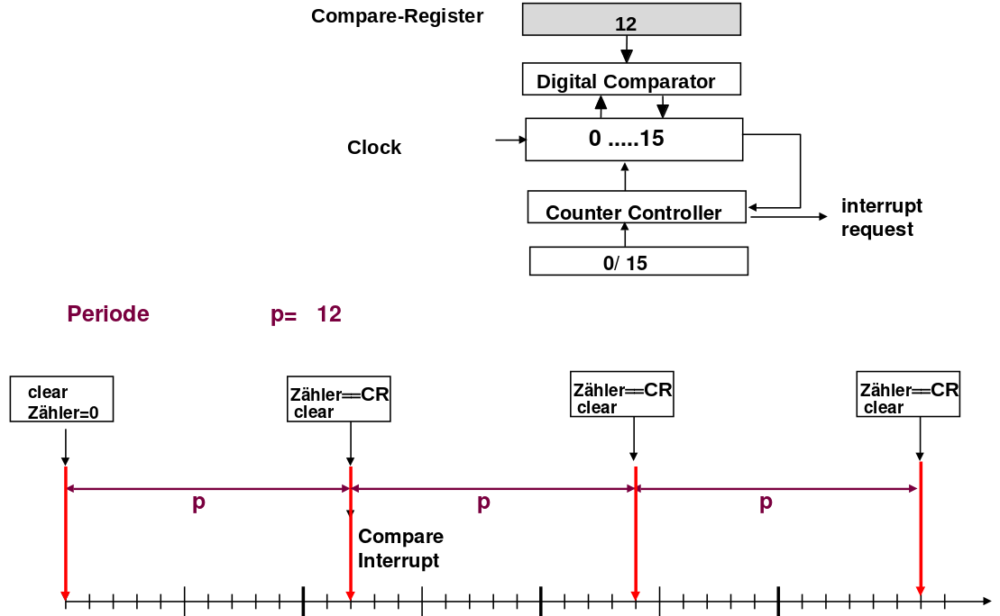
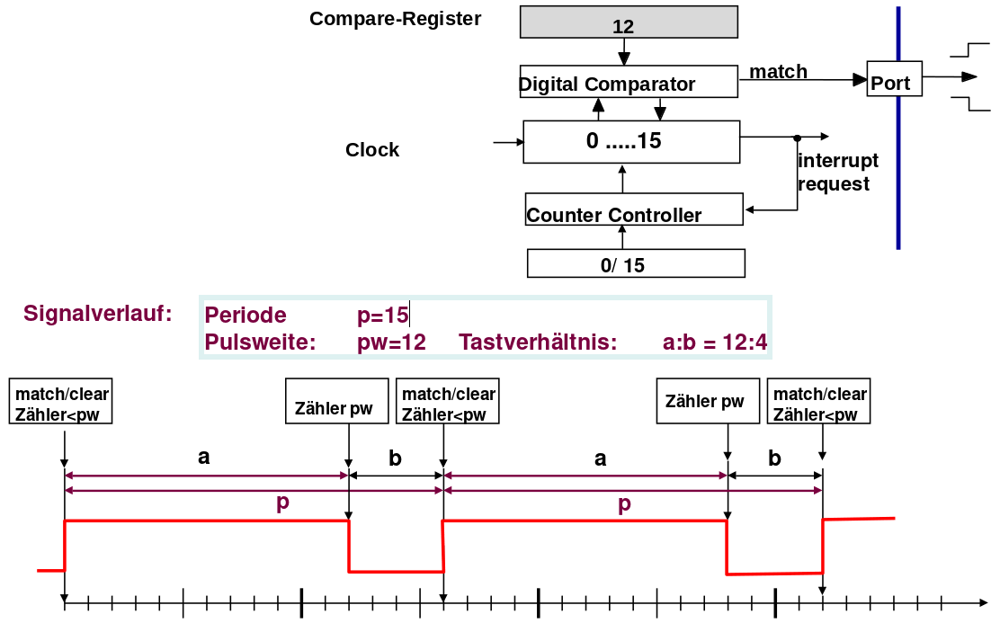
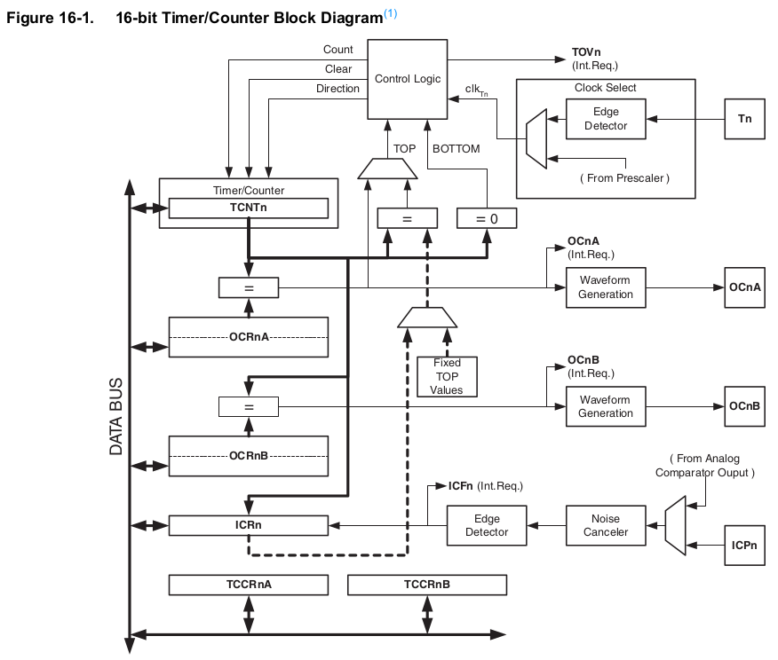
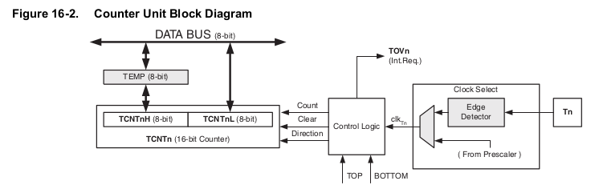

<!--

author:   Sebastian Zug & André Dietrich & Fabian Bär
email:    sebastian.zug@informatik.tu-freiberg.de & andre.dietrich@informatik.tu-freiberg.de & fabian.baer@student.tu-freiberg.de
version:  0.0.4
language: de
narrator: Deutsch Female

import:  https://raw.githubusercontent.com/liascript-templates/plantUML/master/README.md
         https://github.com/LiaTemplates/Pyodide

mark: <span style="background-color: @0;
                                  display: flex;
                                  width: calc(100% + 32px);
                                  margin: -16px;
                                  padding: 6px 16px 6px 16px;
                                  ">@1</span>
red:  @mark(#FF888888,@0)
blue: @mark(#898AE3,@0)
gray: @mark(gray,@0)
-->

# Timer und Interrupts

**TU Bergakademie Freiberg - Wintersemester 2020 / 21**

Link auf die aktuelle Vorlesung im Versionsmanagementsystem GitHub

[https://github.com/TUBAF-IfI-LiaScript/VL_EingebetteteSysteme/blob/15_TimerUndInterrupts.md](https://github.com/TUBAF-IfI-LiaScript/VL_EingebetteteSysteme/blob/master/15_TimerUndInterrupts.md)

Die interaktive Form ist unter [diesem Link](https://liascript.github.io/course/?https://raw.githubusercontent.com/TUBAF-IfI-LiaScript/VL_EingebetteteSysteme/master/15_TimerUndInterrupts.md#1) zu finden


---------------------------------------------------------------------

** Fragen an die Veranstaltung**

+ Für welche Aufgaben werden die Timerfunktionen des Mikrocontrollers herangezogen?
+ Wie sind ein Timer grundlegend aufgebaut (Capture&Compare)?
+ Was ist PWM? Welche Arten der PWM Generierung gibt es?
+ Welche Schritte werden bei der Abarbeitung von Interrupts durchlaufen?
+ Welche Folgen können verpasste Interrupts haben? Beziehen Sie sich dabei insbesondere auf verschiedene Sensortypen, mit denen Sie in der Übung gearbeitet haben.
+ Woraus ergibt sich die Prioritätenfolge der Interrupts beim AVR?
+ Nennen Sie Interruptquellen beim AVR?
+ Wie viele Interrupts können sich beim Atmega stauen, ohne dass einer verloren geht?

<!--
style="width: 80%; min-width: 420px; max-width: 720px;"
-->
```ascii

                Abstraktionsebenen

           +----------------------------+ -.   
  Ebene 6  | Problemorientierte Sprache |  |     ╔═══════════════╗  
           +----------------------------+  |  ◀══║ HIER SIND WIR!║  
                                           ⎬     ╚═══════════════╝
           +----------------------------+  |  Anwendungssoftware
  Ebene 5  | Assemblersprache           |  |
           +----------------------------+ -.

           +----------------------------+
  Ebene 4  | Betriebssystem             |     Systemsoftware
           +----------------------------+

           +----------------------------+
  Ebene 3  | Istruktionsset             |     Maschinensprache
           +----------------------------+     

           +----------------------------+  -.
  Ebene 2  | Mikroarchitektur           |   |
           +----------------------------+   |
                                            ⎬ Automaten, Speicher, Logik
           +----------------------------+   |
  Ebene 1  | Digitale Logik             |   |
           +----------------------------+  -.

           +----------------------------+
  Ebene 0  | E-Technik, Physik          |     Analoge Phänomene
           +----------------------------+                                      .
```

---------------------------------------------------------------------

## Exkurs: Interrupts

Ein Interrupt beschreibt die kurzfristige Unterbrechung der normalen Programmausführung, um einen, in der Regel kurzen, aber zeitlich kritischen, Vorgang abzuarbeiten.

```text @plantUML.png
@startuml
ditaa
                         Hauptprogramm              Interrupt-Routine
                       +---------------+        
                       : ...           |              
                       +---------------+                                                             
                       : Instruktion 1 |      +-------------+                                         
                       +---------------+      |             |                        
Interrupt tritt auf -> : Instruktion 2 |      |             v                                       
                       +---------------+      |     +---------------+                             
                               |              |     : Instruktion A |                             
                               +--------------+     +---------------+                   
                                                    : Instruktion B |
                               +--------------+     +---------------+
                               |              |     : Instruktion C |
                       +---------------+      |     +---------------+
                       : Instruktion 3 |      |             |
                       +---------------+      +-------------+
                       : Instruktion 4 |
                       +---------------+
                       : ...           |
                       +---------------+

@enduml
```

Interrupt-Quellen können unter anderem die im folgenden Abschnitt beschriebenen Timerkomponenten sein. Im nächsten Kapitel wird dann detailliert auf das Interruptsystem des Controllers eingegangen.

## Motivation

Aufgaben von Timer/Counter Lösungen in einem Mikrocontroller:

+ Zählen von Ereignissen
+ Messen von Zeiten, Frequenzen, Phasen, Perioden
+ Erzeugen von Intervallen, Pulsfolgen, Interrupts
+ Überwachen von Ereignissen und Definition von Zeitstempeln

Die Grundstruktur eines Zählerbaustein ergibt sich aus folgenden Komponenten:

```text @plantUML.png
@startuml
ditaa
+------------+
|            |
|            v                    
|   +-------------------+        interner   Interrupt
|   : Startwertregister |          Takt      
|   +-------------------+            |          ^            
|            |                       v          |            
|            v                    +-----------------+
|   +-------------------+         |                 | <---- Externer Takt
|   | Zählereinheit     |<------->| Steuerung       |       
|   | vorwärts/rückwärts|         | (Taktauswahl    | <---- Aktivierung
|   +-------------------+         |  Ausgabe)       |
|            |                    |                 | ----> Ausgabe
|            v                    +++++++++++++++++++
|   +-------------------+
|   : Zählerregister    |
|   +-------------------+
|            |
+------------+
@enduml
```

Capture/Compare-Einheiten Nutzen die Basis-Timerimplementierung. Sie können externe Signale aufnehmen und vergleichen, aber beispielsweise auch Pulsmuster erzeugen.

Sie besitzt meist mehrere Betriebsmodi:

+ Timer/Zähler-Modus: Aufwärtszählen mit verschiedenen Quellen als Taktgeber. Bei Zählerüberlauf kann ein Interrupt ausgelöst werden.

+ Capture-Modus: Beim Auftreten eines externen Signals wird der Inhalt des zugeordneten (laufenden) Timers gespeichert. Auch hier kann ein Interrupt ausgelöst werden.

```text @plantUML.png
@startuml
ditaa
+------------+
|            |
|            v                             +-------------------+  
|   +-------------------+        interner  | Interrupt cFF4    |
|   : Startwertregister |          Takt    +-------------------+   
|   +-------------------+            |          ^            
|            |                       v          |            
|            v                    +-----------------+
|   +-------------------+         |                 | <---- Externer Takt
|   | Zählereinheit     |<------->| Steuerung       |       +-------------------------+
|   | vorwärts/rückwärts|         | (Taktauswahl    | <---- |Aktivierung über Pin cFF4|
|   +-------------------+         |  Ausgabe)       |       +-------------------------+
|            |                    |                 | ----> Ausgabe
|            v                    +++++++++++++++++++
|   +-------------------+
|   : Zählerregister    |
|   +-------------------+
|            |     |
+------------+     v
                +--------------------+
                |Captureregister cFF4|
                +--------------------+
@enduml
```

+ Compare-Modus: Der Zählerstand des zugeordneten Timers wird mit dem eines Registers verglichen. Bei Übereinstimmung kann ein Interrupt ausgelöst werden.

```text @plantUML.png
@startuml
ditaa
+------------+
|            |
|            v                             +-------------------+  
|   +-------------------+        interner  | Interrupt cFF4    |
|   : Startwertregister |          Takt    +-------------------+   
|   +-------------------+            |          ^            
|            |                       v          |            
|            v                    +-----------------+
|   +-------------------+         |                 | <---- Externer Takt
|   | Zählereinheit     |<------->| Steuerung       |       
|   | vorwärts/rückwärts|         | (Taktauswahl    | <---- Aktivierung über Pin
|   +-------------------+   +---->|  Ausgabe,       |       +-------------------------+
|            |              |     |  Vergleich)     | ----> | Ausgabe             cFF4|
|            v              |     +++++++++++++++++++       +-------------------------+
|   +-------------------+   |             ^
|   : Zählerregister    |---+             |
|   +-------------------+                 v
|            |                   +--------------------+   
+------------+                   |Compareregister cFF4|   
                                 +--------------------+           
@enduml
```

> **Merke:** Diese Vorgänge laufen ausschließlich in der Peripherie-Hardware ab, beanspruchen also, abgesehen von eventuellen Interrupts, keine Rechenzeit.

Entsprechend ergibt sich für den Compare-Modus verschiedene Anwendungen und ein zeitliches Verhalten entsprechend den nachfolgenden Grafiken.

<!-- style="width: 75%; max-width: 1000px" -->

<!-- style="width: 75%; max-width: 1000px" -->

## Umsetzung im AVR

Der AtMega328 bringt 4 unabhängige Timersysteme mit:

+ _Two 8-bit Timer/Counters with Separate Prescaler and Compare Mode_
+ _One 16-bit Timer/Counter with Separate Prescaler, Compare Mode, and Capture Mode_
+ _Real Time Counter with Separate Oscillator_
+ _Six PWM Channels_

Dabei soll die Aufmerksamkeit zunächst auf dem 16-bit Timer/Zähler liegen.

<!-- style="width: 75%; max-width: 1000px" -->[^1]

[^1]: Firma Microchip, megaAVR® Data Sheet, Seite 250, [Link](http://ww1.microchip.com/downloads/en/DeviceDoc/ATmega48A-PA-88A-PA-168A-PA-328-P-DS-DS40002061A.pdf)


### Timer-Funktionalität

Für die Umsetzung eines einfachen Timers, der wie im Nachfolgenden Beispiel jede
Sekunde aktiv wird, genügt es einen entsprechenden Vergleichswert zu bestimmen,
den der Zähler erreicht haben muss.

<!-- style="width: 75%; max-width: 1000px" -->[^2]

[^2]: Firma Microchip, megaAVR® Data Sheet, Seite 126, [Link](http://ww1.microchip.com/downloads/en/DeviceDoc/ATmega48A-PA-88A-PA-168A-PA-328-P-DS-DS40002061A.pdf)

```c    /15_Timer/pollingTimer.ino
#ifndef F_CPU
#define F_CPU 16000000UL // 16 MHz clock speed
#endif

//16.000.000 Hz / 1024 = 15.625

int main(void)
{
  DDRB |= (1 << PB5);  // Ausgabe LED festlegen
  // Timer 1 Konfiguration
  //         keine Pins verbunden
  TCCR1A  = 0;
  TCCR1B  = 0;
  // Timerwert
  TCNT1   = 0;
  TCCR1B |= (1 << CS12) | (1 <<CS10);  // 1024 als Prescale-Wert

  while (1) //infinite loop
  {
     if (TCNT1>15625){
        TCNT1 = 0;  
        PINB = (1 << PB5); // LED ein und aus
     }
  }
}
```

> Was stört Sie an dieser Umsetzung?

### PWM Generierung
