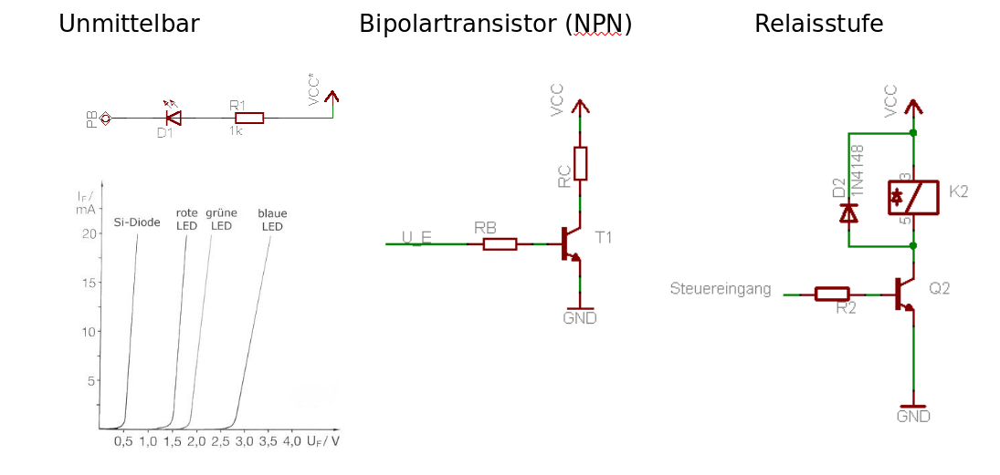
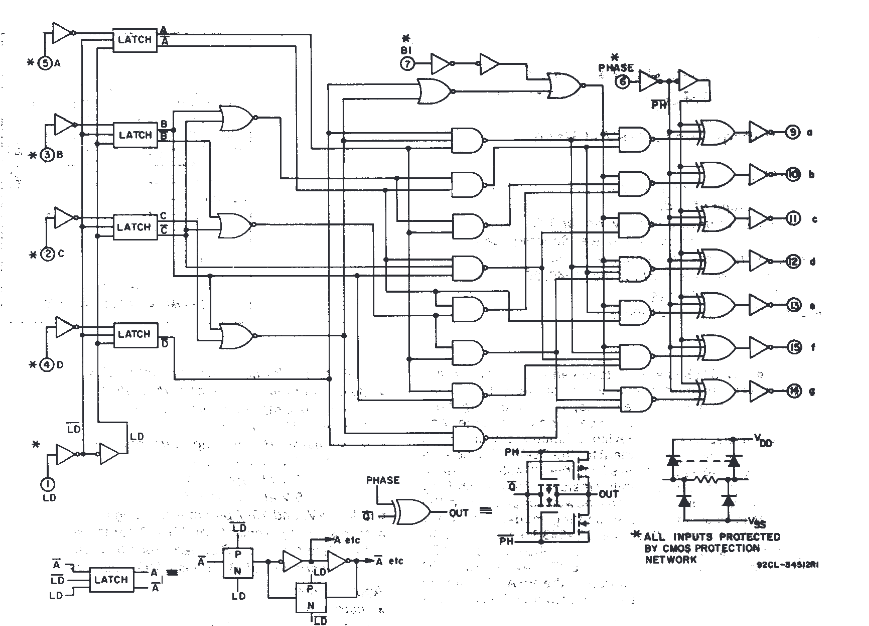
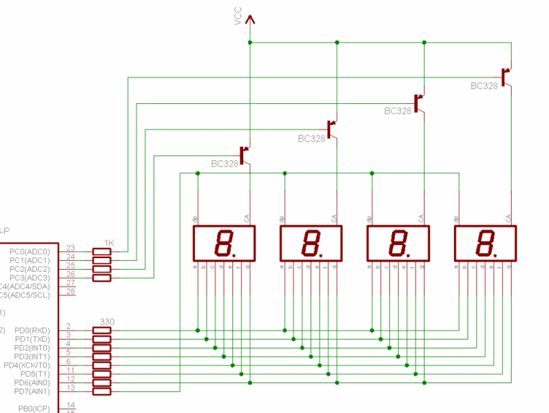
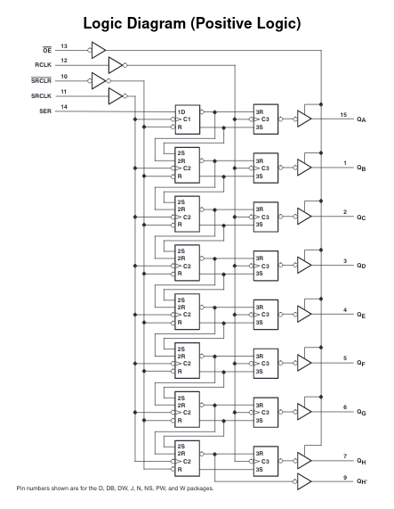
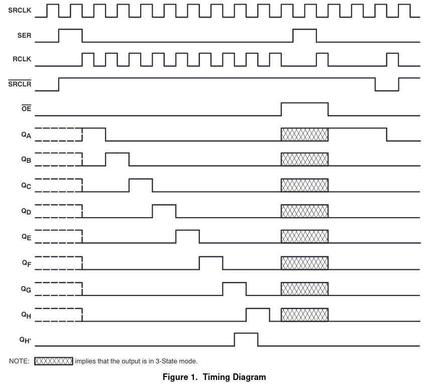
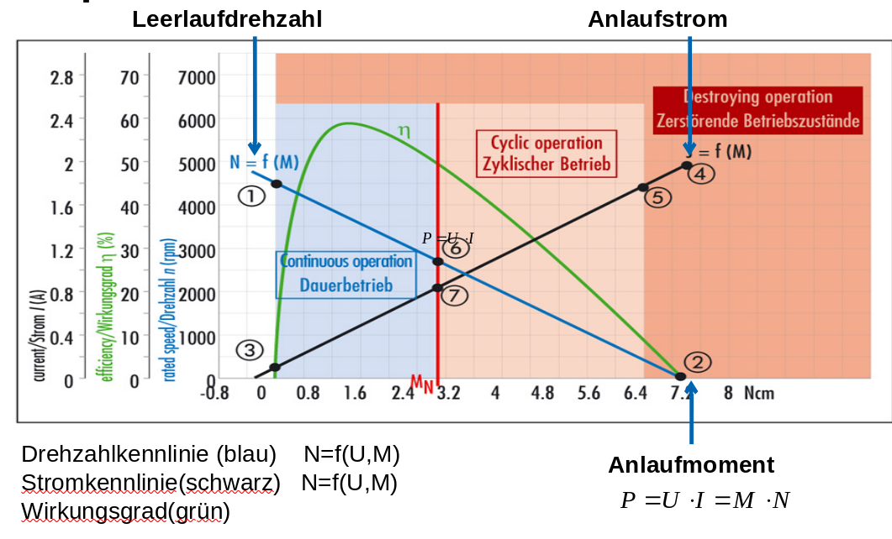
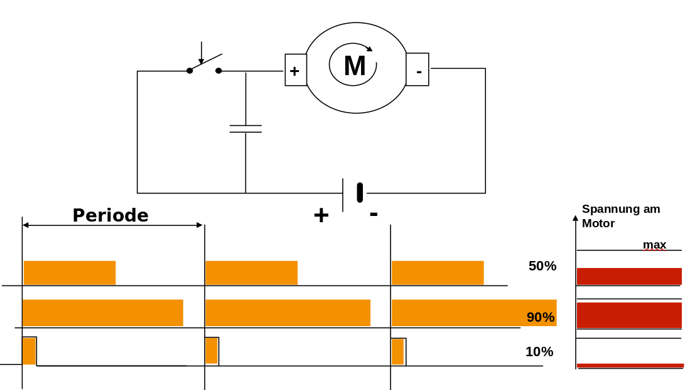
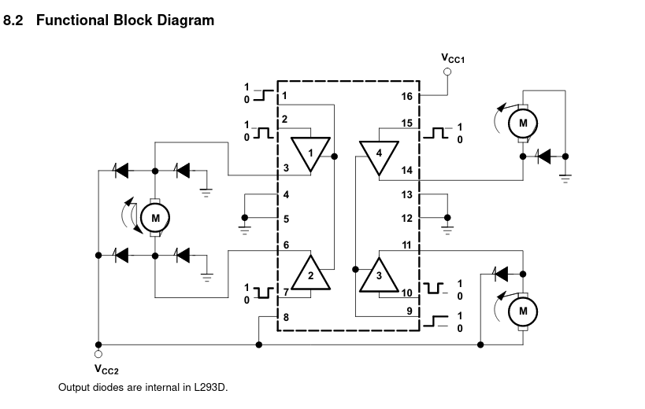
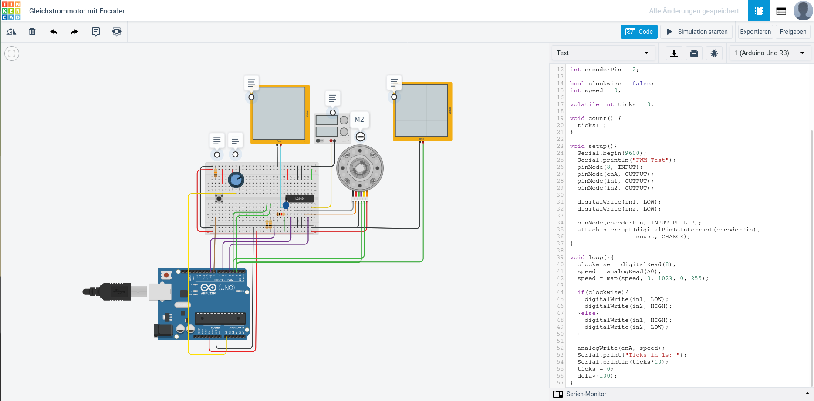

<!--

author:   Sebastian Zug & André Dietrich & Fabian Bär
email:    sebastian.zug@informatik.tu-freiberg.de & andre.dietrich@informatik.tu-freiberg.de & fabian.baer@student.tu-freiberg.de
version:  0.0.4
language: de
narrator: Deutsch Female

import:  https://raw.githubusercontent.com/liascript-templates/plantUML/master/README.md
         https://github.com/LiaTemplates/Pyodide

mark: <span style="background-color: @0;
                                  display: flex;
                                  width: calc(100% + 32px);
                                  margin: -16px;
                                  padding: 6px 16px 6px 16px;
                                  ">@1</span>
red:  @mark(#FF888888,@0)
blue: @mark(#898AE3,@0)
gray: @mark(gray,@0)
-->

# Programmierung CPU

**TU Bergakademie Freiberg - Wintersemester 2020 / 21**

Link auf die aktuelle Vorlesung im Versionsmanagementsystem GitHub

[https://github.com/TUBAF-IfI-LiaScript/VL_EingebetteteSysteme/blob/12_RISC_CISC.md](https://github.com/TUBAF-IfI-LiaScript/VL_EingebetteteSysteme/blob/master/16_Aktoren.md)

Die interaktive Form ist unter [diesem Link](https://liascript.github.io/course/?https://raw.githubusercontent.com/TUBAF-IfI-LiaScript/VL_EingebetteteSysteme/master/16_Aktoren.md#1) zu finden


---------------------------------------------------------------------

** Fragen an die Veranstaltung**

+ Charakterisieren Sie die Merkmale eines eingebetteten Systems!
+ Beschreiben Sie aktuelle Entwicklungstendenzen eingebetteter Systeme.
+ Erklären Sie an einem Beispiel die Notwendigkeit für die interdisziplinäre Arbeit bei der Entwicklung von Sensor-Aktor-Systemen!

<!--
style="width: 80%; min-width: 420px; max-width: 720px;"
-->
```ascii

                Abstraktionsebenen

           +----------------------------+ -.   
  Ebene 6  | Problemorientierte Sprache |  |     ╔═══════════════╗  
           +----------------------------+  |  ◀══║ HIER SIND WIR!║  
                                           ⎬     ╚═══════════════╝
           +----------------------------+  |  Anwendungssoftware
  Ebene 5  | Assemblersprache           |  |
           +----------------------------+ -.

           +----------------------------+
  Ebene 4  | Betriebssystem             |     Systemsoftware
           +----------------------------+

           +----------------------------+
  Ebene 3  | Istruktionsset             |     Maschinensprache
           +----------------------------+     

           +----------------------------+  -.
  Ebene 2  | Mikroarchitektur           |   |
           +----------------------------+   |
                                            ⎬ Automaten, Speicher, Logik
           +----------------------------+   |
  Ebene 1  | Digitale Logik             |   |
           +----------------------------+  -.

           +----------------------------+
  Ebene 0  | E-Technik, Physik          |     Analoge Phänomene
           +----------------------------+                                      .
```

---------------------------------------------------------------------

## Motivation

Bislang haben wir uns allein mit dem Controller beschäftigt, wie aber nutzen
wir nun die Funktionalität in einem eingebetetten System. Damit gehen wir in
unser Betrachtung von Mikrocontrollern noch einen weiteren Schritt zurück und integrieren nun auch die extern angeschlossene Elemente.

**Eingebettete Systeme ...**

> _... sind informationsverarbeitende Systeme, die in ein größeres Produkt integriert sind, und die normalerweise nicht direkt vom Benutzer wahrgenommen werden._  [Marwedel]

> _... bezeichnet einen elektronischen Rechner oder auch Computer, der in einen technischen Kontext eingebunden (eingebettet) ist. Dabei übernimmt der Rechner entweder Überwachungs-, Steuerungs- oder Regelfunktionen oder ist für eine Form der Daten- bzw. Signalverarbeitung zuständig _ [Wikipedia]

Dabei spielt die Größe des Systems keine Rolle. Die Implementierungsvarianten reichen von Mikrorobotern und _Smart Dust_ bis hin zu zusammengesetzten _Systems-of-Systems_ wie einem autonomen Automobil.

Als zentrale Merkmale folgen daraus:

1. Interaktion mit der Umgebung (Sensor/Aktor Systeme)
2. ggf. hohe Anforderungen an die Verlässlichkeit (u.a. Zuverlässigkeit und Verfügbarkeit)

<!-- style="width: 75%; max-width: 1000px" --> [^1]

[^1]: Wikipedia, Autor Avda, Kernkraftwerk Grafenrheinfeld - 2013, [Link](https://commons.wikimedia.org/wiki/File:Kernkraftwerk_Grafenrheinfeld_-_2013.jpg)  

3. Schwerpunktentwicklungsziel Effizienz (Energieverbrauch, Speicher, Ausführungsdauer)

4. explizite Berücksichtigung der Ausführungs- und Reaktionsdauer (Reaktive Systeme, Echtzeitsysteme)

5. Spezifischer Zuschnitt einer Lösung

> Ein eingebettetes System:
>
> + erfüllt eine spezielle Aufgabe mit
> + problemangepasste Hardware und Software
> + einer spezifischen Benutzerschnittstelle
> + ist häufig konkreten Zeitanforderungen unterworfen
> + garantiert ein angepassten Grad an Verlässlichkeit und
> + setzt die Aufgabenstellung effektiv und kostengünstig um.

Der Versuch einer Zukunftsperspektive ist unter anderem auf folgender Webseite versucht worden [Link](https://www.grandviewresearch.com/industry-analysis/microcontroller-market)

> Eingebettete Systeme sind ein boomender Markt, der spezifische Programmierkenntnisse und ein interdisziplinäres Verständnis erfordert.

Im Rahmen dieser Veranstaltung wollen wir uns auf die Integration in eine Mikrocontrollerschaltung konzentrieren.

> **Aktoren** ...  (Wandler; Antriebselemente) setzen die elektronischen Signale in mechanische Bewegung oder andere physikalische Größen um und greifen damit aktiv in die Umgebung des eingebetteten Systems ein.

Sie unterscheiden sich durch:

+ zugeführte Energieform (elektrischer Strom, Brennstoff)
+ abgegebene Energieform (mechanische Energie, Wärme, magnetische Felder, Strahlung )
+ Freiheitsgrade (maximal 6, linear Gelenke, Rotation)
+ Diskret / wertkontinuierlich

Beispiele:

+ Dioden, 7-Segment-Anzeigen, Displays
+ Ventile (Pneumatik, Hydraulik)
+ Motoren (Gleichstrom/Wechselstrom)
+ Magnete (Manipulatoren, Lautsprecher)

## Ansteuerung digitaler Ausgänge

Die Beschaltung eines externen Gerätes wird aus Sicht des Mikrocontrollers durch zwei zentrale Faktoren beschränkt:

1. maximales Strom/ Spannungsniveau der Pins
2. Zahl der verfügbaren vs. benötigte Pins

**Lösungsansätze zu 1:**

Elektronische, elektromechanische Bereitstellung einer entsprechenden Leistung.

<!-- style="width: 75%; max-width: 1000px" --> [^1]

[^1]: mikrocontroller.net, Beschaltung von Digitalen Ausgängen, Zusammenfassung der grafischen Darstellungen  

**Lösungsansätze zu 2:**

1. Verwendung von Dekoder-Bausteinen

Der CD4543 Baustein dient der Ansteuerung von 7-Segment-Anzeigen. Mit dem Dekodieren einer 4-Bit Zahlendarstellung auf die zugehörigen Steuerleitungen werden 3 Pins eingespart. Vergleichen Sie die Schaltung mit der in Vorlesung 4 hergeleiteten Lösung.

<!-- style="width: 75%; max-width: 1000px" --> [^1]

[^1]: Texas Instruments, CMOS BCD-to-Seven-Segement Latch/Decoder/Driver, [Link](https://www.ti.com/lit/ds/symlink/cd4543b.pdf?ts=1612176181441&ref_url=https%253A%252F%252Fwww.google.com%252F)

2. Multiplexiing

Mittels Muliplexing lassen sich nun mehrere 7-Segment-Anzeigen durch ein Set von Ausgängen beschalten. Allerdings wird in dieser Lösung pro Anzeige eine weitere Steuerleitung verwendet. Zudem ist eine Berücksichtigung der Schaltzeiten der Displays zu berücksichtigen.

<!-- style="width: 75%; max-width: 1000px" --> [^1]

[^1]: mikrocontroller.net, 7-Segment gemultiplext, Tutorium, [Link](https://www.mikrocontroller.net/articles/Datei:Tut_7_Seg_03.gif)

3. Shift-Register (Sequenzialisierung)

<!-- style="width: 25%; max-width: 500px" --> [^1]
<!-- style="width: 65%; max-width: 1000px" --> [^1]

[^1]: Texas Instruments, SNx4HC5958-Bit Shift RegistersWith 3-StateOutputRegisters, [Link](https://www.ti.com/lit/ds/symlink/sn74hc595.pdf?ts=1612165666219&ref_url=https%253A%252F%252Fwww.ti.com%252Fproduct%252FSN74HC595)

## Ansteuerung von Motoren

Gleichstrommotor
===================

An dieser Stelle konzentrieren wir uns auf eine spezifische Variante des Gleichstrommotors und seine Ansteuerung mittels PWM.

<!-- style="width: 65%; max-width: 750px" --> [^4]

[^4]: Wikipedia, Autor Honina, Schematische Darstellung der Arbeitsweise einer permanenterregten Gleichstrommaschine, [Link](https://commons.wikimedia.org/wiki/File:Gleichstrommaschine.svg)

Welche Kernparameter bestimmen das Verhalten unseres Motors?

<!-- style="width: 75%; max-width: 750px" --> [^5]

[^5]: Firma Dunker Motoren, Handbuch, [Link](http://www.dunkermotoren.de/default.asp?id=18&lang=1)

Wie erfolgt der Betrieb aus Sicht des Mikrocontrollers? Wir haben zwei vorgaben, die wir umsetzen wollen, die Drehrichtung und die Geschwindigkeit.

Für die Drehrichtung wird die Änderung der Polarität über eine H-Brücke umgesetzt. Mit 4 Schaltern kann der Stromfluss durch den Motor angepasst werden.
<!-- style="width: 75%; max-width: 750px" -->

Die Drehgeschwindigkeit ergibt sich aus der Vorgabe eines PWM Signals.

<!-- style="width: 75%; max-width: 750px" -->

<!-- style="width: 75%; max-width: 750px" --> [^6]

[^6]: Firma Texas Instruments, Datenblatt L293D, [Link](https://www.ti.com/lit/ds/symlink/l293.pdf)

### Schrittmotoren

Ein Schrittmotor ist ein Synchronmotor, bei dem der Rotor (ein drehbares Motorteil mit Welle) durch ein gesteuertes, schrittweise rotierendes, elektromagnetisches Feld der Statorspulen um einen kleinen Winkel (Schritt) oder sein Vielfaches gedreht werden kann.

<!-- style="width: 65%; max-width: 750px" --> [^4]

[^4]: Wikipedia, Autor Honina, Schema eines Schrittmotors mit vier Schritten für eine Umdrehung (und unipolarer Beschaltung), [Link](https://commons.wikimedia.org/wiki/File:Schrittmotor.PNG)

Die technische Realsierung kann dabei zwei grundlegenden Mustern folgen. Man unterscheidet uni- und bipolare Schrittmotoren.

<!-- style="width: 65%; max-width: 750px" --> [^5]

[^5]: Wikipedia, Autor Ulfbastel, Schrittmotor-Schaltungsvarianten), [Link](https://commons.wikimedia.org/wiki/File:Stepmotscheme.jpg)

```c
uint8_t pattern[4]={9,5,6,10};
// 1001 -> 0101 -> 0110 -> 1010

void Vschritte(uint16_t ns, char dir)
{
   uint16_t z;
   int32_t n;
   for (z=0; z<ns; z++){
    	if (dir == 1) n++;
	    else n--;
	    PORTD=pattern[n & 3];
	    delay(10);
   }
}
```

Wird ein Schrittmotor durch ein externes Lastmoment oder durch die anzutreibende Masse beim starken Beschleunigen beziehungsweise Verzögern überlastet (d. h. Lastmoment > Motormoment), kann der Rotor dem Drehfeld nicht mehr folgen. Es werden Schritte übersprungen, und die Information über die aktuelle Position des Rotors geht verloren.

Eine sehr schöne Erklärung zur Funktionsweise von Schrittmotoren liefert das folgende Video.

<iframe width="560" height="315" src="https://www.youtube.com/embed/spWVb9cb7dA" frameborder="0" allow="accelerometer; autoplay; clipboard-write; encrypted-media; gyroscope; picture-in-picture" allowfullscreen></iframe>


### Servomotoren

Als Servomotor werden Elektromotoren bezeichnet, die die Kontrolle der Winkelposition ihrer Motorwelle sowie der Drehgeschwindigkeit und Beschleunigung erlauben. Sie integrieren neben dem eigentlichen Elektromotor, eine Sensorik zur Positionsbestimmung und eine Regelelektronik. Damit kann die Bewegung des Motors entsprechend einem oder mehreren einstellbaren Sollwerten – wie etwa Soll-Winkelposition der Welle oder Solldrehzahl – bestimmt werden.

<!-- style="width: 65%; max-width: 750px" --> [^5]

[^5]: Wikipedia, Autor Bernd vdB, Servo and receiver connections, [Link](https://commons.wikimedia.org/wiki/File:Rc-receiver-servo-battery_b.jpg)

<!--
style="width: 80%; min-width: 420px; max-width: 720px;"
-->
```ascii


           Nulllage (1500ms)
    Minima(1ms)  |  Maxima (2ms)
              |  v  |
High   |      v     v                
       |  +------+...                        +---                            
       |  |   :  |  :                        |     
       |  |   :  |  :                        |               
       |  |   :  |  :                        |               
       |  |   :  |  :                        |               
       |  |   :  |  :                        |                             
       |  |   :  |  :                        |   
       |--+      +---------------------------+
       |
       +-------------------------------------|---->                           .
           0                                20ms
```

Diese Funktionalität lässt sich mit einem Timer entsprechend umsetzen.

$$
20ms = 2500 x 0.008ms
$$


```
#define F_CPU 1000000UL
#include <avr/io.h>
#include <avr/interrupt.h>

ISR( TIMER1_COMPA_vect ){
  OCR1A = 2500-OCR1A;	     }

int main (void){
  TCCR1A = (1<<COM1A0);    // Togglen bei Compare Match
  TCCR1B = (1<<WGM12) |
           (1<<CS11);      // CTC-Mode; Prescaler 8
  TIMSK  = (1<<OCIE1A);    // Timer-Compare Interrupt an
  OCR1A = 2312;            // Neutralposition
  sei();                   // Interrupts global an
  while( 1 ) {
    ...
    OCR1A = OCR1A + 3;
    _delay_ms(40);
    ...
  return 0;
}
```

## Anwendungsbeispiel

<!-- style="width: 75%; max-width: 750px" -->

https://www.tinkercad.com/things/lu1Gt48hNsL-gleichstrommotor-mit-encoder/editel
